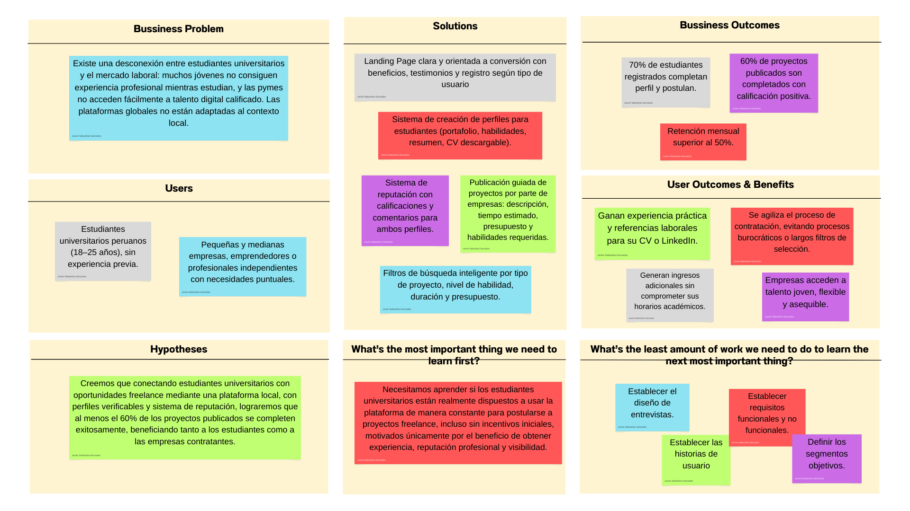
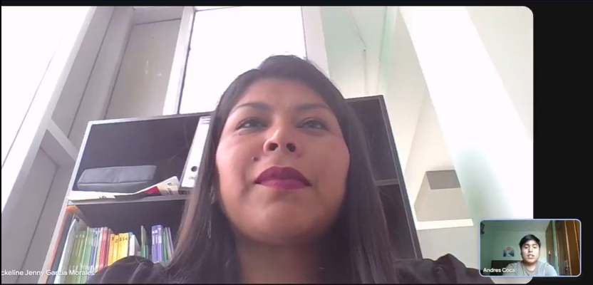
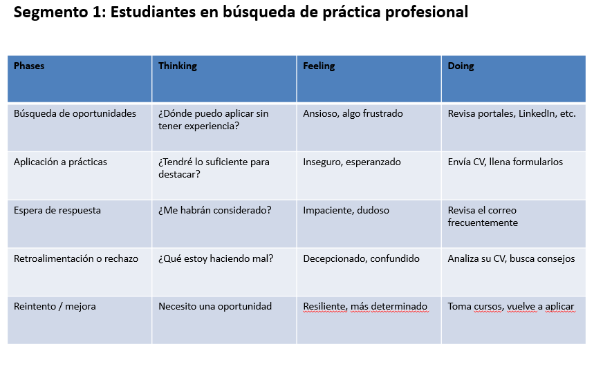
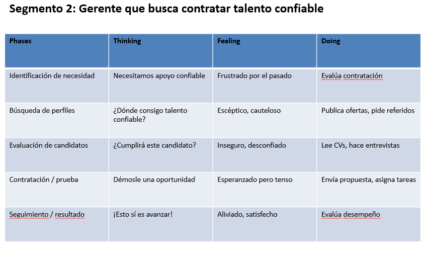
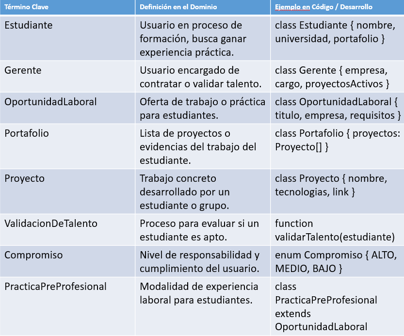
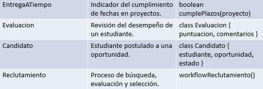
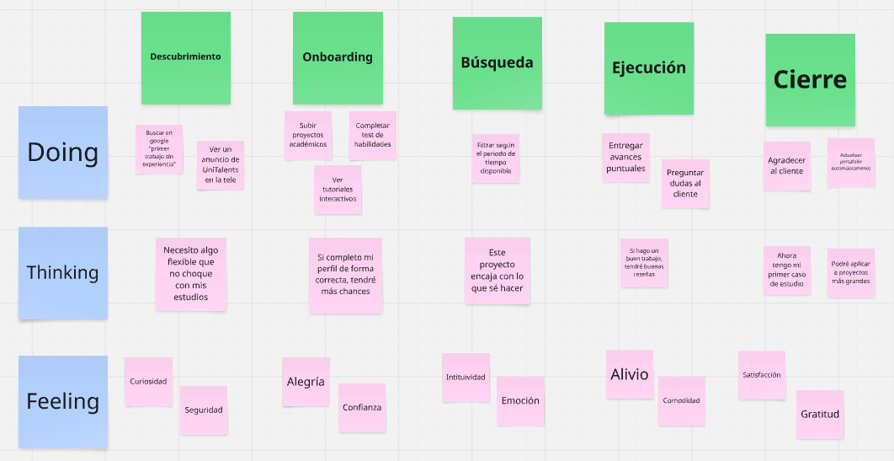
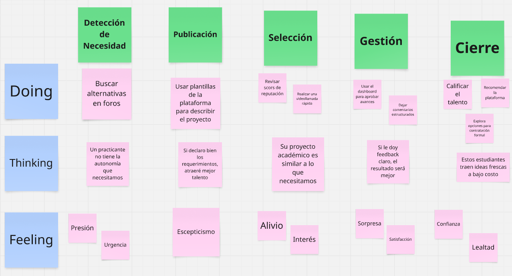
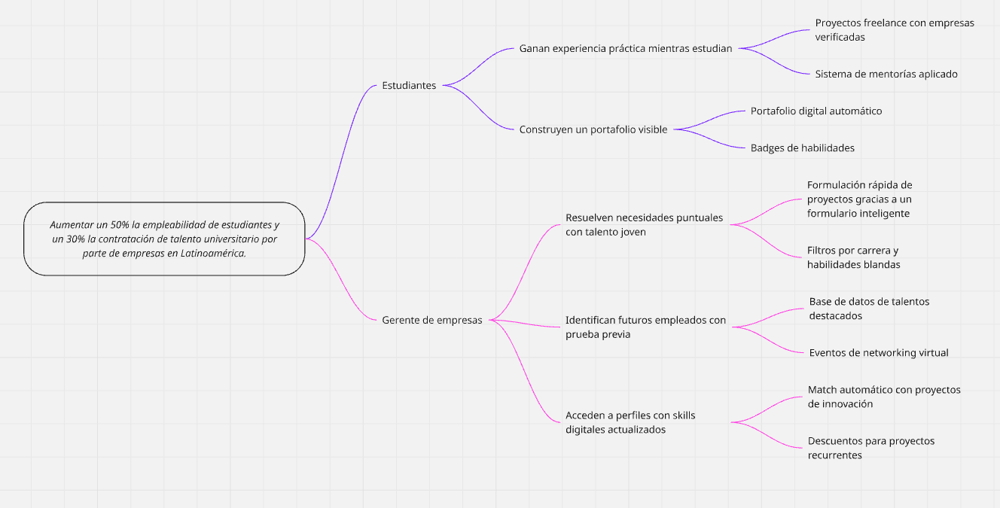

<h1 align="center">Informe de Trabajo Final</h1>

<p align="center">
  
</p>

---
**Universidad:** Universidad Peruana de Ciencias Aplicadas

**Ciclo:**  2025 - 01

**Código del curso:**  1ASI0730-2510

**Nombre del curso:**  Aplicaciones Web

**Sección:**  4376

**Nombre del profesor:**  Hugo Allan Mori Paiva

**Nombre del Startup:** UnitTalents

**Nombre del Producto:**  UniTalents Connect

### Relación de Integrantes

| Código | Apellidos y Nombres |
|--------|----------------------|
|u202312966|Gonzales Alvarado, Javier Sebastian|
|u202313172|Coca Lavado, Carlos Andres|
|u20231d974|Rivera Ratachi, Renzo Sebastian|
|u20231a500|Palomino Fiestas, Erick Leonardo|
|u202019409|Linares Bernable, Cesar Alejandro|


**Año:**  2025

---

## Registro de Versiones del Informe

| Versión | Fecha | Descripción de cambios | Autor(es) |
|--------|-------|-------------------------|-----------|
| 1.0    |       |                         |           |

---

## Project Report Collaboration Insights

---

## Contenido

- [Student Outcome](#student-outcome)  
- [Capítulo I: Introducción](#capítulo-i-introducción)  
  - [1.1. Startup Profile](#11-startup-profile)  
    - [1.1.1. Descripción de la Startup](#111-descripción-de-la-startup)  
    - [1.1.2. Perfiles de integrantes del equipo](#112-perfiles-de-integrantes-del-equipo)  
  - [1.2. Solution Profile](#12-solution-profile)  
    - [1.2.1. Antecedentes y problemática](#121-antecedentes-y-problemática)  
    - [1.2.2. Lean UX Process](#122-lean-ux-process)  
      - [1.2.2.1. Lean UX Problem Statements](#1221-lean-ux-problem-statements)  
      - [1.2.2.2. Lean UX Assumptions](#1222-lean-ux-assumptions)  
      - [1.2.2.3. Lean UX Hypothesis Statements](#1223-lean-ux-hypothesis-statements)  
      - [1.2.2.4. Lean UX Canvas](#1224-lean-ux-canvas)  
  - [1.3. Segmentos objetivo](#13-segmentos-objetivo)  

- [Capítulo II: Requirements Elicitation & Analysis](#capítulo-ii-requirements-elicitation--analysis)  
  - [2.1. Competidores](#21-competidores)  
    - [2.1.1. Análisis competitivo](#211-análisis-competitivo)  
    - [2.1.2. Estrategias y tácticas frente a competidores](#212-estrategias-y-tácticas-frente-a-competidores)  
  - [2.2. Entrevistas](#22-entrevistas)  
    - [2.2.1. Diseño de entrevistas](#221-diseño-de-entrevistas)  
    - [2.2.2. Registro de entrevistas](#222-registro-de-entrevistas)  
    - [2.2.3. Análisis de entrevistas](#223-análisis-de-entrevistas)  
  - [2.3. Needfinding](#23-needfinding)  
    - [2.3.1. User Personas](#231-user-personas)  
    - [2.3.2. User Task Matrix](#232-user-task-matrix)  
    - [2.3.3. User Journey Mapping](#233-user-journey-mapping)  
    - [2.3.4. Empathy Mapping](#234-empathy-mapping)  
    - [2.3.5. As-is Scenario Mapping](#235-as-is-scenario-mapping)  
  - [2.4. Ubiquitous Language](#24-ubiquitous-language)  

- [Capítulo III: Requirements Specification](#capítulo-iii-requirements-specification)  
  - [3.1. To-Be Scenario Mapping](#31-to-be-scenario-mapping)  
  - [3.2. User Stories](#32-user-stories)  
  - [3.3. Impact Mapping](#33-impact-mapping)  
  - [3.4. Product Backlog](#34-product-backlog)  

- [Capítulo IV: Product Design](#capítulo-iv-product-design)  
  - [4.1. Style Guidelines](#41-style-guidelines)  
    - [4.1.1. General Style Guidelines](#411-general-style-guidelines)  
    - [4.1.2. Web Style Guidelines](#412-web-style-guidelines)  
  - [4.2. Information Architecture](#42-information-architecture)  
    - [4.2.1. Organization Systems](#421-organization-systems)  
    - [4.2.2. Labeling Systems](#422-labeling-systems)  
    - [4.2.3. SEO Tags and Meta Tags](#423-seo-tags-and-meta-tags)  
    - [4.2.4. Searching Systems](#424-searching-systems)  
    - [4.2.5. Navigation Systems](#425-navigation-systems)  
  - [4.3. Landing Page UI Design](#43-landing-page-ui-design)  
    - [4.3.1. Landing Page Wireframe](#431-landing-page-wireframe)  
    - [4.3.2. Landing Page Mock-up](#432-landing-page-mock-up)  
  - [4.4. Web Applications UX/UI Design](#44-web-applications-uxui-design)  
    - [4.4.1. Web Applications Wireframes](#441-web-applications-wireframes)  
    - [4.4.2. Web Applications Wireflow Diagrams](#442-web-applications-wireflow-diagrams)  
    - [4.4.3. Web Applications Mock-ups](#443-web-applications-mock-ups)  
    - [4.4.4. Web Applications User Flow Diagrams](#444-web-applications-user-flow-diagrams)  
  - [4.5. Web Applications Prototyping](#45-web-applications-prototyping)  
  - [4.6. Domain-Driven Software Architecture](#46-domain-driven-software-architecture)  
    - [4.6.1. Software Architecture Context Diagram](#461-software-architecture-context-diagram)  
    - [4.6.2. Software Architecture Container Diagrams](#462-software-architecture-container-diagrams)  
    - [4.6.3. Software Architecture Components Diagrams](#463-software-architecture-components-diagrams)  
  - [4.7. Software Object-Oriented Design](#47-software-object-oriented-design)  
    - [4.7.1. Class Diagrams](#471-class-diagrams)  
    - [4.7.2. Class Dictionary](#472-class-dictionary)  
  - [4.8. Database Design](#48-database-design)  
    - [4.8.1. Database Diagram](#481-database-diagram)  

- [Capítulo V: Product Implementation, Validation & Deployment](#capítulo-v-product-implementation-validation--deployment)  
  - [5.1. Software Configuration Management](#51-software-configuration-management)  
    - [5.1.1. Software Development Environment Configuration](#511-software-development-environment-configuration)  
    - [5.1.2. Source Code Management](#512-source-code-management)  
    - [5.1.3. Source Code Style Guide & Conventions](#513-source-code-style-guide--conventions)  
    - [5.1.4. Software Deployment Configuration](#514-software-deployment-configuration)  
  - [5.2. Landing Page, Services & Applications Implementation](#52-landing-page-services--applications-implementation)  
    - [5.2.1. Sprint 1](#521-sprint-1)  
      - [5.2.1.1. Sprint Planning 1](#5211-sprint-planning-1)  
      - [5.2.1.2. Aspect Leaders and Collaborators](#5212-aspect-leaders-and-collaborators)  
      - [5.2.1.3. Sprint Backlog 1](#5213-sprint-backlog-1)  
      - [5.2.1.4. Development Evidence for Sprint Review](#5214-development-evidence-for-sprint-review)  
      - [5.2.1.5. Execution Evidence for Sprint Review](#5215-execution-evidence-for-sprint-review)  
      - [5.2.1.6. Services Documentation Evidence for Sprint Review](#5216-services-documentation-evidence-for-sprint-review)  
      - [5.2.1.7. Software Deployment Evidence for Sprint Review](#5217-software-deployment-evidence-for-sprint-review)  
      - [5.2.1.8. Team Collaboration Insights during Sprint](#5218-team-collaboration-insights-during-sprint)  
  - [5.3. Validation Interviews](#53-validation-interviews)  
    - [5.3.1. Diseño de Entrevistas](#531-diseño-de-entrevistas)  
    - [5.3.2. Registro de Entrevistas](#532-registro-de-entrevistas)  
    - [5.3.3. Evaluaciones según heurísticas](#533-evaluaciones-según-heurísticas)  
  - [5.4. Video About-the-Product](#54-video-about-the-product)  

- [Conclusiones y Recomendaciones](#conclusiones-y-recomendaciones)  
- [Video About-the-Team](#video-about-the-team)  
- [Bibliografía](#bibliografía)  
- [Anexos](#anexos)
---

## Student Outcome

---

## Capítulo I: Introducción

### 1.1. Startup Profile

#### 1.1.1. Descripción de la Startup  

**UniTalents** es una startup tecnológica enfocada en transformar la empleabilidad de estudiantes universitarios a través de soluciones digitales que conectan talento emergente con oportunidades reales de experiencia laboral. A través de su plataforma **UniTalents Connect**, ofrece un espacio donde alumnos de pregrado pueden ofrecer servicios freelance, desarrollar su portafolio profesional y generar ingresos, mientras empresas y personas acceden a talento calificado, flexible y accesible.

La propuesta de UniTalents se basa en la creación de un ecosistema inclusivo, colaborativo y orientado a resultados, promoviendo la inserción laboral temprana, el aprendizaje basado en proyectos reales y el empoderamiento del estudiante como profesional en formación.

**Misión:** Empoderar a estudiantes universitarios mediante una plataforma digital que les permita ofrecer servicios freelance, construir su reputación profesional y adquirir experiencia laboral, del mismo modo brindando a empresas candidatos ideales. 

**Visión:**  En los próximos 5 años **UniTalents Connect** sea la principal plataforma digital en Latinoamérica que potencia el talento universitario. Además busca que **UniTalents** se convierta en un negocio rentable y sostenible contribuyendo al desarrollo profesional y económico de miles de jóvenes.

#### 1.1.2. Perfiles de integrantes del equipo  
| Código | Apellidos y Nombres |
|--------|----------------------|
|Hola mi nombre es Javier Gonzales, estudió la carrera de ingeniería y actualmente me encuentro en el 5to ciclo. Me considero una persona amable, analítica y muy perseverante en cada aspecto de mi vida, por lo que esto me permite desenvolverme bien en los proyectos y en algunas ocasiones dirigir el equipo como Team Leader. Respecto a mis conocimientos técnicos, pues sé C++, Python, SQL, HTML, CSS y lo básico de JavaScript. Aunque se me dificulta mucho aprender idiomas, domino muy bien el Inglés. ||
|||
|||
|||
|||

### 1.2. Solution Profile

#### 1.2.1. Antecedentes y problemática 

##### What (Qué)<br><br>

###### ¿Cuál es el problema?<br><br>

El Ministerio de Trabajo y Promoción del Empleo (MTPE) advierte que siete de cada diez jóvenes enfrentan problemas de inadecuación ocupacional, es decir, no pueden encontrar empleos relacionados con sus estudios (2024). Esta noticia refleja claramente el problema que radica en que los estudiantes tienen dificultades para insertarse laboralmente debido a la falta de experiencia previa o referencias profesionales, mientras que las empresas pequeñas no siempre tienen acceso a talento calificado a costos razonables. Esto genera una brecha entre el talento disponible y la demanda del mercado.<br><br>

##### When (Cuando)<br><br>

###### ¿Cuándo sucede el problema?<br><br>

El problema ocurre constantemente, pero es más crítico entre el segundo y el séptimo ciclo de la vida universitaria, etapa en la cual el estudiante busca adquirir experiencia sin comprometer su disponibilidad académica. Para las empresas, la necesidad es constante y muchas veces inmediata.<br><br>

##### Where (Dónde)<br><br>

###### ¿Dónde surge el problema?<br><br>

Este problema es particularmente agudo en áreas urbanas del Perú, donde la competencia laboral es intensa y las oportunidades para jóvenes sin experiencia son limitadas. Además, Perú se encuentra entre los cinco países con mayor proporción de jóvenes que ni estudian ni trabajan ('ninis'), con un 21% de la población juvenil en esta situación. Las pequeñas empresas también están ubicadas en entornos con recursos limitados para contratar personal especializado.<br><br>

##### Who (Quién)<br><br>

###### ¿Quiénes son los afectados?<br><br>

Estudiantes universitarios, especialmente de los primeros ciclos o sin experiencia laboral previa, que buscan generar ingresos y mejorar su empleabilidad. También pequeñas empresas, profesionales independientes y emprendedores que requieren servicios puntuales pero accesibles en áreas como diseño, programación, redacción o marketing digital.<br><br>

##### Why (Por qué)<br><br>

###### ¿Cuál es la causa del problema?<br><br>

El problema tiene múltiples causas:

+ Falta de experiencia laboral previa exigida por la mayoría de empleadores.

Según el diario Gestión, en Perú, el 37% de jóvenes entre 15 y 29 años enfrenta dificultades para conseguir empleo, principalmente por no cumplir con requisitos de experiencia o por no tener redes de contacto laborales formales

+ Desconexión entre la formación universitaria y las demandas del mercado.

Según el Ministerio de Trabajo, 7 de cada 10 jóvenes en el Perú trabajan en ocupaciones no relacionadas con sus estudios

+ Escasez de espacios digitales locales para que estudiantes trabajen por proyecto o de forma flexible.

Plataformas globales como Upwork o Freelancer no están adaptadas a la realidad educativa, económica y lingüística de los estudiantes peruanos, lo que reduce sus oportunidades.<br><br>

##### How (Cómo)<br><br>

###### ¿Cómo se utilizará el producto?<br><br>

El producto **UniTalents Connect** será utilizado como una plataforma web que permitirá:

+ A los estudiantes universitarios crear un perfil profesional con sus habilidades, intereses y portafolio. También postularse a proyectos publicados por personas o pequeñas empresas y ganar experiencia validada a través de calificaciones y comentarios.

+ A empresas publicar proyectos o necesidades específicas (diseño, desarrollo, redacción, etc.) y seleccionar perfiles de estudiantes según sus competencias, disponibilidad y reputación.<br><br>

##### How Much (Cuánto)<br><br>

###### ¿Cuánto costará implementar la solución?<br><br>

En el Perú, siete de cada diez jóvenes trabajan en empleos que no se relacionan con lo que estudian (Infobae, 2024), lo que evidencia una desconexión entre el talento universitario y el mercado laboral formal. Esta problemática se ve agravada por la falta de plataformas accesibles que les permitan ganar experiencia profesional de manera flexible y validada. Por ello, desarrollar UniTalents Connect representa una inversión estratégica y de alto impacto social, que busca cerrar esta brecha con una solución digital enfocada en los estudiantes. A continuación, se presenta un presupuesto estimado:

+ Desarrollo de Software

Diseño y desarrollo web: S/ 1,250 – S/ 2,250

Backend y API RESTful: S/ 800 – S/ 1,000

Dominio y hosting (anual): S/ 450 – S/ 750

+ Marketing y Lanzamiento

Campañas de marketing digital: S/ 500 – S/ 1,000

+ Mantenimiento y Soporte

Soporte y actualizaciones (anual): S/ 1,000 – S/ 2,000

+ **Total Estimado: S/ 3,200 – S/ 6,000**<br><br>


#### 1.2.2. Lean UX Process

##### 1.2.2.1. Lean UX Problem Statements<br><br>

El propósito de **UniTalents Connect** es brindar a los estudiantes universitarios del Perú una plataforma digital accesible y flexible que les permita acceder a oportunidades de trabajo freelance, facilitando su desarrollo profesional y ayudándolos a generar ingresos sin descuidar su formación académica.

El problema se presenta cuando los estudiantes, especialmente aquellos sin experiencia previa, intentan ingresar al mercado laboral formal y se enfrentan a múltiples barreras como la falta de contactos, la exigencia de experiencia en convocatorias laborales y la escasa disponibilidad de plataformas adaptadas a sus necesidades. Actualmente, muchos jóvenes recurren a redes sociales o plataformas globales donde compiten en condiciones desiguales.

Hemos observado que esta situación genera una sensación generalizada de frustración, subempleo e informalidad entre los estudiantes. La ausencia de un entorno digital confiable y diseñado para ellos limita sus posibilidades de construir un perfil profesional sólido, mostrar su talento y desarrollar habilidades blandas mediante la práctica en proyectos reales. Esta desconexión entre la oferta de talento universitario y la demanda de servicios accesibles por parte de emprendedores y pequeñas empresas también impide el aprovechamiento de recursos humanos valiosos en etapas tempranas.

Y ante esta problemática nos surge la siguiente pregunta: ¿Cómo podríamos conectar el talento universitario con proyectos reales de forma segura, validada y flexible, sin requerir experiencia previa ni depender de redes de contacto tradicionales?<br><br>

+ **Domain:** Empleabilidad juvenil y servicios freelance digitales.
+ **Customer Segments:** Estudiantes universitarios peruanos de pregrado, especialmente entre los 18 y 25 años.
+ **Pain Points:** Falta de experiencia laboral, Escasa disponibilidad laboral adaptadas a la etapa académica, recursos limitados en pequeñas empresas para contratar personal.
+ **Gap:** No hay una solución en el mercado especializada en la conexión del conocimiento, habilidades y talento de estudiantes universitarios y la demanda de empresas que requieren soluciones ágiles, digitales y de bajo costo.
+ **Vision/Strategy:** Crear una plataforma accesible que conecta estudiantes con proyectos freelance reales, permitiéndoles adquirir experiencia, generar ingresos y construir una reputación laboral desde etapas tempranas de su formación.
+ **Initial Segment:** Estudiantes universitarios de Lima Metropolitana de carreras de tecnología, comunicación, diseño y administración, con acceso frecuente a herramientas digitales y motivación por generar ingresos y experiencia profesional.<br><br>

##### 1.2.2.2. Lean UX Assumptions<br><br>

###### Business Assumptions<br><br>

1. **Creo nuestros usuarios tienen la necesidad** de ganar experiencia profesional y generar ingresos mientras estudian.

2. **Estas necesidades se pueden satisfacer** una plataforma web que conecte a estudiantes universitarios talentosos con proyectos freelance reales.

3. **Nuestros clientes iniciales serán** estudiantes universitarios de pregrado entre los 18 y 25 años, de carreras relacionadas al diseño, tecnología, administración y comunicación.

4. **El valor más importante que un cliente quiere de nuestros servicios es** conseguir trabajos o proyectos que les permitan construir su portafolio y reputación profesional.

5. **El cliente también va a obtener** flexibilidad de horarios, ingresos adicionales, desarrollo de habilidades blandas y validación en su perfil.

6. **Vamos a obtener la mayoría de los clientes mediante** redes sociales (instagram, tiktok), alianzas con universidades peruanas y campañas digitales en plataformas estudiantiles.

7. **Vamos a obtener ingresos mediante** comisiones por publicación de proyectos o una subscripción premium para empresas reclutadoras.

8. **Nuestra competencia en el mercado serán** plataformas como Freelancer, Workana o Upwork.

9. **Vamos a tener ventaja frente a nuestra competencia debido a** estamos centrados en el mercado universitario, sin barreras como un título o experiencia previa. 

10. **El mayor riesgo del servicio es** la baja participación de estudiantes o la desconfianza de las empresas en contratar talento sin experiencia formal. 

11. **Lo resolveremos realizando** incentivos por primeras contrataciones, sistema de reputación en candidatos, alianzas con instituciones educativas y casos de éxito visible. 

12. **Otro riesgo que debemos considerar es que** los estudiantes no tengan el tiempo ni la motivación para postularse a trabajos freelance durante su carrera.<br><br>

###### User Assumptions<br><br>

1. **¿Quién es el usuario?**

Estudiantes universitarios de entre 18 y 25 años, con habilidades en diseño, programación, redacción, marketing, que buscan adquirir experiencia laboral, desarrollar su portafolio y generar ingresos mientras estudian. 

Pequeñas y medianas empresas, profesionales independientes y emprendedores que requieren servicios puntuales (como diseño, programación, redacción o community management) a bajo costo, con flexibilidad y acceso directo a talento joven y digitalmente competente.

2. **¿Dónde encaja nuestro producto en su vida?**

A la par de la carrera universitaria. Permitiendo aplicar conocimientos en proyectos reales, ganar reputación y generar ingresos. 

3. **¿Qué problemas resuelve nuestro producto?**

UnitTalents se centra en resolver problemas como: falta de experiencia laboral, barreras de acceder a trabajos remunerados, poca o nula visibilidad de las habilidades del estudiante, falta con contratación de personal por recursos limitados. 

4. **¿Cuándo y cómo se usa nuestro producto?**

En el tiempo libre de los estudiantes, acceden a la AppWeb, crean su perfil, buscan oportunidades y aplican a los trabajos.

5. **¿Qué características son importantes?**

+ Interfaz sencilla y fácil de aprender.
+ Filtro de búsqueda de habilidades.
+ Sistema de reputación.
+ Mensajes internos.
+ Perfil con portafolio.

6. **¿Cómo debería lucir y comportarse el producto?**

Debe ser moderno, amigable, accesible, con diseño responsivo, colores neutros y una experiencia clara e intuitiva que no distraiga ni complique al usuario. <br><br>

###### Feature Assumptions<br><br>

+ **Creemos que** la aplicación debe contar con una interfaz de usuario clara, responsiva y fácil de navegar que permitirá a estudiantes y empleadores utilizar la plataforma sin necesidad de capacitación previa ni conocimientos técnicos avanzados.

+ **Creemos que** la plataforma debe proporcionar notificaciones automáticas y personalizables que mantendrán informados a los usuarios sobre postulaciones recibidas, nuevas oportunidades, mensajes o estados de proyectos.

+ **Creemos que** la aplicación debe contar con un sistema de reputación y validación de desempeño, que permitirá a los clientes calificar el trabajo de los estudiantes, y a los estudiantes construir un historial profesional verificable.

+ **Creemos que** la aplicación debe ofrecer una sección de perfil personal con portafolio digital, donde los estudiantes puedan mostrar proyectos previos, habilidades destacadas y experiencias obtenidas dentro y fuera de la plataforma.

+ **Creemos que** la aplicación debe permitir la publicación rápida y sencilla de proyectos por parte de las empresas o clientes, incluyendo la posibilidad de establecer plazos, presupuestos y requerimientos específicos.<br><br>

##### 1.2.2.3. Lean UX Hypothesis Statements  <br><br>

1. **Hypothesis Statement 01:**

    **Creemos que** los estudiantes universitarios estarán dispuestos a adoptar la plataforma **UniTalents Connect** para postular a trabajos y así obtener experiencia profesional y generar ingresos complementarios. 

    **Sabremos** que hemos tenido éxito.

    **Cuando** al menos un 70% de nuestros usuarios registrados completen su perfil y postulen a un proyecto en el primer mes de uso. 

2. **Hypothesis Statement 02:**

    **Creemos que** la plataforma mejorará la conexión entre pequeñas empresas y el talento universitario al proporcionar un entorno accesible y confiable.

    **Sabremos** que hemos tenido éxito.

    **Cuando** al menos un 60% de proyectos publicados sean completados exitosamente y reciban una calificación positiva por parte del cliente. 

3. **Hypothesis Statement 03:**

    **Creemos que** ofrecer perfiles con portafolio, reputación y sistema de mensajes internos facilitará a los empleadores la selección efectiva de candidatos sin necesidad de recurrir a procesos de contratación tradicionales.

    **Sabremos** que hemos tenido éxito.

    **Cuando** el 75% de los empleadores indiquen que encontraron al candidato adecuado usando únicamente las funcionalidades de la plataforma.<br><br>

##### 1.2.2.4. Lean UX Canvas 

<p align="center">
  
</p>


### 1.3. Segmentos Objetivo  

**Estudiantes Universitarios de Ciclos Avanzados**

**Descripción:**

Jóvenes entre 20 y 27 años que se encuentran cursando los últimos ciclos de sus estudios universitarios (a partir del 5to ciclo en adelante). Este grupo ha adquirido conocimientos técnicos o especializados en su carrera, pero tiene poca o nula experiencia profesional formal.

**Características demográficas y comportamiento:**

- Viven mayoritariamente en zonas urbanas, cerca de centros educativos o residencias estudiantiles.

- Tienen acceso constante a internet y son usuarios activos de redes sociales y plataformas digitales.

- Buscan formas de generar ingresos sin comprometer sus horarios de estudio.

- Prioridad por obtener experiencia profesional para mejorar su empleabilidad post-egreso.

**Sustento estadístico:**

- Según la Secretaría Nacional de la Juventud (Senaju), en Perú, el 21.4% de los jóvenes de 15 a 29 años ha alcanzado estudios universitarios, y el 14.6% ha cursado educación superior no universitaria, lo que significa que existe una base considerable de jóvenes con formación académica que podrían estar interesados en adquirir experiencia laboral mediante proyectos freelance, especialmente si aún no han ingresado al mercado formal de trabajo. ​

- El Instituto Nacional de Estadística e Informática (INEI) reporta que el 70.4% de los jóvenes de 15 a 29 años utiliza internet, siendo el teléfono móvil el medio más común de acceso, lo que significa que nuestro público objetivo cuenta con los recursos tecnológicos necesarios para acceder y utilizar una plataforma web de manera constante y eficiente..

**Personas Naturales y Pequeñas Empresas que Requieren Servicios Puntuales**

**Descripción:**

Emprendedores, profesionales independientes y pequeñas empresas que no cuentan con grandes presupuestos ni el tiempo para contratar agencias o personal permanente, pero que sí necesitan servicios puntuales como diseño gráfico, programación, redacción, análisis de datos, soporte administrativo, entre otros.

**Características demográficas y comportamiento:**

- Edad promedio entre 25 y 50 años.

- Interesados en soluciones ágiles, económicas y con resultados rápidos.

- Valoran la flexibilidad, la comunicación directa y el pago por entregables.

- Acuden a plataformas digitales o grupos en redes sociales para solicitar servicios por encargo.

**Sustento estadístico:**

- Las micro y pequeñas empresas (MYPE) representan el 99.6% de las unidades empresariales en Perú, según el INEI, lo que significa que existe un mercado amplio y diverso de pequeñas organizaciones que podrían beneficiarse de servicios freelance accesibles para resolver necesidades puntuales sin necesidad de contratar personal fijo o recurrir a agencias costosas. 

- De acuerdo con ComexPerú, las MYPE dedicadas al sector servicios constituyen aproximadamente el 50% del total, pero presentan el mayor nivel de informalidad, con un 88.7% en 2021, lo que significa que muchas de estas empresas, al operar con recursos limitados y de manera no formalizada, buscan soluciones prácticas y económicas, como la contratación de freelancers, para cubrir tareas específicas sin incurrir en gastos estructurales adicionales.

---

## Capítulo II: Requirements Elicitation & Analysis

### 2.1. Competidores

#### 2.1.1. Análisis competitivo  

<table border ="1" ><thead>
  <tr>
    <th colspan="6">Competitive Analysis Landscape</th>
  </tr></thead>
<tbody>
  <tr>
    <td rowspan="2">¿Por qué llevar acabo este
análisis?</td>
    <td colspan="5">Quienes son nuestros principales competidores?</td>
  </tr>
  <tr>
    <td colspan="5">  Mediante el análisis de la competencia en el mercado, se puede comprender el entorno competitivo en el que se lanzará nuestro producto. Esto brinda una perspectiva clara sobre cómo otros competidores han incorporado funcionalidades y de qué manera atienden las necesidades de sus usuarios.</td>
  </tr>
  <tr>
    <td rowspan="3">PERFIL</td>
    <td rowspan="2">Overview</td>
    <td> UniTalent Connect


</td>
    <td>
    Workana
    
![logo Workana](data:image/png;base64,iVBORw0KGgoAAAANSUhEUgAAAR4AAACwCAMAAADudvHOAAABtlBMVEUALXL/l7EAtFC/F6f/xgAKeP//SAf/yAD/SQAALXP/ygAAK28AKnP/mrMAKnEALHQALnAAt08Ae///l7UKdv8AJHMJcvQAI3UAr1EAJW8Auk4DOYgAKGoEQ5oAMW4kO2o1Q2g+R2dFS2cAIXVHUluiiUO0mC/OqRnitQbuvQAAG3UuSVutkTPariWIfEAtRWGmjDyRgT5iYFgApVQAnFYAdmIAQ20qK3inG595IpCTHpk3J4AGVLu7F6deJoZSKIKoPj7sRhScHJ0zKnqMeU5QWlTxuyborETPlWXMkXDKjHzLiInKiYTVm1rlwRm5tiN8pjJcoDxGnUIwm0llojgyUFlYTYDfiqHxjrPiloL1q26euDROqEAGV2jzmZnQtBTThKbvs0GfbJbnqVUAfl+RZpMAXmcvPnzBfKAAkVsAR2tFL1mwXGMEd5h8N1IFTKudO0gBk2u3QDDwWkcHgdXQQxvlfYu3d50DmoA1MGnfYV0Gg7kIeNrdc3oEkZB0W40AaGQFiZ8Id+TQLHZ/Rs7DM2RaTcvHN02qIoyLK6xnNledPT7oQC3cRBjOMmLdPEU+YeLCJ4bxMeT2AAAGRUlEQVR4nO2aa1cTVxSGR8OEmTi3EDOQURMVlQRvaIAkCNGgYNUWq1iCVdqUYlFp6/2KQC/WeqHV/uOeySSTuSZ8UOI68z4fYBFgrcOz3r3P3hMYBgAAAAAAAAAAAAAAAAAAAAAAAAAAAAAAAAAAAAAAAAAAAAAAfARkWaghy+0+y2eGLMQTydTuPXsJe3ankom4AEV1hF5l35n9B/rSmY5IpCOT7juw/8w+pVdo97k+A3ihu//gocPpzkikk9DRoX8kktKHDx3s7xb4dp+vvQjS3iNp3UyHA91R+sheKcgRknuPDqQjLjWmokh64GhvUJsQH08eS7tzY89Q+lgyHsgKE6TjTZJjSdDxIFaYkBzIRFrJ0YlkBpJB88MnUn3N68paYX2pRLAKTJhIbyg6tQClJwKVn+6JTMTEmHfcmTEmoOoPRDIT3e0+8+Yh7JucPPvFufMXLnx5/txXZycnMx12Q+SrzNTUxa8vXZ6enr586crFqalvApMfaeZCeTbWYLZ89duzmcYt1tmZuXjtejbbs9Ukm52eC4gfSSmLW+zEYuJ359IRY6mIfH/leo9FjUE0G4z7S1IqTjuGodnyDxk9OFmXGsPPYFJq99k/PTw/7yHHMDR79cdr173l6H4WePqvd2km5qdni1iZmctG/fRs7ZlLtPv0nxzv0qrKic0LQiK+0OMnKJpVaI9P4oavnfKaPhvz8Z98A6QNUT79SIuzvnbqnTeR8vWTHab79pJ8+3JFMe8lITno252p1iMtln2yc1Ox3NpC8pZ3fqJ0x0fw6TxiJWGbaYTuQW8/2lC8XWffBOLe4RErimPiI/Xl7Sfb356TbwbSond4Zhdd87Aw7N2fNYqrKzHvqUdc9PiT47c99UQXqK0ufqfnSCg+8RyGe+9pXnpuUTv68Es/e+gRK+7S0pFSXu1H+2XXts0+9yYh/1ry2rdmfBbx+JzHdqqpd6jVc5dzPekhE4/vntntnn60e+wopXp45T73wLVTiN6lpSMMu7pP9CE7Sulayj97xJUeO+IjPmnyjCvhjE/0qcqqO+iMD/+sFOaeO/TE/DqPTsLVfZa3U6wnTLDHR7zJNKkVnrHHR3u6nWVZavVw4TD3yN595psOwfEhe229YCnWs0T0hLkV6+Ue82/MOsKwtbq0VT08XXTrKT226Km0WBH6LaNh9J7K0qxHLy7i50EjPuJaiwUz/pt5t0d7Xujhobe4qq2Z+Hlu+mky9BgIt0092rJhh149JcNPeGXDeqSUWVy/1+zQe7E/4oz41IdDsdLqnRm+/lhMW1XZmh5K/9lQXypq5cUZ7Vmcb7kgSAvRxqVV7cy0LhUM866mJ8yFV/T8iDdavmsuDFX1rLKsqYfO2tIfaNT1ED/PY+JG9CSInqi2rJp62Ds7N+OsbUBeqvdmvb4elGPijZYPjsnNrg0+3N6wo1L7OIxPrpvxIYLWV2Ib0DOkrf5hscOq1LYeRj5l0aMX2FrLJEhzy6yVrlFaa4voSVn1EEF/FnNKs19QcsWXXXY9lE49VYSSQ89YviArPoYURS7kQw49Kr3hqT5tdugJhfIjJ7x/+MRIPhQKveoKSm1Z9wpDz19ED2GsUDyZIymqI+dOFgvGtxx6aN0o6tib8981ByE9RIRCsVjQP+fNl8c+2PSMtvv8nxbZFh9uPeRgbMz5gk0P7eFhBHv3cepxkQ9O59HhlZJ1NHzdSs8bW3joHQnryG89erM/ts5M7T5hQXnXiA+33krPh+D0ZQNe+aexuJfyze2MN9atLpUPQHhIeSUb7Yf7t3l8XgXo1qojL5l+uPdN45NvXOv0PshwwS9xZn7+axafN8Fqy3UEMz/WwdmNGR51F+0Tjw3+remnSXWNm105SNnRkZO1+4t77x+fenhUOWB2iB/lXbj6nrt/93lZn3eCcaPb4RlSYJzXXlrDuLZIYTEBtMPoAbqrdyC/2ae6T6iBjI4BLyydIoK4115+yDLapY7uCNSN5URmnpEErXss7uOqLmdbYKNTg5eF1P1TeWd+xkdJcHYGXU4VXk6eLhZGxvO6pLF8fnykUDzNw40JzyiMnMvlThPIJ5lp+u4XAAAAAAAAAAAAAAAAAAAAAAAAAAAAAAAAAAAAAAAAAAAAAAAAH4H/AVsj4yP7LJOSAAAAAElFTkSuQmCC)</td>
    <td>
    Freelancer.com
</td>
    <td>
  LinkedIn   
![logo LinkedIn ](data:image/png;base64,iVBORw0KGgoAAAANSUhEUgAAAOEAAADhCAMAAAAJbSJIAAAAflBMVEUKZsL///8AXL8AYMAAWL7u8vlql9OJqtv4/P4AYsEAX8CYtd+2y+m90+wAZMFMic9ij9DL1+02eckRbMUAV77w9/wAVL3T4fJHgszh6vZ3n9clccaBp9rD0+xXjNDb5/Wrw+WowORrmdVQhMwfcMYtd8igu+IATLqEqNqzyOh0zMFGAAAGNElEQVR4nO3da1ujPBAGYAhQSNqm9iQH7cnavuv//4MvtK5WBWbAdTPDzvNhr2s/0PY2QCAJg+cPPd6H/61f4qcR8xTjTZMw2Z9CZXTAPUap7bxOOFkq6w0kWmX5Z+F6Fg7GV8Xejz8Kc61d/6Y/HTW7FebeoBrwGnN8FyZ2gMCSePcm3Aauf8zPJNy/Cieh65/yQ7FqfRU+DHIfrRIUF+GLcv1DfizWRJUwG2wTll3GoRQmw23CshGzUpgOWeipUngYtnDt+WPj+lf8ZMLI8+OBdvfXiJB/RMg/IuQfEfKPCPlHhPzTS8hq6LGr0BoVKqvVShkmY+SdhDYIs3gSXWY5puOtMhzasovQ6Me3+Zwq0dhjcO+MF9r7OPk8u5rE9Oer0EK93NXNIEcL6s2IFZrsSwO+5on4OBZSaEYNvjIxbSJOqLNmYNmKpHdUlNAum3bRazLKXSNKeJ+3Av0kIHxGxQhN3A70/QnhQxEhtBYC+v6CbiMihGYMC6d0GxEhVBEs9DkL9RYB9I9kd1NYiNlJKU+Uw0I1h30+4VlWWBi29/avicje94NCG2CAfnLiK/RgXhWy6zlg4RInJHsyhYWIK5pqLyV7VYM406CE6yVjYe3oxefkjHsLc8AIN4yF+gkjfCJ7EwwLrV0jhGQ7fNS9xQQGpnSX4GLugB9g4R3ZnRQ1iqEOEHBO9jyDE1oDXXyTvSj1kGNt0E3wI+EmRI4Iq9a7YMojbehR/dVLMzC9/wu/s3+wMzNhYytOaAPxs2uqYW4mpv5EH36G1DzXDNikC9LHYJUOs9xWbdOPvnxEvQG9jisVdKiLTX7pHJN8/msZ0r2SeU/H1SZWK/Vw3G6PJ6OYrDPqsWLIWq3p3kp8iaz64h8R8o8I+UeE/CPCv5/yksmoMkFQ/avMd6+faAltYMLgVBwm8zTd7dJ0Pn05FJmtiub0ZuLWtYHps9XXDZQenesWmCWb+M6onjcyqNHE5wWQupoMdgnk0zZBmG1aVu5Em1m/deWodW3n5i++pm7mCVrDkaxu/xxBWADLA8stzn2KIKGE4IqauvFENW3fZn0j1KbATP+UX/TQedSEgtCqI2oW9pJz14EFAkLt7dG+MnnWrRndC1WG20HfE6+6HI3Oheqxo+/ydR2IroV9gL4/7/Agi2Nh82RBe6b4rtGtsF8LVtmjp9WdCg1qcW59CuxDHi6FmAUCzcEuM3MoDEPwOq0t6errdxIT/tfzLPM7v3D7qTthhFzW2RzcrbE7YfKtfbQKrvqTO+H3k6B6DM5C3JHIWrgbvBDVJ/IW7hG3iryFEaLX5y30Z/CQBnMhoktkLtzBXSJzoQ8/Y81dCD9uRUa4Ts+j4+J0WhyLF/zoKeJAJCKcjExYzaNV0SpcjFEPPfqYJ1lICCdWfTyerFItS3ZvAz+NRECYzGq2tuoOtTH8RJl7YW7re23TWm3kLeCpxrlw3XinjhuJG0FXNa6FSUtdFAXOW5Z5hCawXQuLtjPFCjFnA3YXjoW71oX+Vdl/KGBFDsfCbetRZD24JMeOtjACntVAPBgYQdfeboUF8M0BPHOzpi2E3hxin8GPAF/s4FQIlwtBTG2QPpeewRsDRGEVaK7UqRAeZYGLcNEWwlMrGr7+XgIf4VKIePuLXYBC6GzlUoioS4SYJqYsRNSWQlTHgZ6ydilEDHZaC163URYi1iZbDXaIM8LCArHK0KTQp0BdjksheHvOX4ip7stbiGhDxVqIKYgCX5iKUIQiFKEIRShCEYpQhCIUoQhFKEIRilCEIhShCEUoQhGKUIQiFKEIRShCEYpQhCIUoQhFKEIRilCEIhShCEX4l4V/4JkZTxsgtR8AboUq7PjtT6H1boSfiAj5R4T8I0L+ESH/iJB/RMg/IuSff0OIq8DPNZUQLtfEOZUQLMzHOirx/PWQhfbZ9+BCRJxjxpXwPOBGVGkljBi9DL5jbOZXQj8ebCOu0qvQfx5oI5qqxutFmKJfY8Yq19qZ14poe+QbsFjF2vxd6O87vFKQSbR3LYX2u6rdpn5+hW/U4rWa3VvdvmS0Gk6vYU34Vg38pjJhmgV93w1NKdYa5T2+1wL/UHsx3z8tFfuc4unt2yO+VpdMmOez53+YaqtyYV06hwAAAABJRU5ErkJggg==)</td>
  </tr>
  <tr>
    <td>Plataforma web que conecta a estudiantes universitarios de ciclos avanzados con personas o pequeñas empresas que necesitan servicios puntuales (como diseño, redacción, programación, etc.). Promueve el trabajo freelance como una vía para adquirir experiencia real, flexible y útil para su desarrollo profesional.</td>
    <td>Plataforma líder en Latinoamérica para contratar freelancers en áreas como programación, diseño, traducción y marketing.</td>
    <td>Plataforma global que conecta freelancers con proyectos en diversas categorías: desarrollo, escritura, arte, etc. </td>
    <td> Red social profesional que conecta empleadores con talento, usada también para promocionar servicios y encontrar oportunidades de empleo.</td>
  </tr>
  <tr>
    <td>Ventaja competitiva
    ¿Que valor ofrece a los clientes?</td>
    <td>Se enfoca exclusivamente en estudiantes, lo que permite personalizar la experiencia: horarios flexibles, oportunidades acordes a su formación académica, sin requerir experiencia previa.</td>
    <td>

Amplia base de usuarios, reputación consolidada, y herramientas avanzadas para gestión de proyectos. 
    </td>
    <td>
    
Cobertura internacional, variedad de categorías, concursos públicos para contratación.
    </td>
    <td>

Reputación global, red de contactos, integración con empresas.
  </td>
  </tr>
  <tr>
    <td rowspan="2">PERFIL DEL MARKETING</td>
    <td>Mercado
Objetivo</td>
    <td>Estudiantes universitarios, tambien personas naturales y pequeños emprendedores que buscan servicios digitales puntuales</td>
    <td>Profesionales freelancers de habla hispana y empresas medianas que buscan reducir costos.</td>
    <td>Freelancers de todos los niveles y empresas de todos los tamaños.</td>
    <td>Profesionales yestudiantes en búsqueda de empleo, tambien empresas de todos los tamaños</td>
  </tr>
  <tr>
    <td>Estrategias de
Marketing</td>
    <td>

+ Alianzas con universidades.
+ Programas de referidos para estudiantes
+ Marketing de contenido en TikTok e Instagram (tips laborales, historias de éxito)
 
</td>

  <td>Google Ads, blog con contenido educativo y certificaciones de habilidades</td>
    <td>

 Alianzas corporativas y certifaciones.
    </td>
    <td>Integracion con universidades y contenido compartido por usuarios, ademas de usar anuncios por internet exclusivos</td>
  </tr>
  <tr>
    <td rowspan="3">PERFIL DEL PRODUCTO</td>
    <td>Productos &
Servicios</td>
    <td>

- Listado de perfiles de estudiantes por habilidad
- Postulación a proyectos freelance.
    </td>
    <td> 

+ Publicación y postulación de proyectos.
- Contratos, seguimiento y pagos seguros.
 </td>
    <td>
    
+ Publicación de proyectos, concursos, gestión y pago.
</td>
    <td>

- Perfil profesional, buscador de empleo, recomendaciones, networking.
    </td>
  </tr>
  <tr>
    <td>Precios &
Costos</td>
    <td>Ofrecemos los planes Basico ($2.99/mes), Premium ($5.99/mes) y PRO ($9.99/mes) para los empresarios y estudiantes. </td>
    <td>Comisión de 15–20% para freelancers y Clientes publican gratis.</td>
    <td> 
    Opciones premium para destacar perfiles y comisión del 10–20%. 
    </td>
    <td>Gratuito con funciones premium, ademas de suscripciones para empresas y usuarios. 
    </td>
  </tr>
  <tr>
    <td>Canales de
distribución
(web/móvil)</td>
    <td>Móvil y Web</td>
    <td>Móvil y Web</td>
    <td>Móvil y Web</td>
    <td>Móvil y Web</td>
  </tr>
  <tr>
    <td rowspan="4">ANÁLISIS SWOT</td>
    <td>Fortalezas</td>
    <td>

- Público segmentado y claro.
- Precios bajos y acceso rápido a talento.
- Beneficio educativo: experiencia laboral para el CV.
</td>
    <td> 

  - Gran comunidad.
  - Confianza por trayectoria.
</td>
    <td>

- Alcance global.
- Multilingüe y multisectorial.
</td>
    <td>
    
- Amplia base de usuarios profesionales.
- Confianza en el entorno profesional.
</td>
  </tr>
  <tr>
    <td>Debilidades</td>
    <td>

- Puede haber estudiantes poco responsables.
- Difícil asegurar calidad de entregables al inicio.</td>
    <td>

 + Alta competencia interna
 - Dificultad para principiantes.
</td>
    <td>


+ Menor enfoque en estudiantes.
+ Costos ocultos y alta comisión.
</td>
    <td>
    
- No está centrado en freelancers.
- No permite gestión de proyectos.
  </td>
  </tr>
  <tr>
    <td>Oportunidades</td>
    <td>

+ Aumento de freelancing post-pandemia.
- Universidades apoyan prácticas no tradicionales.</td>
    <td>

 + Expansión a nichos educativos o junior.
 - Expansión a plataformas web</td>
    <td>
+ Subdividir en micromercados (como estudiantes).

</td>
    <td>
    
+ Crecimiento de features para estudiantes y freelancers.
    </td>
  </tr>
  <tr>
    <td>Amenazas</td>
    <td>

- Plataformas grandes que podrían crear secciones para estudiantes
- Dificultad para escalar sin inversión.

</td>
    <td>
 
+ Saturación del mercado freelance.
- Nuevas plataformas especializadas.</td>
    <td>
+ Usuarios migran a plataformas especializadas.</td>
    <td>
    
- Otras redes con mejor UX.
    </td>
  </tr>
</tbody></table>

#### 2.1.2. Estrategias y tácticas frente a competidores 

De acuerdo al análisis competitivo realizado previamente, se identificaron las principales fortalezas, oportunidades, debilidades y amenazas de los principales competidores (Workana, Freelancer.com y LinkedIn). A continuación, se presentan estrategias y acciones que se implementarán para posicionar nuestra plataforma en el mercado y diferenciarla efectivamente.

**Afrontando las fortalezas de nuestros competidores:**

- Workana y Freelancer tienen una comunidad amplia y consolidada.

- LinkedIn tiene una reputación fuerte y respaldo de empresas grandes.

- Sistemas avanzados de evaluación, reputación y pago seguro.

**Comprendemos que nuestras fortalezas son:**

- Enfoque específico en estudiantes universitarios.

- Flexibilidad horaria, ideal para quienes estudian y trabajan.

- Sistema de verificación académica para validar habilidades.

**Entonces, podemos aplicar las siguientes estrategias y tácticas:**

**Estrategias:**

- Especializarnos como plataforma nicho para universitarios con talentos emergentes.

- Generar confianza en los contratistas validando las credenciales académicas.

**Tácticas:**
- Crear convenios con universidades para validar perfiles de estudiantes.

- Implementar un sistema de recomendaciones entre pares o docentes.

- Destacar la categoría "Proyectos Académicos o de Innovación" como ventaja frente a plataformas más generales

**Afrontando las debilidades de nuestros competidores:**

- Workana y Freelancer no se enfocan en perfiles sin experiencia.

- LinkedIn está más orientado a empleo formal o networking profesional, no tanto a proyectos puntuales.

- Muchas plataformas cobran altas comisiones a los freelancers.

**Comprendemos que nuestras debilidades son:**

- Menor número inicial de usuarios y proyectos disponibles.

- Ausencia de marca reconocida en el mercado.

- Requiere alcanzar masa crítica para lograr tracción.

**Entonces, podemos aplicar las siguientes estrategias y tácticas:**

**Estrategias:**
- Facilitar el primer contacto entre estudiantes y contratistas con beneficios de entrada.

- Incentivar la participación activa a través de una comunidad educativa.

**Tácticas:**
- Ofrecer los primeros tres proyectos sin comisión para estudiantes nuevos.

- Crear un programa de embajadores en universidades para atraer talentos y proyectos.

- Realizar campañas en redes sociales donde se muestren “casos de éxito” de estudiantes.

**Afrontando las oportunidades de nuestros competidores:**
- Aumento del trabajo remoto y freelance.

- Más personas buscando talento accesible y flexible.

- Interés creciente en el desarrollo profesional desde la etapa universitaria.

**Comprendemos que nuestras oportunidades son:**

- Convertirnos en el puente entre el conocimiento académico y la experiencia práctica.

- Aprovechar la necesidad de empresas de reducir costos sin sacrificar calidad.

- Crear una comunidad educativa y de networking para universitarios.

**Entonces, podemos aplicar las siguientes estrategias y tácticas:**

**Estrategias:**
- Posicionarnos como una solución “ganar-ganar” entre jóvenes con talento y pequeños negocios.

- Apostar por contenido educativo, guías y formación paralela a los proyectos.

**Tácticas:**
- Ofrecer webinars, cursos gratuitos y microcredenciales por participación en proyectos.

- Implementar un “ranking de habilidades” que aumente el valor de perfil del estudiante.

### 2.2. Entrevistas

#### 2.2.1. Diseño de entrevistas  <br><br>

*Preguntas dirigidas al segmento 1*
---

=======
  **Preguntas Directas:**

  1. ¿Podrías proporcionarnos tu nombre completo y tu edad?

  2. ¿Estás buscando actualmente trabajo o alguna forma de ganar dinero mientras estudias? ¿Por qué?

  3. ¿Has tenido algún tipo de experiencia laboral o por encargo relacionada con tu carrera? ¿Cómo fue?

  4. ¿Qué dificultades has tenido para conseguir experiencia profesional o prácticas en lo que estudias?

  5. ¿Qué requisitos suelen pedir en las ofertas laborales que has visto y que te han desanimado a postular?

  6. ¿Has sentido que no puedes acceder a oportunidades solo por no tener experiencia laboral previa?

  7. ¿Qué tipo de tareas o trabajos relacionados a tu carrera estarías dispuesto(a) a hacer si pudieras ganar algo de dinero y sumar experiencia?

  8. ¿Qué habilidades o conocimientos tuyos crees que podrías ofrecer hoy a una empresa o emprendedor?

  9. ¿Qué herramientas, plataformas o redes usas hoy para buscar oportunidades laborales o académicas?

  10. Si existiera una plataforma donde puedas ofrecer tus habilidades a personas o empresas que necesiten ayuda con tareas específicas, ¿la usarías? ¿Por qué sí o por qué no?<br><br>

  **Preguntas Complementarias:**

  11. ¿Qué te gustaría aprender o fortalecer participando en proyectos reales mientras estudias?

  12. ¿Qué tan importante es para ti tener validación o reconocimiento de tu trabajo por parte de quienes te contratan? <br><br>


*Preguntas dirigidas al segmento 2*
---
  **Preguntas Directas:**

  1. ¿Podrías proporcionarnos tu nombre completo y tu edad?

  2. Cuéntame un poco sobre tu negocio/ empresa. ¿Qué tipo de actividades realizan y qué servicios u operaciones manejan internamente?

  3. ¿Cómo manejas actualmente las tareas operativas como diseño, comunicación con clientes, redes sociales, desarrollo de contenido, o tareas técnicas?

  4. Cuando surge una necesidad puntual, como crear una pieza gráfica o actualizar un sitio web,¿Suele contratar apoyo externo para realizar estas tareas?

  5. ¿Con qué frecuencia te encuentras dejando de lado tareas como diseño, contenido o redes sociales por no contar con alguien disponible que pueda ayudarte en el momento que lo necesitas?

  6. ¿Has tenido dificultades para encontrar personas confiables o con las habilidades adecuadas para tareas específicas? ¿Puedes contarme un caso?

  7. ¿Qué factores dificultan más la contratación de apoyo externo en tu experiencia (tiempo, costo, confianza, calidad, disponibilidad, etc.)?

  8. ¿Qué características valora más al momento de elegir a alguien para colaborar en un proyecto?

  9. Desde tu experiencia, ¿por qué crees que muchas empresas en Perú valoran tanto la experiencia laboral cuando buscan contratar?

  10. Si existiera una plataforma local donde pudieras acceder a talento joven, con habilidades específicas, portafolio visible y tarifas flexibles… ¿crees que sería útil para ti o para tu negocio? ¿Por qué sí o por qué no?<br><br>

  **Preguntas Complementarias:**

  11. ¿Has trabajado antes con estudiantes o personas jóvenes en prácticas, pasantías o tareas específicas? ¿Cómo fue esa experiencia?

  12. ¿Estarías dispuesto a probar una nueva forma de contratar apoyo por proyecto si se te asegura facilidad, confianza y resultados concretos? <br><br>


#### 2.2.2. Registro de entrevistas  <br><br>

*Entrevistas a segmento1*
---
<table align="center">
  <tr>
    <th colspan="2" style="text-align:center">Entrevista 1</th>
  </tr>
  <tr>
    <td><strong>Entrevistado</strong></td>
    <td>Estafano Solis</td>
  </tr>
  <tr>
    <td><strong>Edad</strong></td>
    <td>19</td>
  </tr>
  <tr>
    <td><strong>Distrito</strong></td>
    <td>Pueblo Libre</td>
  </tr>
  <tr>
    <td><strong>Timing</strong></td>
    <td>...</td>
  </tr>
  <tr>
    <td><strong>URL</strong></td>
    <td>...</td>
  </tr>
  <tr>
    <td colspan="2" style="text-align:justify">
      Resumen: <br>
      Estefano Solis es 
    </td>
  </tr>
  <tr>
    <td colspan="2"><br>
      <br>
    </td>
  </tr>
</table>


<table align="center">
  <tr>
    <th colspan="2" style="text-align:center">Entrevista 2</th>
  </tr>
  <tr>
    <td><strong>Entrevistado</strong></td>
    <td>Alvaro Abanto</td>
  </tr>
  <tr>
    <td><strong>Edad</strong></td>
    <td>20</td>
  </tr>
  <tr>
    <td><strong>Distrito</strong></td>
    <td>Los Olivos</td>
  </tr>
  <tr>
    <td><strong>Timing</strong></td>
    <td>...</td>
  </tr>
  <tr>
    <td><strong>URL</strong></td>
    <td>...</td>
  </tr>
  <tr>
    <td colspan="2" style="text-align:justify">
      Resumen: <br>
      Alvaro Abanto es un estudiante de tercer año de la carrera de Ciencias de la Computación en la Universidad Peruana de Ciencias Aplicadas. Ultimamente ha estado buscando formas de ganar dinero mientras estudia. Inició su busqueda de practicas o pequeños trabajos en portales como LinkedIn o Computrabajo pero se desanimó al notar que gran parte de las convocatorias exigian experiencia previa, conocimientos avanzados o disponibilidad de tiempo completo, lo cual no es compatible con la vida de un estudiante. A pesar de ello, él esta dispuesto a realizar proyectos pequeños ya que se siente muy apasionado por su carrera, especificamente en el area de analisis de datos. Finalmente, nos comenta que si existiera una plataforma donde pueda ofrecer sus habilidades en programacion o análisis de datos a empresas o personas, lo haria sin dudarlo, ya que esto le permitiría generar experiencia en su rubro preferido, además de obtener un ingreso extra y quizas hacer contactos en el mundo profesional.
    </td>
  </tr>
  <tr>
    <td colspan="2"><br>
      <br>
    </td>
  </tr>
</table>

*Entrevistas a segmento2*
---

<table align="center">
  <tr>
    <th colspan="2" style="text-align:center">Entrevista 1</th>
  </tr>
  <tr>
    <td><strong>Entrevistado</strong></td>
    <td>Javier Sandoval</td>
  </tr>
  <tr>
    <td><strong>Edad</strong></td>
    <td>58</td>
  </tr>
  <tr>
    <td><strong>Distrito</strong></td>
    <td>San Miguel</td>
  </tr>
  <tr>
    <td><strong>Timing</strong></td>
    <td>...</td>
  </tr>
  <tr>
    <td><strong>URL</strong></td>
    <td>...</td>
  </tr>
  <tr>
    <td colspan="2" style="text-align:justify">
      Resumen: <br>
      Javier Sandoval dirige una empresa tecnológica peruana que ofrece servicios en cinco líneas estratégicas. Actualmente, cuentan con un equipo interno que se encarga de las tareas técnicas y de desarrollo, además de un área de marketing que cubre la mayoría de sus necesidades operativas. Sin embargo, ante picos de demanda, especialmente en el área de desarrollo de software, recurren ocasionalmente a personal externo. Según indica, entre una y dos oportunidades al mes se pierden por la falta de disponibilidad de profesionales externos confiables que puedan asumir tareas específicas. Aunque reconocen la necesidad de apoyo externo, enfrentan dificultades al contratar por factores como la falta de confianza, más allá de las habilidades técnicas. Temen que los colaboradores no cumplan con los plazos ni con la calidad esperada. Los factores que más dificultan la contratación son la confianza y la disponibilidad del talento. En los perfiles que contratan, valoran cualidades como responsabilidad, proactividad, buen portafolio, referencias confiables y capacidad de trabajo en equipo. Finalmente, al presentarle brevemente la propuesta de una plataforma para conectar empresas con talento joven y visualización de portafolios, consideró la idea adecuada y potencialmente útil para su organización.   
    </td>
  </tr>
  <tr>
    <td colspan="2"><br>
      <br>
    </td>
  </tr>
</table>


<br>


<table align="center">
  <tr>
    <th colspan="2" style="text-align:center">Entrevista 2</th>
  </tr>
  <tr>
    <td><strong>Entrevistada</strong></td>
    <td>Jackeline Garcia</td>
  </tr>
  <tr>
    <td><strong>Edad</strong></td>
    <td>39</td>
  </tr>
  <tr>
    <td><strong>Distrito</strong></td>
    <td>San Miguel</td>
  </tr>
  <tr>
    <td><strong>Timing</strong></td>
    <td>...</td>
  </tr>
  <tr>
    <td><strong>URL</strong></td>
    <td>...</td>
  </tr>
  <tr>
    <td colspan="2" style="text-align:justify">
      Resumen:<br>
      Jackeline Garcia es gerenta en Eureka: Soluciones Educativas, empresa dedicada a soluciones educativas que ofrece una variedad de materiales para la enseñanza. Su enfoque principal son padres, estudiantes y maestros en instituciones educativas privadas. Ella mencioná que El área de marketing de la empresa es fundamental para crear piezas gráficas y comunicados, especialmente durante eventos importantes como la Semana Santa. Sin embargo, a veces requieren apoyo externo debido a la carga de trabajo y la disponibilidad de personal. También destacó en base a su experiencia laboral, que la confianza es un valor fundamental al elegir colaboradores en proyectos, no solo en marketing, sino en cualquier tipo de trabajo. La experiencia también es importante, pero no es un criterio absoluto, también valoró que la incorporación de catálogos virtuales en las empresas facilita la selección de candidatos adecuados, optimizando el tiempo en procesos de contratación. Esto permite una mejor adaptación a las necesidades del mercado laboral actual.
    </td>
  </tr>
   <tr>
    <td colspan="2"><br>
      <br>
    </td>
  </tr>
</table>

#### 2.2.3. Análisis de entrevistas  

### 2.3. Needfinding

#### 2.3.1. User Personas  

En esta sección se elaborarán las User Personas, las cuales se construirán a partir de la información recolectada en las entrevistas realizadas a nuestros usuarios potenciales. Tomaremos en cuenta factores clave como edad, ocupación, temores y objetivos de los entrevistados, con el fin de comprender a fondo sus necesidades, comportamientos y expectativas. Además, se analizarán las características y preferencias de los usuarios a través del estudio de nuestros competidores, lo que nos permitirá identificar oportunidades de mejora.

- #### User Persona Estudiante Universitario


- #### User Persona Gerente de empresa


#### 2.3.2. User Task Matrix  

  En este apartado se realizará la User Task Matrix tomando en cuenta los dos segmentos definidos y relacionados a nuestras User Persona, estudiantes univeristarios deseosos de experiencia laboral y gerentes que buscan contratar talento joven para el desarrollo de proyectos.


<table border ="1"><thead>
  <tr>
    <th></th>
    <th colspan="2">Estudiante</th>
    <th colspan="2">Gerente</th>
  </tr></thead>
<tbody>
  <tr>
    <td>TASK</td>
    <td>FREQUENCY (Estudiante)</td>
    <td>IMPORTANCE (Estudiante)</td>
    <td>FREQUENCY (Gerente)</td>
    <td>IMPORTANCE (Geremte)</td>
  </tr>

   <tr>
    <td>Buscar proyectos disponibles</td>
    <td>Often</td>
    <td>High</td>
    <td>Sometimes</td>
    <td>Low</td>
  </tr>


  <tr>
    <td>Postular a ofertas</td>
    <td>Sometimes</td>
    <td>High</td>
    <td>Never</td>
    <td>Low</td>
  </tr>
  

  <tr>
    <td>Editar o actualizar su perfil profesional</td>
    <td>Rarely</td>
    <td>High</td>
    <td>Sometimes</td>
    <td>Medium</td>
  </tr>
    <tr>
    <td>Consultar el estado de sus postulaciones</td>
    <td>Sometimes</td>
    <td>High</td>
    <td>Never</td>
    <td>Low</td>
  </tr>
   <tr>
    <td>Asistir a entrevistas</td>
    <td>Rarely</td>
    <td>High</td>
    <td>Sometimes</td>
    <td>High</td>
  </tr>
   <tr>
    <td>Asistir al daily scrum</td>
    <td>Always</td>
    <td>High</td>
    <td>Rarely</td>
    <td>Medium</td>
  </tr>

  
  
 <tr>
    <td>
    Registrar requerimientos de proyecto</td>
    <td>Never</td>
    <td>Low</td>
    <td>Sometimes</td>
    <td>Medium</td>
  </tr>
  
   <tr>
    <td>Publicar convocatorias de proyecto</td>
    <td>Never</td>
    <td>Low</td>
    <td>Sometimes</td>
    <td>Medium</td>
  </tr>
  
   <tr>
    <td>Chatear con miembros del equipo</td>
    <td>Sometimes</td>
    <td>Medium</td>
    <td>Sometimes</td>
    <td>Medium</td>
  </tr>


   <tr>
    <td>Ver postulaciones recibidas</td>
    <td>Never</td>
    <td>Low</td>
    <td>Sometimes</td>
    <td>Medium</td>
  </tr>
    <tr>
    <td>Validar postulantes</td>
    <td>Never</td>
    <td>Low</td>
    <td>Rarely</td>
    <td>High</td>
  </tr>
  <tr>
    <td>Aprobar entregables</td>
    <td>Never</td>
    <td>Low</td>
    <td>Often</td>
    <td>High</td>
  </tr>
  <tr>
    <td>Planificacion del sprint</td>
    <td>Often</td>
    <td>High</td>
    <td>Often</td>
    <td>High</td>
  </tr>


</tbody>
</table>

<br>
<br>

Tomando en cuenta este recuadro podemos apreciar ciertos detalles sobre las actividades de nuestros User Personas:

- Tanto gerente como estudiante al ser parte de un equipo deben participar en reuniones SCRUM (sprint plannting, daily scrum, etc.), las cuales son importantes para ambas personas. 

- Mientras que los estudiantes enfocan su tiempo en actualizar sus perfiles laborales y buscar nuevas oportunidades de empleo, los gerentes suelen emplear su tiempo en otras actividad ya que cuentan con experiencia y un empleo fijo.

- Los gerentes suelen realizar actividades de management como la convocatoria de proyectos o aprobación de entregables, mientras que los estudiantes no son parte de este proceso.


#### 2.3.3. User Journey Mapping  


  Esta sección incluye los User Journey Map relacionado a nuestras dos User Persona previamente elaboradas, estos Journey Map consistirán en las experiencias que nuestros usuarios viven antes de conocer nuestra solución.


- #### User Journey Map Jair Quijada:

Este Journey Map describe el proceso de busqueda y postulacion de un trabajo de Jair Quijada, un estudiante universitario que busca su primera experiencia laboral.


- #### User Journey Map Alexander Dávila:

Este Journey Map describe el proceso de Alexander Dávila en su busqueda de postulantes desde la identificacion de la necesidad de apoyo externo hasta el abandono de la plataforma por malas experiencias con los postulantes.


#### 2.3.4. Empathy Mapping  

<p align="center">
  
</p>


<p align="center">
  
</p>

#### 2.3.5. As-is Scenario Mapping  

<p align="center">
  
</p>

<p align="center">
  
</p>

### 2.4. Ubiquitous Language  

El lenguaje a utilizar para este proyecto es:


<p align="center">
  
</p>


<p align="center">
  
</p>


---

## Capítulo III: Requirements Specification

### 3.1. To-Be Scenario Mapping 

<p align="center">
  
</p>

<p align="center">
  
</p>

### 3.2. User Stories  

### 3.3. Impact Mapping 

<p align="center">
  
</p>

### 3.4. Product Backlog  

| Orden | User Story ID | Título | Descripción | User Stories |
|:-----:|--------------|--------|-------------|--------------|
|   1   |
|   2   |

---

## Capítulo IV: Product Design

### 4.1. Style Guidelines

#### 4.1.1. General Style Guidelines 

#### 4.1.2. Web Style Guidelines  

### 4.2. Information Architecture

La arquitectura de información de UniTalents Connect define cómo se organizará, etiquetará, navegará y buscará el contenido dentro de la plataforma. Su objetivo es permitir que estudiantes y gerentes interactúen de forma fluida con la plataforma, accedan sin dificultad a los recursos clave, y cumplan sus objetivos con el mínimo esfuerzo cognitivo.

#### 4.2.1. Organization Systems <br><br>

UniTalents Connect utilizará una combinación de organización jerárquica, secuencial y matricial, aplicada de forma estratégica tanto en la Landing Page como en las secciones funcionales de la aplicación web. Además, se aplicarán diferentes esquemas de categorización.

+ Jerarquía visual:

La jerarquía visual en UniTalents Connect se aplicará estratégicamente en distintas vistas clave de la plataforma. En la Landing Page, el contenido estará organizado en secciones descendentes que priorizan el título, los beneficios principales y llamados a la acción como “Comienza tu camino profesional” o “Publica tu proyecto ahora”, siguiendo una lógica de atracción y conversión. En el dashboard del estudiante, se destacarán visualmente las oportunidades recomendadas, el estado de las postulaciones y los próximos pasos mediante tarjetas y elementos gráficos resaltados. Por su parte, el dashboard del gerente priorizará la visualización de los proyectos activos, los estudiantes pendientes de validación y las alertas relacionadas con entregas o cierres próximos, facilitando una gestión eficiente desde el primer acceso.<br><br>

+ Organización secuencial:

La organización secuencial en UniTalents Connect se aplicará en procesos clave que requieren acompañamiento paso a paso, facilitando la experiencia incluso para usuarios sin experiencia previa. En el onboarding del estudiante, el flujo estará compuesto por etapas guiadas que incluyen el registro, la carga del perfil, publicación del portafolio de habilidades y la vinculación a oportunidades compatibles. Para los gerentes, la publicación de proyectos se estructurará como un formulario inteligente que avanza progresivamente desde los datos básicos del proyecto hasta los requisitos específicos y filtros de búsqueda del candidato ideal. Asimismo, el proceso de postulación estará compuesto por pasos ordenados que abarcan la elección del proyecto, la revisión de los detalles, la confirmación y el envío de la postulación, asegurando una navegación clara, sin fricciones.<br><br>

+ Organización matricial:

La organización matricial en UniTalents Connect estará orientada a facilitar la exploración libre de contenidos mediante el uso de cuadrículas y tarjetas visuales. En el caso de los estudiantes, se aplicará en el explorador de proyectos, donde las oportunidades aparecerán organizadas en una grilla que podrá filtrarse dinámicamente según criterios relevantes. Para los gerentes, la vista de postulantes mostrará tarjetas con información clave como nombre, carrera, portafolio, puntuación y habilidades destacadas, permitiendo una comparación ágil entre candidatos.<br><br>

+ Esquemas de categorización:

  + **Por audiencia:** el contenido se adapta a si el usuario es estudiante o gerente, con rutas y menús diferenciados.

  + **Alfabético:** para búsquedas de universidades, empresas y habilidades.

  + **Cronológico:** en el historial de entregas, postulaciones, comentarios y validaciones.<br><br>

#### 4.2.2. Labeling Systems  <br><br>

El sistema de etiquetado ha sido diseñado para ser intuitivo, minimalista y consistente entre interfaces. Se emplearán términos cortos y directos (máximo 2 palabras), que permitan a usuarios de distintos niveles de experiencia entender rápidamente el propósito de cada sección o acción.

+ Landing Page:

  + Inicio

  + ¿Cómo funciona?

  + Casos de éxito

  + Integrantes

  + Login / Register

+ WebApp (Estudiantes):

  + Inicio

  + Postulaciones

  + Portafolio

  + Perfil

  + Salir

+ WebApp (Gerentes):

  + Inicio

  + Mis Proyectos

  + Postulantes

  + Evaluaciones

  + Perfil

  + Salir

  <br><br>

  <table align="center">
  <tr>
    <td><strong>Tipo etiqueta</strong></td>
    <td><strong>Ejemplo</strong></td>
    <td><strong>Aparición</strong></td>
  </tr>
  <tr>
    <td><strong>Encabezado</strong></td>
    <td>"Mis postulaciones"</td>
    <td>En la parte superior del dashboard del estudiante</td>
  </tr>
  <tr>
    <td><strong>Panel</strong></td>
    <td>"Portafolio"</td>
    <td>Dentro de una tarjeta destacada del dashboard</td>
  </tr>
  <tr>
    <td><strong>Botón</strong></td>
    <td>"Publicar proyecto”</td>
    <td>Acción principal para los gerentes en el módulo de creación de oportunidades</td>
  </tr>
  <tr>
    <td><strong>Navegación</strong></td>
    <td>“Inicio” – “Portafolio” – “Evaluaciones”</td>
    <td>En la barra lateral o menú superior según el dispositivo</td>
  </tr>
  <tr>
    <td><strong>Estado</strong></td>
    <td>““En revisión” – “Aceptado” – “Entregado””</td>
    <td>En la tarjeta de estado de cada proyecto o postulación</td>
  </tr>
</table><br><br>

#### 4.2.3. SEO Tags and Meta Tags  <br><br>

Las meta etiquetas permitirán estructurar adecuadamente la información que los buscadores necesitan para indexar y posicionar el contenido del sitio. Serán definidas de forma diferenciada para la Landing Page y la Aplicación Web.

+ Landing Page:

  + Título<br><br>

  ```html
  <title>UniTalents Connect – Conecta con talento universitario</title>
  ```

  + Codificación de caracteres<br><br>

  ```html
  <meta charset="utf-8">
  ```

  + Meta Description<br><br>

  ```html
  <meta name="description" content="Plataforma que conecta a estudiantes universitarios con oportunidades de desarrollo profesional mediante proyectos por encargo validados por empresas reales."/>
  ```

  + Keywords<br><br>

  ```html
  <meta name="keywords" content="prácticas preprofesionales, oportunidades laborales, estudiantes, portafolio digital, talento joven"/>
  ```

  + Autor y Derechos de Autor<br><br>

  ```html
  <meta name="author" content="UniTalents Connect Team"/>
  <meta name="copyright" content="© 2025 UniTalents Connect. Todos los derechos reservados." />
  ```

<br>

+ Web Application:

  + Título<br><br>

  ```html
  <title>UniTalents Connect – Talento y Proyectos</title>
  ```

  + Codificación de caracteres<br><br>

  ```html
  <meta charset="utf-8">
  ```

  + Meta Description<br><br>

  ```html
  <meta name="description" content="Gestiona tu perfil profesional, postula a proyectos validados, construye un portafolio digital y recibe feedback de empresas reales."/>
  ```

  + Keywords<br><br>

  ```html
  <meta name="keywords" content="estudiantes universitarios, oportunidades laborales, estudiantes, portafolio digital, talento joven, networking académico"/>
  ```

  + Autor y Derechos de Autor<br><br>

  ```html
  <meta name="author" content="UniTalents Connect Team"/>
  <meta name="copyright" content="© 2025 UniTalents Connect. Todos los derechos reservados." />
  ```

  <br>

#### 4.2.4. Searching Systems <br><br>

Dado que la plataforma gestionará gran cantidad de datos (postulaciones, estudiantes, habilidades, proyectos, empresas), se implementará un sistema de búsqueda flexible y filtrado inteligente.

+ Opciones de búsqueda:

  + Buscar proyectos disponibles

  + Buscar por empresa

  + Buscar estudiantes por universidad

  + Buscar estudiantes por carrera

+ Filtros:

  + Modalidad (remoto/presencial)

  + Habilidades requeridad

  + Duración del proyecto

  + Carrera

  + Universidad

  + Empresa

+ Visualización de Datos

  ...(imagenes)

#### 4.2.5. Navigation Systems<br><br>

La navegación en UniTalents Connect está diseñada para ofrecer una experiencia continua, limpia y responsive. Se evitarán interfaces recargadas, permitiendo una interacción clara tanto en escritorio como en dispositivos móviles.

+ Landing Page:

  En la Landing Page de UniTalents Connect se implementará un diseño de tipo one-page scroll, donde el contenido se presenta de manera continua en una sola página, permitiendo al usuario desplazarse verticalmente a través de las distintas secciones. Para facilitar la navegación, se incluirá un encabezado fijo que funcionará como menú principal, desde el cual se podrá acceder rápidamente a secciones ancladas como “¿Cómo funciona?”, “Planes”, “Casos de éxito”, “FAQs” y “Registro”. Además, en cada sección se destacarán botones de acción visibles y llamativos como “Empieza hoy” o “Publica tu primer proyecto”, con el fin de guiar al usuario hacia los principales objetivos de conversión.

+ Web App:

  En la aplicación web de UniTalents Connect se implementará una navegación híbrida que combina flujos guiados y navegación libre según el contexto de uso. Para los procesos clave como el registro y perfilamiento del usuario, la postulación a una oportunidad y la publicación de un nuevo proyecto, se utilizará una navegación secuencial que acompañará paso a paso al usuario hasta completar cada tarea con éxito. Paralelamente, se ofrecerá una navegación libre a través de un menú lateral en la versión de escritorio y un menú inferior en dispositivos móviles, desde donde se podrá acceder rápidamente a los módulos principales como oportunidades, portafolio, feedback, evaluaciones, perfil y más, permitiendo una experiencia fluida, intuitiva y adaptable a distintos estilos de interacción.

### 4.3. Landing Page UI Design

#### 4.3.1. Landing Page Wireframe  

#### 4.3.2. Landing Page Mock-up  

### 4.4. Web Applications UX/UI Design

#### 4.4.1. Web Applications Wireframes  

#### 4.4.2. Web Applications Wireflow Diagrams 

#### 4.4.3. Web Applications Mock-ups  

#### 4.4.4. Web Applications User Flow Diagrams  

### 4.5. Web Applications Prototyping  

### 4.6. Domain-Driven Software Architecture

#### 4.6.1. Software Architecture Context Diagram  

#### 4.6.2. Software Architecture Container Diagrams  

#### 4.6.3. Software Architecture Components Diagrams  

### 4.7. Software Object-Oriented Design

#### 4.7.1. Class Diagrams  

#### 4.7.2. Class Dictionary  

### 4.8. Database Design

#### 4.8.1. Database Diagram  

---

## Capítulo V: Product Implementation, Validation & Deployment

### 5.1. Software Configuration Management

#### 5.1.1. Software Development Environment Configuration  

#### 5.1.2. Source Code Management  

#### 5.1.3. Source Code Style Guide & Conventions  

#### 5.1.4. Software Deployment Configuration  

### 5.2. Landing Page, Services & Applications Implementation

#### 5.2.1. Sprint 1

##### 5.2.1.1. Sprint Planning 1 

##### 5.2.1.2. Aspect Leaders and Collaborators

##### 5.2.1.3. Sprint Backlog 1 

##### 5.2.1.4. Development Evidence for Sprint Review  

##### 5.2.1.5. Execution Evidence for Sprint Review

##### 5.2.1.6. Services Documentation Evidence for Sprint Review

##### 5.2.1.7. Software Deployment Evidence for Sprint Review

##### 5.2.1.8. Team Collaboration Insights during Sprint  

### 5.3. Validation Interviews

#### 5.3.1. Diseño de Entrevistas  

#### 5.3.2. Registro de Entrevistas  

#### 5.3.3. Evaluaciones según heurísticas  

### 5.4. Video About-the-Product  

---

## Conclusiones

### Conclusiones y recomendaciones  

### Video About-the-Team  

---

## Bibliografía  

- Instituto Nacional de Estadística e Informática (INEI). (2023). Más de 8 millones de jóvenes viven en el Perú. Recuperado de https://m.inei.gob.pe/prensa/noticias/mas-de-8-millones-de-jovenes-viven-en-el-peru-9325/​


- Secretaría Nacional de la Juventud (Senaju). (2023). Día Mundial de la Educación: Más del 90% de jóvenes de 15 a 29 años accede a la educación secundaria y menos del 40% transita a la educación superior. Recuperado de https://juventud.gob.pe/2023/03/dia-mundial-de-la-educacion-mas-del-90-de-jovenes-de-15-a-29-anos-accede-a-la-educacion-secundaria-y-menos-del-40-transita-a-la-educacion-superior/​


- Instituto Nacional de Estadística e Informática (INEI). (2013). Micro, Pequeñas y Medianas empresas concentran más del 20% de las ventas. Recuperado de https://m.inei.gob.pe/prensa/noticias/micro-pequenas-y-medianas-empresas-concentran-mas-/​


- ComexPerú. (2022). MYPES dedicadas a servicios representan el 50% del total, pero son las que tienen el menor índice de capacidad formal. Recuperado de https://www.comexperu.org.pe/articulo/mypes-dedicadas-a-servicios-representan-el-50-del-total-pero-son-las-que-tienen-el-menor-indice-de-capacidad-formal​
Comexperu


---

## Anexos  