<h1 align="center">Informe de Trabajo Final</h1>

<p align="center">
  
</p>

---
**Universidad:** Universidad Peruana de Ciencias Aplicadas

**Ciclo:**  2025-10

**Código del curso:**  1ASI0730-2510

**Nombre del curso:**  Aplicaciones Web

**NRC:**  4376

**Nombre del profesor:**  Hugo Allan Mori Paiva

**Nombre del Startup:** UniTalents

**Nombre del Producto:**  UniTalents Connect

### Relación de Integrantes

| Código | Apellidos y Nombres |
|--------|----------------------|
|u202312966|Gonzales Alvarado, Javier Sebastian|
|u202313172|Coca Lavado, Carlos Andres|
|u20231d974|Rivera Ratachi, Renzo Sebastian|
|u20231a500|Palomino Fiestas, Erick Leonardo|
|u202019409|Linares Bernable, Cesar Alejandro|


**Año:** Julio 2025

---

## Registro de Versiones del Informe

<table align="center">
  <tr>
    <td><strong>Versión</strong></td>
    <td><strong>Fecha</strong></td>
    <td><strong>Autor(es)</strong></td>
    <td><strong>Descripción de cambios</strong></td>
  </tr>
    <tr>
    <td>1.00</td>
    <td>08/04/25</td>
    <td>
    Gonzales,<br>
    Palomino,<br>
    Rivera,<br>
    Linares, Coca
    </td>
    <td>Creación del documento de trabajo en formato markdown.</td>
  </tr>
  </tr>
  <tr>
    <td>1.01</td>
    <td>10/04/25</td>
    <td>
    Gonzales,<br>
    Palomino,<br>
    Rivera,<br>
    Linares, Coca
    </td>
    <td>Desarrollo de la Startup profile, solution profile y segmentos objetivos.</td>
  </tr>
  <tr>
    <td>1.03</td>
    <td>13/04/25</td>
    <td>
    Gonzales,<br>
    Palomino,<br>
    Rivera,<br>
    Linares, Coca
    </td>
    <td>Elaboración del diseño de entrevistas, entrevistamos a los segmentos objetivos y desarrollamos el análisis de entrevistas.</td>
  </tr>
    <tr>
    <td>1.04</td>
    <td>15/04/25</td>
    <td>
    Palomino,<br>
    Rivera,<br>
    Linares, Coca
    </td>
    <td>Desarrollo del análisis competitivo, user personas, user task matrix, journey maps, emphaty mapping, As-Is y To-Be scenario, impact mapping y ubiquitous language.</td>
  </tr>
    <tr>
    <td>1.05</td>
    <td>17/04/25</td>
    <td>
    Gonzales,<br>
    Linares
    </td>
    <td>Añadimos los sytle guidelines y la arquitectura de información</td>
  </tr>
  <tr>
    <td>1.06</td>
    <td>20/04/25</td>
    <td>
    Gonzales,<br>
    Palomino,<br>
    Rivera,<br>
    Linares, Coca
    </td>
    <td>Elaboración de los wireframes y mockups de la landing page y la appweb.</td>
  </tr>
  <tr>
    <td>1.07</td>
    <td>21/04/25</td>
    <td>
    Gonzales,<br>
    Rivera
    </td>
    <td>Wireflows, UserFlow y Prototyping</td>
  </tr>
  <tr>
    <td>1.08</td>
    <td>23/04/25</td>
    <td>
    Palomino,<br>
    Coca
    </td>
    <td>Elaboración de diagrama de contenedores, diagrama de contexto, diagrama de componentes, diagrama de clases y diccionario de clases</td>
  </tr>
  <tr>
    <td>1.09</td>
    <td>24/04/25</td>
    <td>
    Linares
    </td>
    <td>Elaboración de diagrama de base de datos</td>
  </tr>
  <tr>
    <td>1.10</td>
    <td>25/04/25</td>
    <td>
    Gonzales,<br>
    Palomino,<br>
    Rivera,<br>
    Linares, Coca
    </td>
    <td>Redacción de evidencias del sprint 1</td>
  </tr>
    <tr>
    <td>1.11</td>
    <td>25/04/25</td>
    <td>
    Gonzales,<br>
    Palomino,<br>
    Rivera,<br>
    Linares, Coca
    </td>
    <td>Redacción de software configuration management y conclusiones</td>
  </tr>
  </tr>
    <tr>
    <td>2.01</td>
    <td>8/05/25</td>
    <td>
    Gonzales<br>
    </td>
    <td>Mejora continua, correcion de las tabla de competidores y task matrix</td>
  </tr>
  </tr>
    <tr>
    <td>2.02</td>
    <td>9/05/25</td>
    <td>
    Gonzales<br>
    </td>
    <td>Mejora continua, redacción del alcance del proyecto</td>
  </tr>
  </tr>
    <tr>
    <td>2.03</td>
    <td>25/05/25</td>
    <td>
    Gonzales,<br>
    Palomino,<br>
    Rivera,<br>
    Linares, Coca
    </td>
    <td>Mejora continua, correción del user journey maps y impact mapping</td>
  </tr>
  </tr>
    <tr>
    <td>2.04</td>
    <td>25/05/25</td>
    <td>
    Linares
    </td>
    <td>Mejora continua, correcion de product backlog</td>
  </tr>
  </tr>
    <tr>
    <td>2.05</td>
    <td>15/05/25</td>
    <td>
    Gonzales,<br>
    Palomino,<br>
    Rivera,<br>
    Linares, Coca
    </td>
    <td>Redacción del Sprint 2.</td>
  </tr>
  </tr>
  <tr>
    <td>2.06</td>
    <td>16/05/25</td>
    <td>
    Gonzales,<br>
    Palomino,<br>
    Rivera,<br>
    Linares, Coca
    </td>
    <td>Redacción de las Conclusiones, registro de versiones, github collaboration y studen outcome.</td>
  </tr>
  <tr>
    <td>3.01</td>
    <td>11/06/25</td>
    <td>
    Gonzales,<br>
    Palomino,<br>
    Rivera,<br>
    Linares, Coca
    </td>
    <td>Correciones del Front End y commits por todo el equipo</td>
  </tr>
  <tr>
    <td>3.02</td>
    <td>15/06/25</td>
    <td>
    Gonzales,<br>
    Palomino,<br>
    Rivera,<br>
    Linares, Coca
    </td>
    <td>Mejora continua, mejoramos los gráficos</td>
  </tr>
    <tr>
    <td>3.02</td>
    <td>21/06/25</td>
    <td>
    Gonzales,<br>
    Palomino,<br>
    Rivera,<br>
    Linares, Coca
    </td>
    <td>Redacción del Sprint 3</td>
  </tr>
  </tr>
    <tr>
    <td>3.02</td>
    <td>21/06/25</td>
    <td>
    Gonzales,<br>
    Palomino,<br>
    Rivera,<br>
    Linares, Coca
    </td>
    <td>Redacción de las Conclusiones, registro de versiones, github collaboration y studen outcome para el TB2</td>
  </tr>
  <tr>
    <td>4.01</td>
    <td>07/07/25</td>
    <td>
    Gonzales,<br>
    Palomino,<br>
    Rivera,<br>
    Linares, Coca
    </td>
    <td>Diseño responsive incluido</td>
  </tr>
  <tr>
    <td>4.02</td>
    <td>08/07/25</td>
    <td>
    Gonzales,<br>
    Palomino,<br>
    Rivera,<br>
    Linares, Coca
    </td>
    <td>Mejora del contenido en el frontend</td>
  </tr>
    <tr>
    <td>4.02</td>
    <td>09/07/25</td>
    <td>
    Gonzales,<br>
    Palomino,<br>
    Rivera,<br>
    Linares, Coca
    </td>
    <td>Redacción del Sprint 4</td>
  </tr>
  </tr>
    <tr>
    <td>4.03</td>
    <td>11/07/25</td>
    <td>
    Gonzales,<br>
    Palomino,<br>
    Rivera,<br>
    Linares, Coca
    </td>
    <td>Modificaciones en los endpoints del Backend</td>
  </tr>
  </tr>
    <tr>
    <td>4.04</td>
    <td>11/07/25</td>
    <td>
    Gonzales,<br>
    Palomino,<br>
    Rivera,<br>
    Linares, Coca
    </td>
    <td>Redacción de las Conclusiones, registro de versiones, github collaboration y studen outcome para el TF1</td>
  </tr>
</table>

---

## Project Report Collaboration Insights

**Integrantes:**

+ Javier Gonzales (WoodsDos)

+ Erik Palomino(ErickLeo13)

+ Renzo Rivera(renzor11)

+ Carlos Coca(MrAndres08DV)

+ Cesar Linares(Cesar-Linares)

*TB1*
---
<p align="center">
  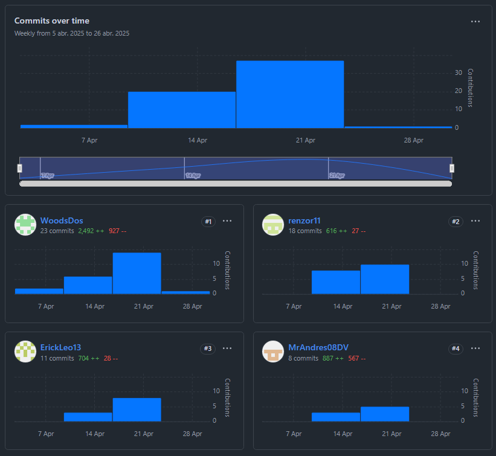
</p>
<br>

<p align="center">
  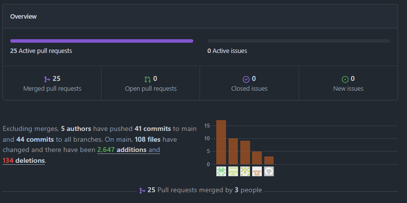
</p>
<br>

<p align="center">
  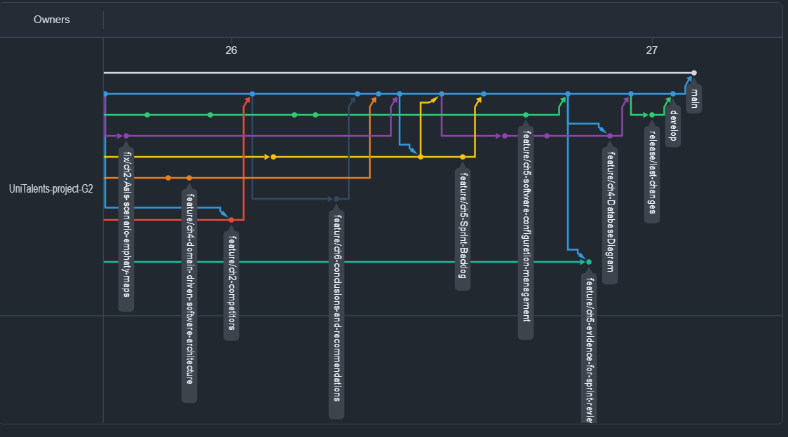
</p>
<br>


*TP1*
---
<p align="center">
  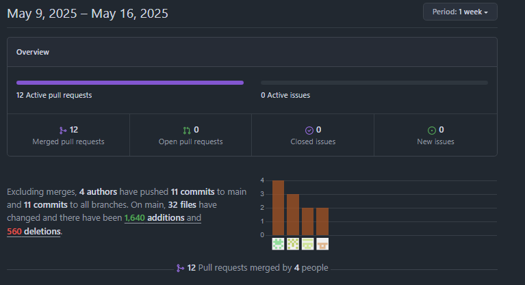
</p>
<br>

<p align="center">
  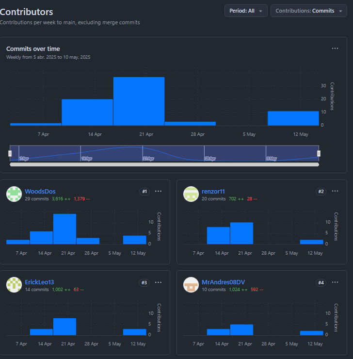
</p>
<br>

<p align="center">
  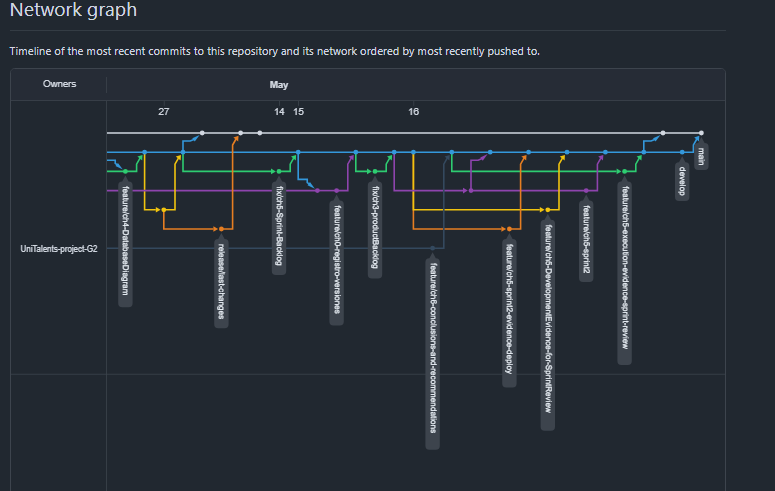
</p>
<br>

*TB2*
---
<p align="center">
  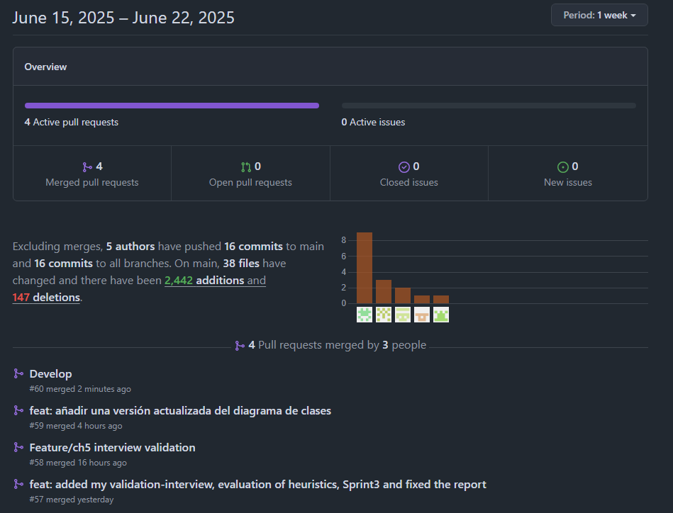
</p>
<br>

<p align="center">
  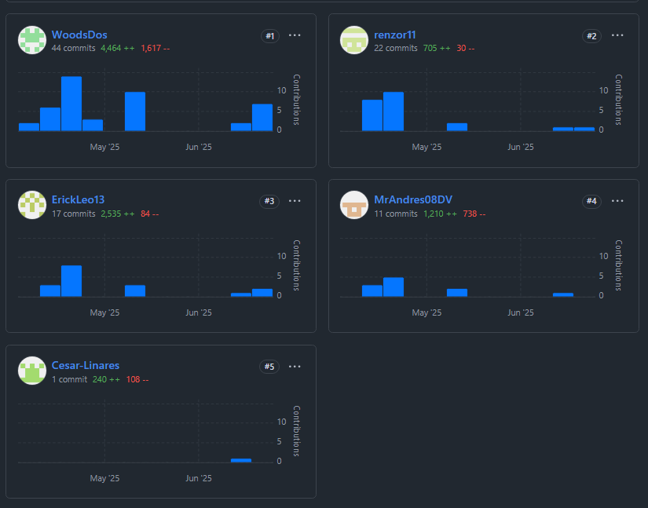
</p>
<br>

<p align="center">
  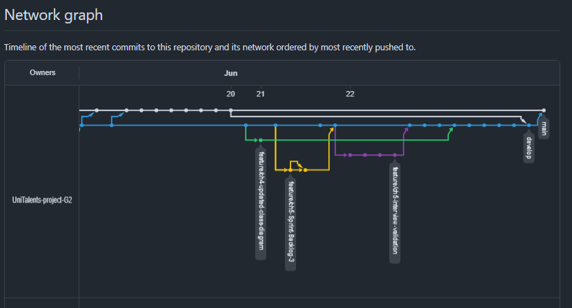
</p>
<br>

*TF1*
---
<p align="center">
  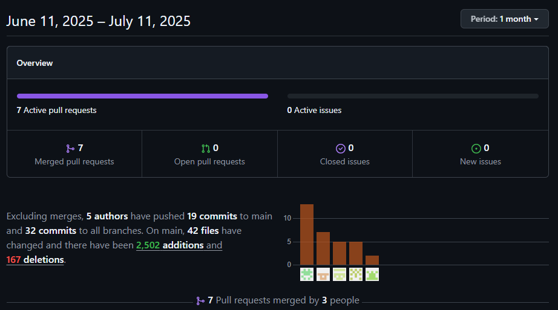
</p>
<br>

<p align="center">
  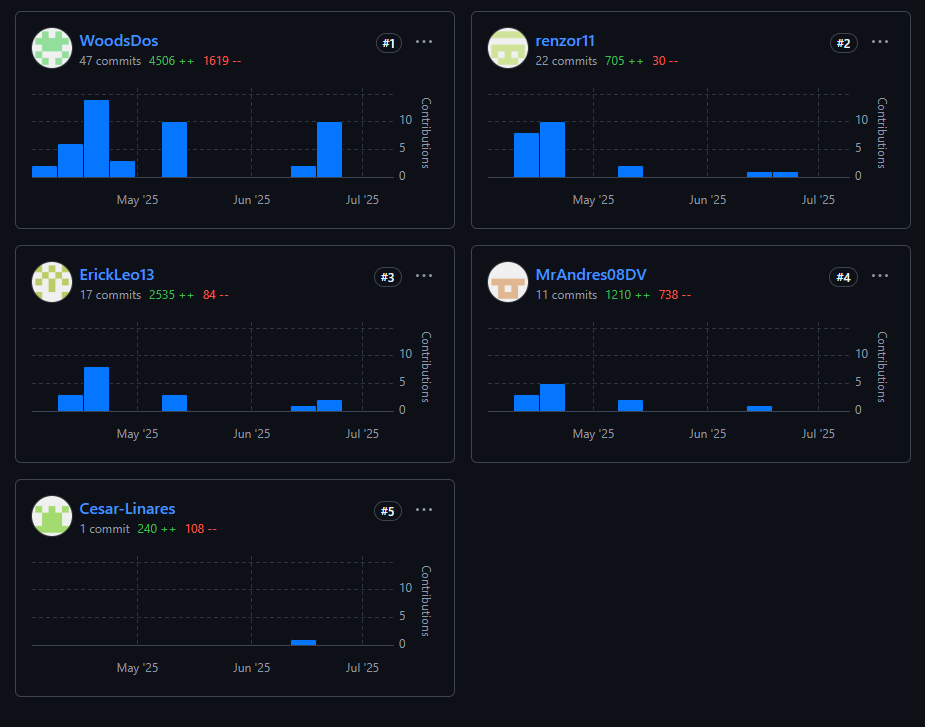
</p>
<br>

<p align="center">
  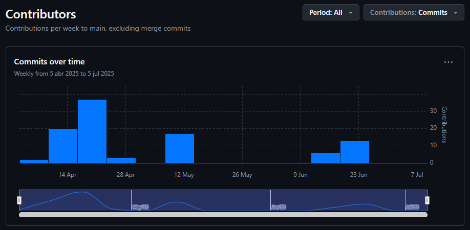
</p>
<br>

<p align="center">
  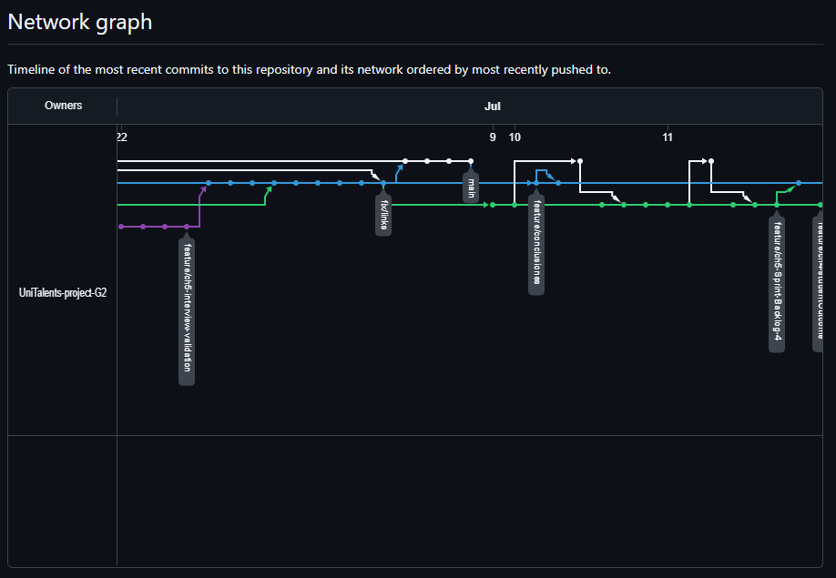
</p>
<br>


**TB1**
---

<table align="center">
  <tr>
    <td><strong>Integrante</strong></td>
    <td><strong>Tareas Asignadas</strong></td>
  </tr>
  <tr>
    <td>
      Javier Gonzales
    </td>
    <td>
      Startup Profile, antecedentes, problemática, Lean Ux proccess, diseño de entrevistas, registro de entrevistas, análisis de entrevistas, user stories, arquitectura de la información, mockups landing page y web application, 
    </td>
  </tr>
  <tr>
    <td>
      Erick Palomino
    </td>
    <td>
      Segmentos objetivos, análisis de competidores y estrategias, diseño de entrevistas, registro de entrevistas, análisis de entrevistas, user stories, diagrama de contexto, diagrama de contenedores, diagrama de componentes, mockups web application, 
    </td>
  </tr>
  <tr>
    <td>
      Renzo Rivera
    </td>
    <td>
      User personas, user task matrix, journey maps, diseño de entrevistas, registro de entrevistas, análisis de entrevistas, user stories,  web application wireframes y mockups, wireflows, userflows, prototyping
    </td>
  </tr>
  <tr>
    <td>
      Andres Coca
    </td>
    <td>
      Empathy maps, As-Is scenario, ubiquitous language, diseño de entrevistas, registro de entrevistas, análisis de entrevistas, diagrama de clases, diccionario de clases, mockups web application, 
    </td>
  </tr>
  <tr>
    <td>
      Cesar Linares
    </td>
    <td>
      To-Be scenario, impact mapping, product backlog, user stories, style guidelines, database diagram
    </td>
  </tr>
</table>

**TP1**
---
<table align="center">
  <tr>
    <td><strong>Integrante</strong></td>
    <td><strong>Tareas Asignadas</strong></td>
  </tr>
  <tr>
    <td>
      Javier Gonzales
    </td>
    <td>
      Feature de gestión de postulaciones para los gerentes, gestión del perfil de mi empresa. Correción de las tablas competidores y user task matrix
    </td>
  </tr>
  <tr>
    <td>
      Erick Palomino
    </td>
    <td>
      Feature de búsqueda de oportunidades, búsqueda de trabajo y postulación para los postulantes.  
    </td>
  </tr>
  <tr>
    <td>
      Renzo Rivera
    </td>
    <td>
      Feature del login y register para el ingreso a la appweb, además la configuración de ambos perfiles tanto estudiantes como gerente. 
    </td>
  </tr>
  <tr>
    <td>
      Andres Coca
    </td>
    <td>
      Feature de la creación, edición y eliminación de proyectos para los gerentes. Corrección del sprint backlog 1
    </td>
  </tr>
  <tr>
    <td>
      Cesar Linares
    </td>
    <td>
      Feature de la gestión del pefil del estudiante. Correción del product backlog. 
    </td>
  </tr>
</table>

**TB2**
---
<table align="center">
  <tr>
    <td><strong>Integrante</strong></td>
    <td><strong>Tareas Asignadas</strong></td>
  </tr>
  <tr>
    <td>
      Javier Gonzales
    </td>
    <td>
      Configuración del módulo shared, Student Outcome, Registro de versiones, Github Collaborations Insights, Implementacion del la Base de Datos y Deploy del backend.
    </td>
  </tr>
  <tr>
    <td>
      Erick Palomino
    </td>
    <td>
      Feature del módulo de Projects, Sprint Backlog 4, Sprint Planning, correciones del anterior sprint.
    </td>
  </tr>
  <tr>
    <td>
      Renzo Rivera
    </td>
    <td>
      Feature del módulo de Students, Aspect Leaders and Collaborators, Execution Evidence for Sprint Review y correciones del anterior sprint
    </td>
  </tr>
  <tr>
    <td>
      Andres Coca
    </td>
    <td>
      Feature del módulo de Companies, Sprint Backlog 4, Development Evidence for Sprint Review y correciones del anterior sprint
    </td>
  </tr>
  <tr>
    <td>
      Cesar Linares
    </td>
    <td>
      Feature del módulo de Postulations, conclusiones y correciones del anterior sprint.
    </td>
  </tr>
</table>

**TF1**
---
<table align="center">
  <tr>
    <td><strong>Integrante</strong></td>
    <td><strong>Tareas Asignadas</strong></td>
  </tr>
  <tr>
    <td>
      Javier Gonzales
    </td><td>Feature del diseño responsive en el Frontend, Feature del Módulo de Reputations y Postulations, y Actualización de los endpoints del Backend</td>
  </tr>
  <tr>
    <td>
      Erick Palomino
    </td><td>Feature del Módulo de Users, Corrección de los diagramas, mejora de los links</td>
  </tr>
  <tr>
    <td>
      Renzo Rivera
    </td>
    <td>Feature del diseño responsive en la Landing Page y Feature del Módulo de Projects</td>
  </tr>
  <tr>
    <td>
      Andres Coca
    </td>
    <td>Feature del Spirnt Backlog 4, Feature del Módulo de Student y mejora de los links 
    </td>
  </tr>
  <tr>
    <td>
      Cesar Linares
    </td>
    <td>Feature del Módulo de Company, desarrollo del PPT</td>
  </tr>
</table>

---

## Contenido

- [Registro de Versiones del Informe](#registro-de-versiones-del-informe)
- [Project Report Collaboration Insights](#project-report-collaboration-insights)
- [**TB1**](#tb1)
- [**TP1**](#tf)
- [**TB2**](#tb2)
- [**TF1**](#tf1)
- [Contenido](#contenido)
- [Student Outcome](#student-outcome)
- [Capítulo I: Introducción](#capítulo-i-introducción)
  - [1.1. Startup Profile](#11-startup-profile)
    - [1.1.1. Descripción de la Startup](#111-descripción-de-la-startup)
    - [1.1.2. Perfiles de integrantes del equipo](#112-perfiles-de-integrantes-del-equipo)
  - [1.2. Solution Profile](#12-solution-profile)
    - [1.2.1. Antecedentes y problemática](#121-antecedentes-y-problemática)
      - [What (Qué)](#what-qué)
        - [¿Cuál es el problema?](#cuál-es-el-problema)
      - [When (Cuando)](#when-cuando)
        - [¿Cuándo sucede el problema?](#cuándo-sucede-el-problema)
      - [Where (Dónde)](#where-dónde)
        - [¿Dónde surge el problema?](#dónde-surge-el-problema)
      - [Who (Quién)](#who-quién)
        - [¿Quiénes son los afectados?](#quiénes-son-los-afectados)
      - [Why (Por qué)](#why-por-qué)
        - [¿Cuál es la causa del problema?](#cuál-es-la-causa-del-problema)
      - [How (Cómo)](#how-cómo)
        - [¿Cómo se utilizará el producto?](#cómo-se-utilizará-el-producto)
      - [How Much (Cuánto)](#how-much-cuánto)
        - [¿Cuánto costará implementar la solución?](#cuánto-costará-implementar-la-solución)
    - [1.2.2. Lean UX Process](#122-lean-ux-process)
      - [1.2.2.1. Lean UX Problem Statements](#1221-lean-ux-problem-statements)
      - [1.2.2.2. Lean UX Assumptions](#1222-lean-ux-assumptions)
        - [Business Assumptions](#business-assumptions)
        - [User Assumptions](#user-assumptions)
        - [Feature Assumptions](#feature-assumptions)
      - [1.2.2.3. Lean UX Hypothesis Statements  ](#1223-lean-ux-hypothesis-statements--)
      - [1.2.2.4. Lean UX Canvas](#1224-lean-ux-canvas)
  - [1.3. Segmentos Objetivo](#13-segmentos-objetivo)
- [Capítulo II: Requirements Elicitation \& Analysis](#capítulo-ii-requirements-elicitation--analysis)
  - [2.1. Competidores](#21-competidores)
    - [2.1.1. Análisis competitivo](#211-análisis-competitivo)
    - [2.1.2. Estrategias y tácticas frente a competidores](#212-estrategias-y-tácticas-frente-a-competidores)
  - [2.2. Entrevistas](#22-entrevistas)
    - [2.2.1. Diseño de entrevistas  ](#221-diseño-de-entrevistas--)
- [*Preguntas dirigidas al segmento 1*](#preguntas-dirigidas-al-segmento-1)
- [*Preguntas dirigidas al segmento 2*](#preguntas-dirigidas-al-segmento-2)
    - [2.2.2. Registro de entrevistas  ](#222-registro-de-entrevistas--)
- [*Entrevistas a segmento 1*](#entrevistas-a-segmento-1)
- [*Entrevistas a segmento 2*](#entrevistas-a-segmento-2)
    - [2.2.3. Análisis de entrevistas](#223-análisis-de-entrevistas)
- [*Análisis de Entrevistas – Segmento 1 (Estudiantes)*](#análisis-de-entrevistas--segmento-1-estudiantes)
- [*Análisis de Entrevistas – Segmento 2 (Gerentes / Empresarios)*](#análisis-de-entrevistas--segmento-2-gerentes--empresarios)
  - [2.3. Needfinding](#23-needfinding)
    - [2.3.1. User Personas](#231-user-personas)
    - [2.3.2. User Task Matrix](#232-user-task-matrix)
    - [2.3.3. User Journey Mapping](#233-user-journey-mapping)
    - [2.3.4. Empathy Mapping](#234-empathy-mapping)
    - [2.3.5. As-is Scenario Mapping](#235-as-is-scenario-mapping)
  - [2.4. Ubiquitous Language](#24-ubiquitous-language)
- [Capítulo III: Requirements Specification](#capítulo-iii-requirements-specification)
  - [3.1. To-Be Scenario Mapping](#31-to-be-scenario-mapping)
  - [3.2. User Stories](#32-user-stories)
  - [3.3. Impact Mapping ](#33-impact-mapping-)
  - [3.4. Product Backlog  ](#34-product-backlog--)
- [Capítulo IV: Product Design](#capítulo-iv-product-design)
  - [4.1. Style Guidelines](#41-style-guidelines)
    - [4.1.1. General Style Guidelines](#411-general-style-guidelines)
    - [4.1.2. Web Style Guidelines](#412-web-style-guidelines)
  - [4.2. Information Architecture](#42-information-architecture)
    - [4.2.1. Organization Systems ](#421-organization-systems-)
    - [4.2.2. Labeling Systems  ](#422-labeling-systems--)
    - [4.2.3. SEO Tags and Meta Tags  ](#423-seo-tags-and-meta-tags--)
    - [4.2.4. Searching Systems ](#424-searching-systems-)
    - [4.2.5. Navigation Systems](#425-navigation-systems)
  - [4.3. Landing Page UI Design](#43-landing-page-ui-design)
    - [4.3.1. Landing Page Wireframe](#431-landing-page-wireframe)
    - [4.3.2. Landing Page Mock-up](#432-landing-page-mock-up)
  - [4.4. Web Applications UX/UI Design](#44-web-applications-uxui-design)
    - [4.4.1. Web Applications Wireframes](#441-web-applications-wireframes)
    - [4.4.2. Web Applications Wireflow Diagrams](#442-web-applications-wireflow-diagrams)
    - [4.4.3. Web Applications Mock-ups](#443-web-applications-mock-ups)
    - [4.4.4. Web Applications User Flow Diagrams](#444-web-applications-user-flow-diagrams)
  - [4.5. Web Applications Prototyping](#45-web-applications-prototyping)
  - [4.6. Domain-Driven Software Architecture](#46-domain-driven-software-architecture)
    - [4.6.1. Software Architecture Context Diagram](#461-software-architecture-context-diagram)
    - [4.6.2. Software Architecture Container Diagrams](#462-software-architecture-container-diagrams)
    - [4.6.3. Software Architecture Components Diagrams](#463-software-architecture-components-diagrams)
  - [4.7. Software Object-Oriented Design](#47-software-object-oriented-design)
    - [4.7.1. Class Diagrams](#471-class-diagrams)
    - [4.7.2. Class Dictionary](#472-class-dictionary)
  - [4.8. Database Design](#48-database-design)
    - [4.8.1. Database Diagram](#481-database-diagram)
- [Capítulo V: Product Implementation, Validation \& Deployment](#capítulo-v-product-implementation-validation--deployment)
  - [5.1. Software Configuration Management](#51-software-configuration-management)
    - [5.1.1. Software Development Environment Configuration](#511-software-development-environment-configuration)
    - [5.1.2. Source Code Management](#512-source-code-management)
    - [5.1.3. Source Code Style Guide \& Conventions](#513-source-code-style-guide--conventions)
    - [5.1.4. Software Deployment Configuration](#514-software-deployment-configuration)
  - [5.2. Landing Page, Services \& Applications Implementation](#52-landing-page-services--applications-implementation)
    - [5.2.1. Sprint 1](#521-sprint-1)
      - [5.2.1.1. Sprint Planning 1](#5211-sprint-planning-1)
      - [5.2.1.2. Aspect Leaders and Collaborators](#5212-aspect-leaders-and-collaborators)
      - [5.2.1.3. Sprint Backlog 1](#5213-sprint-backlog-1)
      - [5.2.1.4. Development Evidence for Sprint Review](#5214-development-evidence-for-sprint-review)
      - [5.2.1.5. Execution Evidence for Sprint Review](#5215-execution-evidence-for-sprint-review)
      - [5.2.1.6. Services Documentation Evidence for Sprint Review](#5216-services-documentation-evidence-for-sprint-review)
      - [5.2.1.7. Software Deployment Evidence for Sprint Review](#5217-software-deployment-evidence-for-sprint-review)
      - [5.2.1.8. Team Collaboration Insights during Sprint](#5218-team-collaboration-insights-during-sprint)
    - [5.2.2. Sprint 2](#522-sprint-2)
      - [5.2.2.1. Sprint Planning 2](#5221-sprint-planning-2)
      - [5.2.2.2. Aspect Leaders and Collaborators](#5222-aspect-leaders-and-collaborators)
      - [5.2.2.3. Sprint Backlog 2](#5223-sprint-backlog-2)
      - [5.2.2.4. Development Evidence for Sprint Review](#5224-development-evidence-for-sprint-review)
      - [5.2.2.5. Execution Evidence for Sprint Review](#5225-execution-evidence-for-sprint-review)
      - [5.2.2.6. Services Documentation Evidence for Sprint Review](#5226-services-documentation-evidence-for-sprint-review)
      - [5.2.2.7. Software Deployment Evidence for Sprint Review](#5227-software-deployment-evidence-for-sprint-review)
        - [*Landing Page:*](#landing-page)
        - [*Front End:*](#front-end)
      - [5.2.2.8. Team Collaboration Insights during Sprint](#5228-team-collaboration-insights-during-sprint)
    - [5.2.3. Sprint 3](#523-sprint-3)
      - [5.2.3.1. Sprint Planning 3](#5231-sprint-planning-3)
      - [5.2.3.2. Aspect Leaders and Collaborators](#5232-aspect-leaders-and-collaborators)
      - [5.2.3.3. Sprint Backlog 3](#5233-sprint-backlog-3)
      - [5.2.3.4. Development Evidence for Sprint Review](#5234-development-evidence-for-sprint-review)
      - [5.2.3.5. Execution Evidence for Sprint Review](#5235-execution-evidence-for-sprint-review)
      - [5.2.3.6. Services Documentation Evidence for Sprint Review](#5236-services-documentation-evidence-for-sprint-review)
      - [5.2.3.7. Software Deployment Evidence for Sprint Review](#5237-software-deployment-evidence-for-sprint-review)
      - [5.2.3.8. Team Collaboration Insights during Sprint](#5238-team-collaboration-insights-during-sprint)
    - [5.2.4. Sprint 4](#524-sprint-4)
      - [5.2.4.1. Sprint Planning 4](#5241-sprint-planning-4)
      - [5.2.4.2. Aspect Leaders and Collaborators](#5242-aspect-leaders-and-collaborators)
      - [5.2.4.3. Sprint Backlog 4](#5243-sprint-backlog-4)
      - [5.2.4.4. Development Evidence for Sprint Review](#5244-development-evidence-for-sprint-review)
      - [5.2.4.5. Execution Evidence for Sprint Review](#5245-execution-evidence-for-sprint-review)
      - [5.2.4.6. Services Documentation Evidence for Sprint Review](#5246-services-documentation-evidence-for-sprint-review)
      - [5.2.4.7. Software Deployment Evidence for Sprint Review](#5247-software-deployment-evidence-for-sprint-review)
      - [5.2.4.8. Team Collaboration Insights during Sprint](#5248-team-collaboration-insights-during-sprint)
  - [5.3 Validation Interviews](#53-validation-interviews)
    - [5.3.1 Diseño de Entrevistas](#531-diseño-de-entrevistas)
    - [5.3.2 Registro de Entrevistas](#532-registro-de-entrevistas)
    - [5.3.3 Evaluaciones según heurísticas](#533-evaluaciones-según-heurísticas)
  - [5.4 Video About-the-Product](#54-video-about-the-product)
- [Conclusiones](#conclusiones)
  - [Conclusiones y recomendaciones](#conclusiones-y-recomendaciones)
- [Bibliografía](#bibliografía)
- [Anexos](#anexos)
---

## Student Outcome

<table align="center">
  <tr>
    <td><strong>Criterio</strong></td>
    <td><strong>Acciones Realizadas</strong></td>
    <td><strong>Conclusiones</strong></td>
  </tr>
  <tr>
    <td>
      Trabaja en equipo para proporcionar liderazgo en forma conjunta
    </td>
    <td>
      <strong>Javier Gonzales:</strong><br>
      TB1 - Coordinación general del proyecto, elaboración del Startup Profile, definición de problemáticas, arquitectura de la información, desarrollo del Lean UX process y gestión del diseño de entrevistas.
      <br><br>
      TP1 – Coordinación del equipo durante el Sprint 2, liderazgo en la implementación de gestión de postulaciones para gerentes y perfil de empresa. Revisión de user task matrix y tablas de competidores.
      <br><br>
      TB2 - Coordinación del módulo shared, registro de versiones y monitoreo de colaboraciones en GitHub mediante Insights.
      <br><br>
      TF1 - Coordinó el diseño responsive en el frontend, desarrolló los módulos de Reputations y Postulations, y actualizó los endpoints del backend.
      <br><br>
      <strong>Erick Palomino:</strong><br>
      TB1 - Análisis de segmentos objetivos y estrategias, levantamiento de competidores, entrevistas y desarrollo de diagramas estructurales del sistema.
      <br><br>
      TP1 – Participación activa en reuniones de planificación. Desarrollo de búsqueda de oportunidades y postulaciones.
      <br><br>
      TB2 - Participación activa en la planificación del sprint y desarrollo de nuevas funcionalidades del módulo Projects.
      <br><br>
      TF1 - Desarrolló el módulo de Users, realizó la corrección de diagramas UML y mejoró los enlaces internos del sistema.
      <br><br>
      <strong>Renzo Rivera:</strong><br>
      TB1 – Desarrollo de user personas, journey maps y user stories, así como wireframes, prototipos y testeo funcional
      <br><br>
      TP1 – Encargado del login/register y configuración de perfiles. Participación constante en decisiones técnicas.
      <br><br>
      TB2 - Apoyo en el liderazgo de subcomponentes del módulo Students, coordinación con colaboradores y corrección de entregables anteriores.
      <br><br>
      TF1 - Implementó diseño responsive en la landing page y desarrolló el módulo de Projects.
      <br><br>
      <strong>Andres Coca:</strong><br>
      TB1 - Diseño de Empathy Maps, escenarios actuales, diccionario de datos, y apoyo en entrevistas y análisis funcional.
      <br><br>
      TP1 – Desarrollo de creación, edición y eliminación de proyectos. Aportó en revisión de sprint backlog 1.
      <br><br>
      TB2 - Participación en el Sprint Backlog 3, gestión de evidencia de desarrollo y solución de observaciones anteriores.
      <br><br>
      TF1 - Implementó y documentó el Sprint Backlog 4, desarrolló el módulo de Student y mejoró los enlaces.
      <br><br>
      <strong>Cesar Linares</strong><br>
      TB1 – Construcción de escenarios TO-BE, mapas de impacto, y estructura del backlog con style guidelines, product backlog y database diagrams
      <br><br>
      TP1 – Desarrollo del perfil del estudiante y corrección del product backlog.
      <br><br>
      TB2 - Coordinación en la revisión del módulo Postulations y mejoras con base en retroalimentación.
      <br><br>
      TF1 - Desarrolló el módulo de Company y elaboró la presentación del proyecto (PPT).
    </td>
    <td>
      TB1 - El equipo ha trabajado de manera cohesionada, organizando responsabilidades desde las primeras etapas del proyecto. Cada miembro asumió liderazgo en tareas clave del desarrollo del sistema, generando entregables integrados y consistentes. La toma de decisiones fue compartida y orientada al cumplimiento de objetivos comunes.
      <br><br>
      TP1 - El grupo ha demostrado un liderazgo compartido durante la planificación y ejecución del Sprint 2, asignando roles según fortalezas técnicas. Se lograron avances significativos en las funcionalidades principales gracias a la coordinación continua y compromiso de cada integrante. Las decisiones se tomaron en conjunto, fortaleciendo el sentido de equipo.
      <br><br>
      TB2 - El grupo mostró una sólida capacidad de liderazgo compartido, gestionando eficientemente las responsabilidades de cada módulo. Se evidenció una comunicación activa para resolver pendientes del sprint anterior y mantener el avance planificado.
      <br><br>
      TF1 - El equipo demostró una adecuada distribución del liderazgo técnico y organizacional, asumiendo responsabilidades clave en distintas áreas del proyecto. La colaboración fue constante y coordinada, asegurando el cumplimiento de los entregables en tiempo y forma.
    </td>
  </tr>
  <tr>
    <td>
      Crea un entorno colaborativo e inclusivo, establece metas, planifica tareas y cumple objetivos. 
    </td>
    <td>
      <strong>Javier Gonzales:</strong><br>
      TB1 – Liderazgo en planificación de tareas clave del UX process, organización de cronograma de entregables y coordinación interna del equipo.
      <br><br>
      TP1 – Coordinación del equipo en Discord, definición de metas de sprint, liderazgo en tareas críticas y soporte técnico.
      <br><br>
      TB2 - Apoyo en la planificación del sprint, seguimiento de tareas e integración de la base de datos con los demás módulos.
      <br><br>
      TF1 - Participó activamente en la integración frontend-backend y en la planificación de funcionalidades críticas.
      <br><br>
      <strong>Erick Palomino:</strong><br>
      TB1 – Participación activa en entrevistas, planificación de criterios de segmentación y coordinación técnica de mockups.
      <br><br>
      TP1 – Apoyo continuo al equipo, cumplimiento de tareas asignadas en tiempo y forma, proactividad para levantar issues y dar seguimiento.
      <br><br>
      TB2 - Colaboración efectiva en la ejecución del módulo Projects, trabajando en conjunto con el equipo para cumplir los objetivos.
      <br><br>
      TF1 - Colaboró en la estructuración del backend y la mejora de la documentación.
      <br><br>
      <strong>Renzo Rivera:</strong><br>
      TB1 – Colaboración en planificación funcional de interfaz, distribución de tareas de prototipado y verificación del cumplimiento de tiempos.<br><br>
      TP1 – Gestión de interfaz de autenticación, organización de estructuras de carpetas y soporte en configuración de perfiles.
      <br><br>
      TB2 - Cumplimiento de tareas asignadas, contribución en el desarrollo y validación del módulo Students.
      <br><br>
      TF1 - Coordinó la estética del diseño inicial de la app, promoviendo buenas prácticas de usabilidad.
      <br><br>
      <strong>Andres Coca:</strong><br>
      TB1 – Aporte en el diseño de estructura lógica de la solución, trabajo colaborativo en entrevistas y contribución al modelo de datos.
      <br><br>
      TP1 – Organización de los módulos de proyectos, planificación de tareas en GitHub y revisión del backlog anterior.
      <br><br>
      TB2 - Participación activa en la planificación técnica del sprint, gestión de entregables y soporte a compañeros.
      <br><br>
      TF1 - Participó en la planificación del Sprint Backlog, asegurando la trazabilidad de tareas.
      <br><br>
      <strong>Cesar Linares:</strong><br>
      TB1 – Apoyo en la definición de objetivos y metas del producto, priorización de funcionalidades clave y control del avance del backlog.<br><br>
      TP1 – Coordinación del trabajo en perfil del estudiante, seguimiento del progreso del equipo y apoyo en ajustes del product backlog.
      <br><br>
      TB2 - Colaboración con el equipo para cerrar observaciones y asegurar el cumplimiento de funcionalidades en Postulations.
      <br><br>
      TF1 - Apoyó en la organización del equipo y documentación visual del avance del proyecto.
    </td>
    <td>
      TB1 - El grupo logró establecer un entorno colaborativo donde se respetaron los roles, tiempos y responsabilidades de cada integrante. Se definieron metas alcanzables, se mantuvo una comunicación efectiva y se cumplieron los objetivos de la primera entrega mediante un trabajo organizado y solidario.
      <br><br>
      TP1 - El equipo logró establecer un entorno colaborativo eficaz, distribuyendo tareas de manera equitativa y planificada. El uso de herramientas como Discord, Trello y GitHub permitió cumplir con los objetivos del sprint. El compromiso de cada miembro garantizó avances sostenibles y alineados con las metas del proyecto.
      <br><br>
      TB2 - Durante el TB2, el equipo demostró un entorno de trabajo inclusivo y cooperativo. Se cumplieron las metas propuestas gracias a una planificación estructurada y a la corresponsabilidad en el cumplimiento de tareas por parte de todos los integrantes.
      <br><br>
      TF1 - El equipo promovió un ambiente de trabajo colaborativo, cumpliendo con las metas propuestas para el sprint. Se logró una integración efectiva de las tareas técnicas y de presentación, reflejando una planificación clara y un trabajo cohesionado.
    </td>
  </tr>
</table>


---

## Capítulo I: Introducción

### 1.1. Startup Profile

#### 1.1.1. Descripción de la Startup  

**UniTalents** es una startup tecnológica enfocada en transformar la empleabilidad de estudiantes universitarios a través de soluciones digitales que conectan talento emergente con oportunidades reales de experiencia laboral. A través de su plataforma **UniTalents Connect**, ofrece un espacio donde alumnos de pregrado pueden ofrecer servicios freelance, desarrollar su portafolio profesional y generar ingresos, mientras empresas y personas acceden a talento calificado, flexible y accesible.

La propuesta de UniTalents se basa en la creación de un ecosistema inclusivo, colaborativo y orientado a resultados, promoviendo la inserción laboral temprana, el aprendizaje basado en proyectos reales y el empoderamiento del estudiante como profesional en formación.

**Misión:** Empoderar a estudiantes universitarios mediante una plataforma digital que les permita ofrecer servicios freelance, construir su reputación profesional y adquirir experiencia laboral, del mismo modo brindando a empresas candidatos ideales. 

**Visión:**  En los próximos 5 años **UniTalents Connect** sea la principal plataforma digital en Latinoamérica que potencia el talento universitario. Además busca que **UniTalents** se convierta en un negocio rentable y sostenible contribuyendo al desarrollo profesional y económico de miles de jóvenes.

**Alcance del proyecto:** UniTalents Connect es una plataforma web que conecta estudiantes universitarios con empresas mediante proyectos reales de corta duración, gestionando postulaciones, portafolios, evaluaciones y certificaciones para impulsar la empleabilidad joven.
<br><br>

#### 1.1.2. Perfiles de integrantes del equipo  
<br>
<table align="center">
  <tr>
    <td><strong>Descripción</strong></td>
    <td><strong>Estudiante</strong></td>
  </tr>
  <tr>
    <td>
      Hola mi nombre es Javier Gonzales, estudió la carrera de ingeniería y actualmente me encuentro en el 5to ciclo. Me considero una persona amable, analítica y muy perseverante en cada aspecto de mi vida, por lo que esto me permite desenvolverme bien en los proyectos y en algunas ocasiones dirigir el equipo como Team Leader. Respecto a mis conocimientos técnicos, pues sé C++, Python, SQL, HTML, CSS y lo básico de JavaScript. Aunque se me dificulta mucho aprender idiomas, domino muy bien el Inglés.
    </td>
    <td>
      <p align="center">
        
      </p>
    </td>
  </tr>
  <tr>
    <td>
      Hola, mi nombre es Erick Leonardo Palomino Fiestas y actualmente soy estudiante de la carrera de Ingeniería de Software, cursando el quinto ciclo. Tengo conocimientos en  C++, HTML, CSS, lo básico de JavaScript, así como en bases de datos SQL y MongoDB.  Me caracterizo por ser una persona responsable, con buena comunicación dentro de mi equipo y una actitud siempre positiva. Además, cuento con un dominio básico del idioma inglés.
    </td>
    <td>
      <p align="center">
        
      </p>
    </td>
  </tr>
  <tr>
    <td>
      Soy Renzo Sebastian Rivera Ratachi y soy estudiante de la carrera de Ingeniería de Software. Actualmente estoy cursando el 5to ciclo de mi carrera y tengo conocimientos intermedios de HTML, CSS, JavaScript y C++. Me considero una persona responsable y puntual.
    </td>
    <td>
      <p align="center">
        
      </p>
    </td>
  </tr>
  <tr>
    <td>
      Soy César Alejandro Linares Bernable y me encuentro estudiando la carrera de Ingeniería de Software en el 5to ciclo. Tengo conocimientos en c++, angular, sql, html y lo básico de css. Me considero responsable y puntual con lo que respecta a cumplir con las tareas encomendadas. Tengo un manejo intermedio del idioma inglés.
    </td>
    <td>
      <p align="center">
        
      </p>
    </td>
  </tr>
  <tr>
    <td>
      Mi Nombre es Carlos Andrés Coca, tengo 19 años, actualmente me encuentro cursando el quinto ciclo de la carrera de Ingeniería de Software. Cuento con conocimientos en C++, Python y HTML.  y desde muy joven me ha interesado la ciberseguridad y el desarrollo de Software. Teniendo en cuenta el gran impacto que presentan a día de hoy.
    </td>
    <td>
      <p align="center">
        
      </p>
    </td>
  </tr>
</table>
<br>

### 1.2. Solution Profile

#### 1.2.1. Antecedentes y problemática 

##### What (Qué)<br><br>

###### ¿Cuál es el problema?<br><br>

El Ministerio de Trabajo y Promoción del Empleo (MTPE) advierte que siete de cada diez jóvenes enfrentan problemas de inadecuación ocupacional, es decir, no pueden encontrar empleos relacionados con sus estudios (2024). Esta noticia refleja claramente el problema que radica en que los estudiantes tienen dificultades para insertarse laboralmente debido a la falta de experiencia previa o referencias profesionales, mientras que las empresas pequeñas no siempre tienen acceso a talento calificado a costos razonables. Esto genera una brecha entre el talento disponible y la demanda del mercado.<br><br>

##### When (Cuando)<br><br>

###### ¿Cuándo sucede el problema?<br><br>

El problema ocurre constantemente, pero es más crítico entre el segundo y el séptimo ciclo de la vida universitaria, etapa en la cual el estudiante busca adquirir experiencia sin comprometer su disponibilidad académica. Para las empresas, la necesidad es constante y muchas veces inmediata.<br><br>

##### Where (Dónde)<br><br>

###### ¿Dónde surge el problema?<br><br>

Este problema es particularmente agudo en áreas urbanas del Perú, donde la competencia laboral es intensa y las oportunidades para jóvenes sin experiencia son limitadas. Además, Perú se encuentra entre los cinco países con mayor proporción de jóvenes que ni estudian ni trabajan ('ninis'), con un 21% de la población juvenil en esta situación. Las pequeñas empresas también están ubicadas en entornos con recursos limitados para contratar personal especializado.<br><br>

##### Who (Quién)<br><br>

###### ¿Quiénes son los afectados?<br><br>

Estudiantes universitarios, especialmente de los primeros ciclos o sin experiencia laboral previa, que buscan generar ingresos y mejorar su empleabilidad. También pequeñas empresas, profesionales independientes y emprendedores que requieren servicios puntuales pero accesibles en áreas como diseño, programación, redacción o marketing digital.<br><br>

##### Why (Por qué)<br><br>

###### ¿Cuál es la causa del problema?<br><br>

El problema tiene múltiples causas:

+ Falta de experiencia laboral previa exigida por la mayoría de empleadores.

Según el diario Gestión, en Perú, el 37% de jóvenes entre 15 y 29 años enfrenta dificultades para conseguir empleo, principalmente por no cumplir con requisitos de experiencia o por no tener redes de contacto laborales formales

+ Desconexión entre la formación universitaria y las demandas del mercado.

Según el Ministerio de Trabajo, 7 de cada 10 jóvenes en el Perú trabajan en ocupaciones no relacionadas con sus estudios

+ Escasez de espacios digitales locales para que estudiantes trabajen por proyecto o de forma flexible.

Plataformas globales como Upwork o Freelancer no están adaptadas a la realidad educativa, económica y lingüística de los estudiantes peruanos, lo que reduce sus oportunidades.<br><br>

##### How (Cómo)<br><br>

###### ¿Cómo se utilizará el producto?<br><br>

El producto **UniTalents Connect** será utilizado como una plataforma web que permitirá:

+ A los estudiantes universitarios crear un perfil profesional con sus habilidades, intereses y portafolio. También postularse a proyectos publicados por personas o pequeñas empresas y ganar experiencia validada a través de calificaciones y comentarios.

+ A empresas publicar proyectos o necesidades específicas (diseño, desarrollo, redacción, etc.) y seleccionar perfiles de estudiantes según sus competencias, disponibilidad y reputación.<br><br>

##### How Much (Cuánto)<br><br>

###### ¿Cuánto costará implementar la solución?<br><br>

En el Perú, siete de cada diez jóvenes trabajan en empleos que no se relacionan con lo que estudian (Infobae, 2024), lo que evidencia una desconexión entre el talento universitario y el mercado laboral formal. Esta problemática se ve agravada por la falta de plataformas accesibles que les permitan ganar experiencia profesional de manera flexible y validada. Por ello, desarrollar UniTalents Connect representa una inversión estratégica y de alto impacto social, que busca cerrar esta brecha con una solución digital enfocada en los estudiantes. A continuación, se presenta un presupuesto estimado:

+ Desarrollo de Software

Diseño y desarrollo web: S/ 1,250 – S/ 2,250

Backend y API RESTful: S/ 800 – S/ 1,000

Dominio y hosting (anual): S/ 450 – S/ 750

+ Marketing y Lanzamiento

Campañas de marketing digital: S/ 500 – S/ 1,000

+ Mantenimiento y Soporte

Soporte y actualizaciones (anual): S/ 1,000 – S/ 2,000

+ **Total Estimado: S/ 3,200 – S/ 6,000**<br><br>


#### 1.2.2. Lean UX Process

##### 1.2.2.1. Lean UX Problem Statements<br><br>

El propósito de **UniTalents Connect** es brindar a los estudiantes universitarios del Perú una plataforma digital accesible y flexible que les permita acceder a oportunidades de trabajo freelance, facilitando su desarrollo profesional y ayudándolos a generar ingresos sin descuidar su formación académica.

El problema se presenta cuando los estudiantes, especialmente aquellos sin experiencia previa, intentan ingresar al mercado laboral formal y se enfrentan a múltiples barreras como la falta de contactos, la exigencia de experiencia en convocatorias laborales y la escasa disponibilidad de plataformas adaptadas a sus necesidades. Actualmente, muchos jóvenes recurren a redes sociales o plataformas globales donde compiten en condiciones desiguales.

Hemos observado que esta situación genera una sensación generalizada de frustración, subempleo e informalidad entre los estudiantes. La ausencia de un entorno digital confiable y diseñado para ellos limita sus posibilidades de construir un perfil profesional sólido, mostrar su talento y desarrollar habilidades blandas mediante la práctica en proyectos reales. Esta desconexión entre la oferta de talento universitario y la demanda de servicios accesibles por parte de emprendedores y pequeñas empresas también impide el aprovechamiento de recursos humanos valiosos en etapas tempranas.

Y ante esta problemática nos surge la siguiente pregunta: ¿Cómo podríamos conectar el talento universitario con proyectos reales de forma segura, validada y flexible, sin requerir experiencia previa ni depender de redes de contacto tradicionales?<br><br>

+ **Domain:** Empleabilidad juvenil y servicios freelance digitales.
+ **Customer Segments:** Estudiantes universitarios peruanos de pregrado, especialmente entre los 18 y 25 años.
+ **Pain Points:** Falta de experiencia laboral, Escasa disponibilidad laboral adaptadas a la etapa académica, recursos limitados en pequeñas empresas para contratar personal.
+ **Gap:** No hay una solución en el mercado especializada en la conexión del conocimiento, habilidades y talento de estudiantes universitarios y la demanda de empresas que requieren soluciones ágiles, digitales y de bajo costo.
+ **Vision/Strategy:** Crear una plataforma accesible que conecta estudiantes con proyectos freelance reales, permitiéndoles adquirir experiencia, generar ingresos y construir una reputación laboral desde etapas tempranas de su formación.
+ **Initial Segment:** Estudiantes universitarios de Lima Metropolitana de carreras de tecnología, comunicación, diseño y administración, con acceso frecuente a herramientas digitales y motivación por generar ingresos y experiencia profesional.<br><br>

##### 1.2.2.2. Lean UX Assumptions<br><br>

###### Business Assumptions<br><br>

1. **Creo nuestros usuarios tienen la necesidad** de ganar experiencia profesional y generar ingresos mientras estudian.

2. **Estas necesidades se pueden satisfacer** una plataforma web que conecte a estudiantes universitarios talentosos con proyectos freelance reales.

3. **Nuestros clientes iniciales serán** estudiantes universitarios de pregrado entre los 18 y 25 años, de carreras relacionadas al diseño, tecnología, administración y comunicación.

4. **El valor más importante que un cliente quiere de nuestros servicios es** conseguir trabajos o proyectos que les permitan construir su portafolio y reputación profesional.

5. **El cliente también va a obtener** flexibilidad de horarios, ingresos adicionales, desarrollo de habilidades blandas y validación en su perfil.

6. **Vamos a obtener la mayoría de los clientes mediante** redes sociales (instagram, tiktok), alianzas con universidades peruanas y campañas digitales en plataformas estudiantiles.

7. **Vamos a obtener ingresos mediante** comisiones por publicación de proyectos o una subscripción premium para empresas reclutadoras.

8. **Nuestra competencia en el mercado serán** plataformas como Freelancer, Workana o Upwork.

9. **Vamos a tener ventaja frente a nuestra competencia debido a** estamos centrados en el mercado universitario, sin barreras como un título o experiencia previa. 

10. **El mayor riesgo del servicio es** la baja participación de estudiantes o la desconfianza de las empresas en contratar talento sin experiencia formal. 

11. **Lo resolveremos realizando** incentivos por primeras contrataciones, sistema de reputación en candidatos, alianzas con instituciones educativas y casos de éxito visible. 

12. **Otro riesgo que debemos considerar es que** los estudiantes no tengan el tiempo ni la motivación para postularse a trabajos freelance durante su carrera.<br><br>

###### User Assumptions<br><br>

1. **¿Quién es el usuario?**

Estudiantes universitarios de entre 18 y 25 años, con habilidades en diseño, programación, redacción, marketing, que buscan adquirir experiencia laboral, desarrollar su portafolio y generar ingresos mientras estudian. 

Pequeñas y medianas empresas, profesionales independientes y emprendedores que requieren servicios puntuales (como diseño, programación, redacción o community management) a bajo costo, con flexibilidad y acceso directo a talento joven y digitalmente competente.

2. **¿Dónde encaja nuestro producto en su vida?**

A la par de la carrera universitaria. Permitiendo aplicar conocimientos en proyectos reales, ganar reputación y generar ingresos. 

3. **¿Qué problemas resuelve nuestro producto?**

UnitTalents se centra en resolver problemas como: falta de experiencia laboral, barreras de acceder a trabajos remunerados, poca o nula visibilidad de las habilidades del estudiante, falta con contratación de personal por recursos limitados. 

4. **¿Cuándo y cómo se usa nuestro producto?**

En el tiempo libre de los estudiantes, acceden a la AppWeb, crean su perfil, buscan oportunidades y aplican a los trabajos.

5. **¿Qué características son importantes?**

+ Interfaz sencilla y fácil de aprender.
+ Filtro de búsqueda de habilidades.
+ Sistema de reputación.
+ Mensajes internos.
+ Perfil con portafolio.

6. **¿Cómo debería lucir y comportarse el producto?**

Debe ser moderno, amigable, accesible, con diseño responsivo, colores neutros y una experiencia clara e intuitiva que no distraiga ni complique al usuario. <br><br>

###### Feature Assumptions<br><br>

+ **Creemos que** la aplicación debe contar con una interfaz de usuario clara, responsiva y fácil de navegar que permitirá a estudiantes y empleadores utilizar la plataforma sin necesidad de capacitación previa ni conocimientos técnicos avanzados.

+ **Creemos que** la plataforma debe proporcionar notificaciones automáticas y personalizables que mantendrán informados a los usuarios sobre postulaciones recibidas, nuevas oportunidades, mensajes o estados de proyectos.

+ **Creemos que** la aplicación debe contar con un sistema de reputación y validación de desempeño, que permitirá a los clientes calificar el trabajo de los estudiantes, y a los estudiantes construir un historial profesional verificable.

+ **Creemos que** la aplicación debe ofrecer una sección de perfil personal con portafolio digital, donde los estudiantes puedan mostrar proyectos previos, habilidades destacadas y experiencias obtenidas dentro y fuera de la plataforma.

+ **Creemos que** la aplicación debe permitir la publicación rápida y sencilla de proyectos por parte de las empresas o clientes, incluyendo la posibilidad de establecer plazos, presupuestos y requerimientos específicos.<br><br>

##### 1.2.2.3. Lean UX Hypothesis Statements  <br><br>

1. **Hypothesis Statement 01:**

    **Creemos que** los estudiantes universitarios estarán dispuestos a adoptar la plataforma **UniTalents Connect** para postular a trabajos y así obtener experiencia profesional y generar ingresos complementarios. 

    **Sabremos** que hemos tenido éxito.

    **Cuando** al menos un 70% de nuestros usuarios registrados completen su perfil y postulen a un proyecto en el primer mes de uso. 

2. **Hypothesis Statement 02:**

    **Creemos que** la plataforma mejorará la conexión entre pequeñas empresas y el talento universitario al proporcionar un entorno accesible y confiable.

    **Sabremos** que hemos tenido éxito.

    **Cuando** al menos un 60% de proyectos publicados sean completados exitosamente y reciban una calificación positiva por parte del cliente. 

3. **Hypothesis Statement 03:**

    **Creemos que** ofrecer perfiles con portafolio, reputación y sistema de mensajes internos facilitará a los empleadores la selección efectiva de candidatos sin necesidad de recurrir a procesos de contratación tradicionales.

    **Sabremos** que hemos tenido éxito.

    **Cuando** el 75% de los empleadores indiquen que encontraron al candidato adecuado usando únicamente las funcionalidades de la plataforma.<br><br>

##### 1.2.2.4. Lean UX Canvas 

<p align="center">
  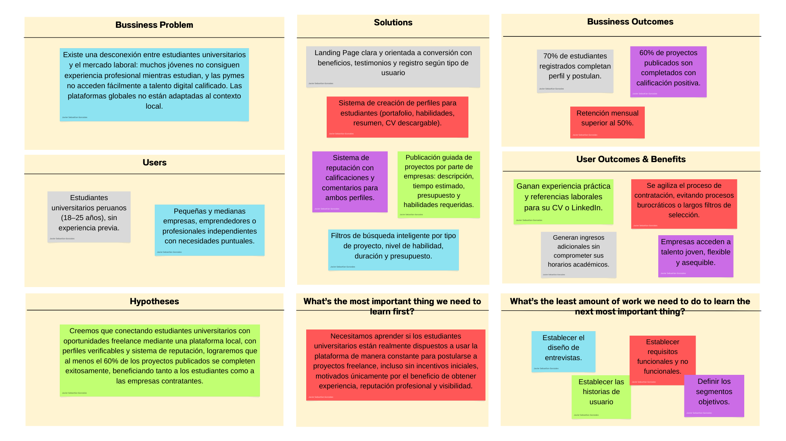
</p>

<p align="center">
  Lean UX Canvas - Elaboración propia
</p>


### 1.3. Segmentos Objetivo  

**Estudiantes Universitarios de Ciclos Avanzados**

**Descripción:**

Jóvenes entre 20 y 27 años que se encuentran cursando los últimos ciclos de sus estudios universitarios (a partir del 5to ciclo en adelante). Este grupo ha adquirido conocimientos técnicos o especializados en su carrera, pero tiene poca o nula experiencia profesional formal.

**Características demográficas y comportamiento:**

- Viven mayoritariamente en zonas urbanas, cerca de centros educativos o residencias estudiantiles.

- Tienen acceso constante a internet y son usuarios activos de redes sociales y plataformas digitales.

- Buscan formas de generar ingresos sin comprometer sus horarios de estudio.

- Prioridad por obtener experiencia profesional para mejorar su empleabilidad post-egreso.

**Sustento estadístico:**

- Según la Secretaría Nacional de la Juventud (Senaju), en Perú, el 21.4% de los jóvenes de 15 a 29 años ha alcanzado estudios universitarios, y el 14.6% ha cursado educación superior no universitaria, lo que significa que existe una base considerable de jóvenes con formación académica que podrían estar interesados en adquirir experiencia laboral mediante proyectos freelance, especialmente si aún no han ingresado al mercado formal de trabajo. ​

- El Instituto Nacional de Estadística e Informática (INEI) reporta que el 70.4% de los jóvenes de 15 a 29 años utiliza internet, siendo el teléfono móvil el medio más común de acceso, lo que significa que nuestro público objetivo cuenta con los recursos tecnológicos necesarios para acceder y utilizar una plataforma web de manera constante y eficiente..

**Personas Naturales y Pequeñas Empresas que Requieren Servicios Puntuales**

**Descripción:**

Emprendedores, profesionales independientes y pequeñas empresas que no cuentan con grandes presupuestos ni el tiempo para contratar agencias o personal permanente, pero que sí necesitan servicios puntuales como diseño gráfico, programación, redacción, análisis de datos, soporte administrativo, entre otros.

**Características demográficas y comportamiento:**

- Edad promedio entre 25 y 50 años.

- Interesados en soluciones ágiles, económicas y con resultados rápidos.

- Valoran la flexibilidad, la comunicación directa y el pago por entregables.

- Acuden a plataformas digitales o grupos en redes sociales para solicitar servicios por encargo.

**Sustento estadístico:**

- Las micro y pequeñas empresas (MYPE) representan el 99.6% de las unidades empresariales en Perú, según el INEI, lo que significa que existe un mercado amplio y diverso de pequeñas organizaciones que podrían beneficiarse de servicios freelance accesibles para resolver necesidades puntuales sin necesidad de contratar personal fijo o recurrir a agencias costosas. 

- De acuerdo con ComexPerú, las MYPE dedicadas al sector servicios constituyen aproximadamente el 50% del total, pero presentan el mayor nivel de informalidad, con un 88.7% en 2021, lo que significa que muchas de estas empresas, al operar con recursos limitados y de manera no formalizada, buscan soluciones prácticas y económicas, como la contratación de freelancers, para cubrir tareas específicas sin incurrir en gastos estructurales adicionales.

---

## Capítulo II: Requirements Elicitation & Analysis

### 2.1. Competidores

#### 2.1.1. Análisis competitivo  

<table border ="1" >
  <thead>
    <tr>
      <th colspan="6">Competitive Analysis Landscape</th>
    </tr>
  </thead>
  <tbody>
    <tr>
      <td rowspan="2">¿Por qué llevar acabo este análisis?</td>
      <td colspan="5">Quienes son nuestros principales competidores?</td>
    </tr>
    <tr>
      <td colspan="5">  Mediante el análisis de la competencia en el mercado, se puede comprender el entorno competitivo en el que se lanzará nuestro producto. Esto brinda una perspectiva clara sobre cómo otros competidores han incorporado funcionalidades y de qué manera atienden las necesidades de sus usuarios.</td>
    </tr>
    <tr>
      <td rowspan="3">PERFIL</td>
      <td rowspan="2">Overview</td>
      <td> 
        UniTalent Connect
        
      </td>
      <td>
        Workana
        
      </td>
      <td>
        Freelancer.com
        
      </td>
      <td>
        LinkedIn 
        
      </td>
    </tr>
    <tr>
      <td>Plataforma web que conecta a estudiantes universitarios de ciclos avanzados con personas o pequeñas empresas que necesitan servicios puntuales (como diseño redacción, programación, etc.). Promueve el trabajo freelance como una vía para adquirir experiencia real, flexible y útil para su desarrollo profesional.</td>
      <td>Plataforma líder en Latinoamérica para contratar freelancers en áreas como programación, diseño, traducción y marketing.</td>
      <td>Plataforma global que conecta freelancers con proyectos en diversas categorías: desarrollo, escritura, arte, etc. </td>
      <td> Red social profesional que conecta empleadores con talento, usada también para promocionar servicios y encontrar oportunidades de empleo.</td>
    </tr>
    <tr>
      <td>Ventaja competitiva
      ¿Que valor ofrece a los clientes?</td>
      <td>Se enfoca exclusivamente en estudiantes, lo que permite personalizar la experiencia: horarios flexibles, oportunidades acordes a su formación académica, sin requerir experiencia previa.</td>
      <td>Amplia base de usuarios, reputación consolidada, y herramientas avanzadas para gestión de proyectos.</td>
      <td>Cobertura internacional, variedad de categorías, concursos públicos para contratación.</td>
      <td>Reputación global, red de contactos, integración con empresas.</td>
    </tr>
    <tr>
      <td rowspan="2">PERFIL DEL MARKETING</td>
      <td>Mercado Objetivo</td>
      <td>Estudiantes universitarios, tambien personas naturales y pequeños emprendedores que buscan servicios digitales puntuales</td>
      <td>Profesionales freelancers de habla hispana y empresas medianas que buscan reducir costos.</td>
      <td>Freelancers de todos los niveles y empresas de todos los tamaños.</td>
      <td>Profesionales yestudiantes en búsqueda de empleo, tambien empresas de todos los tamaños</td>
    </tr>
    <tr>
      <td>Estrategias de Marketing</td>
      <td>
        + Alianzas con universidades.
        + Programas de referidos para estudiantes
        + Marketing de contenido en TikTok e Instagram (tips laborales, historias de éxito)
      </td>
      <td>Google Ads, blog con contenido educativo y certificaciones de habilidades</td>
      <td>Alianzas corporativas y certifaciones.</td>
      <td>Integracion con universidades y contenido compartido por usuarios, ademas de usar anuncios por internet exclusivos</td>
    </tr>
    <tr>
      <td rowspan="3">PERFIL DEL PRODUCTO</td>
      <td>Productos & Servicios</td>
      <td>
        - Listado de perfiles de estudiantes por habilidad<br>
        - Postulación a proyectos freelance.
      </td>
      <td> 
        + Publicación y postulación de proyectos.<br>
        - Contratos, seguimiento y pagos seguros.
      </td>
      <td>
        + Publicación de proyectos, concursos, gestión y pago.
      </td>
      <td>
        - Perfil profesional, buscador de empleo, recomendaciones, networking.
      </td>
    </tr>
    <tr>
      <td>Precios & Costos</td>
      <td>Ofrecemos los planes Basico ($2.99/mes), Premium ($5.99/mes) y PRO ($9.99/mes) para los empresarios y estudiantes.</td>
      <td>Comisión de 15–20% para freelancers y Clientes publican gratis.</td>
      <td>Opciones premium para destacar perfiles y comisión del 10–20%.</td>
      <td>Gratuito con funciones premium, ademas de suscripciones para empresas y usuarios.</td>
    </tr>
    <tr>
      <td>Canales de distribución (web/móvil)</td>
      <td>Móvil y Web</td>
      <td>Móvil y Web</td>
      <td>Móvil y Web</td>
      <td>Móvil y Web</td>
    </tr>
    <tr>
      <td rowspan="4">ANÁLISIS SWOT</td>
      <td>Fortalezas</td>
      <td>
        - Público segmentado y claro.<br>
        - Precios bajos y acceso rápido a talento.<br>
        - Beneficio educativo: experiencia laboral para el CV.
      </td>
      <td> 
        - Gran comunidad.<br>
        - Confianza por trayectoria.
      </td>
      <td>
        - Alcance global.<br>
        - Multilingüe y multisectorial.
      </td>
      <td>
        - Amplia base de usuarios profesionales.<br>
        - Confianza en el entorno profesional.
      </td>
    </tr>
    <tr>
      <td>Debilidades</td>
      <td>
        - Puede haber estudiantes poco responsables.<br>
        - Difícil asegurar calidad de entregables al inicio.
      </td>
      <td>
        + Alta competencia interna<br>
        - Dificultad para principiantes.
      </td>
      <td>
        + Menor enfoque en estudiantes.<br>
        + Costos ocultos y alta comisión.
      </td>
      <td>
        - No está centrado en freelancers.<br>
        - No permite gestión de proyectos.
      </td>
    </tr>
    <tr>
      <td>Oportunidades</td>
      <td>
        + Aumento de freelancing post-pandemia.<br>
        - Universidades apoyan prácticas no tradicionales.
      </td>
      <td>
        + Expansión a nichos educativos o junior.<br>
        - Expansión a plataformas web
      </td>
      <td>
        + Subdividir en micromercados (como estudiantes).
      </td>
      <td>
        + Crecimiento de features para estudiantes y freelancers.
      </td>
    </tr>
    <tr>
      <td>Amenazas</td>
      <td>
        - Plataformas grandes que podrían crear secciones para estudiantes<br>
        - Dificultad para escalar sin inversión.
      </td>
      <td>
        + Saturación del mercado freelance.<br>
        - Nuevas plataformas especializadas.
      </td>
      <td>
        + Usuarios migran a plataformas especializadas.
      </td>
      <td>
        - Otras redes con mejor UX.
      </td>
    </tr>
  </tbody>
</table>

#### 2.1.2. Estrategias y tácticas frente a competidores 

De acuerdo al análisis competitivo realizado previamente, se identificaron las principales fortalezas, oportunidades, debilidades y amenazas de los principales competidores (Workana, Freelancer.com y LinkedIn). A continuación, se presentan estrategias y acciones que se implementarán para posicionar nuestra plataforma en el mercado y diferenciarla efectivamente.

**Afrontando las fortalezas de nuestros competidores:**

- Workana y Freelancer tienen una comunidad amplia y consolidada.

- LinkedIn tiene una reputación fuerte y respaldo de empresas grandes.

- Sistemas avanzados de evaluación, reputación y pago seguro.

**Comprendemos que nuestras fortalezas son:**

- Enfoque específico en estudiantes universitarios.

- Flexibilidad horaria, ideal para quienes estudian y trabajan.

- Sistema de verificación académica para validar habilidades.

**Entonces, podemos aplicar las siguientes estrategias y tácticas:**

**Estrategias:**

- Especializarnos como plataforma nicho para universitarios con talentos emergentes.

- Generar confianza en los contratistas validando las credenciales académicas.

**Tácticas:**
- Crear convenios con universidades para validar perfiles de estudiantes.

- Implementar un sistema de recomendaciones entre pares o docentes.

- Destacar la categoría "Proyectos Académicos o de Innovación" como ventaja frente a plataformas más generales

**Afrontando las debilidades de nuestros competidores:**

- Workana y Freelancer no se enfocan en perfiles sin experiencia.

- LinkedIn está más orientado a empleo formal o networking profesional, no tanto a proyectos puntuales.

- Muchas plataformas cobran altas comisiones a los freelancers.

**Comprendemos que nuestras debilidades son:**

- Menor número inicial de usuarios y proyectos disponibles.

- Ausencia de marca reconocida en el mercado.

- Requiere alcanzar masa crítica para lograr tracción.

**Entonces, podemos aplicar las siguientes estrategias y tácticas:**

**Estrategias:**
- Facilitar el primer contacto entre estudiantes y contratistas con beneficios de entrada.

- Incentivar la participación activa a través de una comunidad educativa.

**Tácticas:**
- Ofrecer los primeros tres proyectos sin comisión para estudiantes nuevos.

- Crear un programa de embajadores en universidades para atraer talentos y proyectos.

- Realizar campañas en redes sociales donde se muestren “casos de éxito” de estudiantes.

**Afrontando las oportunidades de nuestros competidores:**
- Aumento del trabajo remoto y freelance.

- Más personas buscando talento accesible y flexible.

- Interés creciente en el desarrollo profesional desde la etapa universitaria.

**Comprendemos que nuestras oportunidades son:**

- Convertirnos en el puente entre el conocimiento académico y la experiencia práctica.

- Aprovechar la necesidad de empresas de reducir costos sin sacrificar calidad.

- Crear una comunidad educativa y de networking para universitarios.

**Entonces, podemos aplicar las siguientes estrategias y tácticas:**

**Estrategias:**
- Posicionarnos como una solución “ganar-ganar” entre jóvenes con talento y pequeños negocios.

- Apostar por contenido educativo, guías y formación paralela a los proyectos.

**Tácticas:**
- Ofrecer webinars, cursos gratuitos y microcredenciales por participación en proyectos.

- Implementar un “ranking de habilidades” que aumente el valor de perfil del estudiante.

### 2.2. Entrevistas

#### 2.2.1. Diseño de entrevistas  <br><br>

*Preguntas dirigidas al segmento 1*
---
  **Preguntas Directas:**

  1. ¿Podrías proporcionarnos tu nombre completo y tu edad?

  2. ¿Estás buscando actualmente trabajo o alguna forma de ganar dinero mientras estudias? ¿Por qué?

  3. ¿Has tenido algún tipo de experiencia laboral o por encargo relacionada con tu carrera? ¿Cómo fue?

  4. ¿Qué dificultades has tenido para conseguir experiencia profesional o prácticas en lo que estudias?

  5. ¿Qué requisitos suelen pedir en las ofertas laborales que has visto y que te han desanimado a postular?

  6. ¿Has sentido que no puedes acceder a oportunidades solo por no tener experiencia laboral previa?

  7. ¿Qué tipo de tareas o trabajos relacionados a tu carrera estarías dispuesto(a) a hacer si pudieras ganar algo de dinero y sumar experiencia?

  8. ¿Qué habilidades o conocimientos tuyos crees que podrías ofrecer hoy a una empresa o emprendedor?

  9. ¿Qué herramientas, plataformas o redes usas hoy para buscar oportunidades laborales o académicas?

  10. Si existiera una plataforma donde puedas ofrecer tus habilidades a personas o empresas que necesiten ayuda con tareas específicas, ¿la usarías? ¿Por qué sí o por qué no?<br><br>

  **Preguntas Complementarias:**

  11. ¿Qué te gustaría aprender o fortalecer participando en proyectos reales mientras estudias?

  12. ¿Qué tan importante es para ti tener validación o reconocimiento de tu trabajo por parte de quienes te contratan? <br><br>


*Preguntas dirigidas al segmento 2*
---
  **Preguntas Directas:**

  1. ¿Podrías proporcionarnos tu nombre completo y tu edad?

  2. Cuéntame un poco sobre tu negocio/ empresa. ¿Qué tipo de actividades realizan y qué servicios u operaciones manejan internamente?

  3. ¿Cómo manejas actualmente las tareas operativas como diseño, comunicación con clientes, redes sociales, desarrollo de contenido, o tareas técnicas?

  4. Cuando surge una necesidad puntual, como crear una pieza gráfica o actualizar un sitio web,¿Suele contratar apoyo externo para realizar estas tareas?

  5. ¿Con qué frecuencia te encuentras dejando de lado tareas como diseño, contenido o redes sociales por no contar con alguien disponible que pueda ayudarte en el momento que lo necesitas?

  6. ¿Has tenido dificultades para encontrar personas confiables o con las habilidades adecuadas para tareas específicas? ¿Puedes contarme un caso?

  7. ¿Qué factores dificultan más la contratación de apoyo externo en tu experiencia (tiempo, costo, confianza, calidad, disponibilidad, etc.)?

  8. ¿Qué características valora más al momento de elegir a alguien para colaborar en un proyecto?

  9. Desde tu experiencia, ¿por qué crees que muchas empresas en Perú valoran tanto la experiencia laboral cuando buscan contratar?

  10. Si existiera una plataforma local donde pudieras acceder a talento joven, con habilidades específicas, portafolio visible y tarifas flexibles… ¿crees que sería útil para ti o para tu negocio? ¿Por qué sí o por qué no?<br><br>

  **Preguntas Complementarias:**

  11. ¿Has trabajado antes con estudiantes o personas jóvenes en prácticas, pasantías o tareas específicas? ¿Cómo fue esa experiencia?

  12. ¿Estarías dispuesto a probar una nueva forma de contratar apoyo por proyecto si se te asegura facilidad, confianza y resultados concretos? <br><br>


#### 2.2.2. Registro de entrevistas  <br><br>

*Entrevistas a Estudiantes*
---
<table align="center">
  <tr>
    <th colspan="2" style="text-align:center">Entrevista 1</th>
  </tr>
  <tr>
    <td><strong>Entrevistado</strong></td>
    <td>Estafano Solis</td>
  </tr>
  <tr>
    <td><strong>Edad</strong></td>
    <td>19</td>
  </tr>
  <tr>
    <td><strong>Distrito</strong></td>
    <td>Pueblo Libre</td>
  </tr>
  <tr>
    <td><strong>Timing</strong></td>
    <td>00:05</td>
  </tr>
  <tr>
    <td><strong>URL</strong></td>
    <td>
      
  `https://upcedupe-my.sharepoint.com/:v:/g/personal/u202312966_upc_edu_pe/EcvJMs0gTgFJsydLecgT0vYBmuowPPVCvz1rmnAbXwNQKA?e=pZwova&nav=eyJyZWZlcnJhbEluZm8iOnsicmVmZXJyYWxBcHAiOiJTdHJlYW1XZWJBcHAiLCJyZWZlcnJhbFZpZXciOiJTaGFyZURpYWxvZy1MaW5rIiwicmVmZXJyYWxBcHBQbGF0Zm9ybSI6IldlYiIsInJlZmVycmFsTW9kZSI6InZpZXcifX0%3D`

  </td>
  </tr>
  <tr>
    <td colspan="2" style="text-align:justify">
      Resumen: <br>
      Estefano Solis, estudiante de Ingeniería de Software de 19 años, busca activamente oportunidades laborales para ganar experiencia práctica en su campo. Ha trabajado como freelancer en proyectos pequeños, pero enfrenta dificultades para acceder a puestos formales debido a la exigencia de experiencia previa, conocimientos técnicos específicos y un alto nivel de inglés. Aunque tiene una base sólida en programación (Python, Java, C++, SQL) y control de versiones, muchas veces siente que su perfil es descartado automáticamente. Estaría dispuesto a colaborar en tareas como testing, debugging y apoyo en desarrollo. Valora entornos donde pueda aprender y recibir validación por su trabajo. Al presentársele la idea de una plataforma que conecte a jóvenes con empresas mediante proyectos concretos, la consideró una oportunidad ideal para iniciar su historial profesional y construir un portafolio.
    </td>
  </tr>
  <tr>
    <td colspan="2"><br>
      <br>
    </td>
  </tr>
</table>

<br><br>

<table align="center">
  <tr>
    <th colspan="2" style="text-align:center">Entrevista 2</th>
  </tr>
  <tr>
    <td><strong>Entrevistado</strong></td>
    <td>Alvaro Abanto</td>
  </tr>
  <tr>
    <td><strong>Edad</strong></td>
    <td>20</td>
  </tr>
  <tr>
    <td><strong>Distrito</strong></td>
    <td>Los Olivos</td>
  </tr>
  <tr>
    <td><strong>Timing</strong></td>
    <td>6:17</td>
  </tr>
  <tr>
    <td><strong>URL</strong></td>
    <td>
      
  `https://upcedupe-my.sharepoint.com/:v:/g/personal/u202312966_upc_edu_pe/EcvJMs0gTgFJsydLecgT0vYBmuowPPVCvz1rmnAbXwNQKA?e=pZwova&nav=eyJyZWZlcnJhbEluZm8iOnsicmVmZXJyYWxBcHAiOiJTdHJlYW1XZWJBcHAiLCJyZWZlcnJhbFZpZXciOiJTaGFyZURpYWxvZy1MaW5rIiwicmVmZXJyYWxBcHBQbGF0Zm9ybSI6IldlYiIsInJlZmVycmFsTW9kZSI6InZpZXcifX0%3D`

  </td>
  </tr>
  <tr>
    <td colspan="2" style="text-align:justify">
      Resumen: <br>
      Alvaro Abanto es un estudiante de tercer año de la carrera de Ciencias de la Computación en la Universidad Peruana de Ciencias Aplicadas. Ultimamente ha estado buscando formas de ganar dinero mientras estudia. Inició su busqueda de practicas o pequeños trabajos en portales como LinkedIn o Computrabajo pero se desanimó al notar que gran parte de las convocatorias exigian experiencia previa, conocimientos avanzados o disponibilidad de tiempo completo, lo cual no es compatible con la vida de un estudiante. A pesar de ello, él esta dispuesto a realizar proyectos pequeños ya que se siente muy apasionado por su carrera, especificamente en el area de analisis de datos. Finalmente, nos comenta que si existiera una plataforma donde pueda ofrecer sus habilidades en programacion o análisis de datos a empresas o personas, lo haria sin dudarlo, ya que esto le permitiría generar experiencia en su rubro preferido, además de obtener un ingreso extra y quizas hacer contactos en el mundo profesional.
    </td>
  </tr>
  <tr>
    <td colspan="2"><br>
      <br>
    </td>
  </tr>
</table>

<br><br>

<table align="center">
  <tr>
    <th colspan="2" style="text-align:center">Entrevista 3</th>
  </tr>
  <tr>
    <td><strong>Entrevistado</strong></td>
    <td>Ian Curo</td>
  </tr>
  <tr>
    <td><strong>Edad</strong></td>
    <td>19</td>
  </tr>
  <tr>
    <td><strong>Distrito</strong></td>
    <td>San Miguel</td>
  </tr>
  <tr>
    <td><strong>Timing</strong></td>
    <td>10:22</td>
  </tr>
  <tr>
    <td><strong>URL</strong></td>
    <td>
    
  `https://upcedupe-my.sharepoint.com/:v:/g/personal/u202312966_upc_edu_pe/EcvJMs0gTgFJsydLecgT0vYBmuowPPVCvz1rmnAbXwNQKA?e=pZwova&nav=eyJyZWZlcnJhbEluZm8iOnsicmVmZXJyYWxBcHAiOiJTdHJlYW1XZWJBcHAiLCJyZWZlcnJhbFZpZXciOiJTaGFyZURpYWxvZy1MaW5rIiwicmVmZXJyYWxBcHBQbGF0Zm9ybSI6IldlYiIsInJlZmVycmFsTW9kZSI6InZpZXcifX0%3D`

  </td>
  </tr>
  <tr>
    <td colspan="2" style="text-align:justify">
      Resumen: <br>
      Ian es un estudiante de Ingeniería Mecatrónica interesado en comenzar a trabajar, principalmente por motivos económicos y personales. Aunque ya ha tenido experiencia laboral, esta no ha estado relacionada con su carrera. Reconoce que encontrar empleo en su rubro puede ser complicado debido al alto nivel de conocimientos técnicos que se requieren. Considera que las empresas priorizan candidatos con experiencia laboral, jóvenes, con alta disponibilidad, habilidades blandas y conocimientos técnicos específicos. Ha experimentado dificultades para acceder a ciertos puestos por falta de experiencia previa, aunque aclara que esto puede depender del tipo de trabajo. Entre las actividades en las que tiene mayor soltura están la mecánica, soporte técnico, servicios y automóviles. Destaca su proactividad y buen desenvolvimiento interpersonal, y afirma contar con habilidades blandas sólidas gracias a experiencias previas en otros trabajos. Menciona que usa plataformas como LinkedIn y redes sociales para buscar oportunidades laborales. Finalmente, considera que UniTalents Connect es una buena propuesta, ya que ve como necesaria una herramienta que conecte a empresas con jóvenes con alta disponibilidad para tareas específicas.
    </td>
  </tr>
  <tr>
    <td colspan="2"><br>
      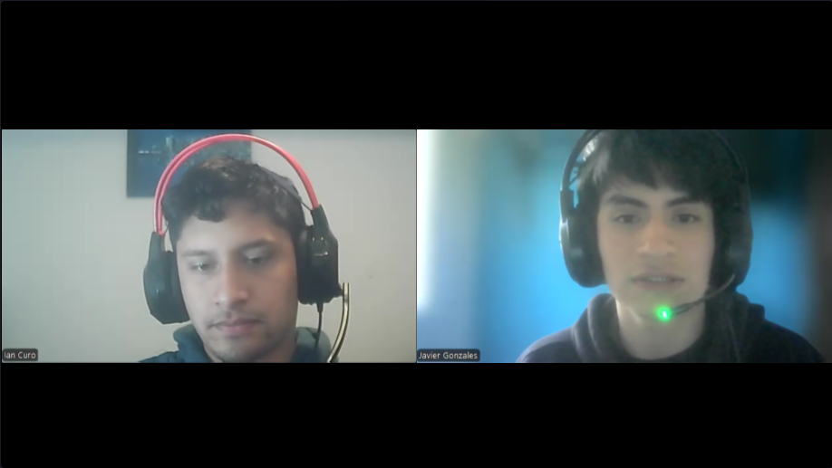<br>
    </td>
  </tr>
</table>

<br><br>

*Entrevistas a Managers*
---

<table align="center">
  <tr>
    <th colspan="2" style="text-align:center">Entrevista 1</th>
  </tr>
  <tr>
    <td><strong>Entrevistado</strong></td>
    <td>Javier Sandoval</td>
  </tr>
  <tr>
    <td><strong>Edad</strong></td>
    <td>58</td>
  </tr>
  <tr>
    <td><strong>Distrito</strong></td>
    <td>San Miguel</td>
  </tr>
  <tr>
    <td><strong>Timing</strong></td>
    <td>16:22</td>
  </tr>
  <tr>
    <td><strong>URL</strong></td>
    <td>

  `https://upcedupe-my.sharepoint.com/:v:/g/personal/u202312966_upc_edu_pe/EcvJMs0gTgFJsydLecgT0vYBmuowPPVCvz1rmnAbXwNQKA?e=pZwova&nav=eyJyZWZlcnJhbEluZm8iOnsicmVmZXJyYWxBcHAiOiJTdHJlYW1XZWJBcHAiLCJyZWZlcnJhbFZpZXciOiJTaGFyZURpYWxvZy1MaW5rIiwicmVmZXJyYWxBcHBQbGF0Zm9ybSI6IldlYiIsInJlZmVycmFsTW9kZSI6InZpZXcifX0%3D`

  </td>
  </tr>
  <tr>
    <td colspan="2" style="text-align:justify">
      Resumen: <br>
      Javier Sandoval dirige una empresa tecnológica peruana que ofrece servicios en cinco líneas estratégicas. Actualmente, cuentan con un equipo interno que se encarga de las tareas técnicas y de desarrollo, además de un área de marketing que cubre la mayoría de sus necesidades operativas. Sin embargo, ante picos de demanda, especialmente en el área de desarrollo de software, recurren ocasionalmente a personal externo. Según indica, entre una y dos oportunidades al mes se pierden por la falta de disponibilidad de profesionales externos confiables que puedan asumir tareas específicas. Aunque reconocen la necesidad de apoyo externo, enfrentan dificultades al contratar por factores como la falta de confianza, más allá de las habilidades técnicas. Temen que los colaboradores no cumplan con los plazos ni con la calidad esperada. Los factores que más dificultan la contratación son la confianza y la disponibilidad del talento. En los perfiles que contratan, valoran cualidades como responsabilidad, proactividad, buen portafolio, referencias confiables y capacidad de trabajo en equipo. Finalmente, al presentarle brevemente la propuesta de una plataforma para conectar empresas con talento joven y visualización de portafolios, consideró la idea adecuada y potencialmente útil para su organización.   
    </td>
  </tr>
  <tr>
    <td colspan="2"><br>
      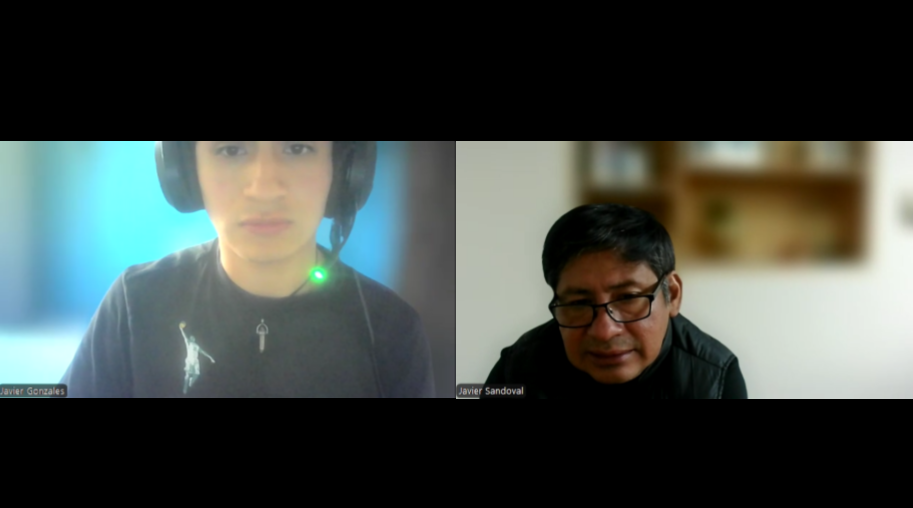<br>
    </td>
  </tr>
</table>

<br><br>

<table align="center">
  <tr>
    <th colspan="2" style="text-align:center">Entrevista 2</th>
  </tr>
  <tr>
    <td><strong>Entrevistada</strong></td>
    <td>Jackeline Garcia</td>
  </tr>
  <tr>
    <td><strong>Edad</strong></td>
    <td>39</td>
  </tr>
  <tr>
    <td><strong>Distrito</strong></td>
    <td>San Miguel</td>
  </tr>
  <tr>
    <td><strong>Timing</strong></td>
    <td>21:32</td>
  </tr>
  <tr>
    <td><strong>URL</strong></td>
    <td>

  `https://upcedupe-my.sharepoint.com/:v:/g/personal/u202312966_upc_edu_pe/EcvJMs0gTgFJsydLecgT0vYBmuowPPVCvz1rmnAbXwNQKA?e=pZwova&nav=eyJyZWZlcnJhbEluZm8iOnsicmVmZXJyYWxBcHAiOiJTdHJlYW1XZWJBcHAiLCJyZWZlcnJhbFZpZXciOiJTaGFyZURpYWxvZy1MaW5rIiwicmVmZXJyYWxBcHBQbGF0Zm9ybSI6IldlYiIsInJlZmVycmFsTW9kZSI6InZpZXcifX0%3D` 

  </td>
  </tr>
  <tr>
    <td colspan="2" style="text-align:justify">
      Resumen:<br>
      Jackeline Garcia es gerenta en Eureka: Soluciones Educativas, empresa dedicada a soluciones educativas que ofrece una variedad de materiales para la enseñanza. Su enfoque principal son padres, estudiantes y maestros en instituciones educativas privadas. Ella mencioná que El área de marketing de la empresa es fundamental para crear piezas gráficas y comunicados, especialmente durante eventos importantes como la Semana Santa. Sin embargo, a veces requieren apoyo externo debido a la carga de trabajo y la disponibilidad de personal. También destacó en base a su experiencia laboral, que la confianza es un valor fundamental al elegir colaboradores en proyectos, no solo en marketing, sino en cualquier tipo de trabajo. La experiencia también es importante, pero no es un criterio absoluto, también valoró que la incorporación de catálogos virtuales en las empresas facilita la selección de candidatos adecuados, optimizando el tiempo en procesos de contratación. Esto permite una mejor adaptación a las necesidades del mercado laboral actual.
    </td>
  </tr>
   <tr>
    <td colspan="2"><br>
      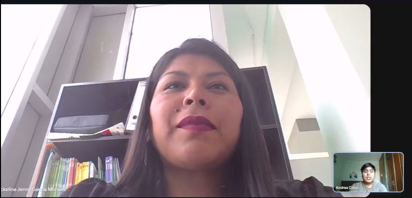<br>
    </td>
  </tr>
</table>

<br><br>

<table align="center">
  <tr>
    <th colspan="2" style="text-align:center">Entrevista 3</th>
  </tr>
  <tr>
    <td><strong>Entrevistado</strong></td>
    <td>Luis Enrique Ayala</td>
  </tr>
  <tr>
    <td><strong>Edad</strong></td>
    <td>33</td>
  </tr>
  <tr>
    <td><strong>Distrito</strong></td>
    <td>San Miguel</td>
  </tr>
  <tr>
    <td><strong>Timing</strong></td>
    <td>38:11</td>
  </tr>
  <tr>
    <td><strong>URL</strong></td>
    <td>
      
  `https://upcedupe-my.sharepoint.com/:v:/g/personal/u202312966_upc_edu_pe/EcvJMs0gTgFJsydLecgT0vYBmuowPPVCvz1rmnAbXwNQKA?e=pZwova&nav=eyJyZWZlcnJhbEluZm8iOnsicmVmZXJyYWxBcHAiOiJTdHJlYW1XZWJBcHAiLCJyZWZlcnJhbFZpZXciOiJTaGFyZURpYWxvZy1MaW5rIiwicmVmZXJyYWxBcHBQbGF0Zm9ybSI6IldlYiIsInJlZmVycmFsTW9kZSI6InZpZXcifX0%3D`

  </td>
  </tr>
  <tr>
    <td colspan="2" style="text-align:justify">
      Resumen:<br>
      Luis Enrique Ayala, actual gerente nacional de ventas de Donofrio en Nestlé, describe su rol como estratégico, enfocado en diseñar, ordenar y delegar tareas dentro de su equipo, mientras que áreas como marketing o soporte operativo las gestiona a través de equipos especializados. En casos de emergencia o sobrecarga, recurre a agencias externas para recibir apoyo, aunque comenta que existen demoras importantes en la respuesta, llegando a tardar entre 3 semanas y 1 mes para conseguir personal disponible. Señala que la mayor dificultad para contratar radica en la falta de confianza, los elevados filtros que deben pasar los candidatos externos, y los limitados presupuestos disponibles para profesionales experimentados. Reconoce que no suele dejar tareas sin hacer por falta de personal, pero sí experimenta retrasos debido a estos cuellos de botella. Al momento de colaborar en proyectos, Luis prioriza el conocimiento técnico, la actitud proactiva, la confianza y el trabajo en equipo. Afirma que la experiencia laboral sigue siendo un factor clave, especialmente para cargos de mayor responsabilidad, ya que permite una mejor capacidad de reacción ante problemas. Sin embargo, también valora las habilidades blandas para puestos de entrada. Finalmente, valida positivamente la propuesta de UniTalents Connect, destacando que actualmente no existe una solución que le permita contactar rápidamente con talento joven calificado, ajustado a sus necesidades específicas.
    </td>
  </tr>
   <tr>
    <td colspan="2"><br>
      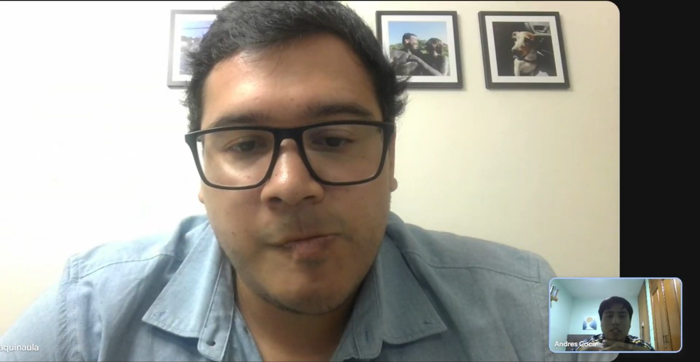<br>
    </td>
  </tr>
</table>

#### 2.2.3. Análisis de entrevistas  

*Análisis de Entrevistas – Segmento 1 (Estudiantes)*
---
En primer lugar, el 100% de los entrevistados tiene entre 19 y 20 años y actualmente cursa una carrera universitaria relacionada con tecnología o ingeniería. Todos comparten el deseo de obtener ingresos propios mientras estudian, ya sea por razones económicas personales o familiares. Asimismo, el 100% de ellos reconoce haber tenido dificultades para acceder a oportunidades laborales dentro de su rubro, debido a la exigencia de experiencia previa, conocimientos técnicos avanzados o alta disponibilidad, condiciones poco compatibles con la realidad académica de un estudiante. El 100% afirma haber utilizado plataformas como LinkedIn, Computrabajo o redes sociales para buscar trabajo, aunque también declaran que estas plataformas no siempre se ajustan al perfil de un estudiante sin experiencia. El 66% indica que ha tenido experiencias laborales previas, aunque no necesariamente relacionadas con su carrera. Todos manifiestan disposición para realizar proyectos pequeños o tareas específicas con el objetivo de ganar experiencia profesional y fortalecer su portafolio. En cuanto a habilidades, el 100% valora sus habilidades blandas, como la proactividad, el trabajo en equipo y la comunicación, considerándolas claves para desenvolverse en entornos laborales aún sin experiencia técnica formal. Finalmente, el 100% de los entrevistados valida positivamente la idea de UniTalents Connect, reconociendo que no existe actualmente una plataforma enfocada en conectar empresas con estudiantes dispuestos a colaborar en proyectos reales y de corta duración, que les permitan construir experiencia profesional desde etapas tempranas.

<br>

*Análisis de Entrevistas – Segmento 2 (Gerentes / Empresarios)*
---
El 100% de los entrevistados ocupa cargos gerenciales en empresas con distintos enfoques (tecnología, educación, consumo masivo), con edades que oscilan entre los 33 y 58 años. Todos cuentan con experiencia laboral significativa y participan activamente en la toma de decisiones estratégicas y operativas dentro de sus organizaciones. Un hallazgo común en el 100% de los casos es que las empresas sí recurren a personal externo, principalmente cuando el equipo interno no puede asumir toda la carga operativa, especialmente en momentos críticos o campañas específicas. Sin embargo, también el 100% identifica limitaciones al momento de contratar: principalmente la falta de confianza, los procesos lentos de intermediación (con agencias), la disponibilidad del talento y el costo de profesionales con experiencia. El 100% de los entrevistados coincide en que la confianza y la actitud son factores decisivos al momento de seleccionar colaboradores, incluso por encima de los conocimientos técnicos en algunos casos. Además, un 66% valora el uso de portafolios y catálogos virtuales como solución para agilizar procesos de selección y tomar decisiones informadas. Si bien todos reconocen que la experiencia laboral sigue siendo relevante (sobre todo en roles de responsabilidad), también valoran las habilidades blandas y la proactividad, especialmente en perfiles junior o de entrada. Finalmente, el 100% de los entrevistados validó positivamente la propuesta de UniTalents Connect, resaltando la necesidad de una plataforma que permita conectar con talento joven confiable, con alta disponibilidad y evidencia clara de sus habilidades, sin pasar por procesos burocráticos o poco flexibles. Consideran que una herramienta así podría optimizar el tiempo de respuesta y permitir cubrir tareas específicas de forma más eficiente y ajustada al contexto actual.

<br>

### 2.3. Needfinding

#### 2.3.1. User Personas  

En esta sección se elaborarán las User Personas, las cuales se construirán a partir de la información recolectada en las entrevistas realizadas a nuestros usuarios potenciales. Tomaremos en cuenta factores clave como edad, ocupación, temores y objetivos de los entrevistados, con el fin de comprender a fondo sus necesidades, comportamientos y expectativas. Además, se analizarán las características y preferencias de los usuarios a través del estudio de nuestros competidores, lo que nos permitirá identificar oportunidades de mejora.

- #### User Persona Estudiante Universitario


<p align="center">
  User Persona Estudiante Universitario - Elaboración propia
</p>

- #### User Persona Gerente de empresa


<p align="center">
  User Persona Gerente de empresa - Elaboración propia
</p>

#### 2.3.2. User Task Matrix  

  En este apartado se realizará la User Task Matrix tomando en cuenta los dos segmentos definidos y relacionados a nuestras User Persona, estudiantes univeristarios deseosos de experiencia laboral y gerentes que buscan contratar talento joven para el desarrollo de proyectos.


<table border ="1">
  <thead>
    <tr>
      <th></th>
      <th colspan="2">Estudiante</th>
      <th colspan="2">Gerente</th>
    </tr>
  </thead>
  <tbody>
    <tr>
      <td>TASK</td>
      <td>FREQUENCY (Estudiante)</td>
      <td>IMPORTANCE (Estudiante)</td>
      <td>FREQUENCY (Gerente)</td>
      <td>IMPORTANCE (Geremte)</td>
    </tr>
    <tr>
      <td>Buscar proyectos disponibles</td>
      <td>Often</td>
      <td>High</td>
      <td>Sometimes</td>
      <td>Low</td>
    </tr>
    <tr>
      <td>Postular a ofertas</td>
      <td>Sometimes</td>
      <td>High</td>
      <td>Never</td>
      <td>Low</td>
    </tr>
    <tr>
      <td>Editar o actualizar su perfil profesional</td>
      <td>Rarely</td>
      <td>High</td>
      <td>Sometimes</td>
      <td>Medium</td>
    </tr>
    <tr>
      <td>Consultar el estado de sus postulaciones</td>
      <td>Sometimes</td>
      <td>High</td>
      <td>Never</td>
      <td>Low</td>
    </tr>
    <tr>
      <td>Asistir a entrevistas</td>
      <td>Rarely</td>
      <td>High</td>
      <td>Sometimes</td>
      <td>High</td>
    </tr>
    <tr>
      <td>Asistir al daily scrum</td>
      <td>Always</td>
      <td>High</td>
      <td>Rarely</td>
      <td>Medium</td>
    </tr>
    <tr>
      <td>
      Registrar requerimientos de proyecto</td>
      <td>Never</td>
      <td>Low</td>
      <td>Sometimes</td>
      <td>Medium</td>
    </tr>
    <tr>
      <td>Publicar convocatorias de proyecto</td>
      <td>Never</td>
      <td>Low</td>
      <td>Sometimes</td>
      <td>Medium</td>
    </tr>
    <tr>
      <td>Chatear con miembros del equipo</td>
      <td>Sometimes</td>
      <td>Medium</td>
      <td>Sometimes</td>
      <td>Medium</td>
    </tr>
    <tr>
      <td>Ver postulaciones recibidas</td>
      <td>Never</td>
      <td>Low</td>
      <td>Sometimes</td>
      <td>Medium</td>
    </tr>
    <tr>
      <td>Validar postulantes</td>
      <td>Never</td>
      <td>Low</td>
      <td>Rarely</td>
      <td>High</td>
    </tr>
    <tr>
      <td>Aprobar entregables</td>
      <td>Never</td>
      <td>Low</td>
      <td>Often</td>
      <td>High</td>
    </tr>
    <tr>
      <td>Planificacion del sprint</td>
      <td>Often</td>
      <td>High</td>
      <td>Often</td>
      <td>High</td>
    </tr>
  </tbody>
</table>

<br>
<br>

Tomando en cuenta este recuadro podemos apreciar ciertos detalles sobre las actividades de nuestros User Personas:

- Tanto gerente como estudiante al ser parte de un equipo deben participar en reuniones SCRUM (sprint plannting, daily scrum, etc.), las cuales son importantes para ambas personas. 

- Mientras que los estudiantes enfocan su tiempo en actualizar sus perfiles laborales y buscar nuevas oportunidades de empleo, los gerentes suelen emplear su tiempo en otras actividad ya que cuentan con experiencia y un empleo fijo.

- Los gerentes suelen realizar actividades de management como la convocatoria de proyectos o aprobación de entregables, mientras que los estudiantes no son parte de este proceso.


#### 2.3.3. User Journey Mapping  


  Esta sección incluye los User Journey Map relacionado a nuestras dos User Persona previamente elaboradas, estos Journey Map consistirán en las experiencias que nuestros usuarios viven antes de conocer nuestra solución.


- #### User Journey Map Jair Quijada:

Este Journey Map describe el proceso de busqueda y postulacion de un trabajo de Jair Quijada, un estudiante universitario que busca su primera experiencia laboral.


<p align="center">
  User Journey Map Jair Quijada - Elaboración propia
</p>

- #### User Journey Map Alexander Dávila:

Este Journey Map describe el proceso de Alexander Dávila en su busqueda de postulantes desde la identificacion de la necesidad de apoyo externo hasta el abandono de la plataforma por malas experiencias con los postulantes.


<p align="center">
  User Journey Map Alexander Dávila - Elaboración propia
</p>

#### 2.3.4. Empathy Mapping  

<p align="center">
  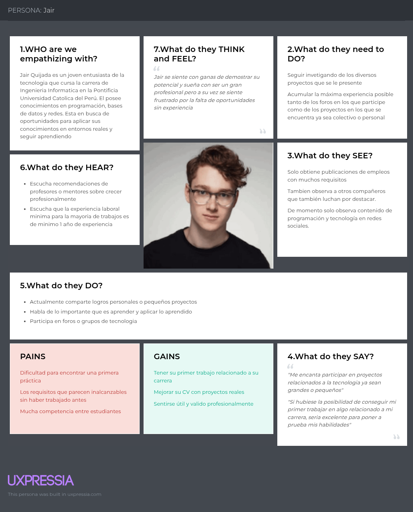
</p>

<p align="center">
  Empathy Mapping  Jair Quijada - Elaboración propia
</p>

<br>

<p align="center">
  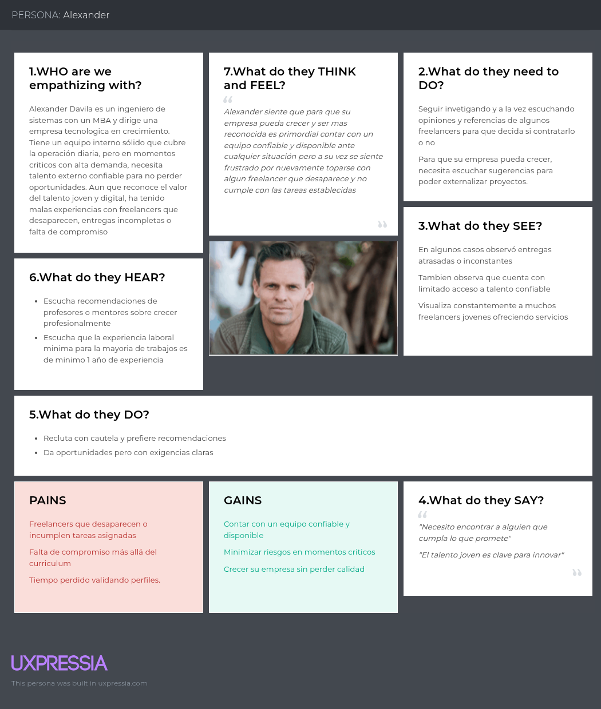
</p>

<p align="center">
  Empathy Mapping  Alexander Dávila - Elaboración propia
</p>

<br>

#### 2.3.5. As-is Scenario Mapping  

<p align="center">
  
</p>

<p align="center">
  As-is Scenario Mapping  1 - Elaboración propia
</p>

<br>

<p align="center">
  
</p>

<p align="center">
  As-is Scenario Mapping  2 - Elaboración propia
</p>

<br>

### 2.4. Ubiquitous Language  

El lenguaje a utilizar para este proyecto es:


<p align="center">
  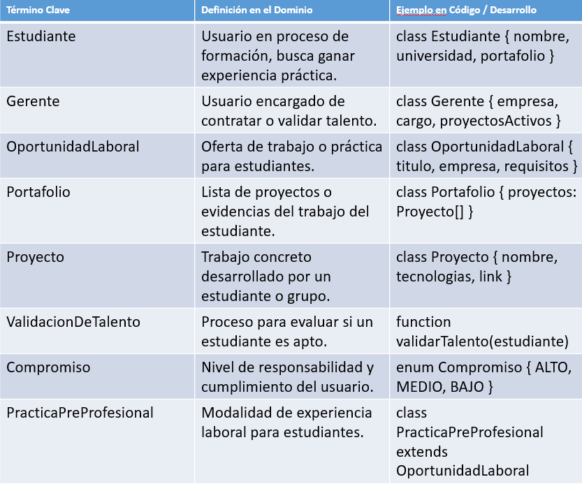
</p>

<p align="center">
   Ubiquitous Language 1 - Elaboración propia
</p>

<br>

<p align="center">
  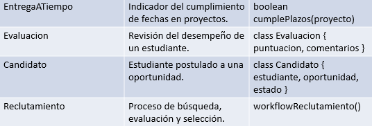
</p>

<p align="center">
  Ubiquitous Language 2 - Elaboración propia
</p>

<br>

---

## Capítulo III: Requirements Specification

### 3.1. To-Be Scenario Mapping<br><br> 

<p align="center">
  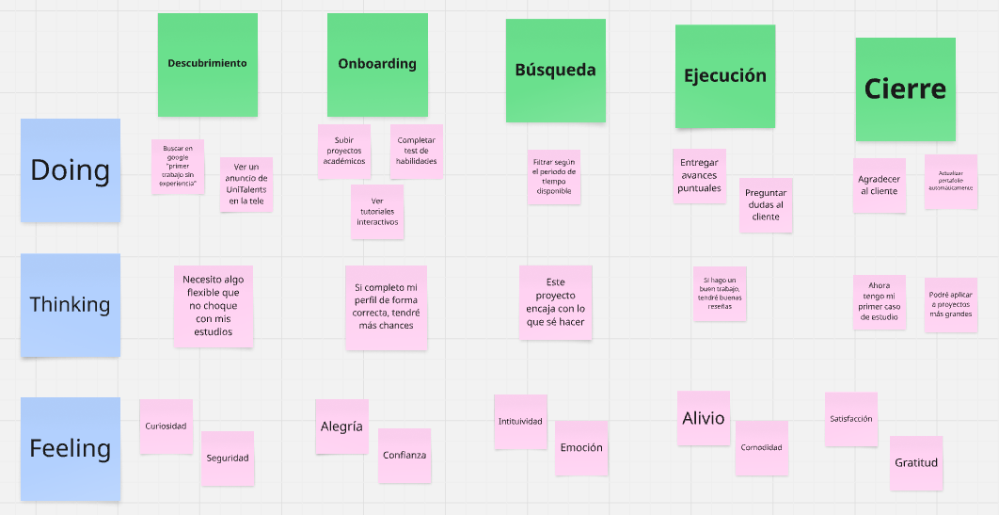
</p>

<p align="center">
  To-be Scenario Mapping estudiante - Elaboración propia
</p>


<br>

<p align="center">
  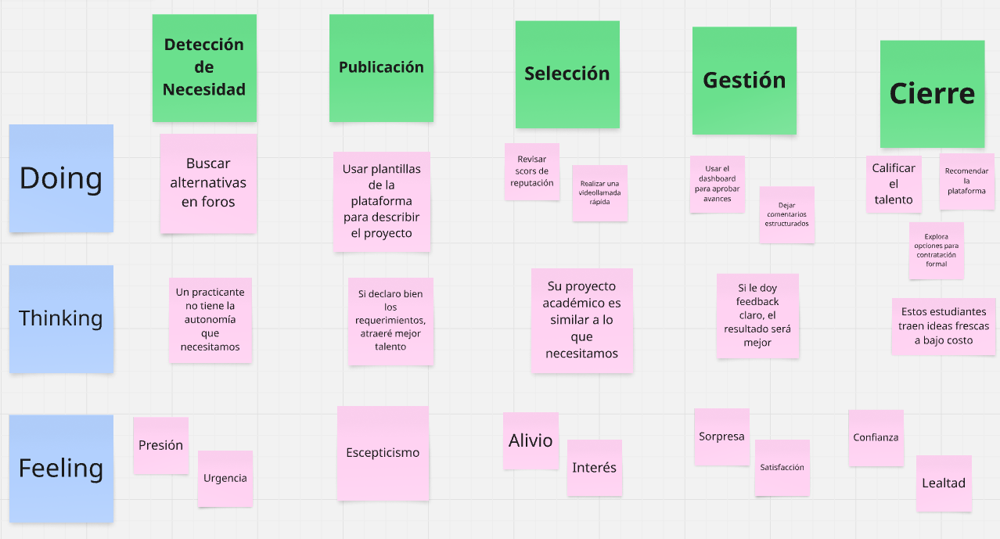
</p>

<p align="center">
  To-be Scenario Mapping gerente - Elaboración propia
</p>

<br>

### 3.2. User Stories<br><br>

<table border ="1" >
  <tbody>
    <tr>
      <td>Epic / Story ID</td>
      <td>Título</td>
      <td>Descripción</td>
      <td>Criterios de Aceptación</td>
      <td>Relación con Epic</td>
    </tr>
    <tr>
      <td>EP01</td>
      <td>Registro y Onboarding de Usuarios</td>
      <td>
        <strong>Como</strong> nuevo usuario de la plataforma, <strong>quiero</strong> registrarme y completar un perfil profesional guiado, <strong>para</strong> poder acceder a oportunidades o gestionar talento según mi rol.
      </td>
      <td>No corresponde</td>
      <td>No corresponde</td>
    </tr>
    <tr>
      <td>EP02</td>
      <td>Gestión de Oportunidades y Proyectos</td>
      <td>
        <strong>Como</strong> gerente de una empresa, <strong>quiero</strong> publicar proyectos con requisitos personalizados, <strong>para</strong> atraer a estudiantes con el perfil adecuado y resolver tareas específicas de mi organización.
      </td>
      <td>No corresponde</td>
      <td>No corresponde</td>
    </tr>
    <tr>
      <td>EP03</td>
      <td>Exploración y Postulación a Proyectos</td>
      <td>
        <strong>Como</strong> estudiante universitario, <strong>quiero</strong> explorar y postularme a proyectos compatibles con mis habilidades e intereses, <strong>para</strong> ganar experiencia práctica y construir un portafolio sólido.</td>
      <td>No corresponde</td>
      <td>No corresponde</td>
    </tr>
    <tr>
      <td>EP04</td>
      <td>Evaluación y Retroalimentación</td>
      <td>
        <strong>Como</strong> gerente, <strong>quiero</strong> evaluar el desempeño de los estudiantes durante y al finalizar el proyecto, <strong>para</strong> asegurar la calidad del trabajo y fomentar una cultura de mejora continua.</td>
      <td>No corresponde</td>
      <td>No corresponde</td>
    </tr>
    <tr>
      <td>EP05</td>
      <td>Creación y Visualización de Portafolio</td>
      <td>
        <strong>Como</strong> estudiante, <strong>quiero</strong> subir proyectos y evidencias de mis habilidades en un portafolio digital, <strong>para</strong> mostrar mi experiencia a futuras oportunidades laborales.</td>
      <td>No corresponde</td>
      <td>No corresponde</td>
    </tr>
    <tr>
      <td>EP06</td>
      <td>Validación y Reputación del Talento</td>
      <td>
        <strong>Como</strong> usuario de la plataforma, <strong>quiero</strong> consultar la reputación de otros usuarios (estudiantes o gerentes), <strong>para</strong> tomar decisiones informadas al aceptar postulaciones o colaborar en proyectos.</td>
      <td>No corresponde</td>
      <td>No corresponde</td>
    </tr>
    <tr>
      <td>EP07</td>
      <td>Búsqueda y Filtros Inteligentes</td>
      <td>
        <strong>Como</strong> usuario, <strong>quiero</strong> buscar proyectos o talentos aplicando filtros específicos como carrera, habilidades o disponibilidad, <strong>para</strong> encontrar rápidamente las opciones que mejor se adaptan a mis necesidades.</td>
      <td>No corresponde</td>
      <td>No corresponde</td>
    </tr>
    <tr>
      <td>EP08</td>
      <td>Presentación Clara del Valor de la Plataforma</td>
      <td>
        <strong>Como</strong> visitante nuevo en la web, <strong>quiero</strong> entender fácilmente qué ofrece UniTalents Connect, <strong>para</strong> saber si se adapta a mis necesidades como estudiante o empresa.</td>
      <td>No corresponde</td>
      <td>No corresponde</td>
    </tr>
    <tr>
      <td>EP09</td>
      <td>Validación Social y Casos de Éxito</td>
      <td>
        <strong>Como</strong> potencial usuario, <strong>quiero</strong> ver testimonios y casos de éxito reales, <strong>para</strong> confiar en la plataforma antes de registrarme.</td>
      <td>No corresponde</td>
      <td>No corresponde</td>
    </tr>
    <tr>
      <td>US01</td>
      <td>Comprender el propósito de la plataforma desde la página de inicio</td>
      <td>
        <strong>Como</strong> usuario nuevo, <strong>quiero</strong> entender rápidamente de qué trata UniTalents Connect, <strong>para</strong> decidir si me interesa registrarme como estudiante o gerente.</td>
      <td>
        <strong>Escenario 1: Primer contacto con la Landing Page</strong><br>
        <strong>Dado</strong> que soy un usuario que visita la landing por primera vez, <strong>cuando</strong> accedo al sitio principal, <strong>entonces</strong> visualizo en los primeros 15 segundos un mensaje claro que explica qué es UniTalents Connect y cómo funciona.
        <br><br>
        <strong>Escenario 2: Perfilamiento por tipo de usuario</strong><br>
        <strong>Dado</strong> que soy un visitante interesado en contratar talento, <strong>cuando</strong> hago scroll o clic en "¿Cómo funciona?", <strong>entonces</strong> puedo identificar fácilmente los beneficios dirigidos a empresas o gerentes sin confundirlos con los de estudiantes.
      </td>
      <td>Epic 08</td>
    </tr>
    <tr>
      <td>US02</td>
      <td>Registro inmediato desde la landing</td>
      <td>
        <strong>Como</strong> usuario nuevo, <strong>quiero</strong> acceder rápidamente al formulario de registro, <strong>para</strong> comenzar a usar la plataforma sin perder tiempo.</td>
      <td>
        <strong>Escenario 1: Acceso directo desde el encabezado</strong><br>
        <strong>Dado</strong> que soy un usuario que visita la landing por primera vez, <strong>cuando</strong> hago clic en el botón "Empieza" ubicado en el encabezado, <strong>entonces</strong> soy redirigido al formulario de registro correspondiente (estudiante o gerente).
      </td>
      <td>Epic 01</td>
    </tr>
    <tr>
      <td>US03</td>
      <td>Ver testimonios de usuarios reales</td>
      <td>
        <strong>Como</strong> usuario interesado, <strong>quiero</strong> ver experiencias de otras personas en la plataforma, <strong>para</strong> sentir confianza antes de crear una cuenta.</td>
      <td>
        <strong>Escenario 1: Visualización básica de testimonios</strong><br>
        <strong>Dado</strong> que llego a la sección de testimonios, <strong>cuando</strong> leo los testimonios, <strong>entonces</strong> puedo ver el nombre, rol (estudiante o gerente) y un mensaje real validado por el sistema.
      </td>
      <td>Epic 09</td>
    </tr>
    <tr>
      <td>US04</td>
      <td>Llamados a la acción claros en cada sección</td>
      <td>
        <strong>Como</strong> usuario, <strong>quiero</strong> encontrar botones de acción relevantes a lo largo de la landing, <strong>para</strong> tomar decisiones sin tener que regresar al inicio.
      </td>
      <td>
        <strong>Escenario 1: CTA visibles al finalizar cada bloque</strong><br>
        <strong>Dado</strong> que estoy navegando por secciones como “¿Cómo funciona?” o “Casos de éxito”, <strong>cuando</strong> llego al final de una sección, <strong>entonces</strong> encuentro un botón como “Regístrate ahora” o “Publica tu primer proyecto” de forma clara y destacada.
      </td>
      <td>Epic 01</td>
    </tr>
    <tr>
      <td>US05</td>
      <td>Subir proyecto a mi portafolio</td>
      <td>
        <strong>Como</strong> estudiante, <strong>quiero</strong> poder subir una URL que dirija a un proyecto de mi portafolio, <strong>para</strong> que los gerentes o empresas puedan visualizar mi trabajo y evaluar mejor mi experiencia.
      </td>
      <td>
        <strong>Escenario 1: Registro exitoso del proyecto con URL</strong><br>
        <strong>Dado</strong> que soy un estudiante autenticado y me encuentro en la sección "Configuración" <strong>cuando</strong> ingresa a "mi portafolio" e inserta una URL válida <strong>entonces</strong> la URL debe guardarse correctamente y debe aparecer como un enlace activo en la vista de portafolio.
      </td>
      <td>Epic 05</td>
    </tr>
    <tr>
      <td>US06</td>
      <td>Visualización del portafolio por gerentes</td>
      <td>
        <strong>Como</strong> gerente, <strong>quiero</strong> poder revisar el portafolio de un estudiante antes de seleccionarlo, <strong>para</strong> evaluar su experiencia previa.
      </td>
      <td>
        <strong>Escenario 1: Visualización del enlace por parte del gerente</strong><br>
        <strong>Dado</strong> que soy un gerente autenticado y estoy revisando el perfil de un estudiante que esta postulando a uno de mis proyectos <strong>cuando</strong> clickeo en "ver portafolio" <strong>entonces</strong> debo ser redirigido a la página de su portafolio en una nueva pestaña.
      </td>
      <td>Epic 05</td>
    </tr>
    <tr>
      <td>US07</td>
      <td>Ver estado de mis postulaciones</td>
      <td>
        <strong>Como</strong> estudiante, <strong>quiero</strong> consultar el estado de mis postulaciones, <strong>para</strong> saber si fui considerado.
      </td>
      <td>
        <strong>Escenario 1: Vista general del estado de cada postulación</strong><br>
        <strong>Dado</strong> que he postulado a varios proyectos, <strong>cuando</strong> accedo a la sección "Mis Postulaciones", <strong>entonces</strong> puedo ver el nombre del proyecto, la empresa, y su estado: En revisión, Aceptado o Rechazado.
        <br><br>
        <strong>Escenario 2: Notificación de cambios en el estado</strong><br>
        <strong>Dado</strong> que estoy esperando una respuesta, <strong>cuando</strong> el gerente cambia el estado de mi postulación, <strong>entonces</strong> recibo una notificación dentro de la plataforma y/o por correo electrónico.
      </td>
      <td>Epic 04</td>
    </tr>
    <tr>
      <td>US08</td>
      <td>Ver reputación de un estudiante</td>
      <td>
        <strong>Como</strong> gerente, <strong>quiero</strong> ver el historial de evaluación de un estudiante, <strong>para</strong> decidir si confiarle un nuevo proyecto.
      </td>
      <td>
        <strong>Escenario 1: Acceso a evaluación desde el perfil del estudiante</strong><br>
        <strong>Dado</strong> que estoy considerando un postulante, <strong>cuando</strong> entro a su perfil, <strong>entonces</strong> puedo visualizar su reputación con puntuaciones previas, feedback recibido y métricas como cumplimiento de plazos.
        <br><br>
        <strong>Escenario 2: Información clara y filtrada</strong><br>
        <strong>Dado</strong> que quiero una lectura rápida, <strong>cuando</strong> reviso la reputación, <strong>entonces</strong> puedo ver una visualización resumida con promedio de evaluación, número de proyectos completados y etiquetas destacadas.
      </td>
      <td>Epic 06</td>
    </tr>
    <tr>
      <td>US09</td>
      <td>Recuperar contraseña</td>
      <td>
        <strong>Como</strong> usuario, <strong>quiero</strong> poder recuperar mi contraseña, <strong>para</strong> acceder a mi cuenta si la olvido..
      </td>
      <td>
        <strong>Escenario 1: Solicitud de recuperación</strong><br>
        <strong>Dado</strong> que olvidé mi contraseña, <strong>cuando</strong> selecciono la opción "¿Olvidaste tu contraseña?" en la pantalla de login, <strong>entonces</strong> puedo ingresar mi correo electrónico asociado a la cuenta.
        <br><br>
        <strong>Escenario 2: Enlace de recuperación enviado</strong><br>
        <strong>Dado</strong> que ingreso un correo válido, <strong>cuando</strong> envío la solicitud, <strong>entonces</strong> recibo un correo con un enlace temporal para establecer una nueva contraseña.
        <br><br>
        <strong>Escenario 3: Contraseña restablecida correctamente</strong><br>
        <strong>Dado</strong> que hago clic en el enlace recibido, <strong>cuando</strong> ingreso una nueva contraseña válida y la confirmo, <strong>entonces</strong> mi acceso se restablece y puedo ingresar normalmente a la plataforma.
      </td>
      <td>Epic 01</td>
    </tr>
    <tr>
      <td>US10</td>
      <td>Modificación de perfil de usuario</td>
      <td>
        <strong>Como</strong> usuario, <strong>quiero</strong> modificar la información de mi perfil <strong>para</strong> mantener mis datos actualizados en la plataforma.
      </td>
      <td>
        <strong>Escenario 1:   Usuario modifica nombre y descripción</strong><br>
        <strong>Dado</strong> que el usuario ha iniciado sesión <strong>Y</strong> se encuentra en la sección de perfil<strong>cuando</strong>  edita su nombre o descripción  <strong>entonces</strong>  los cambios deben guardarse correctamente y mostrarse en el perfil.
        <br><br>
        <strong>Escenario 2:  Usuario cambia su foto de perfil</strong><br>
        <strong>Dado</strong>  que el usuario accede a su perfil <strong>cuando</strong> sube una nueva imagen <strong>entonces</strong> la nueva foto debe reemplazar la anterior y visualizarse correctamente.
        <br><br>
      </td>
      <td>Epic 01</td>
    </tr>
        <tr>
      <td>US11</td>
      <td>Calificación de estudiante freelance</td>
      <td>
        <strong>Como</strong> empresario, <strong>quiero</strong>  calificar a un estudiante luego de un proyecto <strong>para</strong> reflejar su desempeño en la plataforma.
      </td>
      <td>
        <strong>Escenario 1: Empresario deja una calificación</strong><br>
        <strong>Dado</strong> que el proyecto ha finalizado <strong>cuando</strong> el empresario accede al perfil del estudiante <strong>Y</strong> completa una calificación con comentario <strong>entonces</strong> esta debe guardarse y reflejarse públicamente.
        <br><br>
      </td>
      <td>Epic 04</td>
    </tr>
    <tr>
      <td>US12</td>
      <td>Actualización de URL del portafolio del estudiante</td>
      <td>
        <strong>Como</strong> estudiante, <strong>quiero</strong> modificar la URL de mi portafolio, <strong>para</strong>  mantener actualizado el enlace que visualizan los gerentes o empresas.
      </td>
      <td>
        <strong>Escenario 1: Actualización exitosa de URL del portafolio</strong><br>
        <strong>Dado</strong> que el estudiante ha iniciado sesión y se encuentra en la sección de mi perfil <strong>cuando</strong> actualiza el campo de URL con un enlace válido y hace clic en “Guardar cambios” <strong>entonces</strong> el sistema debe almacenar la nueva URL y reflejarla correctamente en su perfil público.
        <br><br>
        <strong>Escenario 2: Error al ingresar URL inválida</strong><br>
        <strong>Dado</strong> que el estudiante desea actualizar su portafolio <strong>cuando</strong> ingresa una URL mal formada o vacía <strong>entonces</strong> el sistema debe mostrar un mensaje de error indicando que el enlace no es válido y no debe actualizar la URL anterior.
        <br><br>
      </td>
      <td>Epic 05</td>
    </tr>
        <tr>
      <td>US13</td>
      <td>Calificación del contratador</td>
      <td>
        <strong>Como</strong> estudiante, <strong>quiero</strong> calificar al empresario luego del proyecto <strong>para</strong> compartir mi experiencia con futuros postulantes.
      </td>
      <td>
        <strong>Escenario 1:  Estudiante deja una calificación al empresario</strong><br>
        <strong>Dado</strong> que el proyecto ha concluido <strong>cuando</strong> el estudiante selecciona puntuación y comentario <strong>entonces</strong> el sistema debe guardar y mostrar la evaluación.
        <br><br>
      </td>
      <td>Epic 04</td>
    </tr>
        <tr>
      <td>US14</td>
      <td>Búsqueda de postulante</td>
      <td>
        <strong>Como</strong> empresario, <strong>quiero</strong> filtrar entre los postulantes a mis proyectos por carrera, habilidades y calificación previa, <strong>para</strong> encontrar más fácilmente al candidato ideal para colaborar.
      </td>
      <td>
        <strong>Escenario 1: Filtrado por carrera</strong><br>
        <strong>Dado</strong> que el gerente visualiza las postulaciones a uno de sus proyectos <strong>cuando</strong> selecciona una carrera específica desde el panel de filtros <strong>entonces</strong> el sistema muestra solo a los postulantes que pertenecen a dicha carrera.
        <br><br>
        <strong>Escenario 2: Filtrado por habilidades</strong><br>
        <strong>Dado</strong> que el gerente accede a la lista de postulantes <strong>cuando</strong> ingresa una o más habilidades en el filtro correspondiente <strong>entonces</strong> el sistema filtra y muestra solo a los postulantes que tengan esas habilidades en su perfil.
        <br><br>
        <strong>Escenario 3: Filtrado por calificación</strong><br>
        <strong>Dado</strong> que el gerente desea evaluar postulantes previamente calificados <strong>cuando</strong> aplica el filtro de calificación mínima (por ejemplo, 4 estrellas o más) <strong>entonces</strong> el sistema solo muestra postulantes con calificaciones iguales o superiores.
      </td>
      <td>Epic 07</td>
    </tr>
    <tr>
      <td>US15</td>
      <td>Registrarse como usuario</td>
      <td>
        <strong>Como</strong> usuario nuevo, <strong>quiero</strong> crear una cuenta, <strong>para</strong> utilizar la aplicación.
      </td>
      <td>
        <strong>Escenario 1: Estudiante crea una cuenta</strong><br>
        <strong>Dado</strong> que el estudiante se encuentra en la pantalla de registro
        <strong>Y</strong> selecciona la opción "Registrarse como estudiante". <strong>Cuando</strong> ingresa un nombre de usuario, un correo electronico y una contraseña válidos <strong>Y </strong> presiona el botón "Registrarse" <strong>
        Entonces</strong> la cuenta debe crearse correctamente.
        <br><br>
        <strong>Escenario 2: Gerente crea una cuenta</strong><br>
        <strong>Dado</strong> que el gerente se encuentra en la pantalla de registro
        <strong>Y</strong> selecciona la opción "Registrarse como gerente". <strong>Cuando</strong> ingresa un nombre de usuario, un correo electronico y una contraseña válidos <strong>Y </strong> presiona el botón "Registrarse" <strong>
        Entonces</strong> la cuenta debe crearse correctamente.
        <br><br>
      </td>
      <td>Epic 01</td>
    </tr>
    <tr>
      <td>US16</td>
      <td>Iniciar sesión</td>
      <td>
        <strong>Como</strong> usuario, <strong>quiero</strong> iniciar sesión en la aplicación, <strong>para</strong> acceder a sus funcionalidades.
      </td>
      <td>
        <strong>Escenario 1: Usuario inicia sesión</strong><br>
        <strong>Dado</strong> que el usuario se encuentra en la pantalla de inicio de sesión
        <strong>Cuando</strong> ingresa  un correo electronico y una contraseña válidos <strong>Y</strong> presiona el botón "Iniciar Sesión" <strong>
        Entonces</strong> el usuario debe acceder correctamente a la aplicación.
        <br><br>
        <strong>Escenario 2: Fallo al iniciar sesión</strong><br>
        <strong>Dado</strong> que el usuario se encuentra en la pantalla de inicio de sesión
        <strong>Cuando</strong> ingresa  un correo electronico o una contraseña inválidos <strong>Y</strong> presiona el botón "Iniciar Sesión" <strong>
        Entonces</strong> el sistema debe enviar un mensaje de error al usuario.
        <br><br>
      </td>
      <td>Epic 01</td>
    </tr>
    <tr>
      <td>US17</td>
      <td>Crear Convocatoria</td>
      <td>
        <strong>Como</strong> gerente, <strong>quiero</strong> crear convocatorias en la aplicación, <strong>para</strong> recibir solicitudes de postulantes.
      </td>
      <td>
        <strong>Escenario 1: Gerente crea convocatoria</strong><br>
        <strong>Dado</strong> que el usuario se encuentra en el apartado de proyectos
        <strong>Cuando</strong> hace click en "Nueva convocatoria" <strong>Y</strong> añade los datos requeridos (título, descripción, duración, sueldo, habilidades)
        <strong>Y</strong> le da click al botón "Publicar convocatoria" 
        <strong>Entonces</strong> la convocatoria será publicada en la aplicación.
        <br><br>
        <strong>Escenario 2: Gerente crea convocatoria con información incompleta</strong><br>
        <strong>Dado</strong> que el usuario se encuentra en el apartado de proyectos
        <strong>Cuando</strong> hace click en "Nueva convocatoria" <strong>Y</strong> solo añade algunos de los datos requeridos (título, descripción, duración, sueldo, habilidades) 
        <strong>Y</strong> le da click al botón "Publicar convocatoria" 
        <strong> Entonces</strong> el gerente recibirá un aviso de que su convocatoria no fue publicada.
        <br><br>
      </td>
      <td>Epic 02</td>
    </tr>
    <tr>
      <td>US18</td>
      <td>Editar Convocatoria</td>
      <td>
        <strong>Como</strong> gerente, <strong>quiero</strong> editar convocatorias en la aplicación, <strong>para</strong>  corregir o actualizar la infromación cuando lo necesite.
      </td>
      <td>
        <strong>Escenario 1: Gerente edita convocatoria</strong><br>
        <strong>Dado</strong> que el gerente haya creado una convocatoria
        <strong>Y</strong> se encuentre en el apartado de convocatorias  
        <strong>Cuando</strong> hace click en el botón "Editar información" de una convocatoria <strong>Y</strong> modifica los datos requeridos (título, descripción, duración, sueldo, habilidades) <strong>
        <strong>Y</strong> le da click al botón "Guardar cambios" 
        Entonces</strong> los cambios deben de guardarse y mostrarse correctamente en la aplicación.
        <br><br>
      </td>
      <td>Epic 02</td>
    </tr>
    <tr>
      <td>US19</td>
      <td>Eliminar Convocatoria</td>
      <td>
        <strong>Como</strong> gerente, <strong>quiero</strong> eliminar una convocatoria publicada en la aplicación, <strong>para</strong> evitar recibir nuesvas postulaciones cuando el proyecto cierre.
      </td>
      <td>
        <strong>Escenario 1: Gerente borra convocatoria</strong><br>
        <strong>Dado</strong> que el gerente haya creado una convocatoria
        <strong>Y</strong> se encuentre en el apartado de convocatorias  
        <strong>Cuando</strong> hace click en el botón "Eliminar" de una convocatoria
        <strong>Y</strong> da click en el botón "Sí" en el cuadro de confirmación. 
        <strong>Entonces</strong> la convocatoria será eliminada de la aplicación.
        <br><br>
        <strong>Escenario 2: Gerente cancela la eliminación de convocatoria</strong><br>
        <strong>Dado</strong> que el gerente haya creado una convocatoria
        <strong>Y</strong> se encuentre en el apartado de convocatorias  
        <strong>Cuando</strong> hace click en el botón "Eliminar" de una convocatoria
        <strong>Y</strong> da click en el botón "No" en el cuadro de confirmación. 
        <strong>Entonces</strong> la convocatoria se mantendrá disponible en la aplicación.
      </td>
      <td>Epic 02</td>
    </tr>
    <tr>
      <td>US20</td>
      <td>Cerrar sesión</td>
      <td>
        <strong>Como</strong> usuario, <strong>quiero</strong> poder cerrar sesión en cualquier momento, <strong>para</strong> asegurar la privacidad de mi cuenta.
      </td>
      <td>
        <strong>Escenario 1: Usuario cierra sesión</strong><br>
        <strong>Dado</strong> que estoy en cualquier parte de la aplicación
        <strong>Cuando</strong> presiono el botón de “Cerrar sesión”
        <strong>Entonces</strong> la sesión finaliza y soy redirigido a la pantalla de inicio.
      </td>
      <td>Epic 01</td>
    </tr>
    <tr>
      <td>US21</td>
      <td>Actualizar tecnologias en el perfil del estudiante</td>
      <td>
        <strong>Como</strong> estudiante, <strong>quiero</strong> actualizar las tecnologías que domino, <strong>para</strong> que se muestren en mi perfil 
      </td>
      <td>
        <strong>Escenario 1: Estudiante añade una tecnología a su perfil
</strong><br>
        <strong>Dado que </strong> el estudiante accede a su perfil y hace click en “Cambiar” junto a Tecnologías y Especializaciones
        <strong>Cuando</strong> escribe el nombre de la tecnología Y hace click en Agregar
        <strong>Entonces</strong>  la tecnología se añade al  perfil.
        <br><br>
        <strong>Escenario 2: Estudiante elimina una tecnología de su perfil</strong><br>
        <strong>Dado que</strong> el estudiante accede a la configuración y hace click en “Cambiar” junto a Tecnologías y Especializaciones 
        <strong>Cuando</strong> elimina una de las tecnologías agregadas  
        <strong>Entonces</strong>  la tecnología ya no se visualizará en su perfil.
      </td>
      <td>Epic 06</td>
    </tr>
    <tr>
      <td>US22</td>
      <td>Visualizar información de empresa</td>
      <td>
        <strong>Como</strong> estudiante, <strong>quiero</strong> ver la información de la empresa a la que estoy postulando, <strong>para</strong> mantenerme más informado.
      </td>
      <td>
        <strong>Escenario 1: Estudiante visualiza la información de empresa    </strong><br>
        <strong>Dado que </strong> estoy viendo la información de una convocatoria
        <strong>Cuando</strong>  el usuario hace click en “Ver Empresa”
        <strong>Entonces</strong> se mostrará un apartado con información de la empresa como correo electrónico, número de contacto y calificación
      </td>
      <td>Epic 03</td>
    </tr>
    <tr>
      <td>US23</td>
      <td>Actualizar tecnologías en el perfil de la empresa</td>
      <td>
        <strong>Como</strong> gerente, <strong>quiero</strong> actualizar las tecnologías que se utilizan en mi empresa, <strong>para</strong> que se muestren en el perfil de la compañía. 
      </td>
      <td>
        <strong>Escenario 1: Gerente añade una tecnología a su perfil</strong><br>
        <strong>Dado</strong> que el gerente accede a su perfil y hace click en “Cambiar” junto a Tecnologías y Especializaciones 
        <strong>Cuando</strong> escribe el nombre de la tecnología Y hace click en Agregar
        <strong>Entonces</strong> la tecnología se añade al  perfil de la compañía.
            <br><br>
        <strong>Escenario 2: Gerente elimina una tecnología de su perfil</strong><br>
        <strong>Dado que</strong> el gerente accede a la configuración y hace click en “Cambiar” junto a Tecnologías y Especializaciones 
        <strong>Cuando</strong> elimina una de las tecnologías agregadas  
        <strong>Entonces</strong>  la tecnología ya no se visualizará en el perfil de la empresa
      </td>
      <td>Epic 06</td>
    </tr>
    <tr>
      <td>US24</td>
      <td>Tener un encabezado fijo para navegar por la página</td>
      <td>
        <strong>Como</strong> visitante de la landing page, <strong>quiero</strong> contar con un encabezado visible en todo momento, <strong>para</strong> moverme fácilmente entre las secciones sin hacer scroll manualmente.
      </td>
      <td>
        <strong>Escenario 1: Encabezado permanece visible al hacer scroll</strong><br>
        <strong>Dado</strong> que estoy navegando hacia abajo en la landing page,
        <strong>Cuando</strong> hago scroll,
        <strong>Entonces</strong> el encabezado permanece fijo en la parte superior con accesos visibles a las secciones principales.
        <br><br>
        <strong>Escenario 2: Enlaces del encabezado con anclaje interno</strong><br>
        <strong>Dado</strong> que deseo moverme a otra sección desde cualquier parte,
        <strong>Cuando</strong> hago clic en un ítem del encabezado (ej. “Planes”, “Casos de éxito”, “Registro”),
        <strong>Entonces</strong> la página se desplaza automáticamente hasta la sección correspondiente sin recargar.
      </td>
      <td>Epic 08</td>
    </tr>
    <tr>
      <td>US25</td>
      <td>Acceder a la sección de preguntas frecuentes (FAQs)</td>
      <td>
        <strong>Como</strong> visitante indeciso, <strong>quiero</strong> acceder fácilmente a una sección de preguntas frecuentes, <strong>para</strong> resolver mis dudas antes de registrarme en la plataforma.
      </td>
      <td>
        <strong>Escenario 1: Acceso directo desde el menú</strong><br>
        <strong>Dado</strong> que estoy navegando en la landing page,
        <strong>Cuando</strong> hago clic en “FAQs” en el encabezado,
        <strong>Entonces</strong> soy llevado directamente a la sección de preguntas frecuentes sin salir de la página.
        <br><br>
        <strong>Escenario 2: Visualización organizada de preguntas y respuestas</strong><br>
        <strong>Dado</strong> que ya estoy en la sección FAQs,
        <strong>Cuando</strong> reviso las preguntas,
        <strong>Entonces</strong> estas aparecen con un formato desplegable que permite leer las respuestas una por una.
      </td>
      <td>Epic 08</td>
    </tr>
    <tr>
      <td>US26</td>
      <td>Visualizar la propuesta de valor con un diseño atractivo desde el inicio</td>
      <td>
        <strong>Como</strong> usuario nuevo, <strong>quiero</strong> ver de inmediato una propuesta visual clara y atractiva, <strong>para</strong> captar rápidamente la esencia de UniTalents Connect sin necesidad de leer demasiado.
      </td>
      <td>
        <strong>Escenario 1: Mensaje central visible en el primer vistazo</strong><br>
        <strong>Dado</strong> que ingreso a la landing page,
        <strong>Cuando</strong> visualizo el primer bloque superior,
        <strong>Entonces</strong> veo un mensaje corto, atractivo y centrado que transmite el valor principal de la plataforma.
        <br><br>
        <strong>Escenario 2: Imagen o ilustración complementaria al mensaje</strong><br>
        <strong>Dado</strong> que leo el mensaje principal,
        <strong>Cuando</strong> observo el diseño,
        <strong>Entonces</strong> se acompaña de una imagen relevante, que refuerza visualmente la propuesta de valor.
      </td>
      <td>Epic 08</td>
    </tr>
    <tr>
      <td>US27</td>
      <td>Acceder a información de contacto o soporte desde la landing</td>
      <td>
        <strong>Como</strong> visitante que necesita ayuda, <strong>quiero</strong> poder acceder fácilmente a los datos de contacto o soporte, <strong>para</strong> resolver dudas antes de registrarme o publicar un proyecto.
      </td>
      <td>
        <strong>Escenario 1: Acceso al contacto desde el pie de página</strong><br>
        <strong>Dado</strong> que estoy en la landing page,
        <strong>Cuando</strong> llego al final del sitio,
        <strong>Entonces</strong> visualizo una sección con enlaces a “Contáctanos”, correo de soporte, y redes sociales.
      </td>
      <td>Epic 08</td>
    </tr>
    <tr>
      <td>US28</td>
      <td>Visualizar oportunidades para estudiante</td>
      <td>
        <strong>Como</strong> estudiante que inicio sesión, <strong>quiero</strong> poder acceder a un apartado de oportunidades, <strong>para</strong> para postularme a uno.
      </td>
      <td>
        <strong>Escenario 1: Accedo a el apartado Oportunidades</strong><br>
        <strong>Dado</strong> que estoy en el inicio de la aplicación,
        <strong>Cuando</strong> presiono en Oportunidades,
        <strong>Entonces</strong> visualizo diferentes proyectos para postularme.
      </td>
      <td>Epic 03</td>
    </tr>
    <tr>
      <td>US29</td>
      <td>Visualizar de portafolio para estudiante</td>
      <td>
        <strong>Como</strong> estudiante que inicio sesión, <strong>quiero</strong> poder acceder a un apartado de Portafolio, <strong>para</strong> para visualizar mis trabajos hechos.
      </td>
      <td>
        <strong>Escenario 1: Accedo a el apartado Portafolios</strong><br>
        <strong>Dado</strong> que estoy en el inicio de la aplicación,
        <strong>Cuando</strong> presiono en Portafolios,
        <strong>Entonces</strong> visualizo diferentes trabajos hechos.
      </td>
      <td>Epic 05</td>
    </tr>
    <tr>
      <td>US30</td>
      <td>Visualizar de postulaciones para gerentes</td>
      <td>
        <strong>Como</strong> gerente que inicio sesión, <strong>quiero</strong> poder acceder a un apartado de Postulaciones, <strong>para</strong> para visualizar las diferentes postulaciones hechas a mi proyecto.
      </td>
      <td>
        <strong>Escenario 1: Accedo a el apartado Postulaciones</strong><br>
        <strong>Dado</strong> que estoy en el inicio de la aplicación,
        <strong>Cuando</strong> presiono en Postulaciones,
        <strong>Entonces</strong> visualizo diferentes postulaciones hechas en mis proyectos.
      </td>
      <td>Epic 02</td>
    </tr>
    <tr>
      <td>TS01</td>
      <td>Endpoint para registro de usuarios</td>
      <td>
        <strong>Como</strong> developer, <strong>quiero</strong> crear un endpoint para registrar nuevos usuarios diferenciando su rol (estudiante o gerente), <strong>para</strong> permitir su autenticación y posterior personalización de la plataforma.
      </td>
      <td>
        <strong>Escenario 1: Registro exitoso</strong><br>
        <strong>Dado</strong> que el usuario ingresa datos válidos (nombre, correo, contraseña, rol),
        <strong>Cuando</strong> envía una solicitud POST al endpoint,
        <strong>Entonces</strong> el sistema crea la cuenta y responde con código 201 Created.
        <br><br>
        <strong>Escenario 2: Error en validación de campos</strong><br>
        <strong>Dado</strong> que el usuario omite campos requeridos o envía datos inválidos,
        <strong>Cuando</strong> envía la solicitud,
        <strong>Entonces</strong> el sistema responde con código 400 Bad Request y un mensaje de error claro.
      </td>
      <td></td>
    </tr>
    <tr>
      <td>TS02</td>
      <td>Endpoint para creación de proyectos</td>
      <td>
        <strong>Como</strong> developer, <strong>quiero</strong> crear un endpoint para que los gerentes puedan publicar nuevos proyectos, <strong>para</strong> que los estudiantes puedan visualizar y postular.
      </td>
      <td>
        <strong>Escenario 1: Proyecto creado correctamente</strong><br>
        <strong>Dado</strong> que el gerente envía todos los datos requeridos (nombre, descripción, habilidades, plazos),
        <strong>Cuando</strong> realiza un POST a /api/projects,
        <strong>Entonces</strong> el sistema guarda el proyecto y responde con código 201 Created.
        <br><br>
        <strong>Escenario 2: Falta de autorización</strong><br>
        <strong>Dado</strong> que un usuario no autenticado intenta crear un proyecto,
        <strong>Cuando</strong> envía la solicitud,
        <strong>Entonces</strong> el sistema responde con código 401 Unauthorized.
      </td>
      <td></td>
    </tr>
    <tr>
      <td>TS03</td>
      <td>Endpoint para postulación a proyectos</td>
      <td>
        <strong>Como</strong> developer, <strong>quiero</strong> desarrollar un endpoint para que los estudiantes puedan postular a proyectos, <strong>para</strong> registrar su interés formal en una oportunidad.
      </td>
      <td>
        <strong>Escenario 1: Postulación registrada correctamente</strong><br>
        <strong>Dado</strong> que el estudiante está autenticado y el proyecto existe,
        <strong>Cuando</strong> envía un POST a /api/applications,
        <strong>Entonces</strong> el sistema registra su postulación y responde con código 201 Created.
        <br><br>
        <strong>Escenario 2: Postulación duplicada</strong><br>
        <strong>Dado</strong> que el estudiante ya postuló antes al mismo proyecto,
        <strong>Cuando</strong> intenta enviar otra solicitud,
        <strong>Entonces</strong> el sistema responde con código 409 Conflict.
      </td>
      <td></td>
    </tr>
    <tr>
      <td>TS04</td>
      <td>Endpoint para calificación de desempeño</td>
      <td>
        <strong>Como</strong> developer, <strong>quiero</strong> crear un endpoint que permita a los gerentes calificar el desempeño de un estudiante tras finalizar un proyecto, <strong>para</strong> actualizar su reputación en la plataforma.
      </td>
      <td>
        <strong>Escenario 1: Evaluación registrada correctamente</strong><br>
        <strong>Dado</strong> que el gerente finalizó el proyecto y el estudiante participó,
        <strong>Cuando</strong> envía un POST a /api/evaluations,
        <strong>Entonces</strong> la evaluación se guarda y se actualiza el perfil del estudiante.
        <br><br>
        <strong>Escenario 2: Error por proyecto no finalizado</strong><br>
        <strong>Dado</strong> que el proyecto aún no ha sido marcado como "finalizado",
        <strong>Cuando</strong> el gerente intenta evaluar,
        <strong>Entonces</strong> el sistema responde con código 403 Forbidden.
      </td>
      <td></td>
    </tr>
  </tbody>
</table>

<br>

### 3.3. Impact Mapping <br><br>

<p align="center">
  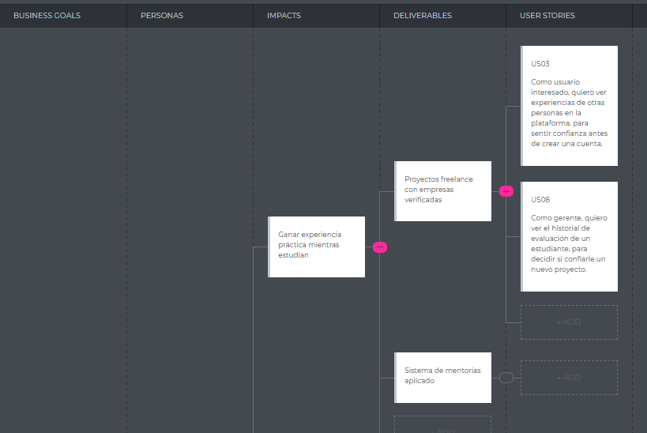
</p>

<p align="center">
  Impact Mapping 1 - Elaboración propia
</p>

<br>

<p align="center">
  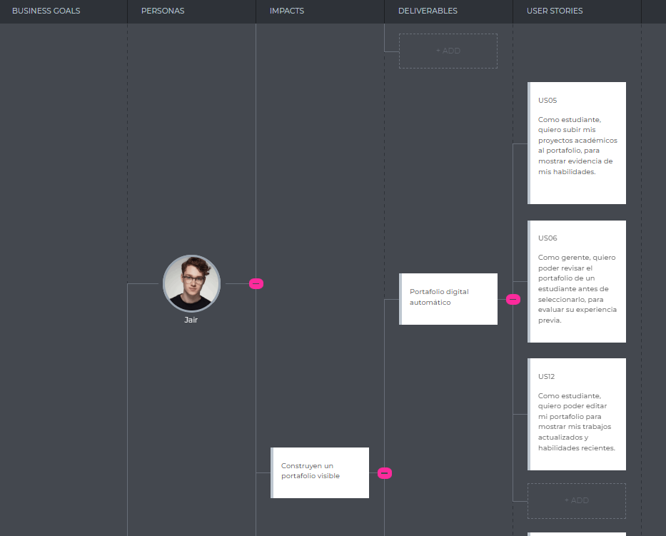
</p>

<p align="center">
  Impact Mapping 2 - Elaboración propia
</p>

<br>

<p align="center">
  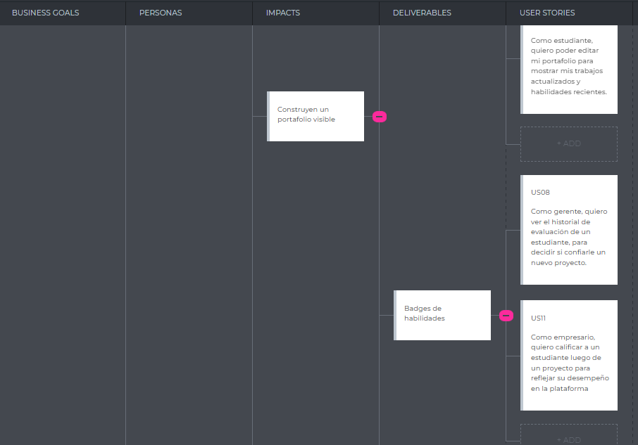
</p>

<p align="center">
  Impact Mapping 3 - Elaboración propia
</p>

<br>

<p align="center">
  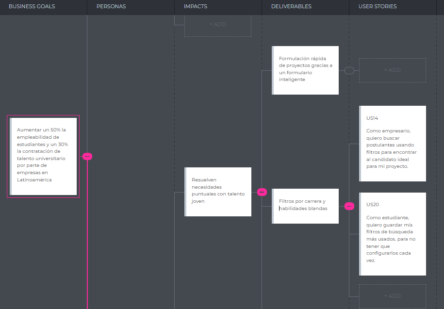
</p>

<p align="center">
  Impact Mapping 4 - Elaboración propia
</p>

<br>

<p align="center">
  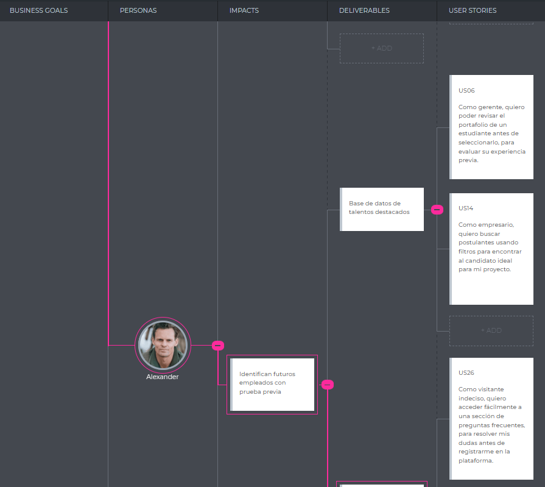
</p>

<p align="center">
  Impact Mapping 5 - Elaboración propia
</p>

<br>

<p align="center">
  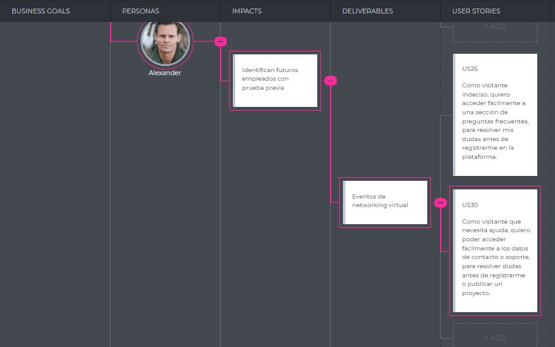
</p>

<p align="center">
  Impact Mapping 6 - Elaboración propia
</p>

<br>

<p align="center">
  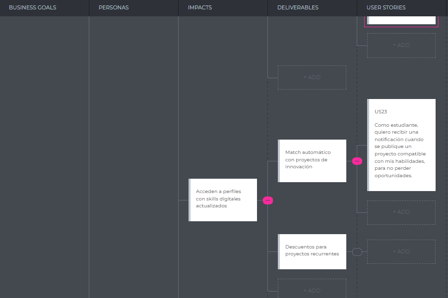
</p>

<p align="center">
  Impact Mapping 7 - Elaboración propia
</p>

<br>

### 3.4. Product Backlog  <br><br>

<br>

<table border="1">
  <thead>
    <tr>
      <th># Orden</th>
      <th>User Story Id</th>
      <th>Título</th>
      <th>Descripción</th>
      <th>Story Points (1 / 2 / 3 / 5 / 8)</th>
    </tr>
  </thead>
  <tbody>
    <tr>
      <td>1</td>
      <td>US01</td>
      <td>Comprender el propósito de la plataforma</td>
      <td>Como usuario nuevo, quiero entender rápidamente de qué trata UniTalents Connect, para decidir si me interesa registrarme como estudiante o gerente.</td>
      <td>5</td>
    </tr>
    <tr>
      <td>2</td>
      <td>US26</td>
      <td>Visualizar la propuesta de valor</td>
      <td>Como usuario nuevo, quiero ver de inmediato una propuesta visual clara y atractiva, para captar rápidamente la esencia de UniTalents Connect sin necesidad de leer demasiado.</td>
      <td>5</td>
    </tr>
    <tr>
      <td>3</td>
      <td>US04</td>
      <td>Llamados a la acción claros</td>
      <td>Como usuario, quiero encontrar botones de acción relevantes a lo largo de la landing, para tomar decisiones sin tener que regresar al inicio.</td>
      <td>3</td>
    </tr>
    <tr>
      <td>4</td>
      <td>US02</td>
      <td>Registro inmediato desde la landing</td>
      <td>Como usuario nuevo, quiero acceder rápidamente al formulario de registro, para comenzar a usar la plataforma sin perder tiempo.</td>
      <td>3</td>
    </tr>
    <tr>
      <td>5</td>
      <td>US03</td>
      <td>Ver testimonios de usuarios reales</td>
      <td>Como usuario interesado, quiero ver experiencias de otras personas en la plataforma, para sentir confianza antes de crear una cuenta.</td>
      <td>2</td>
    </tr>
    <tr>
      <td>6</td>
      <td>US24</td>
      <td>Encabezado fijo para navegar</td>
      <td>Como visitante de la landing page, quiero contar con un encabezado visible en todo momento, para moverme fácilmente entre las secciones sin hacer scroll manualmente.</td>
      <td>3</td>
    </tr>
    <tr>
      <td>7</td>
      <td>US25</td>
      <td>Acceder a la sección de FAQs</td>
      <td>Como visitante indeciso, quiero acceder fácilmente a una sección de preguntas frecuentes, para resolver mis dudas antes de registrarme en la plataforma.</td>
      <td>2</td>
    </tr>
    <tr>
      <td>8</td>
      <td>US27</td>
      <td>Acceder a información de contacto o soporte</td>
      <td>Como visitante que necesita ayuda, quiero poder acceder fácilmente a los datos de contacto o soporte, para resolver dudas antes de registrarme o publicar un proyecto.</td>
      <td>2</td>
    </tr>
    <tr>
      <td>9</td>
      <td>US05</td>
      <td>Subir proyecto a mi portafolio</td>
      <td>Como estudiante, quiero poder subir una URL que dirija a un proyecto de mi portafolio, para que los gerentes o empresas puedan visualizar mi trabajo y evaluar mejor mi experiencia.</td>
      <td>5</td>
    </tr>
    <tr>
      <td>10</td>
      <td>US06</td>
      <td>Visualización del portafolio por gerentes</td>
      <td>Como gerente, quiero poder revisar el portafolio de un estudiante antes de seleccionarlo, para evaluar su experiencia previa.</td>
      <td>3</td>
    </tr>
    <tr>
      <td>11</td>
      <td>US07</td>
      <td>Ver estado de mis postulaciones</td>
      <td>Como estudiante, quiero consultar el estado de mis postulaciones, para saber si fui considerado.</td>
      <td>3</td>
    </tr>
    <tr>
      <td>12</td>
      <td>US08</td>
      <td>Ver reputación de un estudiante</td>
      <td>Como gerente, quiero ver el historial de evaluación de un estudiante, para decidir si confiarle un nuevo proyecto.</td>
      <td>5</td>
    </tr>
    <tr>
      <td>13</td>
      <td>US09</td>
      <td>Recuperar contraseña</td>
      <td>Como usuario, quiero poder recuperar mi contraseña, para acceder a mi cuenta si la olvido.</td>
      <td>2</td>
    </tr>
    <tr>
      <td>14</td>
      <td>US10</td>
      <td>Modificación de perfil de usuario</td>
      <td>Como usuario, quiero modificar la información de mi perfil para mantener mis datos actualizados en la plataforma.</td>
      <td>3</td>
    </tr>
    <tr>
      <td>15</td>
      <td>US13</td>
      <td>Calificación del contratador</td>
      <td>Como estudiante, quiero calificar al empresario luego del proyecto para compartir mi experiencia con futuros postulantes.</td>
      <td>2</td>
    </tr>
    <tr>
      <td>16</td>
      <td>US12</td>
      <td>Actualizar URL del portafolio</td>
      <td>Como estudiante, quiero modificar la URL de mi portafolio, para mantener actualizado el enlace que visualizan los gerentes o empresas.</td>
      <td>2</td>
    </tr>
    <tr>
      <td>17</td>
      <td>US14</td>
      <td>Búsqueda de postulante</td>
      <td>Como empresario, quiero filtrar entre los postulantes a mis proyectos por carrera, habilidades y calificación previa, para encontrar más fácilmente al candidato ideal para colaborar.</td>
      <td>5</td>
    </tr>
    <tr>
      <td>18</td>
      <td>US15</td>
      <td>Registrarse como usuario</td>
      <td>Como usuario nuevo, quiero crear una cuenta, para utilizar la aplicación.</td>
      <td>3</td>
    </tr>
    <tr>
      <td>19</td>
      <td>US16</td>
      <td>Iniciar sesión</td>
      <td>Como usuario, quiero iniciar sesión en la aplicación, para acceder a sus funcionalidades.</td>
      <td>3</td>
    </tr>
    <tr>
      <td>20</td>
      <td>US17</td>
      <td>Crear convocatoria</td>
      <td>Como gerente, quiero crear convocatorias en la aplicación, para recibir solicitudes de postulantes.</td>
      <td>5</td>
    </tr>
    <tr>
      <td>21</td>
      <td>US18</td>
      <td>Editar convocatoria</td>
      <td>Como gerente, quiero editar convocatorias en la aplicación, para corregir o actualizar la información cuando lo necesite.</td>
      <td>3</td>
    </tr>
    <tr>
      <td>22</td>
      <td>US19</td>
      <td>Eliminar convocatoria</td>
      <td>Como gerente, quiero eliminar una convocatoria publicada, para evitar recibir nuevas postulaciones cuando el proyecto cierre.</td>
      <td>3</td>
    </tr>
    <tr>
      <td>23</td>
      <td>US20</td>
      <td>Cerrar sesión</td>
      <td>Como usuario, quiero poder cerrar sesión en cualquier momento, para asegurar la privacidad de mi cuenta.</td>
      <td>2</td>
    </tr>
    <tr>
      <td>24</td>
      <td>US21</td>
      <td>Actualizar tecnologias en el perfil del estudiante</td>
      <td>Como estudiante, quiero actualizar las tecnologías que domino, para que se muestren en mi perfil </td>
      <td>2</td>
    </tr>
    <tr>
      <td>25</td>
      <td>US22</td>
      <td>Visualizar información de empresa</td>
      <td>Como estudiante, quiero ver la información de la empresa a la que estoy postulando, para mantenerme más informado.</td>
      <td>3</td>
    </tr>
    <tr>
      <td>26</td>
      <td>US23</td>
      <td>Actualizar tecnologías en el perfil de la empresa</td>
      <td>Como gerente, quiero actualizar las tecnologías que se utilizan en mi empresa, para que se muestren en el perfil de la compañía. </td>
      <td>2</td>
    </tr>
    <tr>
      <td>27</td>
      <td>TS01</td>
      <td>Endpoint para registro de usuarios</td>
      <td>Como developer, quiero crear un endpoint para registrar nuevos usuarios diferenciando su rol (estudiante o gerente), para permitir su autenticación y posterior personalización de la plataforma.</td>
      <td>3</td>
    </tr>
    <tr>
      <td>28</td>
      <td>TS02</td>
      <td>Endpoint para creación de proyectos</td>
      <td>Como developer, quiero crear un endpoint para que los gerentes puedan publicar nuevos proyectos, para que los estudiantes puedan visualizar y postular.</td>
      <td>3</td>
    </tr>
    <tr>
      <td>29</td>
      <td>TS03</td>
      <td>Endpoint para postulación a proyectos</td>
      <td>Como developer, quiero desarrollar un endpoint para que los estudiantes puedan postular a proyectos, para registrar su interés formal en una oportunidad.</td>
      <td>3</td>
    </tr>
    <tr>
      <td>30</td>
      <td>TS04</td>
      <td>Endpoint para calificación de desempeño</td>
      <td>Como developer, quiero crear un endpoint que permita a los gerentes calificar el desempeño de un estudiante tras finalizar un proyecto, para actualizar su reputación en la plataforma.</td>
      <td>3</td>
    </tr>
    <tr>
      <td>31</td>
      <td>US28</td>
      <td>Visualizar oportunidades para estudiante</td>
      <td>Como estudiante que inicio sesión, quiero poder acceder a un apartado de oportunidades, para para postularme a uno.</td>
      <td>5</td>
    </tr>
    <tr>
      <td>32</td>
      <td>US29</td>
      <td>Visualizar de portafolio para estudiante</td>
      <td>Como estudiante que inicio sesión, quiero poder acceder a un apartado de Portafolio, para para visualizar mis trabajos hechos.</td>
      <td>3</td>
    </tr>
    <tr>
      <td>33</td>
      <td>US30</td>
      <td>Visualizar de postulaciones para gerentes</td>
      <td>Como gerente que inicio sesión, quiero poder acceder a un apartado de Postulaciones, para para visualizar las diferentes postulaciones hechas a mi proyecto.</td>
      <td>4</td>
    </tr>
  </tbody>
</table>


<br><br>


<p align="center">
  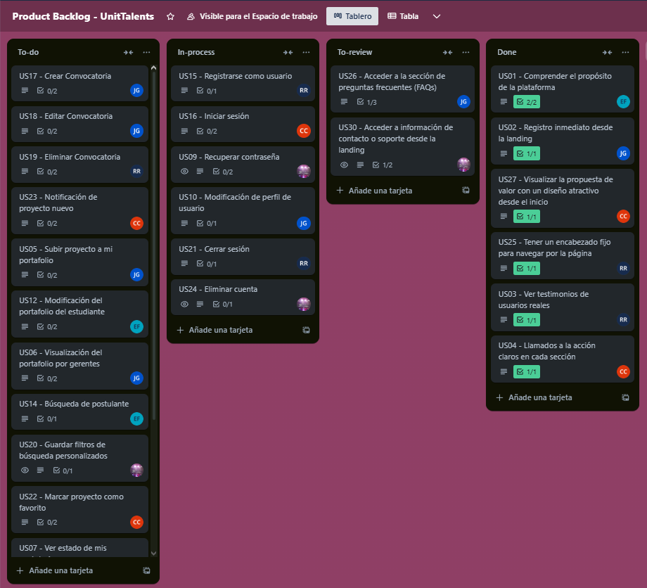
</p>

<p align="center">
  Product Backlog - Elaboración propia
</p>

<br>

`https://trello.com/b/sMeOQ8TS/product-backlog-unittalents`

---

## Capítulo IV: Product Design

### 4.1. Style Guidelines

Esta sección establece un conjunto de directrices visuales y de interacción coherentes que funcionarán como fuente central de referencia para el equipo de diseño, desarrollo y comunicación de UniTalents Connect.
El objetivo es garantizar una presentación unificada, profesional y alineada con la esencia de la marca: conectar a turistas con experiencias auténticas, de manera simple y confiable.

#### 4.1.1. General Style Guidelines 

- _Branding:_    
    - La identidad visual de UniTalents Connect es moderna, cercana y confiable. El logotipo incorpora dos figuras humanas estilizadas unidas en un gesto de conexión, lo que simboliza el espíritu colaborativo y humano de la plataforma.
    - Uso del logotipo: El logotipo debe usarse preferentemente sobre fondos claros (beige, blanco o pastel neutro). En fondos oscuros, se permite una versión monocromática blanca o en azul marino (#1C1F2B).
    - No se permite:
        - Rotar el logotipo.
        - Aplicar sombras, contornos o degradados.
        - Cambiar la tipografía original de la palabra UniTalents Connect.
  
  <p align="center">
    
  </p>

  <p align="center">
    Logo UniTalent Conncect - Elaboración propia
  </p>

  <br>

- _Typography:_
    - La tipografía utilizada en el logotipo es una fuente sans-serif geométrica, amigable y legible. Para mantener coherencia, se adoptará un sistema tipográfico similar en toda la aplicación.

    - Fuente primaria: Nunito Sans
        - Uso: Títulos, botones, navegación.
        - Estilos permitidos: Regular, SemiBold, Bold.

    - Fuente secundaria: Inter
        - Uso: Cuerpos de texto largos, formularios.

    - Tamaños recomendados:
        - Título principal (H1): 32px / 700
        - Subtítulo (H2): 24px / 600
        - Texto normal: 16px / 400
        - Nota o ayuda: 12px / 400
    
        | Nombre de fuente | Tipografia |
        |:----------------:|:----------:|
        | Nunito Sans |  |
        | Inter | 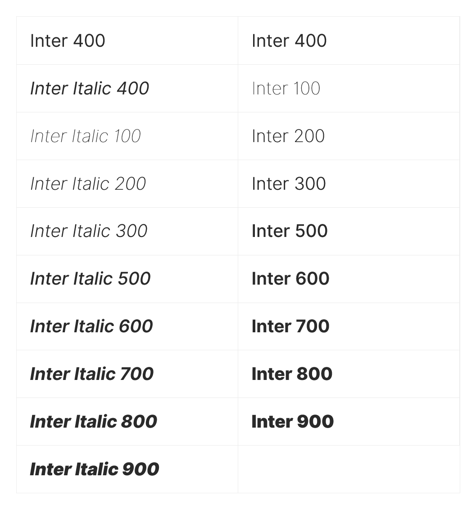 |        
              
- _Colors:_
    - La paleta de UniTalents Connect se basa en contrastes suaves y un color protagonista: azul marino profundo, que transmite confianza y estabilidad. Se acompaña de colores neutros y un acento cálido para llamados a la acción<br><br>
    
    | Color | Hex | Uso Principal | 
    |:-----:|:---:|:-------------:|
    |Azul Marino| #1C1F2B | Texto principal, botones|
    |Beige Claro| #F5F0E6 | Fondo base|
    |Gris Suave| #B3B3B3 | Bordes, textos secundarios|
    |Azul Claro| #3A71C1 | Enlaces, etiquetas, botones secundarios|
    |Amarillo Arena| #FFD479| Llamado a la acción / botones |
    |Blanco| #FFFFFF|Logotipo, tarjetas, formularios|
<br>
<p align="center">
    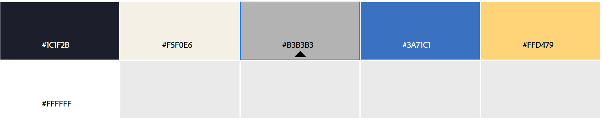
</p>

<p align="center">
    System Colors UniTalent Connect - Elaboración propia
</p>

<br>

- _Spacing:_
    - La coherencia en el espaciado es clave para una interfaz limpia y clara.
        - Espaciado entre secciones principales: 32px
        - Margen interno de botones y campos: 12px vertical / 20px horizontal
        - Separación entre elementos repetitivos (cards, ítems): 16px
        - Padding general de contenedores: 24px

- _Tono de comunicación y lenguaje:_
    - El tono de UniTalents Connect es cercano, entusiasta y profesional.
    
    | Estilo de redacción | Tono predominante |
    |---------------------|-------------------|
    | 1. Amigable y claro <br> 2. Sin tecnicismos innecesarios <br> 3. Verbos en voz activa <br> 4. Enfocado en beneficios (“Descubre experiencias únicas”, “Reserva en segundos”)| 1. Formal-casual: Respetuoso, pero no rígido. <br> 2. Entusiasta: Inspirador, motivador, acogedor. <br> 3. Directo: Frases cortas y llamadas a la acción claras. |

#### 4.1.2. Web Style Guidelines  

- _Responsive Design Standards:_  
    UniTalents Connect está diseñado como una aplicación web mobile-first, adaptándose fluidamente a diferentes dispositivos:

    - **Mobile (360px - 768px):**  
        - Navegación tipo hamburguesa.  
        - Cards apiladas en columna.  
        - Botones grandes y legibles.  

    - **Tablet (769px - 1024px):**  
        - Layout en 2 columnas.  
        - Menú lateral colapsable.  

    - **Desktop (1025px en adelante):**  
        - Menú principal visible.  
        - Layout de 3 columnas donde sea posible.  

    Todos los componentes deben utilizar **flexbox/grid** con puntos de quiebre en 768px y 1024px.

- _Interactivity:_  
    - **Botones:**  
        - Bordes redondeados (border-radius: 12px).  
        - Hover: cambio de fondo o sombra suave (box-shadow: 0px 2px 8px rgba(0, 0, 0, 0.1)).  
        - Feedback claro al clic (cambio de color, animación sutil).  

    - **Transiciones y animaciones:**  
        - Duración: 200–300ms.  
        - Usar ease-in-out.  
        - Aplicables en sliders, modales, tooltips y feedback de formularios.

- _Accessibility:_  
    - Contrastes de texto cumplen con **WCAG AA** como mínimo.  
    - Todo ícono debe tener alternativa textual (aria-label o alt).  
    - Navegación compatible con teclado (Tab, Enter, Esc).  
    - Uso de role, aria-expanded, aria-hidden en componentes dinámicos.  
    - Fuente mínima: 16px.

- _UI Consistency:_  
    - Uso de un sistema de componentes reutilizables: botones, tarjetas, inputs, modales.  
    - Evitar cambios de estilo arbitrarios entre páginas.  
    - Todos los formularios deben compartir un estilo común:  
        - Etiqueta arriba, campo debajo, mensaje de error abajo.  
        - Validaciones claras y mensajes amigables.

### 4.2. Information Architecture

La arquitectura de información de UniTalents Connect define cómo se organizará, etiquetará, navegará y buscará el contenido dentro de la plataforma. Su objetivo es permitir que estudiantes y gerentes interactúen de forma fluida con la plataforma, accedan sin dificultad a los recursos clave, y cumplan sus objetivos con el mínimo esfuerzo cognitivo.

#### 4.2.1. Organization Systems <br><br>

UniTalents Connect utilizará una combinación de organización jerárquica, secuencial y matricial, aplicada de forma estratégica tanto en la Landing Page como en las secciones funcionales de la aplicación web. Además, se aplicarán diferentes esquemas de categorización.

+ Jerarquía visual:

La jerarquía visual en UniTalents Connect se aplicará estratégicamente en distintas vistas clave de la plataforma. En la Landing Page, el contenido estará organizado en secciones descendentes que priorizan el título, los beneficios principales y llamados a la acción como “Comienza tu camino profesional” o “Publica tu proyecto ahora”, siguiendo una lógica de atracción y conversión. En el dashboard del estudiante, se destacarán visualmente las oportunidades recomendadas, el estado de las postulaciones y los próximos pasos mediante tarjetas y elementos gráficos resaltados. Por su parte, el dashboard del gerente priorizará la visualización de los proyectos activos, los estudiantes pendientes de validación y las alertas relacionadas con entregas o cierres próximos, facilitando una gestión eficiente desde el primer acceso.<br><br>

+ Organización secuencial:

La organización secuencial en UniTalents Connect se aplicará en procesos clave que requieren acompañamiento paso a paso, facilitando la experiencia incluso para usuarios sin experiencia previa. En el onboarding del estudiante, el flujo estará compuesto por etapas guiadas que incluyen el registro, la carga del perfil, publicación del portafolio de habilidades y la vinculación a oportunidades compatibles. Para los gerentes, la publicación de proyectos se estructurará como un formulario inteligente que avanza progresivamente desde los datos básicos del proyecto hasta los requisitos específicos y filtros de búsqueda del candidato ideal. Asimismo, el proceso de postulación estará compuesto por pasos ordenados que abarcan la elección del proyecto, la revisión de los detalles, la confirmación y el envío de la postulación, asegurando una navegación clara, sin fricciones.<br><br>

+ Organización matricial:

La organización matricial en UniTalents Connect estará orientada a facilitar la exploración libre de contenidos mediante el uso de cuadrículas y tarjetas visuales. En el caso de los estudiantes, se aplicará en el explorador de proyectos, donde las oportunidades aparecerán organizadas en una grilla que podrá filtrarse dinámicamente según criterios relevantes. Para los gerentes, la vista de postulantes mostrará tarjetas con información clave como nombre, carrera, portafolio, puntuación y habilidades destacadas, permitiendo una comparación ágil entre candidatos.<br><br>

+ Esquemas de categorización:

  + **Por audiencia:** el contenido se adapta a si el usuario es estudiante o gerente, con rutas y menús diferenciados.

  + **Alfabético:** para búsquedas de universidades, empresas y habilidades.

  + **Cronológico:** en el historial de entregas, postulaciones, comentarios y validaciones.<br><br>

#### 4.2.2. Labeling Systems  <br><br>

El sistema de etiquetado ha sido diseñado para ser intuitivo, minimalista y consistente entre interfaces. Se emplearán términos cortos y directos (máximo 2 palabras), que permitan a usuarios de distintos niveles de experiencia entender rápidamente el propósito de cada sección o acción.

+ Landing Page:

  + Inicio (logo)

  + ¿Cómo funciona?

  + Casos de éxito

  + FAQs

  + Integrantes

  + Accceder

+ WebApp (Estudiantes):

  + Oportunidades

  + Portafolio

  + Mis postulaciones

  + Perfil


+ WebApp (Gerentes):

  + Mis Proyectos

  + Talento

  + Evaluaciones

  + Mi empresa

<br>

<p align="center">
  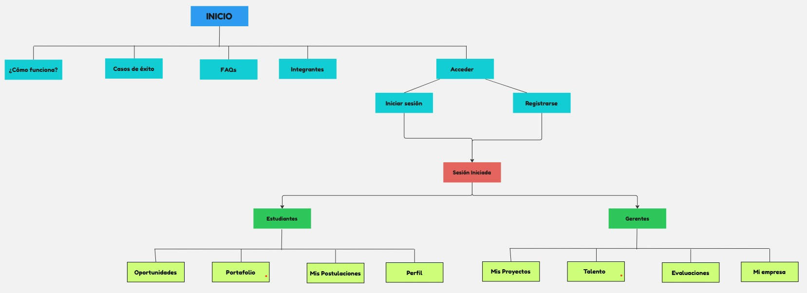
</p>

<p align="center">
    Labeling System - Elaboración propia
</p>


<br><br>

  <table align="center">
  <tr>
    <td><strong>Tipo etiqueta</strong></td>
    <td><strong>Ejemplo</strong></td>
    <td><strong>Aparición</strong></td>
  </tr>
  <tr>
    <td><strong>Encabezado</strong></td>
    <td>"Mis postulaciones"</td>
    <td>En la parte superior del dashboard del estudiante</td>
  </tr>
  <tr>
    <td><strong>Panel</strong></td>
    <td>"Portafolio"</td>
    <td>Dentro de una tarjeta destacada del dashboard</td>
  </tr>
  <tr>
    <td><strong>Botón</strong></td>
    <td>"Publicar proyecto”</td>
    <td>Acción principal para los gerentes en el módulo de creación de oportunidades</td>
  </tr>
  <tr>
    <td><strong>Navegación</strong></td>
    <td>“Inicio” – “Portafolio” – “Evaluaciones”</td>
    <td>En la barra lateral o menú superior según el dispositivo</td>
  </tr>
  <tr>
    <td><strong>Estado</strong></td>
    <td>““En revisión” – “Aceptado” – “Entregado””</td>
    <td>En la tarjeta de estado de cada proyecto o postulación</td>
  </tr>
</table><br><br>

#### 4.2.3. SEO Tags and Meta Tags  <br><br>

Las meta etiquetas permitirán estructurar adecuadamente la información que los buscadores necesitan para indexar y posicionar el contenido del sitio. Serán definidas de forma diferenciada para la Landing Page y la Aplicación Web.

+ Landing Page:

  + Título<br><br>

  ```html
  <title>UniTalents Connect – Conecta con talento universitario</title>
  ```

  + Codificación de caracteres<br><br>

  ```html
  <meta charset="utf-8">
  ```

  + Meta Description<br><br>

  ```html
  <meta name="description" content="Plataforma que conecta a estudiantes universitarios con oportunidades de desarrollo profesional mediante proyectos por encargo validados por empresas reales."/>
  ```

  + Keywords<br><br>

  ```html
  <meta name="keywords" content="prácticas preprofesionales, oportunidades laborales, estudiantes, portafolio digital, talento joven"/>
  ```

  + Autor y Derechos de Autor<br><br>

  ```html
  <meta name="author" content="UniTalents Connect Team"/>
  <meta name="copyright" content="© 2025 UniTalents Connect. Todos los derechos reservados." />
  ```

<br>

+ Web Application:

  + Título<br><br>

  ```html
  <title>UniTalents Connect – Talento y Proyectos</title>
  ```

  + Codificación de caracteres<br><br>

  ```html
  <meta charset="utf-8">
  ```

  + Meta Description<br><br>

  ```html
  <meta name="description" content="Gestiona tu perfil profesional, postula a proyectos validados, construye un portafolio digital y recibe feedback de empresas reales."/>
  ```

  + Keywords<br><br>

  ```html
  <meta name="keywords" content="estudiantes universitarios, oportunidades laborales, estudiantes, portafolio digital, talento joven, networking académico"/>
  ```

  + Autor y Derechos de Autor<br><br>

  ```html
  <meta name="author" content="UniTalents Connect Team"/>
  <meta name="copyright" content="© 2025 UniTalents Connect. Todos los derechos reservados." />
  ```

  <br>

#### 4.2.4. Searching Systems <br><br>

Dado que la plataforma gestionará gran cantidad de datos (postulaciones, estudiantes, habilidades, proyectos, empresas), se implementará un sistema de búsqueda flexible y filtrado inteligente.

+ Opciones de búsqueda:

  + Buscar proyectos disponibles

  + Buscar por empresa

  + Buscar estudiantes por universidad

  + Buscar estudiantes por carrera

+ Filtros:

  + Modalidad (remoto/presencial)

  + Habilidades requeridad

  + Duración del proyecto

  + Carrera

  + Universidad

  + Empresa


#### 4.2.5. Navigation Systems<br><br>

La navegación en UniTalents Connect está diseñada para ofrecer una experiencia continua, limpia y responsive. Se evitarán interfaces recargadas, permitiendo una interacción clara tanto en escritorio como en dispositivos móviles.

+ Landing Page:

  En la Landing Page de UniTalents Connect se implementará un diseño de tipo one-page scroll, donde el contenido se presenta de manera continua en una sola página, permitiendo al usuario desplazarse verticalmente a través de las distintas secciones. Para facilitar la navegación, se incluirá un encabezado fijo que funcionará como menú principal, desde el cual se podrá acceder rápidamente a secciones ancladas como “¿Cómo funciona?”, “Planes”, “Casos de éxito”, “FAQs” y “Registro”. Además, en cada sección se destacarán botones de acción visibles y llamativos como “Empieza hoy” o “Publica tu primer proyecto”, con el fin de guiar al usuario hacia los principales objetivos de conversión.

+ Web App:

  En la aplicación web de UniTalents Connect se implementará una navegación híbrida que combina flujos guiados y navegación libre según el contexto de uso. Para los procesos clave como el registro y perfilamiento del usuario, la postulación a una oportunidad y la publicación de un nuevo proyecto, se utilizará una navegación secuencial que acompañará paso a paso al usuario hasta completar cada tarea con éxito. Paralelamente, se ofrecerá una navegación libre a través de un menú lateral en la versión de escritorio y un menú inferior en dispositivos móviles, desde donde se podrá acceder rápidamente a los módulos principales como oportunidades, portafolio, feedback, evaluaciones, perfil y más, permitiendo una experiencia fluida, intuitiva y adaptable a distintos estilos de interacción.

### 4.3. Landing Page UI Design

#### 4.3.1. Landing Page Wireframe  

<p align="center">
  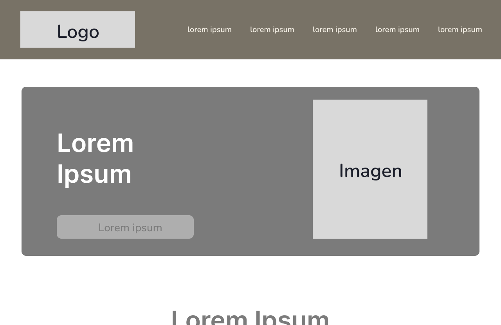
</p>

<p align="center">
    Wireframes 1 - Elaboración propia
</p>

<br><br>

<p align="center">
  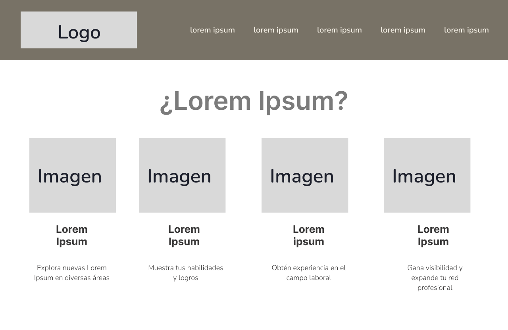
</p>

<p align="center">
    Wireframes 2 - Elaboración propia
</p>

<br><br>

<p align="center">
  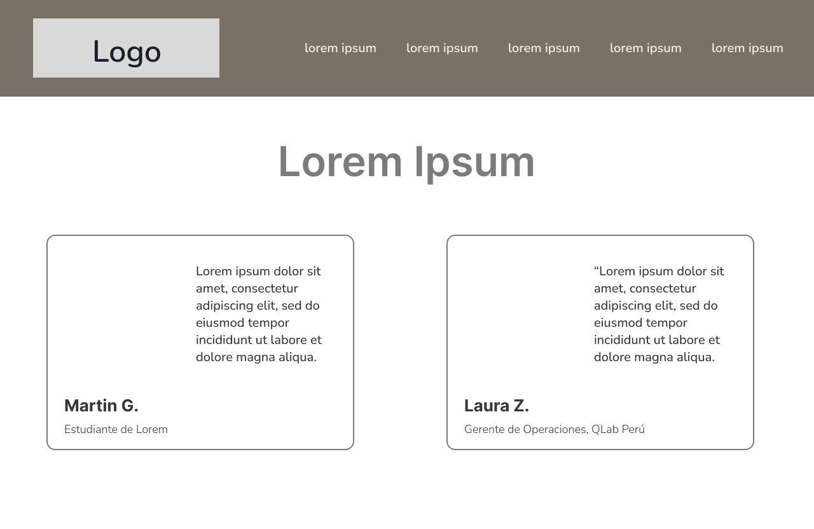
</p>

<p align="center">
    Wireframes 3 - Elaboración propia
</p>

<br><br>

<p align="center">
  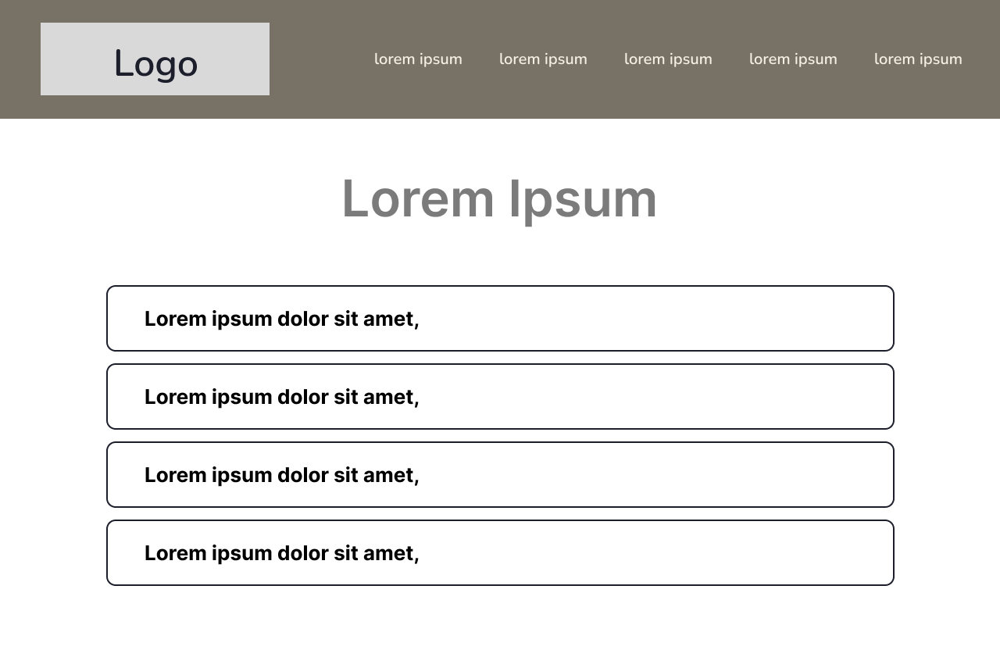
</p>

<p align="center">
    Wireframes 4 - Elaboración propia
</p>

<br><br>

#### 4.3.2. Landing Page Mock-up  

<p align="center">
  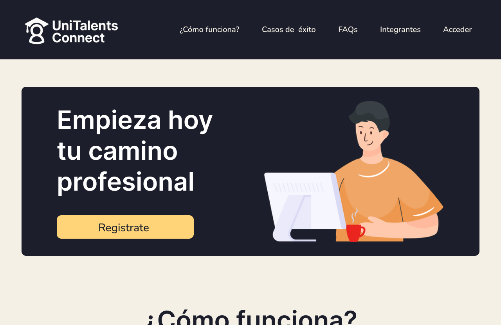
</p>

<p align="center">
    Mock-up 1 - Elaboración propia
</p>

<br><br>

<p align="center">
  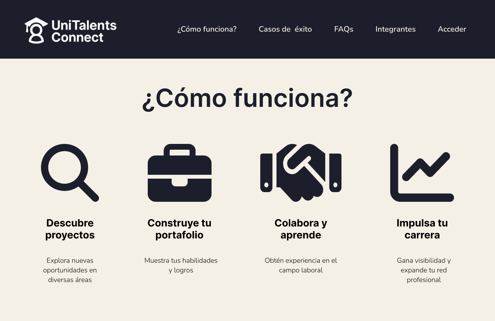
</p>

<p align="center">
    Mock-up 2 - Elaboración propia
</p>

<br><br>

<p align="center">
  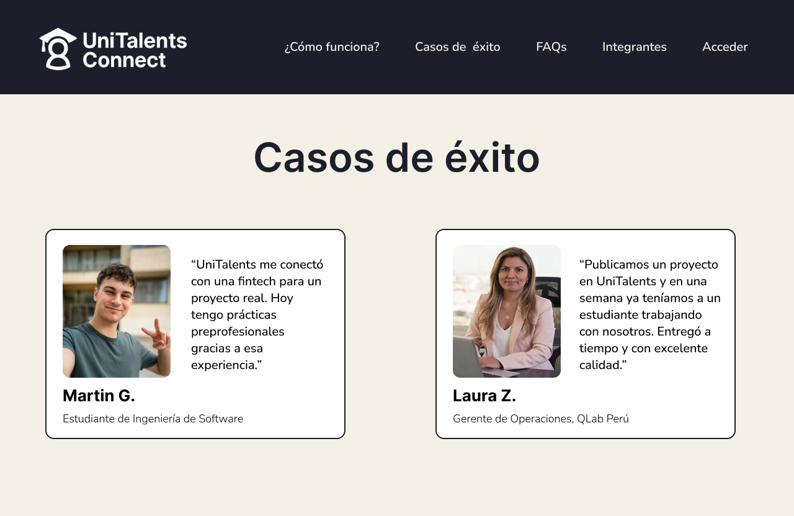
</p>

<p align="center">
    Mock-up 3 - Elaboración propia
</p>

<br><br>

<p align="center">
  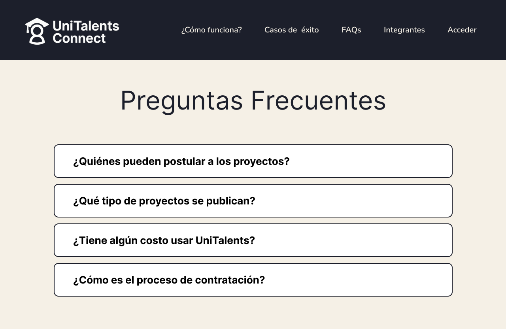
</p>

<p align="center">
    Mock-up 4 - Elaboración propia
</p>

<br><br>

### 4.4. Web Applications UX/UI Design

#### 4.4.1. Web Applications Wireframes 

Los wireframes de UniTalents Connect han sido desarrollados aplicando principios clave de diseño centrado en el usuario, priorizando la claridad visual, la jerarquía de información y la accesibilidad. Cada sección está estructurada con una navegación intuitiva y coherente entre el menú lateral, encabezado fijo y bloques de contenido, lo cual refleja una arquitectura de información jerárquica y secuencial bien definida. Se han utilizado elementos de diseño consistentes como tarjetas, iconos descriptivos, botones llamativos y formularios bien distribuidos, facilitando la interacción fluida en dispositivos de diferentes tamaños. Además, se ha incorporado un enfoque de diseño inclusivo al priorizar la legibilidad (uso de contrastes adecuados, tamaños de fuente amplios y campos de formulario claros), permitiendo que usuarios con distintos niveles de experiencia digital puedan navegar sin fricciones. Todo el diseño contribuye a lograr una experiencia coherente entre perfiles (estudiante y gerente), enfocada en guiar a los usuarios hacia sus metas (postular, contratar, calificar, publicar proyectos) de forma eficiente y accesible.

`https://www.figma.com/design/4ogul9R3HVNx4WAPZMDCCh/UnitTalents?node-id=90-2&t=MxwzCu31lmWjWLeX-1`
<br><br>

+ Iniciar Sesión / Registrarse:

Permite a nuevos usuarios crear una cuenta como estudiante o gerente, y a usuarios existentes ingresar con sus credenciales para acceder a su respectivo dashboard.

<p align="center">
  
</p>

<p align="center">
    Wireframe Sing In - Elaboración propia
</p>

<br><br>

<p align="center">
  
</p>

<p align="center">
    Wireframe Manager Register - Elaboración propia
</p>

<br><br>

<p align="center">
  
</p>

<p align="center">
    Wireframe Student Register - Elaboración propia
</p>

<br><br>

+ Dashboard del Estudiante:

Muestra un resumen del estado de las postulaciones, proyectos sugeridos, y accesos rápidos a portafolio y feedback. El punto de inicios son las oportunidades.

<p align="center">
  
</p>

<p align="center">
    Wireframe Student Homepage - Elaboración propia
</p>

<br><br>

+ Agregar Proyecto al Portafolio:

Formulario para registrar un nuevo proyecto, con campos como título, descripción, tecnologías y enlaces.

<p align="center">
  
</p>

<p align="center">
    Wireframe Student Add project - Elaboración propia
</p>

<br><br>

+ Vista del Portafolio del Estudiante:

Muestra todos los proyectos subidos con opción de editar o eliminar.

<p align="center">
  
</p>

<p align="center">
    Wireframe Student portafolio - Elaboración propia
</p>

<br><br>

+ Mis Postulaciones:

Muestra el estado actual de todas las postulaciones enviadas (en revisión, aceptado, rechazado).

<p align="center">
  
</p>

<p align="center">
    Wireframe Student Mis postulaciones - Elaboración propia
</p>

<br><br>

+ Dashboard del Gerente:

Muestra resumen de proyectos activos, buscar talento, mis evaluaciones y mi empresa. Empezando con Mis Proyectos.

<p align="center">
  
</p>

<p align="center">
    Wireframe Gerente Homepage - Elaboración propia
</p>

<br><br>

+ Vista del Proyecto:

Presenta los detalles del proyecto ya concluido, historial del proceso, entregables y resultados.

<p align="center">
  
</p>

<p align="center">
    Wireframe Gerente Ver información proyecto - Elaboración propia
</p>

<br><br>

+ Buscar Talento:

Permite buscar estudiantes por filtros, acceder a perfiles, portafolios y evaluaciones anteriores.

<p align="center">
  
</p>

<p align="center">
    Wireframe Gerente Buscar Talento - Elaboración propia
</p>

<br><br>

+ Evaluaciones:

Panel que muestra los proyectos pendientes de evaluación y permite calificar estudiantes.

<p align="center">
  
</p>

<p align="center">
    Wireframe Gerente Evaluaciones - Elaboración propia
</p>

<br><br>


#### 4.4.2. Web Applications Wireflow Diagrams 

`https://overflow.io/s/TQAWUZY8`

<br><br>

+ **Wireflow 1: Login / Registrarse**

**User Goal:** Como nuevo usuario, quiero ingresar o crear una cuenta, para acceder a la plataforma según mi rol.

**User Persona:** Estudiante y Gerente de empresa

**Flujo:** El usuario accede a la landing page y hace clic en “Acceder” desde el encabezado. Al seleccionar una opción, puede elegir entre perfil Estudiante o Gerente mediante un botón conmutador. Si ya está registrado, introduce su correo y contraseña. Si es nuevo, completa el formulario correspondiente con nombre, correo, contraseña y rubro (en el caso de estudiantes). Tras completar el proceso, es redirigido automáticamente a su dashboard correspondiente.

<p align="center">
  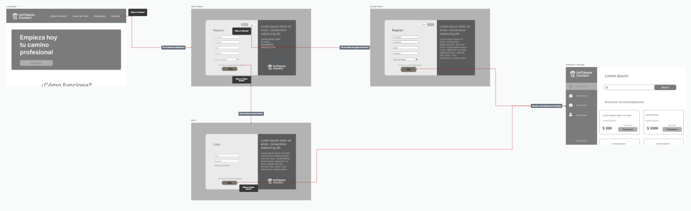
</p>

<p align="center">
    Wireflow Login y Register - Elaboración propia
</p>

<br><br>

+ **Wireflow 2: Postular a un proyecto**

**User Goal:** Como estudiante, quiero postularme a un proyecto, para ganar experiencia y construir mi portafolio.

**User Persona:** Estudiante

**Flujo:** Desde el menú lateral, el estudiante accede a la sección Oportunidades. Allí visualiza un listado de proyectos activos con filtros (carrera, habilidades, duración, etc.). Al hacer clic en un proyecto, se despliega su ficha completa con descripción, empresa y requisitos. El estudiante hace clic en “Postularme”, y recibe una confirmación visual de que su postulación fue enviada. El proyecto aparece ahora en la sección “Mis Postulaciones”.

<p align="center">
  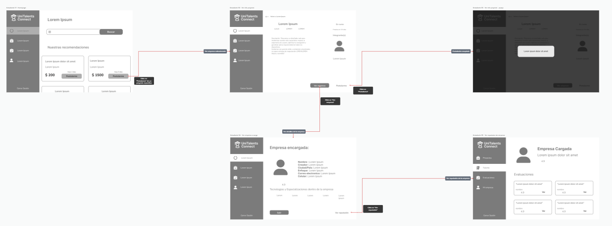
</p>

<p align="center">
    Wireflow Postular a un proyecto - Elaboración propia
</p>

<br><br>

+ **Wireflow 3: Gestionar portafolio**

**User Goal:** Como estudiante, quiero gestionar mis proyectos, para mostrar mi trabajo a posibles contratantes.

**User Persona:** Estudiante

**Flujo:** Desde su dashboard, el estudiante selecciona la sección Mi Portafolio. Allí encuentra una lista de tarjetas con sus proyectos previos. Puede hacer clic en “Agregar proyecto” para abrir un formulario con campos como título, descripción, tecnologías y enlaces o archivos. También puede editar o eliminar un proyecto existente desde un ícono de opciones en cada tarjeta. Al guardar los cambios, la lista se actualiza y queda lista para ser visualizada por los gerentes.

<p align="center">
  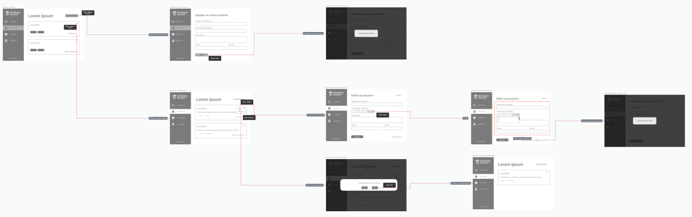
</p>

<p align="center">
    Wireflow Gestionar portafolio - Elaboración propia
</p>

<br><br>

+ **Wireflow 4: Calificar empresa**

**User Goal:** Como estudiante, quiero evaluar a la empresa al finalizar un proyecto, para compartir mi experiencia con otros usuarios.

**User Persona:** Estudiante

**Flujo:** Una vez que un proyecto en el que participó ha sido marcado como Finalizado, el estudiante recibe una notificación para dejar una calificación. Desde Mis Postulaciones, puede acceder a un botón “Calificar empresa” que le permite puntuar aspectos como comunicación, claridad de requerimientos y cumplimiento de condiciones, además de dejar un comentario opcional. Al confirmar la evaluación, esta se almacena en el historial de la empresa y contribuye a su reputación en la plataforma.

<p align="center">
  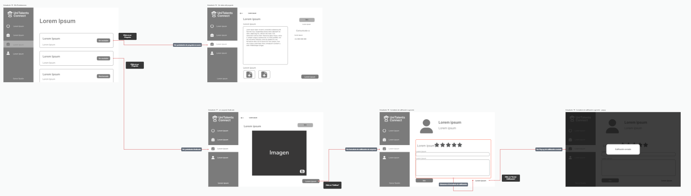
</p>

<p align="center">
    Wireflow Calificar empresa - Elaboración propia
</p>

<br><br>

+ **Wireflow 5: Crear proyecto**

**User Goal:** Como gerente, quiero publicar un nuevo proyecto, para encontrar estudiantes con el perfil adecuado.

**User Persona:** Gerente

**Flujo:** Desde el apartado "Mis Proyectos", el gerente accede a la opción “Agregar Proyecto”. Se abre un formulario con campos organizados paso a paso: nombre del proyecto, descripción, habilidades requeridas, duración, modalidad, fechas clave y nivel de compromiso. Al finalizar, puede hacer clic en “Publicar” y el proyecto pasa a estar visible en la plataforma dentro del explorador de oportunidades. 

<p align="center">
  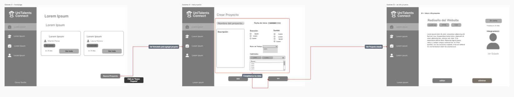
</p>

<p align="center">
    Wireflow Crear Proyecto - Elaboración propia
</p>

<br><br>

+ **Wireflow 6: Calificar postulante**

**User Goal:** Como gerente, quiero calificar al estudiante que participó en mi proyecto, para contribuir a su reputación.

**User Persona:** Gerente

**Flujo:** Una vez un proyecto termina, el gerente accede a Evaluaciones. Ahí visualiza la lista de estudiantes asignados. Al hacer clic en “Evaluar”, se abre un formulario con escala de puntuación (ej. responsabilidad, calidad, puntualidad) y un campo de comentario. Al guardar, la evaluación se almacena y se refleja en la reputación del estudiante, visible para futuros gerentes.

<p align="center">
  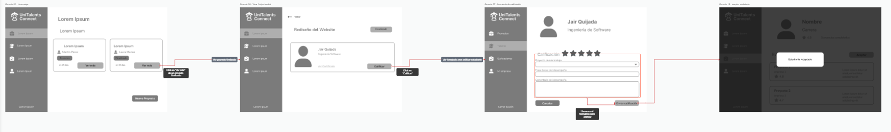
</p>

<p align="center">
    Wireflow Calificar Postulante - Elaboración propia
</p>

<br><br>

+ **Wireflow 7: Contratar estudiante**

**User Goal:** Como gerente, quiero seleccionar a un estudiante para un proyecto, para iniciar oficialmente su participación.

**User Persona:** Gerente

**Flujo:** Desde el listado de postulaciones dentro de un proyecto publicado, el gerente puede revisar el perfil y portafolio de cada candidato. Al decidirse por uno, hace clic en el botón “Contratar” dentro de su tarjeta. Se solicita una confirmación de la acción y se genera automáticamente el vínculo entre el estudiante y el proyecto. A partir de ese momento, el proyecto se mueve a la fase En curso y el estudiante recibe una notificación en su panel.

<p align="center">
  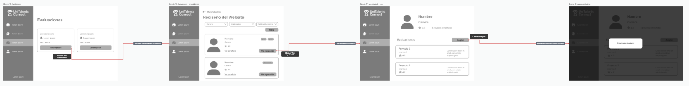
</p>

<p align="center">
    Wireflow Contratar estudiante - Elaboración propia
</p>

<br><br>

#### 4.4.3. Web Applications Mock-ups  

Los siguientes Mock-ups fueron elaborados en base a los wireframes previamente hechos. Representan fielmente la manera en la que nuestros usuarios podrán apreciar la aplicación web.

`https://www.figma.com/design/4ogul9R3HVNx4WAPZMDCCh/UnitTalents?node-id=0-1&p=f&t=dIa0V1UemHWoieb7-0`
<br><br>

+ Iniciar Sesión / Registrarse:

Permite a nuevos usuarios crear una cuenta como estudiante o gerente, y a usuarios existentes ingresar con sus credenciales para acceder a su respectivo dashboard.

<p align="center">
  
</p>

<p align="center">
    Web Applications Mock-ups Login - Elaboración propia
</p>

<br><br>

<p align="center">
  
</p>

<p align="center">
    Web Applications Mock-ups Register Manager - Elaboración propia
</p>

<br><br>

<p align="center">
  
</p>

<p align="center">
    Web Applications Mock-ups Register Student - Elaboración propia
</p>

<br><br>

+ Dashboard del Estudiante:

Muestra un resumen del estado de las postulaciones, proyectos sugeridos, y accesos rápidos a portafolio y feedback. El punto de inicios son las oportunidades.

<p align="center">
  
</p>

<p align="center">
    Web Applications Mock-ups Homepage Estudiante - Elaboración propia
</p>

<br><br>

+ Agregar Proyecto al Portafolio:

Formulario para registrar un nuevo proyecto, con campos como título, descripción, tecnologías y enlaces.

<p align="center">
  
</p>

<p align="center">
    Web Applications Mock-ups Agregar Proyecto al Portafolio - Elaboración propia
</p>

<br><br>

+ Vista del Portafolio del Estudiante:

Muestra todos los proyectos subidos con opción de editar o eliminar.

<p align="center">
  
</p>

<p align="center">
    Web Applications Mock-ups Vista del Portafolio - Elaboración propia
</p>

<br><br>

+ Mis Postulaciones:

Muestra el estado actual de todas las postulaciones enviadas (en revisión, aceptado, rechazado).

<p align="center">
  
</p>

<p align="center">
    Web Applications Mock-ups Mis Postulaciones - Elaboración propia
</p>

<br><br>

+ Dashboard del Gerente:

Muestra resumen de proyectos activos, buscar talento, mis evaluaciones y mi empresa. Empezando con Mis Proyectos.

<p align="center">
  
</p>

<p align="center">
    Web Applications Mock-ups Dashboard Gerente - Elaboración propia
</p>

<br><br>

+ Vista del Proyecto:

Presenta los detalles del proyecto ya concluido, historial del proceso, entregables y resultados.

<p align="center">
  
</p>

<p align="center">
    Web Applications Mock-ups Vista de Proyecto - Elaboración propia
</p>

<br><br>

+ Buscar Talento:

Permite buscar estudiantes por filtros, acceder a perfiles, portafolios y evaluaciones anteriores.

<p align="center">
  
</p>

<p align="center">
    Web Applications Mock-ups Buscar Talento - Elaboración propia
</p>

<br><br>

+ Evaluaciones:

Panel que muestra los proyectos pendientes de evaluación y permite calificar estudiantes.

<p align="center">
  
</p>

<p align="center">
    Web Applications Mock-ups Evaluaciones - Elaboración propia
</p>

<br><br>


#### 4.4.4. Web Applications User Flow Diagrams  

Los siguientes User Flow Diagrams se elaboraron con respecto a los WireFlows previamente hechos y representan los pasos que seguirán nuestros usuarios a través de la aplicación.


`https://overflow.io/s/QHU9N2IZ`

<br>

+ **User Flow Diagram 1: Login / Registrarse**

**User Goal:** Como nuevo usuario, quiero ingresar o crear una cuenta, para acceder a la plataforma según mi rol.

**User Persona:** Gerente de empresa y Estudiante

**Flujo:** El usuario accede a la landing page y hace clic en “Acceder” desde el encabezado. Al seleccionar una opción, puede elegir entre perfil Estudiante o Gerente mediante un botón conmutador. Si ya está registrado, introduce su correo y contraseña. Si es nuevo, completa el formulario correspondiente con nombre, correo, contraseña y rubro (en el caso de estudiantes). Tras completar el proceso, es redirigido automáticamente a su dashboard correspondiente.

<p align="center">
  
</p>

<p align="center">
    Web Applications User Flow Login- Elaboración propia
</p>

<br><br>

+ **User Flow Diagram 2: Postular a un proyecto**

**User Goal:** Como estudiante, quiero postularme a un proyecto, para ganar experiencia y construir mi portafolio.

**User Persona:** Estudiante

**Flujo:** Desde el menú lateral, el estudiante accede a la sección Oportunidades. Allí visualiza un listado de proyectos activos con filtros (carrera, habilidades, duración, etc.). Al hacer clic en un proyecto, se despliega su ficha completa con descripción, empresa y requisitos. El estudiante hace clic en “Postularme”, y recibe una confirmación visual de que su postulación fue enviada. El proyecto aparece ahora en la sección “Mis Postulaciones”.

<p align="center">
  
</p>

<p align="center">
    Web Applications User Flow Postular Proyecto- Elaboración propia
</p>

<br><br>

+ **User Flow Diagram 3: Gestionar portafolio**

**User Goal:** Como estudiante, quiero gestionar mis proyectos, para mostrar mi trabajo a posibles contratantes.

**User Persona:** Estudiante

**Flujo:** Desde su dashboard, el estudiante selecciona la sección Mi Portafolio. Allí encuentra una lista de tarjetas con sus proyectos previos. Puede hacer clic en “Agregar proyecto” para abrir un formulario con campos como título, descripción, tecnologías y enlaces o archivos. También puede editar o eliminar un proyecto existente desde un ícono de opciones en cada tarjeta. Al guardar los cambios, la lista se actualiza y queda lista para ser visualizada por los gerentes.

<p align="center">
  
</p>

<p align="center">
    Web Applications User Flow Gestionar Portafolio- Elaboración propia
</p>

<br><br>

+ **User Flow Diagram 4: Calificar empresa**

**User Goal:** Como estudiante, quiero evaluar a la empresa al finalizar un proyecto, para compartir mi experiencia con otros usuarios.

**User Persona:** Estudiante

**Flujo:** Una vez que un proyecto en el que participó ha sido marcado como Finalizado, el estudiante recibe una notificación para dejar una calificación. Desde Mis Postulaciones, puede acceder a un botón “Calificar empresa” que le permite puntuar aspectos como comunicación, claridad de requerimientos y cumplimiento de condiciones, además de dejar un comentario opcional. Al confirmar la evaluación, esta se almacena en el historial de la empresa y contribuye a su reputación en la plataforma.

<p align="center">
  
</p>

<p align="center">
    Web Applications User Flow Calificar empresa- Elaboración propia
</p>

<br><br>

+ **User Flow Diagram 5: Crear proyecto**

**User Goal:** Como gerente, quiero publicar un nuevo proyecto, para encontrar estudiantes con el perfil adecuado.

**User Persona:** Gerente de Empresa

**Flujo:** Desde el apartado "Mis Proyectos", el gerente accede a la opción “Agregar Proyecto”. Se abre un formulario con campos organizados paso a paso: nombre del proyecto, descripción, habilidades requeridas, duración, modalidad, fechas clave y nivel de compromiso. Al finalizar, puede hacer clic en “Publicar” y el proyecto pasa a estar visible en la plataforma dentro del explorador de oportunidades. 

<p align="center">
  
</p>

<p align="center">
    Web Applications User Flow Crear Proyecto- Elaboración propia
</p>

<br><br>

+ **User Flow Diagram 6: Calificar postulante**

**User Goal:** Como gerente, quiero calificar al estudiante que participó en mi proyecto, para contribuir a su reputación.

**User Persona:** Gerente de Empresa

**Flujo:** Una vez un proyecto termina, el gerente accede a Evaluaciones. Ahí visualiza la lista de estudiantes asignados. Al hacer clic en “Evaluar”, se abre un formulario con escala de puntuación (ej. responsabilidad, calidad, puntualidad) y un campo de comentario. Al guardar, la evaluación se almacena y se refleja en la reputación del estudiante, visible para futuros gerentes.

<p align="center">
  
</p>

<p align="center">
    Web Applications User Flow Calificar postulante- Elaboración propia
</p>

<br><br>

+ **User Flow Diagram 7: Contratar estudiante**

**User Goal:** Como gerente, quiero seleccionar a un estudiante para un proyecto, para iniciar oficialmente su participación.

**User Persona:** Gerente de Empresa

**Flujo:** Desde el listado de postulaciones dentro de un proyecto publicado, el gerente puede revisar el perfil y portafolio de cada candidato. Al decidirse por uno, hace clic en el botón “Contratar” dentro de su tarjeta. Se solicita una confirmación de la acción y se genera automáticamente el vínculo entre el estudiante y el proyecto. A partir de ese momento, el proyecto se mueve a la fase En curso y el estudiante recibe una notificación en su panel.

<p align="center">
  
</p>

<p align="center">
    Web Applications User Flow Contratar estudiante- Elaboración propia
</p>

<br><br>


### 4.5. Web Applications Prototyping  

### 4.6. Domain-Driven Software Architecture

El Domain Driven Design (DDD) permite alinear el desarrollo de UniTalent Connect con las necesidades reales del dominio freelance estudiantil. A través del uso de un lenguaje ubicuo y una estructura centrada en el negocio, se mejora la colaboración entre desarrolladores y expertos del dominio. DDD guía el diseño del sistema mediante patrones y diagramas que reflejan fielmente la lógica del dominio. 

Este diagrama de arquitectura fue creado en **Structurizr**.
`https://structurizr.com/share/101676/c0e4ce4f-36d3-4065-b4e4-ae9dc8c4d388`

#### 4.6.1. Software Architecture Context Diagram  

El diagrama de contexto ofrece una visión general de alto nivel que representa cómo el sistema de software UniTalent Connect se relaciona con sus usuarios y, cuando aplica, con otros sistemas externos.

<p align="center">
  
</p>

<p align="center">
    Web Applications User Flow C4 Context- Elaboración propia
</p>

<br>

#### 4.6.2. Software Architecture Container Diagrams  

El diagrama de contenedores proporciona una vista general de alto nivel sobre el software UniTalent Connect.

<p align="center">
  
</p>

<p align="center">
    Web Applications User Flow C4 Container- Elaboración propia
</p>

<br>

#### 4.6.3. Software Architecture Components Diagrams  

Los diagramas de componentes muestran la estructura interna de los contenedores principales del sistema UniTalent Connect, detallando cómo se organizan e interactúan sus componentes. En este caso, se presentan todos los componentes de las diferentes funcionalidades que va a tener nuestro producto.

**Bounded Context Iam**
<p align="center">
  
</p>

<p align="center">
    Web Applications User Flow C4 Components Bounded Context Iam- Elaboración propia
</p>

<br>

**Bounded Context Companies**
<p align="center">
  
</p>

<p align="center">
    Web Applications User Flow C4 Components Bounded Context Companies- Elaboración propia
</p>

<br>

**Bounded Context Postulations**
<p align="center">
  
</p>

<p align="center">
    Web Applications User Flow C4 Components Bounded Context Postulations- Elaboración propia
</p>

<br>

**Bounded Context Projects**
<p align="center">
  
</p>

<p align="center">
    Web Applications User Flow C4 Components Bounded Context Projects- Elaboración propia
</p>

<br>

**Bounded Context Students**
<p align="center">
  
</p>

<p align="center">
    Web Applications User Flow C4 Components Bounded Context Students- Elaboración propia
</p>

<br>

### 4.7. Software Object-Oriented Design

#### 4.7.1. Class Diagrams  

<p align="center">
  
</p>

<p align="center">
    Class Diagram - Elaboración propia
</p>

<br>

Link: `https://lucid.app/lucidchart/a7ea3f84-0447-416e-b49c-81db44ec1a0b/edit?viewport_loc=-1980%2C-440%2C4658%2C2280%2C0_0&invitationId=inv_8dc70efe-cc45-4fe9-9d62-a84601b32109`

Diagrama deL Frontend:

<p align="center">
  
</p>

<p align="center">
    Diagrama de Frontend 1 - Elaboración propia
</p>

<br>

<p align="center">
  
</p>

<p align="center">
    Diagrama de Frontend 1 - Elaboración propia
</p>

<br>

<p align="center">
  
</p>

<p align="center">
    Diagrama de Frontend - Bounded Context Studen Postulations - Elaboración propia
</p>

<br>

<p align="center">
  
</p>

<p align="center">
    Diagrama de Frontend - Bounded Context Projects - Elaboración propia
</p>

<br>

<p align="center">
  
</p>

<p align="center">
    Diagrama de Frontend - Bounded Context Companies - Elaboración propia
</p>

<br>

<p align="center">
  
</p>

<p align="center">
    Diagrama de Frontend - Bounded Context Reputations - Elaboración propia
</p>

<br>

<p align="center">
  
</p>

<p align="center">
    Diagrama de Frontend - Bounded Context Students - Elaboración propia
</p>

<br>

<p align="center">
  
</p>

<p align="center">
    Diagrama de Frontend - Bounded Context Auth - Elaboración propia
</p>

<br>

<p align="center">
  
</p>

<p align="center">
    Diagrama de Frontend - Bounded Context Users - Elaboración propia
</p>

<br>

<p align="center">
  
</p>

<p align="center">
    Diagrama de Frontend - Bounded Context Shared - Elaboración propia
</p>

<br>

<p align="center">
  
</p>

<p align="center">
    Diagrama de Frontend - Bounded Context App Root - Elaboración propia
</p>

<br>

Diagrama de Backend:

<p align="center">
  
</p>

<p align="center">
    Diagrama de Backend 1 - Elaboración propia
</p>

<br>

<p align="center">
  
</p>

<p align="center">
    Diagrama de Backend 2 - Elaboración propia
</p>

<br>

<p align="center">
  
</p>

<p align="center">
    Diagrama de Backend 3 - Elaboración propia
</p>

<br>

<p align="center">
  
</p>

<p align="center">
    Diagrama de Backend - Bounded Context Shared - Elaboración propia
</p>

<br>

<p align="center">
  
</p>

<p align="center">
    Diagrama de Backend - Bounded Context StudentPostulations 1 - Elaboración propia
</p>

<br>

<p align="center">
  
</p>

<p align="center">
    Diagrama de Backend - Bounded Context StudentPostulations 2 - Elaboración propia
</p>

<br>

<p align="center">
  
</p>

<p align="center">
    Diagrama de Backend - Bounded Context Projects 1 - Elaboración propia
</p>

<br>

<p align="center">
  
</p>

<p align="center">
    Diagrama de Backend - Bounded Context Projects 2 - Elaboración propia
</p>

<br>

<p align="center">
  
</p>

<p align="center">
    Diagrama de Backend - Bounded Context Users 1 - Elaboración propia
</p>

<br>

<p align="center">
  
</p>

<p align="center">
    Diagrama de Backend - Bounded Context Users 2 - Elaboración propia
</p>

<br>

<p align="center">
  
</p>

<p align="center">
    Diagrama de Backend - Bounded Context Reputation 1 - Elaboración propia
</p>

<br>

<p align="center">
  
</p>

<p align="center">
    Diagrama de Backend - Bounded Context Reputation 2 - Elaboración propia
</p>

<br>

<p align="center">
  
</p>

<p align="center">
    Diagrama de Backend - Bounded Context Students 1 - Elaboración propia
</p>

<br>

<p align="center">
  
</p>

<p align="center">
    Diagrama de Backend - Bounded Context Students 2 - Elaboración propia
</p>

<br>

<p align="center">
  
</p>

<p align="center">
    Diagrama de Backend - Bounded Context Companies 1 - Elaboración propia
</p>

<br>

<p align="center">
  
</p>

<p align="center">
    Diagrama de Backend - Bounded Context Companies 2 - Elaboración propia
</p>

<br>


#### 4.7.2. Class Dictionary  

| Clase | Descripción | Atributos | Metodos |
|:-----:|--------------|--------|-------------|
|User|Representa a cualquier usuario del sistema. Base para Manager y Student.|id: int, name: string, email: string, password: string, role: string|isStudent(), isManager()|
|Student|	Usuario que ofrece sus servicios freelance dentro de la plataforma.|id: int, userId: int, birthdate: Date, city: string, country: string, field: string, phoneNumber: string, portfolioLink: string, aboutMe: string, rating: float, specializations: vector<string>, logo: string, endedProjects: vector<Project>|No presenta métodos|
|Company|Representa a una empresa que publica proyectos.|id: int, userId: int, companyName: string, sector: string, location: string, email: string, phone: string, rating: int, specializations: vector<string>, logo: string, description: string|No presenta métodos|
|Project|Proyecto freelance publicado por una empresa.|id: long, title: string, description: string, companyId: int, studentSelected: int, isFinished: bool, postulants: vector<int>, field: string, budget: float, createdAt: Date, skills: vector<string>, status: string|calculateStatus()|
|StudentPostulation|Representa una postulación de un estudiante a un proyecto.|id: int, studentId: int, projectId: int, status: string, date: Date|No presenta métodos|
|Reputation|Calificación y comentario que recibe un estudiante tras finalizar un proyecto.|id: int, studentId: int, projectId: int, rating: float, comment: string|No presenta metodos|

### 4.8. Database Design

#### 4.8.1. Database Diagram  

<p align="center">
  
</p>

<p align="center">
    Database Diagram- Elaboración propia
</p>

<br>

## Capítulo V: Product Implementation, Validation & Deployment

### 5.1. Software Configuration Management

#### 5.1.1. Software Development Environment Configuration  

**Gestión de Proyecto (Project Management)**

GitHub Pages: Plataforma basada en la web para gestionar y alojar las páginas del proyecto. Facilita la colaboración en la documentación y permite desplegar contenidos en línea de forma fácil y accesible.

Ruta de acceso: `https://pages.github.com`

**Gestión de Requisitos (Requirements Management)**

Trello: Aplicación para organizar tareas, asignar responsabilidades y monitorear el avance de las actividades. Se utilizará para coordinar las tareas del equipo y gestionar el progreso de los sprints e historias de usuario.

Ruta de acceso: `https://trello.com/es`

**Diseño de UX/UI del Producto (Product UX/UI Design)**

Figma: Herramienta online para crear prototipos y diseños gráficos. Se empleará para desarrollar las interfaces de usuario de la aplicación en sus versiones Desktop y Mobile.

Ruta de acceso: `https://www.figma.com/login`

Overflow: Plataforma para diseñar flujos de usuario y wireflows, útil para representar la experiencia del usuario dentro del sistema.

Ruta de acceso: `https://overflow.io`

**Desarrollo de Software (Software Development)**

Visual Studio Code: Entorno de desarrollo integrado utilizado por el equipo para escribir y compilar código, gracias a su soporte extensivo de lenguajes y herramientas adicionales.

Ruta de acceso: `https://code.visualstudio.com`

IntelliJ IDEA: IDE avanzado para el desarrollo de aplicaciones en lenguajes como Java y Kotlin, siendo clave para la creación de los componentes del sistema.

Ruta de acceso: `https://www.jetbrains.com/idea`

HTML5: Lenguaje de marcado para estructurar el contenido web de la aplicación.

Ruta de acceso: `https://developer.mozilla.org/en-US/docs/Web/HTML`

CSS: Lenguaje de estilos utilizado para diseñar y presentar las páginas web, garantizando una presentación adecuada del contenido.

Ruta de acceso:  `https://developer.mozilla.org/en-US/docs/Web/CSS`

JavaScript: Lenguaje de programación que permite implementar funcionalidades interactivas en el navegador, esencial para la interacción con la interfaz de usuario.

Ruta de acceso: `https://developer.mozilla.org/en-US/docs/Web/JavaScript`

**Despliegue de Software (Software Deployment)**

Git: Sistema de control de versiones que registra los cambios en el código fuente y facilita el trabajo colaborativo entre los miembros del equipo. Se usará para mantener el historial del proyecto y controlar las versiones del software.

Ruta de acceso: `https://git-scm.com`

**Documentación del Software (Software Documentation)**

Markdown: Lenguaje de marcado utilizado para crear documentación técnica, permitiendo una fácil redacción y lectura en plataformas como GitHub.

Ruta de acceso: `https://www.markdownguide.org`

GitHub Pages: Servicio en la web para alojar documentación del proyecto, accesible públicamente o de manera privada.

Ruta de acceso: `https://pages.github.com`

#### 5.1.2. Source Code Management 

GitHub se utilizará como plataforma central de control de versiones para todo el proyecto. En este apartado se podra visualizar los URL de los repositorios de GitHub de nuestra Documentacion de nuestro informe y nuestra Landing Page.

URL de Repositorios:

Documentacion Informe: `https://github.com/UniTalents-project-G2/UnitTalents-report`

Landing Page: `https://github.com/UniTalents-project-G2/UniTalents-LandingPage`

Cada repositorio incluirá todos los archivos del proyecto.

**Implementación de GitFlow como Workflow de Control de Versiones**

Modelo de GitFlow:

GitFlow se implementará como el flujo de trabajo para gestionar las ramas del proyecto y asegurar una integración fluida entre los desarrolladores.

<p align="center">
  
</p>

<p align="center">
  Modelo de GitFlow- Elaboración propia
</p>

<br>

Ramas principales:

Main branch: main

Esta será la rama principal donde siempre se encontrará el código estable y listo para producción.

Development branch: develop

Aquí se realizará todo el desarrollo del proyecto antes de fusionarlo a la rama principal. Los cambios y mejoras en el código serán fusionados primero en esta rama antes de pasar a main.

Feature branches: feature

 Cada nueva funcionalidad o característica se desarrollará en una rama separada basada en develop. Estas ramas seguirán la convención:

feature/ch1-actvidiad-hecha

Ejemplo: feature/ch1-target-segment

Release branches: realse

Para preparar el proyecto para una nueva versión estable, se creará una rama de liberación a partir de develop.Este tipo de ramas se utilizará para corregir errores menores, realizar pruebas finales y documentar el código antes de realizar una versión estable. Las ramas de liberación seguirán la convención:

release/version

Ejemplo: release/v1.0.0

Hotfix branches: hotfix

Cuando sea necesario realizar una corrección crítica o urgente en producción, se creará una rama desde main. Las ramas de hotfix seguirán la convención:

hotfix/parte-arreglada

Ejemplo: hotfix/imagen-bug

**Convenciones para Versiones**

Se aplicará Semantic Versioning (Versionado Semántico) para todas las versiones lanzadas.

**Mensajes de Commits con Conventional Commits**
 
Para los mensajes de commit, se implementará Conventional Commits para asegurar claridad en los cambios realizados en el código. Esta convención incluirá los siguientes tipos:

feat: Nuevas características o funcionalidades.

fix: Corrección de errores.

docs: Cambios en la documentación.

style: Cambios de formato, sin alterar la funcionalidad.

refactor: Refactorización de código, sin cambios en el comportamiento.

test: Añadir o modificar pruebas.

chore: Tareas de mantenimiento.

#### 5.1.3. Source Code Style Guide & Conventions  

**HTML:** Estas prácticas se aplicaron en el desarrollo de la Landing Page estática.

1. Se utilizará href=#id para una navegación interna fluida.

2. Se utilizan atributos "alt" para reemplazar imagenes en caso de que no carguen. Por ejemplo: < img src="images/image-hero.png" alt="Persona frente a computadora"/>


3. Los iconos SVG serán conseguidos desde FontAwesome.

4. Se utilizará snake case para nombrar los id y las clases. Por ejemplo: class="success-stories" id="casos-exito"

**CSS:**
1. Se utiliza Flexbox para facilitar el diseño responsive de la Landing Page.

2. Los colores utilizados serán definidos en codigo HEX. Por ejemplo: #1C1F2B

3. Se utiliza comentarios al inicio de cada hoja de estilos para distinguir las secciones de la Landing Page.


**JavaScript:** 

1. Para la declaración de funciones se utilizará Camel Case. 


**Gherkin:** Este lenguaje de dominio se utilizó para realizar los escenarios de las User Stories usando palabras clave como "Given", "When", "Then" y "And".


#### 5.1.4. Software Deployment Configuration  

**Landing Page Deployment:**

Para el despliegue de nuestra Landing Page se utilizó Github Pages por la facilidad de uso. Se tomó el archivo index.html como punto de entrada para el principal.

<p align="center">
  
</p>

<p align="center">
  Landing Page Deployment 1 - Elaboración propia
</p>

<br>

Se nos muestra el enlace que se usó para compartir la vista de nuestra Landing Page estática.

<p align="center">
  
</p>

<p align="center">
  Landing Page Deployment 2 - Elaboración propia
</p>

<br>

Se muestra nuestra landing page en GitHub Pages.

<p align="center">
  
</p>

<p align="center">
  Landing Page Deployment 3 - Elaboración propia
</p>

<br>

`https://unitalents-project-g2.github.io/UniTalents-LandingPage/`

### 5.2. Landing Page, Services & Applications Implementation

#### 5.2.1. Sprint 1

Durante el Sprint 1 del proyecto UniTalents Connect, el equipo se enfocó en el diseño y construcción funcional de la Landing Page de la plataforma. Se implementaron las principales secciones informativas, incluyendo el mensaje de bienvenida, los botones de registro y navegación, la sección de testimonios de usuarios, preguntas frecuentes (FAQs) y el acceso a información de contacto. Además, se trabajó en aspectos clave de interacción como la fijación del encabezado al hacer scroll y la visualización atractiva de la propuesta de valor. El equipo logró completar la mayoría de las tareas planificadas, dejando solo algunos elementos en proceso de revisión. Todo el despliegue del Sprint 1 priorizó una navegación fluida, accesibilidad y claridad en la comunicación hacia los usuarios nuevos.

##### 5.2.1.1. Sprint Planning 1 

<table align="center">
  <tr>
    <td><strong>Sprint #</strong></td>
    <td>1</td>
  </tr>
  <tr>
    <td colspan="2"><strong>Sprint planning Backgroud</strong></td>
  </tr>
  <tr>
    <td><strong>Date</strong></td>
    <td>2025 - 04 -23</td>
  </tr>
  <tr>
    <td><strong>Time</strong></td>
    <td>9:00 pm</td>
  </tr>
  <tr>
    <td><strong>Location</strong></td>
    <td>Virtual meet in our discord server</td>
  </tr>
  <tr>
    <td><strong>Prepared by</strong></td>
    <td>Javier Gonzales</td>
  </tr>
  <tr>
    <td><strong>Attendes (to planning meeting)</strong></td>
    <td>Erik Palomino, Renzo Rivera, Carlos Coca, Cesar Linares</td>
  </tr>
  <tr>
    <td><strong>Sprint 0 Review Summary</strong></td>
    <td>No tuvimos una reunión previa debido a que este es nuestro primer sprint</td>
  </tr>
  <tr>
    <td><strong>Sprint 0 Retorspective Summary</strong></td>
    <td>No tuvimos una reunión previa debido a que este es nuestro primer sprint</td>
  </tr>
  <tr>
    <td colspan="2"><strong>Sprint Goal and User Stories</strong></td>
  </tr>
  <tr>
    <td><strong>Sprint 1 Goal</strong></td>
    <td>Entregar una landing page estática que comunique la propuesta de valor de UniTalents Connect, con el objetivo de generar engagement inicial de los usuarios y ofrecer claridad a los stakeholders. Se considerará logrado cuando la página esté publicada y los visitantes puedan entender el propósito de la plataforma.</td>
  </tr>
  <tr>
    <td><strong>Sprint 1 Velocity</strong></td>
    <td>19</td>
  </tr>
</table>
<br>

##### 5.2.1.2. Aspect Leaders and Collaborators

<table align="center">
  <tr>
    <td><strong>Team Member</strong></td>
    <td><strong>GitHub Username</strong></td>
    <td><strong>Contenido y mensajes</strong></td>
    <td><strong>Funcionalidades específicas</strong></td>
    <td><strong>Diseño y Navegación</strong></td>
    <td><strong>Deployment</strong></td>
  </tr>
  <tr>
    <td>Gonzales Alvarado, Javier Sebastian</td>
    <td>WoodsDos</td>
    <td>L</td>
    <td>C</td>
    <td>C</td>
    <td>L</td>
  </tr>
  <tr>
    <td>Linares Bernable, Cesar Alejandro</td>
    <td>Cesar-Linares</td>
    <td>C</td>
    <td>C</td>
    <td>C</td>
    <td>C</td>
  </tr>
  <tr>
    <td>Coca Lavado, Carlos Andres</td>
    <td>MrAndres08DV</td>
    <td>C</td>
    <td>L</td>
    <td>C</td>
    <td>C</td>
  </tr>
  <tr>
    <td>Palomino Fiestas, Erick Leonardo</td>
    <td>ErickLeo13</td>
    <td>C</td>
    <td>C</td>
    <td>C</td>
    <td>C</td>
  </tr>
  <tr>
    <td>Rivera Ratachi, Renzo Sebastian</td>
    <td>rezor11</td>
    <td>C</td>
    <td>C</td>
    <td>L</td>
    <td>C</td>
  </tr>
</table>
<br>


##### 5.2.1.3. Sprint Backlog 1 

Durante el primer sprint backlog, el equipo tuvo la tarea de realizar y completar la landing page. La herramienta empleada para la organización y gestión a los miembros del equipo fue Trello. Ya que esta herramienta permitió que se pueda dividir todas las user stories
en tareas manejables, para luego asi asignarlas a los diferentes miembtros segun sus diferentes habilidades. el objetivo principal del sprint era
construir en su totalidad la landing page, logrando que sea atractiva y funcional.


<p align="center">
  Sprint Backlog 1 Trello - Elaboración propia
</p>

<br>

link al trello: `https://trello.com/invite/b/680c67136f8b25dc0a5f3435/ATTIba8ec03b44403b8b5969a8a70d46cf329895CDBE/1asi0730-2510-4376-unittalents`

<table border="1" cellspacing="0" cellpadding="5">
    <thead>
        <tr>
            <th>Sprint #</th>
            <th colspan="8">Sprint 1</th>
        </tr>
        <tr>
            <th colspan="2">User Story</th>
            <th colspan="7">WorkItem-Task</th>
        </tr>
        <tr>
            <th>US-ID</th>
            <th>Title</th>
            <th>ID</th>
            <th>Title</th>
            <th>Description</th>
            <th>Acceptance Criteria</th>
            <th>Estimation (Hours)</th>
            <th>Assigned To</th>
            <th>Status</th>
        </tr>
    </thead>
    <tbody>
        <tr>
            <td>US01</td>
            <td>Comprender el propósito de la plataforma desde la página de inicio</td>
            <td>UT01</td>
            <td>Crear mensaje principal de bienvenida</td>
            <td><strong>Como usuario nuevo</strong>, quiero entender el propósito de UniTalents Connect desde la landing page <strong>para decidir si registrarme rápidamente</strong>.</td>
            <td>
                <strong>Escenario 1:</strong> Given que accedo a la landing page, When la carga, Then debo ver un mensaje claro que diga: "Conecta con talentos universitarios en un solo clic".<br>
                <strong>Escenario 2:</strong> Given que leo el mensaje, When termino, Then debo ver un botón naranja con texto "Regístrate gratis".
            </td>
            <td>6</td>
            <td>Andrés Coca</td>
            <td>Done</td>
        </tr>
        <tr>
            <td>US02</td>
            <td>Registro inmediato desde la landing</td>
            <td>UT02</td>
            <td>Implementar botón "Acceder" en el header</td>
            <td><strong>Como usuario no registrado</strong>, quiero un botón de acceso rápido<strong>para reducir el tiempo de registro</strong>.</td>
            <td>
                <strong>Escenario 1:</strong> Given que hago clic en "Acceder", Then soy redirigido a "/registro".<br>
                <strong>Escenario 2:</strong> Given que hago scroll, When reviso el header, Then el botón sigue visible.
            </td>
            <td>8</td>
            <td>Javier Gonzales</td>
            <td>In-Process</td>
        </tr>
        <tr>
            <td>US03</td>
            <td>Ver testimonios de usuarios reales</td>
            <td>UT03</td>
            <td>Funcionalidad "desplegar testimonios"</td>
            <td><strong>Como visitante</strong>, quiero leer testimonios reales <strong>para confiar en la plataforma </strong>.</td>
            <td>
                <strong>Escenario 1:</strong> Given que navego a "Testimonios", Then veo 3 tarjetas con foto, nombre y texto.<br>
                <strong>Escenario 2:</strong> Given que hago clic en "Siguiente", Then la transición es suave.
            </td>
            <td>5</td>
            <td>Leonardo Palomino</td>
            <td>Done</td>
        </tr>
        <tr>
            <td>US04</td>
            <td>Llamados a la acción claros en cada sección</td>
            <td>UT04</td>
            <td>Botones interactivos para fácil acceso</td>
            <td><strong>Como usuario</strong>, quiero botones interactivos en cada sección<strong>para navegar fácilmente</strong>.</td>
            <td>
                <strong>Escenario 1:</strong> Given que veo una sección, Then encuentro un botón con texto claro.<br>
                <strong>Escenario 2:</strong> Given que paso el mouse sobre un botón, Then cambia de color.
            </td>
            <td>4</td>
            <td>Cesar Linares</td>
            <td>Done</td>
        </tr>
        <tr>
            <td>US24</td>
            <td>Tener un encabezado fijo para navegar por la página</td>
            <td>UT05</td>
            <td>Encabezado visible al hacer scroll</td>
            <td><strong>Como usuario</strong>, quiero un header fijo<strong>para navegar sin perder tiempo</strong>.</td>
            <td>
                <strong>Escenario 1:</strong> Given que hago scroll, Then el header permanece visible.<br>
                <strong>Escenario 2:</strong> Given que uso móvil, Then el header se convierte en menú hamburguesa.
            </td>
            <td>5</td>
            <td>Renzo Rivera</td>
            <td>In-Process</td>
        </tr>
        <tr>
            <td>US25</td>
            <td>Acceder a la sección de preguntas frecuentes (FAQs)</td>
            <td>UT06</td>
            <td>Implementar sección FAQs accesible</td>
            <td><strong>Como usuario con dudas</strong>, quiero una sección FAQs accesible<strong>para resolver preguntas sin contacto</strong>.</td>
            <td>
                <strong>Escenario 1:</strong> Given que hago clic en "FAQs", Then veo preguntas organizadas por temas.<br>
                <strong>Escenario 2:</strong> Given que selecciono una pregunta, Then se expande con su respuesta.
            </td>
            <td>8</td>
            <td>Javier Gonzales</td>
            <td>Done</td>
        </tr>
        <tr>
            <td>US26</td>
            <td>Visualizar la propuesta de valor con un diseño atractivo desde el inicio</td>
            <td>UT07</td>
            <td>Crear mensaje visual principal de propuesta de valor</td>
            <td><strong>Como visitante</strong>, quiero un bloque visual con la propuesta de valor<strong>para entender rápidamente el servicio</strong>.</td>
            <td>
                <strong>Escenario 1:</strong> Given que ingreso a la landing, Then veo un bloque con imagen + texto destacado.<br>
                <strong>Escenario 2:</strong> Given que cargo la página, Then el bloque es visible sin hacer scroll.
            </td>
            <td>8</td>
            <td>Renzo Rivera</td>
            <td>In-Process</td>
        </tr>
        <tr>
            <td>US27</td>
            <td>Acceder a información de contacto o soporte desde la landing</td>
            <td>UT08</td>
            <td>Acceso a información de contacto o soporte</td>
            <td><strong>Como usuario</strong>, quiero datos de contacto visibles<strong>para resolver dudas antes de registrarme</strong>.</td>
            <td>
                <strong>Escenario 1:</strong> Given que hago clic en "Contacto", Then veo un formulario con campos obligatorios.<br>
                <strong>Escenario 2:</strong> Given que envío el formulario, Then recibo un email de confirmación.
            </td>
            <td>6</td>
            <td>Cesar Linares</td>
            <td>To-Review</td>
        </tr>
    </tbody>
</table>


##### 5.2.1.4. Development Evidence for Sprint Review 

<table align="center">
  <tr>
    <td><strong>Repository</strong></td>
    <td><strong>Branch</strong></td>
    <td><strong>Commit Id</strong></td>
    <td><strong>Commit Message</strong></td>
    <td><strong>Commit Message Body</strong></td>
    <td><strong>Commited on (Date)</strong></td>
  </tr>
  <tr>
    <td>https://github.com/UniTalents-project-G2/UniTalents-LandingPage</td>
    <td>develop</td>
    <td>2fa5600</td>
    <td>Initial commit</td>
    <td>Initial commit</td>
    <td>23/04/25</td>
  </tr>
  <tr>
    <td></td>
    <td>develop</td>
    <td>bc64786</td>
    <td>docs:created 3 principale docs</td>
    <td>created 3 principale docs (index,sytle,script)</td>
    <td>23/04/25</td>
  </tr>
  <tr>
    <td></td>
    <td>develop</td>
    <td>dd5540c</td>
    <td>feat: added the header and 2 sections</td>
    <td>Added the header and two sections, also modified the css doc</td>
    <td>23/04/25</td>
  </tr>
  <tr>
    <td></td>
    <td>develop</td>
    <td>1b95644</td>
    <td>feat: added section of success stories</td>
    <td>Added code of the section of succes stories</td>
    <td>24/04/25</td>
  </tr>
  <tr>
    <td></td>
    <td>develop</td>
    <td>2c41955</td>
    <td>feat: added faq and team members</td>
    <td>Added FAQ section and team members section</td>
    <td>24/04/25</td>
  </tr>
</table>

<br>

##### 5.2.1.5. Execution Evidence for Sprint Review

Durante el sprint 1 se completó exitosamente el despliegue de la landing page. Esta página cuenta con diversas secciones diseñadas para que los usuarios puedan informarse detalladamente sobre nuestro producto y sus características principales.

1. Header:

Barra superior fija con el logo de UniTalents Connect, menú de navegación por anclas (Cómo funciona, Casos de Éxito, FAQs, Integrantes) y botones visibles para ingresar o registrarse según el tipo de usuario.

<p align="center">
  
</p>

<p align="center">
  Header Landing page - Elaboración propia
</p>

<br><br>

2. Sección principal:

Bloque visual destacado con mensaje central claro, acompañado de una imagen o ilustración que represente la plataforma. Incluye un llamado a la acción (CTA) como “Empieza tu camino profesional”.

<p align="center">
  
</p>

<p align="center">
  Seccion principal Landing page - Elaboración propia
</p>

<br><br>

3. Sección How it works:

Explicación sencilla y visual del funcionamiento de la plataforma en 4 pasos. Incluye íconos y frases breves por cada etapa.

<p align="center">
  
</p>

<p align="center">
  Sección How it works Landing page - Elaboración propia
</p>

<br><br>

4. Sección casos de éxito:

Testimonios reales y breves de estudiantes y gerentes que utilizaron UniTalents con éxito. Se presenta en formato de tarjetas con nombres, rol, breve cita.

<p align="center">
  
</p>

<p align="center">
  Sección casos de éxito Landing page - Elaboración propia
</p>

<br><br>

5. FAQs:

Sección de preguntas frecuentes organizada en formato acordeón, diseñada para responder dudas comunes de estudiantes y empresas.

<p align="center">
  
</p>

<p align="center">
  FAQs Landing page - Elaboración propia
</p>

<br><br>

6. Footer:

Pie de página con enlaces a contacto. 

<p align="center">
  
</p>

<p align="center">
  Footer Landing page - Elaboración propia
</p>

<br><br>

7. Formulario de registro:

Nueva página donde los usuarios pueden crear una cuenta seleccionando su perfil (Estudiante o Empresa), completando un formulario con nombre, correo, contraseña y datos adicionales según el rol.

<p align="center">
  
</p>

<p align="center">
  Formulario de registro Landing page - Elaboración propia
</p>

<br><br>

##### 5.2.1.6. Services Documentation Evidence for Sprint Review

Para este primer sprint no se vio una ejecutación de servicios.

##### 5.2.1.7. Software Deployment Evidence for Sprint Review

Durante el Sprint 1 del desarrollo de UniTalents Connect, se realizaron las actividades iniciales de despliegue enfocadas principalmente en la publicación del Landing Page. A continuación, se detallan los procesos realizados:

+ Creación y configuración del proyecto de desarrollo:

Se creó el repositorio principal del proyecto en GitHub, en el cual se integraron ramas específicas para desarrollo (develop) y (main). Se estructuró el entorno del landing y  se configuró el archivo *index.html* como punto de entrada principal.

+ Configuración del entorno de despliegue:

Se utilizó GitHub Pages como solución inicial de hosting para la Landing Page. Esta decisión se tomó por su facilidad de configuración y despliegue directo desde la rama main. Se enlazó correctamente el repositorio con el entorno de despliegue, permitiendo publicar actualizaciones de manera continua tras cada commit.

  + Activación de GitHub Pages en el repositorio

<p align="center">
  
</p>

<p align="center">
  Activación de GitHub Pages - Elaboración propia
</p>

<br><br>

  + Confirmación del enlace del repositorio con entorno de publicación

<p align="center">
  
</p>

<p align="center">
  Confirmación del repositorio - Elaboración propia
</p>

<br><br>

  + Visualización activa del dominio temporal generado por GitHub Pages

<p align="center">
  
</p>

<p align="center">
  Visualización activa del dominio - Elaboración propia
</p>

<br>

`https://unitalents-project-g2.github.io/UniTalents-LandingPage/`

##### 5.2.1.8. Team Collaboration Insights during Sprint
<br>

<table align="center">
  <tr>
    <td><strong>Alumno</strong></td>
    <td><strong>GitHub User</strong></td>
    <td><strong>Actividad</strong></td>
  </tr>
  <tr>
    <td>Gonzales Alvarado, Javier Sebastian</td>
    <td>WoodsDos</td>
    <td>Implementación del header, sección inicio y la sección "¿Cómo funciona?"</td>
  </tr>
  <tr>
    <td>Palomino Fiestas, Erik Leonardo</td>
    <td>ErickLeo13</td>
    <td>Implementación de la sección "Casos de éxito"</td>
  </tr>
  <tr>
    <td>Rivera Ratachi, Renzo Sebastian</td>
    <td>renzor11</td>
    <td>Implementación de la sección "FAQs" e "Integrates"</td>
  </tr>
  <tr>
    <td>Coca Lavado, Carlos Andres</td>
    <td>MrAndres08DV</td>
    <td>Implementación del footer y responsive de la Landing Page</td>
  </tr>
  <tr>
    <td>Linares Bernable, Cesar Alejandro</td>
    <td>Cesar-Linares</td>
    <td>Implementación de la página de registro</td>
  </tr>
</table>
<br><br>

<p align="center">
  
</p>

<p align="center">
  Insight 1 Sprint 1 - Elaboración propia
</p>

<br>

<p align="center">
  
</p>

<p align="center">
  Insight 2 Sprint 1 - Elaboración propia
</p>

<br>

*Nota:*
Nuestro compañero César Linares utilizó una plataforma externa a GitHub para gestionar parte de su trabajo, por lo que su actividad no se refleja en los insights de GitHub. Sin embargo, todo el equipo puede dar fe de que César ha participado activamente y ha trabajado de manera adecuada durante todo el desarrollo de la TB1.

<p align="center">
  
</p>

<p align="center">
  Insight 3 Sprint 1 - Elaboración propia
</p>

<br>

---

#### 5.2.2. Sprint 2

Durante el Sprint 2 del proyecto UniTalents Connect, el equipo enfocó sus esfuerzos en avanzar con el desarrollo del frontend funcional de la aplicación web, priorizando las funcionalidades clave para los distintos perfiles de usuario. Se implementaron los módulos de autenticación, incluyendo login, registro y configuración de cuenta. Para el perfil de estudiante, se desarrollaron las vistas de oportunidades laborales, búsqueda de trabajos, postulaciones activas y visualización del perfil personal. Por parte del gerente, se construyeron las funcionalidades para la creación, edición y eliminación de proyectos, así como la gestión de postulaciones recibidas, evaluación de candidatos y visualización del perfil de la empresa. Todo el desarrollo siguió los principios de Domain-Driven Design (DDD), permitiendo una estructura clara del dominio del sistema, y se utilizó WebStorm como entorno principal de desarrollo. Este sprint permitió sentar las bases operativas de la plataforma, brindando una experiencia inicial funcional tanto para estudiantes como para gerentes, y alineando el producto con los objetivos de empleabilidad y conexión profesional definidos en la propuesta de valor.

##### 5.2.2.1. Sprint Planning 2

<table align="center">
  <tr>
    <td><strong>Sprint #</strong></td>
    <td>2</td>
  </tr>
  <tr>
    <td colspan="2"><strong>Sprint planning Backgroud</strong></td>
  </tr>
  <tr>
    <td><strong>Date</strong></td>
    <td>2025 - 09 - 05</td>
  </tr>
  <tr>
    <td><strong>Time</strong></td>
    <td>6:00 pm</td>
  </tr>
  <tr>
    <td><strong>Location</strong></td>
    <td>Virtual meet in our discord server</td>
  </tr>
  <tr>
    <td><strong>Prepared by</strong></td>
    <td>Erik Palomino</td>
  </tr>
  <tr>
    <td><strong>Attendes (to planning meeting)</strong></td>
    <td>Javier Gonzales, Renzo Rivera, Carlos Coca, Cesar Linares</td>
  </tr>
  <tr>
    <td><strong>Sprint 1 Review Summary</strong></td>
    <td>	Durante el Sprint 1 se completó exitosamente la landing page estática, incluyendo navegación fluida, encabezado fijo, secciones informativas, testimonios y preguntas frecuentes.</td>
  </tr>
  <tr>
    <td><strong>Sprint 1 Retorspective Summary</strong></td>
    <td>El equipo resaltó una buena coordinación, cumplimiento de tareas planificadas y propuso como mejora la distribución más equilibrada de tareas técnicas entre los miembros.</td>
  </tr>
  <tr>
    <td colspan="2"><strong>Sprint Goal and User Stories</strong></td>
  </tr>
  <tr>
    <td><strong>Sprint 2 Goal</strong></td>
    <td>	Implementar un frontend funcional que permita a los usuarios registrarse, iniciar sesión, gestionar su perfil e interactuar con oportunidades y proyectos según su rol. Se espera que esto brinde un punto de entrada claro y útil a la plataforma, facilitando el uso de funciones clave. Se considerará cumplido cuando los usuarios puedan navegar por la interfaz, acceder a su panel personalizado y utilizar funcionalidades según su perfil asignado.</td>
  </tr>
  <tr>
    <td><strong>Sprint 2 Velocity</strong></td>
    <td>57</td>
  </tr>
</table>
<br>

##### 5.2.2.2. Aspect Leaders and Collaborators

<table align="center">
  <tr>
    <td><strong>Team Member</strong></td>
    <td><strong>GitHub Username</strong></td>
    <td><strong>Autenticación (Login/Register)</strong></td>
    <td><strong>Funcionalidad <br>Estudiante (Oportunidades, <br>y Postulación)</strong></td>
    <td><strong>Funcionalidad<br>Gerente (Proyectos y <br>Postulaciones)</strong></td>
    <td><strong>Configuración<br> y Perfil</strong></td>
    <td><strong>Integración y Testing</strong></td>
  </tr>
  <tr>
    <td>Gonzales Alvarado, Javier Sebastian</td>
    <td>WoodsDos</td>
    <td>C</td>
    <td>C</td>
    <td>L</td>
    <td>L</td>
    <td>C</td>
  </tr>
  <tr>
    <td>Coca Lavado, Carlos Andres</td>
    <td>MrAndres08DV</td>
    <td>C</td>
    <td>C</td>
    <td>C</td>
    <td>C</td>
    <td>L</td>
  </tr>
  <tr>
    <td>Palomino Fiestas, Erick Leonardo</td>
    <td>ErickLeo13</td>
    <td>C</td>
    <td>L</td>
    <td>C</td>
    <td>C</td>
    <td>C</td>
  </tr>
  <tr>
    <td>Rivera Ratachi, Renzo Sebastian</td>
    <td>renzor11</td>
    <td>L</td>
    <td>C</td>
    <td>C</td>
    <td>C</td>
    <td>C</td>
  </tr>
</table>
<br>


##### 5.2.2.3. Sprint Backlog 2

Durante el primer sprint backlog, el equipo tuvo la tarea de realizar y completar la landing page. La herramienta empleada para la organización y gestión a los miembros del equipo fue Trello. Ya que esta herramienta permitió que se pueda dividir todas las user stories
en tareas manejables, para luego asi asignarlas a los diferentes miembtros segun sus diferentes habilidades. el objetivo principal del sprint era
construir en su totalidad la landing page, logrando que sea atractiva y funcional.


<p align="center">
  Sprint Backlog 2 - Elaboración propia
</p>

<br>

link al trello: `https://trello.com/b/VzJqmOvZ/sprint-2-backlog-appweb`

<table border="1" cellspacing="0" cellpadding="5">
    <thead>
        <tr>
            <th>Sprint #</th>
            <th colspan="8">Sprint 2</th>
        </tr>
        <tr>
            <th colspan="2">User Story</th>
            <th colspan="7">WorkItem-Task</th>
        </tr>
        <tr>
            <th>US-ID</th>
            <th>Title</th>
            <th>ID</th>
            <th>Title</th>
            <th>Description</th>
            <th>Estimation (Hours)</th>
            <th>Assigned To</th>
            <th>Status</th>
        </tr>
    </thead>
    <tbody>
        <tr>
            <td>US15</td>
            <td>Registrarse como usuario</td>
            <td>T01</td>
            <td>Formulario de registro</td>
            <td>Como usuario nuevo, quiero crear una cuenta, para utilizar la aplicación.</td>
            <td>4</td>
            <td>Renzo Rivera</td>
            <td>Done</td>
        </tr>
        <tr>
            <td>US16</td>
            <td>Iniciar sesión</td>
            <td>T02</td>
            <td>Login y validación</td>
            <td>Como usuario, quiero iniciar sesión en la aplicación, para acceder a sus funcionalidades.</td>
            <td>4</td>
            <td>Renzo Rivera</td>
            <td>Done</td>
        </tr>
        <tr>
            <td>US06</td>
            <td>Visualización del portafolio por gerentes</td>
            <td>T03</td>
            <td>Listado de portafolio por gerente</td>
            <td>Como gerente, quiero poder revisar el portafolio de un estudiante antes de seleccionarlo, para evaluar su experiencia previa.</td>
            <td>3</td>
            <td>Javier Gonzales</td>
            <td>In procces</td>
        </tr>
        <tr>
            <td>US07</td>
            <td>Ver estado de mis postulaciones</td>
            <td>T04</td>
            <td>Visualización de estado de las postulaciones</td>
            <td>Como estudiante, quiero consultar el estado de mis postulaciones, para saber si fui considerado.</td>
            <td>4</td>
            <td>Renzo Rivera</td>
            <td>Done</td>
        </tr>
        <tr>
            <td>US17</td>
            <td>Crear Convocatoria</td>
            <td>T05</td>
            <td>Formulario de creación de convocatoria</td>
            <td>Como gerente, quiero crear convocatorias en la aplicación, para recibir solicitudes de postulantes.</td>
            <td>5</td>
            <td>Andres Coca</td>
            <td>Done</td>
        </tr>
        <tr>
            <td>US18</td>
            <td>Editar Convocatoria</td>
            <td>T06</td>
            <td>Formulario de edición de convocatoria</td>
            <td>Como gerente, quiero editar convocatorias en la aplicación, para corregir o actualizar la infromación cuando lo necesite.</td>
            <td>5</td>
            <td>Andres Coca</td>
            <td>Done</td>
        </tr>
        <tr>
            <td>US19</td>
            <td>Eliminar Convocatoria</td>
            <td>T07</td>
            <td>Boton y confimación de eliminar convocatoria</td>
            <td>Como gerente, quiero eliminar una convocatoria publicada en la aplicación, para evitar recibir nuesvas postulaciones cuando el proyecto cierre.</td>
            <td>3</td>
            <td>Andres Coca</td>
            <td>Done</td>
        </tr>
        <tr>
            <td>US14</td>
            <td>Búsqueda de postulante</td>
            <td>T08</td>
            <td>Listado de postulantes</td>
            <td>Como empresario, quiero filtrar entre los postulantes a mis proyectos por carrera, habilidades y calificación previa, para encontrar más fácilmente al candidato ideal para colaborar.</td>
            <td>3</td>
            <td>Javier Gonzales</td>
            <td>Done</td>
        </tr>
        <tr>
            <td>US08</td>
            <td>Ver reputación de un estudiante</td>
            <td>T09</td>
            <td>Visualizacion de estrella con reputación</td>
            <td>Como gerente, quiero ver el historial de evaluación de un estudiante, para decidir si confiarle un nuevo proyecto.</td>
            <td>5</td>
            <td>Javier Gonzales</td>
            <td>Done</td>
        </tr>
        <tr>
            <td>TS04</td>
            <td>Endpoint para calificación de desempeño</td>
            <td>T12</td>
            <td>Creacion de endpoint para calificación de desempeño</td>
            <td>Como developer, quiero crear un endpoint que permita a los gerentes calificar el desempeño de un estudiante tras finalizar un proyecto, para actualizar su reputación en la plataforma.</td>
            <td>3</td>
            <td>Erick Palomino</td>
            <td>Done</td>
        </tr>
        <tr>
            <td>US28</td>
            <td>Visualizar oportunidades para estudiante</td>
            <td>T13</td>
            <td>Listado de proyectos disponibles para el estudiante</td>
            <td>Como estudiante que inicio sesión, quiero poder acceder a un apartado de oportunidades, para para postularme a uno.</td>
            <td>5</td>
            <td>Erick Palomino</td>
            <td>Done</td>
        </tr>
        <tr>
            <td>US29</td>
            <td>Visualizar de portafolio para estudiante</td>
            <td>T14</td>
            <td>Listado del portafolio para el estudiante</td>
            <td>Como estudiante que inicio sesión, quiero poder acceder a un apartado de Portafolio, para para visualizar mis trabajos hechos.</td>
            <td>3</td>
            <td>Erick Palomino</td>
            <td>Done</td>
        </tr>
        <tr>
            <td>US10</td>
            <td>Modificación de perfil de usuario</td>
            <td>T15</td>
            <td>Formulario de edicion de perfil</td>
            <td>Como usuario, quiero modificar la información de mi perfil para mantener mis datos actualizados en la plataforma.</td>
            <td>4</td>
            <td>Javier Gonzales</td>
            <td>In procces</td>
        </tr>
        <tr>
            <td>US30</td>
            <td>Visualizar de postulaciones para gerentes</td>
            <td>T16</td>
            <td>Listado de postulaciones a proyectos de gerentes</td>
            <td>Como gerente que inicio sesión, quiero poder acceder a un apartado de Postulaciones, para para visualizar las diferentes postulaciones hechas a mi proyecto.</td>
            <td>4</td>
            <td>Javier Gonzales</td>
            <td>Done</td>
        </tr>
    </tbody>
</table>

<br>


##### 5.2.2.4. Development Evidence for Sprint Review 

<table align="center">
  <tr>
    <td><strong>Repository</strong></td>
    <td><strong>Branch</strong></td>
    <td><strong>Commit Id</strong></td>
    <td><strong>Commit Message</strong></td>
    <td><strong>Commit Message Body</strong></td>
    <td><strong>Commited on (Date)</strong></td>
  </tr>
  <tr>
    <td>https://github.com/UniTalents-project-G2/UniTalents-FrontEnd</td>
    <td>main</td>
    <td>38b3314</td>
    <td>Initial commit</td>
    <td>Initial commit</td>
    <td>09/05/25</td>
  </tr>
  <tr>
    <td>https://github.com/UniTalents-project-G2/UniTalents-FrontEnd</td>
    <td>main</td>
    <td>d99d18c</td>
    <td>feat: added postulations proccess</td>
    <td>Added postulations proccess, acept or decline students, view students, toolbar</td>
    <td>14/05/25</td>
  </tr>
  <tr>
    <td>https://github.com/UniTalents-project-G2/UniTalents-FrontEnd</td>
    <td>main</td>
    <td>8cf417a</td>
    <td>feat: added my company setting</td>
    <td>added my company setting</td>
    <td>14/05/25</td>
  </tr>
  <tr>
    <td>https://github.com/UniTalents-project-G2/UniTalents-FrontEnd</td>
    <td>main</td>
    <td>3da2108</td>
    <td>docs: add auth login and register</td>
    <td>Added a login, register and recover password pages, allows updating passwords and adding users to json file</td>
    <td>14/05/25</td>
  </tr>
  <tr>
    <td>https://github.com/UniTalents-project-G2/UniTalents-FrontEnd</td>
    <td>main</td>
    <td>3da2108</td>
    <td>docs: add auth login and register</td>
    <td>Added a login, register and recover password pages, allows updating passwords and adding users to json file</td>
    <td>14/05/25</td>
  </tr>
  <tr>
    <td>https://github.com/UniTalents-project-G2/UniTalents-FrontEnd</td>
    <td>main</td>
    <td>c2477f3</td>
    <td>feat:Projects-Bounded-Context</td>
    <td>Added create, edit and delete projects of managers</td>
    <td>15/05/25</td>
  </tr>
  <tr>
    <td>https://github.com/UniTalents-project-G2/UniTalents-FrontEnd</td>
    <td>main</td>
    <td>60e1be1</td>
    <td>feat:fixed the Button of the Add Skills for new Project</td>
    <td>Fixed the button of add Skills required for new projects</td>
    <td>15/05/25</td>
  </tr>
  <tr>
    <td>https://github.com/UniTalents-project-G2/UniTalents-FrontEnd</td>
    <td>main</td>
    <td>96105ab</td>
    <td>feat:Develop of the Projects-Bounded-Context</td>
    <td>Complete de Develop of the Projects-Bounded-Context</td>
    <td>15/05/25</td>
  </tr>
  <tr>
    <td>https://github.com/UniTalents-project-G2/UniTalents-FrontEnd</td>
    <td>main</td>
    <td>c4bd344</td>
    <td>feat: add student portfolio page</td>
    <td>Added student portfolio page, shows completed projects and project info</td>
    <td>16/05/25</td>
  </tr>
  <tr>
    <td>https://github.com/UniTalents-project-G2/UniTalents-FrontEnd</td>
    <td>main</td>
    <td>0af3dd3</td>
    <td>feat: add student postulations page</td>
    <td>Shows student postulations and their status( in progress, finished, or denied) also shows project details</td>
    <td>16/05/25</td>
  </tr>
  <tr>
    <td>https://github.com/UniTalents-project-G2/UniTalents-FrontEnd</td>
    <td>main</td>
    <td>dd0f0a8</td>
    <td>feat: opportunities, and connect to postulations</td>
    <td>opportunities, and connect to postulation</td>
    <td>16/05/25</td>
  </tr>
</table>

<br>

##### 5.2.2.5. Execution Evidence for Sprint Review

En el Sprint 2 se alcanzo un desarrollo completo en la implementación del despliegue del landing page. La cual muestra
diferentes secciones donde el usuario podra acceder tanto en ingles como en español, asi como su version responsive. Por otro lado, se realizo un desarrollo parcial de la aplicación web, la cual permite al usuario navegar por ciertas funcionalidades. A continuación se muestran algunas evidencias:

- US15


<p align="center">
  Sprint 2 Login - Elaboración propia
</p>

<br>

- US16


<p align="center">
  Sprint 2 Register - Elaboración propia
</p>

<br>


- US17


<p align="center">
  Sprint 2 Nuevo Proyecto - Elaboración propia
</p>

<br>


<p align="center">
  Sprint 2 Proyectos - Elaboración propia
</p>

<br>


<p align="center">
  Sprint 2 Información de Proyectos - Elaboración propia
</p>

<br>

- US18


<p align="center">
  Sprint 2 Editar Proyectos - Elaboración propia
</p>

<br>

- US19


<p align="center">
  Sprint 2 Borrar Proyecto - Elaboración propia
</p>

<br>

- US30


<p align="center">
  Sprint 2 Postulaciones - Elaboración propia
</p>

<br>


<p align="center">
  Sprint 2 Lista de Postulaciones - Elaboración propia
</p>

<br>

- US08


<p align="center">
  Sprint 2 Reputación de Estudiante - Elaboración propia
</p>

<br>

- US06


<p align="center">
  Sprint 2 Boton de Portafolio de Estudiante - Elaboración propia
</p>

<br>

- US10


<p align="center">
  Sprint 2 Editar Perfil Manager - Elaboración propia
</p>

<br>

- US07


<p align="center">
  Sprint 2 Postulaciones - Elaboración propia
</p>

<br>


<p align="center">
  Sprint 2 Ver Postulacion 1 - Elaboración propia
</p>

<br>


<p align="center">
  Sprint 2 Ver Postulacion 2 - Elaboración propia
</p>

<br>

- US28


<p align="center">
  Sprint 2 Oportunidades - Elaboración propia
</p>

<br>


<p align="center">
  Sprint 2 Ver proyecto Oportunidades - Elaboración propia
</p>

<br>


<p align="center">
  Sprint 2 Ver empresa Oportunidades - Elaboración propia
</p>

<br>

- US29


<p align="center">
  Sprint 2 Ver Portafolio Estudiante - Elaboración propia
</p>

<br>


<p align="center">
  Sprint 2 Ver Proyecto Portafolio Estudiante - Elaboración propia
</p>

<br>

##### 5.2.2.6. Services Documentation Evidence for Sprint Review

Durante este Sprint se logró documentar y validar los servicios web (endpoints REST) utilizados para la interacción entre el frontend de UniTalents y la base de datos local simulada a través de json-server. Se enfocó en la documentación de endpoints relacionados con oportunidades de postulación estudiantil, empresas, y postulaciones, todos ellos utilizados en el desarrollo de funcionalidades clave implementadas en este Sprint.

La documentación de estos servicios sigue el estilo OpenAPI de forma local y se complementa con ejemplos de pruebas reales realizadas en la interfaz web, así como el detalle del verbo HTTP, parámetros y respuestas obtenidas.

<h3>📌 Endpoints implementados</h3>

<table>
  <thead>
    <tr>
      <th>Endpoint URL (local)</th>
      <th>Recurso</th>
      <th>Verbo HTTP</th>
      <th>Acción / Sintaxis</th>
      <th>Parámetros</th>
      <th>Ejemplo de Response</th>
      <th>Descripción breve</th>
    </tr>
  </thead>
  <tbody>
    <tr>
      <td>/opportunities</td>
      <td>Oportunidades</td>
      <td><code>GET</code></td>
      <td>/opportunities</td>
      <td>—</td>
      <td><code>[ { id, title, ... } ]</code></td>
      <td>Lista todas las oportunidades</td>
    </tr>
    <tr>
      <td>/opportunities/:id</td>
      <td>Oportunidad específica</td>
      <td><code>GET</code></td>
      <td>/opportunities/1</td>
      <td>id</td>
      <td><code>{ id: 1, ... }</code></td>
      <td>Detalle de una oportunidad</td>
    </tr>
    <tr>
      <td>/companies</td>
      <td>Empresas</td>
      <td><code>GET</code></td>
      <td>/companies</td>
      <td>—</td>
      <td><code>[ { id, name, ... } ]</code></td>
      <td>Lista todas las empresas</td>
    </tr>
    <tr>
      <td>/companies/:id</td>
      <td>Empresa específica</td>
      <td><code>GET</code></td>
      <td>/companies/1</td>
      <td>id</td>
      <td><code>{ id: 1, ... }</code></td>
      <td>Datos de una empresa específica</td>
    </tr>
    <tr>
      <td>/studentPostulations</td>
      <td>Postulaciones</td>
      <td><code>GET</code></td>
      <td>/studentPostulations</td>
      <td>—</td>
      <td><code>[ { projectId, postulationStatus } ]</code></td>
      <td>Lista todas las postulaciones</td>
    </tr>
    <tr>
      <td>/studentPostulations</td>
      <td>Nueva postulación</td>
      <td><code>POST</code></td>
      <td>body: { projectId, postulationStatus }</td>
      <td>—</td>
      <td><code>{ id: X, projectId: Y, ... }</code></td>
      <td>Crea una nueva postulación</td>
    </tr>
  </tbody>
</table>


##### 5.2.2.7. Software Deployment Evidence for Sprint Review

Durante el presente Sprint se realizó el despliegue del frontend funcional del sistema UniTalents como una Azure Static Web App, lo que permitió publicar la aplicación en un entorno de producción accesible, escalable y con integración directa desde GitHub. Este despliegue se configuró para tomar automáticamente los cambios desde la rama principal (main), permitiendo validar y mostrar en tiempo real los avances del desarrollo.

Adicionalmente, se hace referencia al despliegue de la landing page institucional, el cual fue implementado en el Sprint anterior mediante GitHub Pages, sirviendo como punto de presentación del proyecto para usuarios externos y validadores. Esta landing continúa activa y disponible como parte del entorno general de la plataforma.

Ambos despliegues constituyen evidencias clave del avance técnico alcanzado, y han permitido validar la correcta integración entre los módulos implementados, la navegación funcional del sistema y la correcta visualización del contenido publicado.

*Landing Page:*
---

  + Activación de GitHub Pages en el repositorio

<p align="center">
  
</p>

<p align="center">
  Sprint 2 Activación de GitHub Pages - Elaboración propia
</p>

<br><br>

  + Confirmación del enlace del repositorio con entorno de publicación

<p align="center">
  
</p>

<p align="center">
  Sprint 2 Confirmación del repositorio - Elaboración propia
</p>

<br><br>

  + Visualización activa del dominio temporal generado por GitHub Pages

<p align="center">
  
</p>

<p align="center">
  Sprint 2 Visualización activa del dominio - Elaboración propia
</p>

<br><br>

*Front End:*
---

  + Creación de la Static WebApp

<p align="center">
  
</p>

<p align="center">
  Sprint 2 Creación de la Static WebApp - Elaboración propia
</p>

<br><br>

  + Configuración de la Static WebApp

<p align="center">
  
</p>

<p align="center">
  Sprint 2 Configuración de la Static WebApp - Elaboración propia
</p>

<br><br>

  + Vista de recursos de la Static WebApp

<p align="center">
  
</p>

<p align="center">
  Sprint 2 Vista de recursos de la Static WebApp - Elaboración propia
</p>

<br><br>

  + Confirmación de creación de la página desde GitHub

<p align="center">
  
</p>

<p align="center">
  Sprint 2 Confirmación de creación - Elaboración propia
</p>

<br><br>

  + Visualización activa de la Static WebApp en azure

<p align="center">
  
</p>

<p align="center">
  Sprint 2 Visualización activa de la Static WebApp - Elaboración propia
</p>

<br><br>


##### 5.2.2.8. Team Collaboration Insights during Sprint
<br>

<table align="center">
  <tr>
    <td><strong>Alumno</strong></td>
    <td><strong>GitHub User</strong></td>
    <td><strong>Actividad</strong></td>
  </tr>
  <tr>
    <td>Gonzales Alvarado, Javier Sebastian</td>
    <td>WoodsDos</td>
    <td>Router Gerente, Apartado de evaluaciones y aceptación de estudiantes a proyectos</td>
  </tr>
  <tr>
    <td>Palomino Fiestas, Erik Leonardo</td>
    <td>ErickLeo13</td>
    <td>Sección de oportunidades (estudiante)</td>
  </tr>
  <tr>
    <td>Rivera Ratachi, Renzo Sebastian</td>
    <td>renzor11</td>
    <td>Login, Register, y  Portafolio</td>
  </tr>
  <tr>
    <td>Coca Lavado, Carlos Andres</td>
    <td>MrAndres08DV</td>
    <td>Creación, edición y eliminación de proyectos</td>
  </tr>
</table>
<br><br>

<p align="center">
  
</p>

<p align="center">
  Sprint 2 Insight evidence 1 - Elaboración propia
</p>

<br>

<p align="center">
  
</p>

<p align="center">
  Sprint 2 Insight evidence 2 - Elaboración propia
</p>

<br>

<p align="center">
  
</p>

<p align="center">
  Sprint 2 Insight evidence 3 - Elaboración propia
</p>

<br>

<p align="center">
  
</p>

<p align="center">
  Sprint 2 Insight evidence 4 - Elaboración propia
</p>

<br>

---

#### 5.2.3. Sprint 3

##### 5.2.3.1. Sprint Planning 3

<table align="center">
  <tr>
    <td><strong>Sprint #</strong></td>
    <td>3</td>
  </tr>
  <tr>
    <td colspan="2"><strong>Sprint planning Backgroud</strong></td>
  </tr>
  <tr>
    <td><strong>Date</strong></td>
    <td>2025 - 09 - 06</td>
  </tr>
  <tr>
    <td><strong>Time</strong></td>
    <td>6:00 pm</td>
  </tr>
  <tr>
    <td><strong>Location</strong></td>
    <td>Virtual meet in our discord server</td>
  </tr>
  <tr>
    <td><strong>Prepared by</strong></td>
    <td>Javier Gonzales</td>
  </tr>
  <tr>
    <td><strong>Attendes (to planning meeting)</strong></td>
    <td>Erik Palomino, Renzo Rivera, Carlos Coca, Cesar Linares</td>
  </tr>
  <tr>
    <td><strong>Sprint 2 Review Summary</strong></td>
    <td>Durante el Sprint 2 se completó el frontend de la aplicación web, incluyendo los dashboards para los dos segmentos: estudiantes universitarios y managers de empresas. Las funcionalidades incluyen: ver oportunidades, portafolio, postulaciones, mis proyectos y el área "mi empresa".</td>
  </tr>
  <tr>
    <td><strong>Sprint 2 Retorspective Summary</strong></td>
    <td>El equipo resaltó una buena coordinación, cumplimiento de tareas planificadas y propuso como mejora la distribución más equilibrada de tareas técnicas entre los miembros.</td>
  </tr>
  <tr>
    <td colspan="2"><strong>Sprint Goal and User Stories</strong></td>
  </tr>
  <tr>
    <td><strong>Sprint 3 Goal</strong></td>
    <td>Implementar un backend funcional que respalde las funcionalidades clave del frontend de los dashboards para estudiantes y managers, permitiendo a los usuarios autenticarse, gestionar su perfil, visualizar oportunidades, postularse y consultar datos de proyectos con persistencia real. Se considerará cumplido cuando dichas funciones se ejecuten correctamente con conexión al backend y se reflejen los cambios en la base de datos.</td>
  </tr>
  <tr>
    <td><strong>Sprint 3 Velocity</strong></td>
    <td>34</td>
  </tr>
</table>
<br>

##### 5.2.3.2. Aspect Leaders and Collaborators


<table align="center">
  <tr>
    <td><strong>Team Member</strong></td>
    <td><strong>GitHub Username</strong></td>
    <td><strong>Desarrollo del módulo Shared</strong></td>
    <td><strong>Desarrollo del módulo Students</strong></td>
    <td><strong>Desarrollo del módulo Companies</strong></td>
    <td><strong>Desarrollo del módulo Projects</strong></td>
    <td><strong>Desarrollo del módulo Postulations</strong></td>
  </tr>
  <tr>
    <td>Gonzales Alvarado, Javier Sebastian</td>
    <td>WoodsDos</td>
    <td>L</td>
    <td>C</td>
    <td>C</td>
    <td>C</td>
    <td>C</td>
  </tr>
  <tr>
    <td>Coca Lavado, Carlos Andres</td>
    <td>MrAndres08DV</td>
    <td>C</td>
    <td>C</td>
    <td>L</td>
    <td>C</td>
    <td>C</td>
  </tr>
  <tr>
    <td>Palomino Fiestas, Erick Leonardo</td>
    <td>ErickLeo13</td>
    <td>C</td>
    <td>L</td>
    <td>C</td>
    <td>C</td>
    <td>C</td>
  </tr>
  <tr>
    <td>Rivera Ratachi, Renzo Sebastian</td>
    <td>renzor11</td>
    <td>C</td>
    <td>C</td>
    <td>C</td>
    <td>L</td>
    <td>C</td>
  </tr>
  <tr>
    <td>Cesar Alejandro Linares Bernable</td>
    <td>Cesar-Linares</td>
    <td>C</td>
    <td>C</td>
    <td>C</td>
    <td>C</td>
    <td>L</td>
  </tr>
</table>
<br>


##### 5.2.3.3. Sprint Backlog 3

Durante el tercer sprint backlog, el equipo tuvo la tarea de realizar y completar el backedn de la aplicación. La herramienta empleada para la organización y gestión a los miembros del equipo fue Trello. Ya que esta herramienta permitió que se pueda dividir todas las user stories
en tareas manejables, para luego asi asignarlas a los diferentes miembtros segun sus diferentes habilidades.


<p align="center">
  Sprint Backlog 3 Trello- Elaboración propia
</p>

<br>

link al trello: `https://trello.com/invite/b/68573c52e08f1ff8c59dd766/ATTI3c85d652195d9919855cda5c8463e15e78E98523/sprint-3-backlog-apps-web`

<br>

<table border="1" cellspacing="0" cellpadding="5">
    <thead>
        <tr>
            <th>Sprint #</th>
            <th colspan="8">Sprint 3</th>
        </tr>
        <tr>
            <th colspan="2">User Story</th>
            <th colspan="7">WorkItem-Task</th>
        </tr>
        <tr>
            <th>US-ID</th>
            <th>Title</th>
            <th>ID</th>
            <th>Title</th>
            <th>Description</th>
            <th>Estimation (Hours)</th>
            <th>Assigned To</th>
            <th>Status</th>
        </tr>
    </thead>
    <tbody>
        <tr>
            <td>US10</td>
            <td>Modificación de perfil de usuario</td>
            <td>T01</td>
            <td>Endpoint y lógica de edición de perfil</td>
            <td>Como usuario, quiero modificar mi información de perfil, para mantener mis datos actualizados</td>
            <td>4</td>
            <td>Javier Gonzales</td>
            <td>Done</td>
        </tr>
        <tr>
            <td>US12</td>
            <td>Actualizar URL del portafolio</td>
            <td>T02</td>
            <td>Gestión y validación de URL de portafolio</td>
            <td>Como usuario, quiero actualizar el enlace a mi portafolio, para mostrar mi trabajo en la plataforma.</td>
            <td>4</td>
            <td>Renzo Rivera</td>
            <td>Done</td>
        </tr>
        <tr>
            <td>US14</td>
            <td>Búsqueda de postulante</td>
            <td>T03</td>
            <td>Filtro y motor de búsqueda de postulantes</td>
            <td>Como gerente, quiero buscar postulantes por criterios, para encontrar candidatos ideales para mi proyecto.</td>
            <td>6</td>
            <td>Renzo Rivera</td>
            <td>In procces</td>
        </tr>
        <tr>
            <td>US28</td>
            <td>Visualizar oportunidades para estudiante</td>
            <td>T04</td>
            <td>Vista de oportunidades disponibles</td>
            <td>Como estudiante, quiero ver oportunidades activas, para postular a prácticas o empleos de mi interés.</td>
            <td>4</td>
            <td>Leonardo Palomino</td>
            <td>Done</td>
        </tr>
        <tr>
            <td>US29</td>
            <td>Visualizar portafolio para estudiante</td>
            <td>T05</td>
            <td>Interfaz de visualización de portafolios</td>
            <td>Como gerente, quiero ver el portafolio de un estudiante, para evaluar su experiencia y habilidades.</td>
            <td>5</td>
            <td>Cesar Linares</td>
            <td>In process</td>
        </tr>
        <tr>
            <td>US30</td>
            <td>Visualizar postulaciones para gerentes</td>
            <td>T06</td>
            <td>Módulo de gestión de postulaciones</td>
            <td>Como gerente, quiero ver quiénes se postularon, para analizar sus perfiles antes de contactar.</td>
            <td>5</td>
            <td>Andres Coca</td>
            <td>Done</td>
        </tr>
        <tr>
            <td>TS02</td>
            <td>Endpoint para creación de proyectos</td>
            <td>T07</td>
            <td>Creacion de endpoint para proyectos</td>
            <td>Como developer, quiero crear un endpoint para que los gerentes puedan publicar nuevos proyectos, para que los estudiantes puedan visualizar y postular.</td>
            <td>3</td>
            <td>Andres Coca</td>
            <td>Done</td>
        </tr>
        <tr>
            <td>TS03</td>
            <td>Endpoint para postulación a proyectos</td>
            <td>T08</td>
            <td>Creacion de endpoint para postulantes a proyectos</td>
            <td>Como developer, quiero desarrollar un endpoint para que los estudiantes puedan postular a proyectos, para registrar su interés formal en una oportunidad.</td>
            <td>3</td>
            <td>Leonardo Palomino</td>
            <td>Done</td>
        </tr>
    </tbody>
</table>

<br>

##### 5.2.3.4. Development Evidence for Sprint Review 

<table align="center">
  <tr>
    <td><strong>Repository</strong></td>
    <td><strong>Branch</strong></td>
    <td><strong>Commit Id</strong></td>
    <td><strong>Commit Message</strong></td>
    <td><strong>Commit Message Body</strong></td>
    <td><strong>Commited on (Date)</strong></td>
  </tr>
  <tr>
    <td>https://github.com/UniTalents-project-G2/unitalents-connect-front-end</td>
    <td>main</td>
    <td>3e6e30f</td>
    <td>Initial commit</td>
    <td>Initial commit</td>
    <td>08/06/25</td>
  </tr>
  <tr>
    <td>https://github.com/UniTalents-project-G2/unitalents-connect-front-end</td>
    <td>main</td>
    <td>e1abc01</td>
    <td>feat: add auth components</td>
    <td>feat: add auth components</td>
    <td>08/06/25</td>
  </tr>
  <tr>
    <td>https://github.com/UniTalents-project-G2/unitalents-connect-front-end</td>
    <td>main</td>
    <td>8a27a67</td>
    <td>feat: add section calls</td>
    <td>feat: add section calls</td>
    <td>10/06/25</td>
  </tr>
  <tr>
    <td>https://github.com/UniTalents-project-G2/unitalents-connect-front-end</td>
    <td>main</td>
    <td>96a2dd4</td>
    <td>feat: calls fixed</td>
    <td>feat: calls fixed</td>
    <td>10/06/25</td>
  </tr>
  <tr>
    <td>https://github.com/UniTalents-project-G2/unitalents-connect-front-end</td>
    <td>main</td>
    <td>dc6cb0b</td>
    <td>feat: added calls section</td>
    <td>feat: added calls section</td>
    <td>11/06/25</td>
  </tr>
  <tr>
    <td>https://github.com/UniTalents-project-G2/unitalents-connect-front-end</td>
    <td>main</td>
    <td>fe0309e</td>
    <td>feat: section my-company</td>
    <td>feat: section my-company</td>
    <td>11/06/25</td>
  </tr>
  <tr>
    <td>https://github.com/UniTalents-project-G2/unitalents-connect-front-end</td>
    <td>main</td>
    <td>53e5fe5</td>
    <td>feat: projects section</td>
    <td>feat: projects section</td>
    <td>12/06/25</td>
  </tr>
  <tr>
    <td>https://github.com/UniTalents-project-G2/unitalents-connect-front-end</td>
    <td>main</td>
    <td>676195e</td>
    <td>feat: develop of projects section</td>
    <td>feat: develop of projects section</td>
    <td>12/06/25</td>
  </tr>
  <tr>
    <td>https://github.com/UniTalents-project-G2/unitalents-connect-front-end</td>
    <td>main</td>
    <td>a1f5665</td>
    <td>feat: add first part of opportunities section</td>
    <td>feat: add first part of opportunities section</td>
    <td>12/06/25</td>
  </tr>
  <tr>
    <td>https://github.com/UniTalents-project-G2/unitalents-connect-front-end</td>
    <td>main</td>
    <td>6b076ac</td>
    <td>feat: delete node_modules</td>
    <td>feat: delete node_modules</td>
    <td>12/06/25</td>
  </tr>
  <tr>
    <td>https://github.com/UniTalents-project-G2/unitalents-connect-front-end</td>
    <td>main</td>
    <td>db1c8fa</td>
    <td>fix: fixed db.json</td>
    <td>fix: fixed db.json</td>
    <td>12/06/25</td>
  </tr>
  <tr>
    <td>https://github.com/UniTalents-project-G2/unitalents-connect-front-end</td>
    <td>main</td>
    <td>7c41e7e</td>
    <td>feat: remove icon</td>
    <td>feat: remove icon</td>
    <td>13/06/25</td>
  </tr>
  <tr>
    <td>https://github.com/UniTalents-project-G2/unitalents-connect-front-end</td>
    <td>main</td>
    <td>16fba32</td>
    <td>feat: add opportunities details and view company</td>
    <td>feat: add opportunities details and view company</td>
    <td>13/06/25</td>
  </tr>
  <tr>
    <td>https://github.com/UniTalents-project-G2/unitalents-connect-front-end</td>
    <td>main</td>
    <td>0c97dc5</td>
    <td>feat: add student-postulation</td>
    <td>feat: add student-postulation</td>
    <td>15/06/25</td>
  </tr>
  <tr>
    <td>https://github.com/UniTalents-project-G2/unitalents-connect-front-end</td>
    <td>main</td>
    <td>cfd347f</td>
    <td>feat: fixed postulations router</td>
    <td>feat: fixed postulations router</td>
    <td>16/06/25</td>
  </tr>
  <tr>
    <td>https://github.com/UniTalents-project-G2/unitalents-connect-front-end</td>
    <td>main</td>
    <td>af4c2b5</td>
    <td>feat: creación de la interfaz del perfil del usuario</td>
    <td>feat: creación de la interfaz del perfil del usuario</td>
    <td>17/06/25</td>
  </tr>
  <tr>
    <td>https://github.com/UniTalents-project-G2/unitalents-connect-front-end</td>
    <td>main</td>
    <td>4f1510c</td>
    <td>fix: añadí la opción de editar los datos del perfil</td>
    <td>fix: añadí la opción de editar los datos del perfil</td>
    <td>17/06/25</td>
  </tr>
  <tr>
    <td>https://github.com/UniTalents-project-G2/unitalents-connect-front-end</td>
    <td>main</td>
    <td>c413537</td>
    <td>fix: fix edit manager and student</td>
    <td>fix: fix edit manager and student</td>
    <td>17/06/25</td>
  </tr>
  <tr>
    <td>https://github.com/UniTalents-project-G2/unitalents-connect-front-end</td>
    <td>main</td>
    <td>b65a114</td>
    <td>fix: fixed edit profile</td>
    <td>fix: fixed edit profile</td>
    <td>17/06/25</td>
  </tr>
  <tr>
    <td>https://github.com/UniTalents-project-G2/unitalents-connect-front-end</td>
    <td>main</td>
    <td>53e7c54</td>
    <td>feat: Student portfolio manager</td>
    <td>feat: Student portfolio manager</td>
    <td>17/06/25</td>
  </tr>
  <tr>
    <td>https://github.com/UniTalents-project-G2/unitalents-backend</td>
    <td>main</td>
    <td>596a03f</td>
    <td>Initial commit</td>
    <td>Initial commit</td>
    <td>20/06/25</td>
  </tr>
  <tr>
    <td>https://github.com/UniTalents-project-G2/unitalents-backend</td>
    <td>main</td>
    <td>f6807ef</td>
    <td>feat: module shared</td>
    <td>feat: module shared</td>
    <td>20/06/25</td>
  </tr>
  <tr>
    <td>https://github.com/UniTalents-project-G2/unitalents-backend</td>
    <td>main</td>
    <td>99bd8e0</td>
    <td>feat: add student module</td>
    <td>feat: add student module</td>
    <td>20/06/25</td>
  </tr>
  <tr>
    <td>https://github.com/UniTalents-project-G2/unitalents-backend</td>
    <td>main</td>
    <td>c0589a5</td>
    <td>feat: companies module</td>
    <td>feat: companies module</td>
    <td>20/06/25</td>
  </tr>
  <tr>
    <td>https://github.com/UniTalents-project-G2/unitalents-backend</td>
    <td>main</td>
    <td>7858d64</td>
    <td>feat: add projects bounded context</td>
    <td>feat: add projects bounded context</td>
    <td>20/06/25</td>
  </tr>
  <tr>
    <td>https://github.com/UniTalents-project-G2/unitalents-backend</td>
    <td>main</td>
    <td>edc4ebc</td>
    <td>feat: postulation module</td>
    <td>feat: postulation module</td>
    <td>21/06/25</td>
  </tr>
  <tr>
    <td>https://github.com/UniTalents-project-G2/unitalents-backend</td>
    <td>main</td>
    <td>cebfccf</td>
    <td>fix: modified connections between databases</td>
    <td>fix: modified connections between databases</td>
    <td>21/06/25</td>
  </tr>
  <tr>
    <td>https://github.com/UniTalents-project-G2/unitalents-backend</td>
    <td>main</td>
    <td>3f70c4e</td>
    <td>feat: Add postulations module</td>
    <td>feat: Add postulations module</td>
    <td>21/06/25</td>
  </tr>
  <tr>
    <td>https://github.com/UniTalents-project-G2/unitalents-backend</td>
    <td>main</td>
    <td>bbbe47c</td>
    <td>update</td>
    <td>update</td>
    <td>21/06/25</td>
  </tr>
</table>

<br>

##### 5.2.3.5. Execution Evidence for Sprint Review

En el Sprint 3 se alcanzo una mejora en el contenido de nuestro Frontend. El cual muestra de manera precisa el contenido que ofrecemos nosotros como StartUp, ademas, se realizó la creación de los diferentes endpoints en nuestro Backend. A continuación se muestran algunas evidencias:

+ US10

<br>
<p align="center">
  
</p>

<p align="center">
  Sprint 3 Perfil Estudiante- Elaboración propia
</p>

<br>

<p align="center">
  
</p>

<p align="center">
  Sprint 3 Editar Perfil Estudiante- Elaboración propia
</p>

<br><br>

+ US12

<br>
<p align="center">
  
</p>

<p align="center">
  Sprint 3 Enlace Portafolio Estudiante- Elaboración propia
</p>

<br><br>

+ US14

<br>
<p align="center">
  
</p>

<p align="center">
  Sprint 3 Filtrar Estudiantes- Elaboración propia
</p>

<br><br>

+ US28

<br>
<p align="center">
  
</p>

<p align="center">
  Sprint 3 Oportunidades - Elaboración propia
</p>

<br><br>

+ US29

<br>
<p align="center">
  
</p>

<p align="center">
  Sprint 3 Portafolio - Elaboración propia
</p>

<br><br>

+ US30

<br>
<p align="center">
  
</p>

<p align="center">
  Sprint 3 Ver Convocatorias - Elaboración propia
</p>

<br><br>

+ TS02

<br>
<p align="center">
  
</p>

<p align="center">
  Sprint 3 Projects - Elaboración propia
</p>

<br><br>

+ TS03

<br>
<p align="center">
  
</p>

<p align="center">
  Sprint 3 Postulations - Elaboración propia
</p>

<br><br>


##### 5.2.3.6. Services Documentation Evidence for Sprint Review
<h3>Endpoints implementados</h3>

<table>
  <thead>
    <tr>
      <th>Endpoint URL (local)</th>
      <th>Recurso</th>
      <th>Verbo HTTP</th>
      <th>Acción / Sintaxis</th>
      <th>Parámetros</th>
      <th>Ejemplo de Response</th>
    </tr>
  </thead>
  <tbody>
    <tr><td>/api/v1/companies</td><td>Companies</td><td>GET</td><td>Obtener listado de compañías</td><td>Ninguno</td><td>[ { "id": 1, "companyName": "Example Co." }, ... ]</td></tr>
    <tr><td>/api/v1/companies</td><td>Companies</td><td>POST</td><td>Crear una nueva compañía</td><td>Body: companyName, sector, etc.</td><td>{ "id": 1, "companyName": "Example Co." }</td></tr>
    <tr><td>/api/v1/companies/{id}</td><td>Companies</td><td>GET</td><td>Obtener compañía por ID</td><td>id</td><td>{ "id": 1, "companyName": "Example Co." }</td></tr>
    <tr><td>/api/v1/companies/{id}</td><td>Companies</td><td>PUT</td><td>Actualizar compañía</td><td>id + Body: fields a actualizar</td><td>{ "id": 1, "companyName": "Updated Co." }</td></tr>
    <tr><td>/api/v1/companies/{id}</td><td>Companies</td><td>DELETE</td><td>Eliminar compañía</td><td>id</td><td>{ "message": "Deleted successfully" }</td></tr>
    <tr><td>/api/v1/companies/user/{userId}</td><td>Companies</td><td>GET</td><td>Obtener compañía por userId</td><td>userId</td><td>{ "id": 1, "companyName": "Example Co." }</td></tr>
    <tr><td>/api/postulations</td><td>Postulations</td><td>GET</td><td>Obtener listado de postulaciones</td><td>Ninguno</td><td>[ { "id": 1, "studentId": 2 }, ... ]</td></tr>
    <tr><td>/api/postulations</td><td>Postulations</td><td>POST</td><td>Crear una nueva postulación</td><td>Body: studentId, projectId, status</td><td>{ "id": 1, "studentId": 2 }</td></tr>
    <tr><td>/api/postulations/{id}</td><td>Postulations</td><td>GET</td><td>Obtener postulación por ID</td><td>id</td><td>{ "id": 1, "studentId": 2 }</td></tr>
    <tr><td>/api/postulations/{id}</td><td>Postulations</td><td>PUT</td><td>Actualizar postulación</td><td>id + Body: fields a actualizar</td><td>{ "id": 1, "status": "accepted" }</td></tr>
    <tr><td>/api/postulations/{id}</td><td>Postulations</td><td>DELETE</td><td>Eliminar postulación</td><td>id</td><td>{ "message": "Deleted successfully" }</td></tr>
    <tr><td>/api/postulations/student/{studentId}</td><td>Postulations</td><td>GET</td><td>Obtener postulaciones por estudiante</td><td>studentId</td><td>[ { "id": 1, "studentId": 2 }, ... ]</td></tr>
    <tr><td>/api/postulations/project/{projectId}</td><td>Postulations</td><td>GET</td><td>Obtener postulaciones por proyecto</td><td>projectId</td><td>[ { "id": 1, "projectId": 3 }, ... ]</td></tr>
    <tr><td>/api/projects</td><td>Projects</td><td>GET</td><td>Obtener listado de proyectos</td><td>Ninguno</td><td>[ { "id": 1, "name": "Project A" }, ... ]</td></tr>
    <tr><td>/api/projects</td><td>Projects</td><td>POST</td><td>Crear un nuevo proyecto</td><td>Body: name, description, etc.</td><td>{ "id": 1, "name": "Project A" }</td></tr>
    <tr><td>/api/projects/{id}</td><td>Projects</td><td>GET</td><td>Obtener proyecto por ID</td><td>id</td><td>{ "id": 1, "name": "Project A" }</td></tr>
    <tr><td>/api/projects/{id}</td><td>Projects</td><td>PUT</td><td>Actualizar proyecto</td><td>id + Body: fields a actualizar</td><td>{ "id": 1, "name": "Updated Project" }</td></tr>
    <tr><td>/api/projects/{id}</td><td>Projects</td><td>DELETE</td><td>Eliminar proyecto</td><td>id</td><td>{ "message": "Deleted successfully" }</td></tr>
    <tr><td>/api/projects/company/{companyId}</td><td>Projects</td><td>GET</td><td>Obtener proyectos por companyId</td><td>companyId</td><td>[ { "id": 1, "companyId": 1 }, ... ]</td></tr>
    <tr><td>/api/v1/students</td><td>Students</td><td>GET</td><td>Obtener listado de estudiantes</td><td>Ninguno</td><td>[ { "id": 1, "name": "Student A" }, ... ]</td></tr>
    <tr><td>/api/v1/students</td><td>Students</td><td>POST</td><td>Crear un nuevo estudiante</td><td>Body: name, field, etc.</td><td>{ "id": 1, "name": "Student A" }</td></tr>
    <tr><td>/api/v1/students/{id}</td><td>Students</td><td>GET</td><td>Obtener estudiante por ID</td><td>id</td><td>{ "id": 1, "name": "Student A" }</td></tr>
    <tr><td>/api/v1/students/{id}</td><td>Students</td><td>PUT</td><td>Actualizar estudiante</td><td>id + Body: fields a actualizar</td><td>{ "id": 1, "name": "Updated Student" }</td></tr>
    <tr><td>/api/v1/students/{id}</td><td>Students</td><td>DELETE</td><td>Eliminar estudiante</td><td>id</td><td>{ "message": "Deleted successfully" }</td></tr>
    <tr><td>/api/v1/students/by-user/{userId}</td><td>Students</td><td>GET</td><td>Obtener estudiante por userId</td><td>userId</td><td>{ "id": 1, "userId": 2 }</td></tr>
    <tr><td>/api/v1/students/search</td><td>Students</td><td>GET</td><td>Buscar estudiantes (filtros)</td><td>query params: field, rating, etc.</td><td>[ { "id": 1, "field": "IT" }, ... ]</td></tr>
  </tbody>
</table>


##### 5.2.3.7. Software Deployment Evidence for Sprint Review

Durante el presente Sprint se realizó el despliegue del backend del sistema UniTalents mediante un Azure App Service, lo que permitió contar con una API funcional, estable y accesible en un entorno de producción gestionado, garantizando escalabilidad y alta disponibilidad para el servicio. Este despliegue se integró con el repositorio de GitHub del proyecto, permitiendo la publicación automatizada de nuevas versiones a partir de la rama principal (main).

Asimismo, se configuró y desplegó una instancia de Azure Database for MySQL, la cual provee el servicio de base de datos relacional seguro y administrado para la plataforma. La base de datos fue aprovisionada con las credenciales necesarias y los esquemas definidos para el correcto funcionamiento de los módulos implementados, asegurando la persistencia y consistencia de la información.

Ambos despliegues constituyen evidencias fundamentales del avance técnico alcanzado en este Sprint, permitiendo validar la integración entre el frontend, el backend y la base de datos, así como el correcto funcionamiento de los flujos de trabajo de la plataforma en un entorno en la nube.

*Landing Page:*
---

  + Activación de GitHub Pages en el repositorio

<p align="center">
  
</p>

<p align="center">
  Sprint 3 Activación de GitHub Pages - Elaboración propia
</p>

<br><br>

  + Confirmación del enlace del repositorio con entorno de publicación

<p align="center">
  
</p>

<p align="center">
  Sprint 3 Confirmación del repositorio - Elaboración propia
</p>

<br><br>

  + Visualización activa del dominio temporal generado por GitHub Pages

<p align="center">
  
</p>

<p align="center">
  Sprint 3 Visualización activa del dominio - Elaboración propia
</p>

<br><br>

*Front End:*
---

  + Creación de la Static WebApp

<p align="center">
  
</p>

<p align="center">
  Sprint 3 Creación de la Static WebApp - Elaboración propia
</p>

<br><br>

  + Configuración de la Static WebApp

<p align="center">
  
</p>

<p align="center">
  Sprint 3 Configuración de la Static WebApp - Elaboración propia
</p>

<br><br>

  + Vista de recursos de la Static WebApp

<p align="center">
  
</p>

<p align="center">
  Sprint 3 Vista de recursos de la Static WebApp- Elaboración propia
</p>

<br><br>

  + Confirmación de creación de la página desde GitHub

<p align="center">
  
</p>

<p align="center">
  Sprint 3 Confirmación de creación de la página - Elaboración propia
</p>

<br><br>

  + Visualización activa de la Static WebApp en azure

<p align="center">
  
</p>

<p align="center">
  Sprint 3 Visualización activa de la Static WebApp  - Elaboración propia
</p>

<br><br>

*Back End:*
---

  + Creación de la database en azure usando MySql
<br>
<p align="center">
  
</p>
<br>
<p align="center">
  Sprint 3 Creación de la database en azure usando MySql  - Elaboración propia
</p>
<br><br>

  + Configuramos nuestro proyecto con docker
<br>
<p align="center">
  
</p>
<br>
<p align="center">
  Sprint 3 Configuramos nuestro proyecto con docker - Elaboración propia
</p>
<br><br>

 + Compilamos nuestro proyecto con docker
<br>
<p align="center">
  
</p>
<br>
<p align="center">
  Sprint 3 Compilamos nuestro proyecto con docker  - Elaboración propia
</p>
<br><br>

 + Creamos la app service
<br>
<p align="center">
  
</p>
<br>
<p align="center">
  Sprint 3 Creamos la app service  - Elaboración propia
</p>
<br><br>

 + Accedemos al link proporcionado por azure

<br>
<p align="center">
  
</p>
<br>
<p align="center">
  Sprint 3 Accedemos al link proporcionado por azure  - Elaboración propia
</p>
<br><br>

 + Deploy del back end

<br>
<p align="center">
  
</p>
<br>
<p align="center">
  Sprint 3 Deploy del back end  - Elaboración propia
</p>
<br><br>


##### 5.2.3.8. Team Collaboration Insights during Sprint

<br>

<table align="center">
  <tr>
    <td><strong>Alumno</strong></td>
    <td><strong>GitHub User</strong></td>
    <td><strong>Actividad</strong></td>
  </tr>
  <tr>
    <td>Gonzales Alvarado, Javier Sebastian</td>
    <td>WoodsDos</td>
    <td>Módulo de Shared y creación del proyecto</td>
  </tr>
  <tr>
    <td>Palomino Fiestas, Erik Leonardo</td>
    <td>ErickLeo13</td>
    <td>Módulo de Estudiantes</td>
  </tr>
  <tr>
    <td>Rivera Ratachi, Renzo Sebastian</td>
    <td>renzor11</td>
    <td>Módulo de Proyectos</td>
  </tr>
  <tr>
    <td>Coca Lavado, Carlos Andres</td>
    <td>MrAndres08DV</td>
    <td>Módulo de Compañias</td>
  </tr>
  <tr>
    <td>Linares Bernable, Cesar Alejandro</td>
    <td>Cesar-Linares</td>
    <td>Módulo de Postulaciones</td>
  </tr>
</table>
<br><br>

*FrontEnd*
---

<p align="center">
  
</p>

<p align="center">
  Sprint 3 Insight Evidence 1 Frontend - Elaboración propia
</p>

<br>

<p align="center">
  
</p>

<p align="center">
  Sprint 3 Insight Evidence 2 Frontend - Elaboración propia
</p>

<br>

<p align="center">
  
</p>

<p align="center">
  Sprint 3 Insight Evidence 3 Frontend - Elaboración propia
</p>

<br><br>

*BackEnd*
---

<p align="center">
  
</p>

<p align="center">
  Sprint 3 Insight Evidence 1 Backend - Elaboración propia
</p>

<br>

<p align="center">
  
</p>

<p align="center">
  Sprint 3 Insight Evidence 2 Backend - Elaboración propia
</p>

<br>

<p align="center">
  
</p>

<p align="center">
  Sprint 3 Insight Evidence 3 Backend - Elaboración propia
</p>

<br>

---

#### 5.2.4 Sprint 4

##### 5.2.4.1. Sprint Planning 4

<table align="center">
  <tr>
    <td><strong>Sprint #</strong></td>
    <td>4</td>
  </tr>
  <tr>
    <td colspan="2"><strong>Sprint planning Backgroud</strong></td>
  </tr>
  <tr>
    <td><strong>Date</strong></td>
    <td>2025 - 07 - 07</td>
  </tr>
  <tr>
    <td><strong>Time</strong></td>
    <td>2:00 pm</td>
  </tr>
  <tr>
    <td><strong>Location</strong></td>
    <td>Virtual meet in our discord server</td>
  </tr>
  <tr>
    <td><strong>Prepared by</strong></td>
    <td>Javier Gonzales</td>
  </tr>
  <tr>
    <td><strong>Attendes (to planning meeting)</strong></td>
    <td>Erik Palomino, Renzo Rivera, Carlos Coca, Cesar Linares</td>
  </tr>
  <tr>
    <td><strong>Sprint 3 Review Summary</strong></td>
    <td>Durante el Sprint 3 se implementó el backend funcional que conecta con las principales funcionalidades del frontend. Se habilitaron el login, la gestión de perfiles, la visualización de oportunidades, las postulaciones y la persistencia de los datos. También se implementaron endpoints seguros y pruebas básicas de integración.</td>
  </tr>
  <tr>
    <td><strong>Sprint 3 Retorspective Summary</strong></td>
    <td>El equipo destacó una buena coordinación al dividir el trabajo del backend por módulos. Sin embargo, se identificaron cuellos de botella en testing y validación. Como mejora, se propuso priorizar pruebas automatizadas y mantener una comunicación constante durante la integración.</td>
  </tr>
  <tr>
    <td colspan="2"><strong>Sprint Goal and User Stories</strong></td>
  </tr>
  <tr>
    <td><strong>Sprint 4 Goal</strong></td>
    <td>	Integrar y validar completamente el backend con el frontend, asegurando que cada funcionalidad del sistema se ejecute correctamente desde la interfaz hasta la lógica de servidor. El objetivo es garantizar una experiencia fluida para los usuarios al interactuar con sus dashboards. Se considerará cumplido cuando puedan realizar acciones completas con respuestas correctas del sistema y sin errores funcionales visibles.</td>
  </tr>
  <tr>
    <td><strong>Sprint 4 Velocity</strong></td>
    <td>37</td>
  </tr>
</table>
<br>

##### 5.2.4.2. Aspect Leaders and Collaborators


<table align="center">
  <tr>
    <td><strong>Team Member</strong></td>
    <td><strong>GitHub Username</strong></td>
    <td><strong>Módulo de Reputations</strong></td>
    <td><strong>Módulo de Postulations</strong></td>
    <td><strong>Módulo de Projects</strong></td>
    <td><strong>Módulo de Company</strong></td>
    <td><strong>Módulo de Student</strong></td>
    <td><strong>Módulo de Users</strong></td>
  </tr>
  <tr>
    <td>Gonzales Alvarado, Javier Sebastian</td>
    <td>WoodsDos</td>
    <td>L</td>
    <td>L</td>
    <td>C</td>
    <td>C</td>
    <td>C</td>
    <td>C</td>
  </tr>
  <tr>
    <td>Coca Lavado, Carlos Andres</td>
    <td>MrAndres08DV</td>
    <td>C</td>
    <td>C</td>
    <td>C</td>
    <td>C</td>
    <td>L</td>
    <td>C</td>
  </tr>
  <tr>
    <td>Palomino Fiestas, Erick Leonardo</td>
    <td>ErickLeo13</td>
    <td>C</td>
    <td>C</td>
    <td>C</td>
    <td>C</td>
    <td>C</td>
    <td>L</td>
  </tr>
  <tr>
    <td>Rivera Ratachi, Renzo Sebastian</td>
    <td>renzor11</td>
    <td>C</td>
    <td>C</td>
    <td>L</td>
    <td>C</td>
    <td>C</td>
    <td>C</td>
  </tr>
  <tr>
    <td>Cesar Alejandro Linares Bernable</td>
    <td>Cesar-Linares</td>
    <td>C</td>
    <td>C</td>
    <td>C</td>
    <td>L</td>
    <td>C</td>
    <td>C</td>
  </tr>
</table>
<br>


##### 5.2.4.3. Sprint Backlog 4

Durante el cuarto sprint backlog, el equipo tuvo la tarea de realizar mejoras respecto al frontend y backend, ademas, de implementar las funcionalidades en base a las User Stories trabajadas en este Sprint.


<p align="center">
  Sprint Backlog 4 Trello- Elaboración propia
</p>

<br>

link al trello: `https://trello.com/invite/b/686e8381f583f3effa4aebdf/ATTI860bf7f1e9e3990046c17abff7f3d8d9226EC9DE/sprint-backlog-4-apps-web`

<br>

<table border="1" cellspacing="0" cellpadding="5">
    <thead>
        <tr>
            <th>Sprint #</th>
            <th colspan="8">Sprint 4</th>
        </tr>
        <tr>
            <th colspan="2">User Story</th>
            <th colspan="7">WorkItem-Task</th>
        </tr>
        <tr>
            <th>US-ID</th>
            <th>Title</th>
            <th>ID</th>
            <th>Title</th>
            <th>Description</th>
            <th>Estimation (Hours)</th>
            <th>Assigned To</th>
            <th>Status</th>
        </tr>
    </thead>
    <tbody>
        <tr>
            <td>US05</td>
            <td>Subir proyecto a mi portafolio</td>
            <td>T01</td>
            <td>Implementar subida de URL de proyecto</td>
            <td>Como estudiante, quiero poder subir una URL que dirija a un proyecto de mi portafolio, para que los gerentes o empresas puedan visualizar mi trabajo y evaluar mejor mi experiencia.</td>
            <td>4</td>
            <td>Javier Gonzales</td>
            <td>Done</td>
        </tr>
        <tr>
            <td>US09</td>
            <td>Recuperar contraseña</td>
            <td>T02</td>
            <td>Implementar recuperación de contraseña</td>
            <td>Como usuario, quiero poder recuperar mi contraseña, para acceder a mi cuenta si la olvido.</td>
            <td>4</td>
            <td>Renzo Rivera</td>
            <td>Done</td>
        </tr>
        <tr>
            <td>US11</td>
            <td>Calificación de estudiante freelance</td>
            <td>T03</td>
            <td>Implementar calificación de estudiante</td>
            <td>Como empresario, quiero calificar a un estudiante luego de un proyecto para reflejar su desempeño en la plataforma.</td>
            <td>6</td>
            <td>Renzo Rivera</td>
            <td>In procces</td>
        </tr>
        <tr>
            <td>US13</td>
            <td>Calificación del contratador</td>
            <td>T04</td>
            <td>Implementar calificación de empresario</td>
            <td>Como estudiante, quiero calificar al empresario luego del proyecto para compartir mi experiencia con futuros postulantes.</td>
            <td>4</td>
            <td>Leonardo Palomino</td>
            <td>Done</td>
        </tr>
        <tr>
            <td>US20</td>
            <td>Cerrar sesión</td>
            <td>T05</td>
            <td>Implementar cierre de sesión</td>
            <td>Como usuario, quiero poder cerrar sesión en cualquier momento, para asegurar la privacidad de mi cuenta.</td>
            <td>5</td>
            <td>Cesar Linares</td>
            <td>In process</td>
        </tr>
        <tr>
            <td>US21</td>
            <td>Actualizar tecnologias en el perfil del estudiante</td>
            <td>T06</td>
            <td>Implementar componente de edición de tecnologias</td>
            <td>Como estudiante, quiero actualizar las tecnologias que domino, para que se muestren en mi perfil .</td>
            <td>5</td>
            <td>Andres Coca</td>
            <td>Done</td>
        </tr>
        <tr>
            <td>US22</td>
            <td>Visualizar información de empresa</td>
            <td>T07</td>
            <td>Implementar apartado con información de empresa</td>
            <td>Como estudiante, quiero ver la información de la empresa a la que estoy postulando, para mantenerme más informado.</td>
            <td>3</td>
            <td>Andres Coca</td>
            <td>Done</td>
        </tr>
        <tr>
            <td>US23</td>
            <td>Actualizar tecnologías en el perfil de la empresa</td>
            <td>T08</td>
            <td>Implementar eliminación de cuenta</td>
            <td>Como gerente, quiero actualizar las tecnologías que se utilizan en mi empresa, para que se muestren en el perfil de la compañía. </td>
            <td>5</td>
            <td>Leonardo Palomino</td>
            <td>Done</td>
        </tr>
        <tr>
            <td>TS01</td>
            <td>Endpoint para registro de usuarioss</td>
            <td>T09</td>
            <td>Crear endpoint para registro de usuarios</td>
            <td>Como developer, quiero crear un endpoint para registrar nuevos usuarios diferenciando su rol (estudiante o gerente), para permitir su autenticación y posterior personalización de la plataforma.</td>
            <td>3</td>
            <td>Leonardo Palomino</td>
            <td>In process</td>
        </tr>
    </tbody>
</table>

<br>

##### 5.2.4.4. Development Evidence for Sprint Review 

<table align="center">
  <tr>
    <td><strong>Repository</strong></td>
    <td><strong>Branch</strong></td>
    <td><strong>Commit Id</strong></td>
    <td><strong>Commit Message</strong></td>
    <td><strong>Commit Message Body</strong></td>
    <td><strong>Commited on (Date)</strong></td>
  </tr>
  <tr>
    <td>https://github.com/UniTalents-project-G2/unitalents-connect-front-end</td>
    <td>master</td>
    <td>a5085c1</td>
    <td>feat: added Responsive Style to Projects Bounded Context</td>
    <td>feat: added Responsive Style to Projects Bounded Context</td>
    <td>07/07/25</td>
  </tr>
  <tr>
    <td>https://github.com/UniTalents-project-G2/unitalents-connect-front-end</td>
    <td>master</td>
    <td>0aa3e61</td>
    <td>Update .gitignore</td>
    <td>Update .gitignore</td>
    <td>08/07/25</td>
  </tr>
  <tr>
    <td>https://github.com/UniTalents-project-G2/unitalents-connect-front-end</td>
    <td>master</td>
    <td>2707724</td>
    <td>fix: first part</td>
    <td>fix: first part</td>
    <td>09/07/25</td>
  </tr>
  <tr>
    <td>https://github.com/UniTalents-project-G2/unitalents-connect-front-end</td>
    <td>master</td>
    <td>c318fe9</td>
    <td>features ended</td>
    <td>features ended</td>
    <td>09/07/25</td>
  </tr>
  <tr>
    <td>https://github.com/UniTalents-project-G2/unitalents-connect-front-end</td>
    <td>master</td>
    <td>bb8c563</td>
    <td>fix: fixed the responsive</td>
    <td>fix all the webapp</td>
    <td>09/07/25</td>
  </tr>
  <tr>
    <td>https://github.com/UniTalents-project-G2/unitalents-connect-front-end</td>
    <td>master</td>
    <td>262eb38</td>
    <td>update</td>
    <td>update</td>
    <td>09/07/25</td>
  </tr>
  <tr>
    <td>https://github.com/UniTalents-project-G2/UniTalents-BackEnd-App-Web</td>
    <td>develop</td>
    <td>43fca28</td>
    <td>feat: addded reputations module</td>
    <td>feat: addded reputations module</td>
    <td>11/07/25</td>
  </tr>
  <tr>
    <td>https://github.com/UniTalents-project-G2/UniTalents-BackEnd-App-Web</td>
    <td>develop</td>
    <td>d0c9a4b</td>
    <td>feat: added postulations module</td>
    <td>feat: added postulations module</td>
    <td>11/07/25</td>
  </tr>
  <tr>
    <td>https://github.com/UniTalents-project-G2/UniTalents-BackEnd-App-Web</td>
    <td>develop</td>
    <td>4f6673f</td>
    <td>feat: added projects bounded context</td>
    <td>Added projects bounded context</td>
    <td>11/07/25</td>
  </tr>
  <tr>
    <td>https://github.com/UniTalents-project-G2/UniTalents-BackEnd-App-Web</td>
    <td>develop</td>
    <td>6085eda</td>
    <td>feat: add company bounded context</td>
    <td>feat: add company bounded context</td>
    <td>11/07/25</td>
  </tr>
  <tr>
    <td>https://github.com/UniTalents-project-G2/UniTalents-BackEnd-App-Web</td>
    <td>develop</td>
    <td>51add9a</td>
    <td>feat: Student Bounded Context</td>
    <td>feat: Student Bounded Context</td>
    <td>11/07/25</td>
  </tr>
  <tr>
    <td>https://github.com/UniTalents-project-G2/UniTalents-BackEnd-App-Web</td>
    <td>develop</td>
    <td>0919096</td>
    <td>feat: add users</td>
    <td>feat: add users</td>
    <td>11/07/25</td>
  </tr>
  <tr>
    <td>https://github.com/UniTalents-project-G2/UniTalents-BackEnd-App-Web</td>
    <td>develop</td>
    <td>90a5608</td>
    <td>feat: added module shared</td>
    <td>feat: added module shared</td>
    <td>11/07/25</td>
  </tr>
</table>

<br>


##### 5.2.4.5. Execution Evidence for Sprint Review

En el Sprint 4 se alcanzo una mejora en el contenido de nuestro Frontend. El cual ya cuenta con un diseño Responsive al igual que nuestra landing page, ademas, se realizó mejoras en los endpoints en nuestro Backend y a su vez añadimos unos nuevos. A continuación se muestran algunas evidencias:

+ US05

<br>
<p align="center">
  
</p>

<p align="center">
  Sprint 4 Enlace a Portafolio- Elaboración propia
</p>

<br>


+ US09

<br>
<p align="center">
  
</p>

<p align="center">
  Sprint 4 Recuperar contraseña- Elaboración propia
</p>

<br>

+ US11

<br>
<p align="center">
  
</p>

<p align="center">
  Sprint 4 Calificación de estudiantes - Elaboración propia
</p>

<br>

+ US13

<br>
<p align="center">
  
</p>

<p align="center">
  Sprint 4 Calificación de gerente - Elaboración propia
</p>

<br>

+ US20

<br>
<p align="center">
  
</p>

<p align="center">
  Sprint 4 Cerrar sesión - Elaboración propia
</p>

<br>

+ US21

<br>
<p align="center">
  
</p>

<p align="center">
  Sprint 4 Actualizar tecnologias  de estudiante - Elaboración propia
</p>

<br>

+ US22

<br>
<p align="center">
  
</p>

<p align="center">
  Sprint 4 Visualizar información de empresa - Elaboración propia
</p>

<br>

+ US23

<br>
<p align="center">
  
</p>

<p align="center">
  Sprint 4 Editar tecnologias de empresa - Elaboración propia
</p>

<br>

+ TS01

<br>
<p align="center">
  
</p>

<p align="center">
  Sprint 4 Creación de los endpoints para registrar usuario - Elaboración propia
</p>

<br>

#### 5.2.4.6. Services Documentation Evidence for Sprint Review

<h3>Endpoints implementados</h3>

<table>
  <thead>
    <tr>
      <th>Endpoint URL (local)</th>
      <th>Recurso</th>
      <th>Verbo HTTP</th>
      <th>Acción / Sintaxis</th>
      <th>Parámetros</th>
      <th>Ejemplo de Response</th>
    </tr>
  </thead>
  <tbody>
    <tr><td>/api/CompanyRatings/exists</td><td>CompanyRatings</td><td>GET</td><td>Obtener listado de valoraciones hacia la empresa</td><td>projectId</td><td>[{"projectId":1, "rating": 4.0}]</td></tr>
    <tr><td>/api/CompanyRatings</td><td>CompanyRatings</td><td>POST</td><td>Crear una nueva valoración hacia la empresa</td><td>projectId, rating</td><td>{"projectId":0, "rating": 0}</td></tr>
    <tr><td>/api/Reputations</td><td>Reputations</td><td>GET</td><td>Obtener listado de reputaciones de los estudiantes</td><td>Body: studentId, projectId</td><td>[ { "id": 1, "studentId": 2 }, ... ]</td></tr>
    <tr><td>/api/Reputations</td><td>Reputations</td><td>POST</td><td>Crear una nueva reputación sobre los estudiantes</td><td>Body: studentId, projectId, status</td><td>{"projectId": 2, "rating": 4.0, "comment": "bueno"}</td></tr>
    <tr><td>/api/Users/register</td><td>Users</td><td>POST</td><td>Crear usuarios</td><td>name, email, password, role</td><td>{"Pedro":"string","example@email.com": "string", "12345": "string", "company": "string"}</td></tr>
    <tr><td>/api/Users/login</td><td>Users</td><td>GET</td><td>Inicio de sesión para usuarios</td><td>email, password</td><td>{"id": 2, "name": "Pedro", "email": "pedro@email.com", "role": "company"}</td></tr>
    <tr><td>/api/StudentPostulations</td><td>StudentPostulations</td><td>POST</td><td>Crear postulaciones para estudiantes</td><td>studentId, projectId</td><td>[{"studentId": 1, "projectId": 2}]</td></tr>
    <tr><td>/api/StudentPostulations</td><td>StudentPostulations</td><td>GET</td><td>Listado de todas las postulaciones creadas para estudiantes</td><td>studentId, projectId</td><td>[ { "id": 1, "studentId": 2 }, ... ]</td></tr>
    <tr><td>/api/StudentPostulations</td><td>StudentPostulations</td><td>PUT</td><td>Editar una de las postulaciones creadas para estudiantes</td><td>postulationId</td><td>[ { "id": 1, "studentId": 2 }, ... ]</td></tr>
  </tbody>
</table>

#### 5.2.4.7. Software Deployment Evidence for Sprint Review

Durante el presente Sprint se realizó el despliegue del backend del sistema UniTalents mediante un Azure App Service, lo que permitió contar con una API funcional, estable y accesible en un entorno de producción gestionado, garantizando escalabilidad y alta disponibilidad para el servicio. Este despliegue se integró con el repositorio de GitHub del proyecto, permitiendo la publicación automatizada de nuevas versiones a partir de la rama principal (main).

Asimismo, se configuró y desplegó una instancia de Azure Database for MySQL, la cual provee el servicio de base de datos relacional seguro y administrado para la plataforma. La base de datos fue aprovisionada con las credenciales necesarias y los esquemas definidos para el correcto funcionamiento de los módulos implementados, asegurando la persistencia y consistencia de la información.

Ambos despliegues constituyen evidencias fundamentales del avance técnico alcanzado en este Sprint, permitiendo validar la integración entre el frontend, el backend y la base de datos, así como el correcto funcionamiento de los flujos de trabajo de la plataforma en un entorno en la nube.

*Landing Page:*
---

  + Activación de GitHub Pages en el repositorio

<p align="center">
  
</p>

<p align="center">
  Sprint 4 Activación de GitHub Pages - Elaboración propia
</p>

<br><br>

  + Confirmación del enlace del repositorio con entorno de publicación

<p align="center">
  
</p>

<p align="center">
  Sprint 4 Confirmación del repositorio - Elaboración propia
</p>

<br><br>

  + Visualización activa del dominio temporal generado por GitHub Pages

<p align="center">
  
</p>

<p align="center">
  Sprint 4 Visualización activa del dominio - Elaboración propia
</p>

<br><br>

*Front End:*
---

  + Creación de la Static WebApp

<p align="center">
  
</p>

<p align="center">
  Sprint 4 Creación de la Static WebApp - Elaboración propia
</p>

<br><br>

  + Configuración de la Static WebApp

<p align="center">
  
</p>

<p align="center">
  Sprint 4 Configuración de la Static WebApp - Elaboración propia
</p>

<br><br>

  + Vista de recursos de la Static WebApp

<p align="center">
  
</p>

<p align="center">
  Sprint 4 Vista de recursos de la Static WebApp- Elaboración propia
</p>

<br><br>

  + Confirmación de creación de la página desde GitHub

<p align="center">
  
</p>

<p align="center">
  Sprint 4 Confirmación de creación de la página - Elaboración propia
</p>

<br><br>

  + Visualización activa de la Static WebApp en azure

<p align="center">
  
</p>

<p align="center">
  Sprint 4 Visualización activa de la Static WebApp  - Elaboración propia
</p>

<br><br>


#### 5.2.4.8. Team Collaboration Insights during Sprint

<br>

<table align="center">
  <tr>
    <td><strong>Alumno</strong></td>
    <td><strong>GitHub User</strong></td>
    <td><strong>Actividad</strong></td>
  </tr>
  <tr>
    <td>Gonzales Alvarado, Javier Sebastian</td>
    <td>WoodsDos</td>
    <td>Módulo de Reputación y Postulación</td>
  </tr>
  <tr>
    <td>Palomino Fiestas, Erik Leonardo</td>
    <td>ErickLeo13</td>
    <td>Módulo de Usuarios</td>
  </tr>
  <tr>
    <td>Rivera Ratachi, Renzo Sebastian</td>
    <td>renzor11</td>
    <td>Módulo de Projectos</td>
  </tr>
  <tr>
    <td>Coca Lavado, Carlos Andres</td>
    <td>MrAndres08DV</td>
    <td>Módulo de Estudiantes</td>
  </tr>
  <tr>
    <td>Linares Bernable, Cesar Alejandro</td>
    <td>Cesar-Linares</td>
    <td>Módulo de Compañia</td>
  </tr>
</table>
<br><br>

*FrontEnd*
---

<p align="center">
  
</p>

<p align="center">
  Sprint 4 Insight Evidence 1 Frontend - Elaboración propia
</p>

<br>

<p align="center">
  
</p>

<p align="center">
  Sprint 4 Insight Evidence 2 Frontend - Elaboración propia
</p>

<br>

<br><br>

*BackEnd*
---

<p align="center">
  
</p>

<p align="center">
  Sprint 4 Insight Evidence 1 Backend - Elaboración propia
</p>

<br>

<p align="center">
  
</p>

<p align="center">
  Sprint 4 Insight Evidence 2 Backend - Elaboración propia
</p>

<br>


---

### 5.3 Validation Interviews

#### 5.3.1 Diseño de Entrevistas

*Entrevistas a Estudiantes*
---

1. ¿La pantalla principal (dashboard) te ayudó a encontrar rápidamente las oportunidades o secciones que te interesaban?

2. ¿Qué te pareció el proceso de revisar proyectos disponibles? ¿La información que se muestra es suficiente para decidir postular?

3. ¿Que te pareció la forma en la que se postula a un proyecto? 

4. ¿La sección de postulaciones te permitió entender claramente en qué estado está cada postulación tuya?

5. ¿Te pareció útil contar con una sección de portafolio donde se guarden los proyectos completados?

6. ¿Qué parte de la app te pareció más útil como estudiante que busca ganar experiencia? ¿Por qué?

7. ¿Qué opinas del estilo visual y la presentación general?

*Entrevistas a Managers*
---

1. ¿Le resulta sencillo publicar una oferta laboral o una práctica profesional en la plataforma?

2. ¿Ha podido filtrar candidatos de manera efectiva según habilidades, formación, experiencia u otros criterios relevantes para su equipo?

3. ¿Recibe notificaciones útiles cuando aparecen perfiles que se ajustan a sus necesidades?

4. ¿Ha notado si los jóvenes pueden mostrar claramente sus proyectos, logros o experiencias dentro de su perfil?

5. ¿La interfaz le ha parecido clara y fácil de navegar, incluso si no tiene mucha experiencia en herramientas digitales?

6. ¿Considera que el diseño visual de la plataforma (colores, tipografía, organización) transmite profesionalismo y confianza?


#### 5.3.2 Registro de Entrevistas

*Entrevistas a Estudiantes*
---
<table align="center">
  <tr>
    <th colspan="2" style="text-align:center">Entrevista 1</th>
  </tr>
  <tr>
    <td><strong>Entrevistado</strong></td>
    <td>Estafano Solis</td>
  </tr>
  <tr>
    <td><strong>Edad</strong></td>
    <td>19</td>
  </tr>
  <tr>
    <td><strong>Distrito</strong></td>
    <td>Pueblo Libre</td>
  </tr>
  <tr>
    <td><strong>Timing</strong></td>
    <td>00:00 - 10:04</td>
  </tr>
  <tr>
    <td><strong>URL</strong></td>
    <td>

  `https://upcedupe-my.sharepoint.com/:v:/g/personal/u20231a500_upc_edu_pe/EURr5bDUXpNCt_u72I-XOM0BIduJFhjNXPBmpgiGLN8sBw?nav=eyJwbGF5YmFja09wdGlvbnMiOnsic3RhcnRUaW1lSW5TZWNvbmRzIjowLCJ0aW1lc3RhbXBlZExpbmtSZWZlcnJlckluZm8iOnsic2NlbmFyaW8iOiJDaGFwdGVyU2hhcmUiLCJhZGRpdGlvbmFsSW5mbyI6eyJpc1NoYXJlZENoYXB0ZXJBdXRvIjpmYWxzZX19fSwicmVmZXJyYWxJbmZvIjp7InJlZmVycmFsQXBwIjoiU3RyZWFtV2ViQXBwIiwicmVmZXJyYWxWaWV3IjoiU2hhcmVDaGFwdGVyTGluayIsInJlZmVycmFsQXBwUGxhdGZvcm0iOiJXZWIiLCJyZWZlcnJhbE1vZGUiOiJ2aWV3In19&e=AOeHbk`

    
  </td>
  </tr>
  <tr>
    <td colspan="2" style="text-align:justify">
      Resumen: Estefano Solis considera que la pantalla principal de la app es clara y bien organizada, aunque sugiere mejorar la visibilidad de los filtros. Destaca que revisar y postular a proyectos es un proceso sencillo, directo y satisfactorio, sin necesidad de llenar formularios extensos. Señala que la información de los proyectos es suficiente, aunque en algunos casos se podría ampliar la descripción. La sección de postulaciones le resulta clara y le brinda tranquilidad al mostrar el estado de cada proceso. Valora mucho la función del portafolio, ya que facilita mostrar la experiencia adquirida. Para él, la posibilidad de encontrar y postular a proyectos es lo más útil, ya que permite a los estudiantes acceder a experiencia real. Además, opina que el diseño visual de la app es limpio, moderno e intuitivo.
    </td>
  </tr>
  <tr>
    <td colspan="2"><br>
      <br>
    </td>
  </tr>
</table>

<br><br>

<table align="center">
  <tr>
    <th colspan="2" style="text-align:center">Entrevista 2</th>
  </tr>
  <tr>
    <td><strong>Entrevistado</strong></td>
    <td>Alvaro Abanto</td>
  </tr>
  <tr>
    <td><strong>Edad</strong></td>
    <td>20</td>
  </tr>
  <tr>
    <td><strong>Distrito</strong></td>
    <td>Los Olivos</td>
  </tr>
  <tr>
    <td><strong>Timing</strong></td>
    <td>10:04 - 18:14</td>
  </tr>
  <tr>
    <td><strong>URL</strong></td>
    <td>
  
  `https://upcedupe-my.sharepoint.com/:v:/g/personal/u20231a500_upc_edu_pe/EURr5bDUXpNCt_u72I-XOM0BIduJFhjNXPBmpgiGLN8sBw?nav=eyJwbGF5YmFja09wdGlvbnMiOnsic3RhcnRUaW1lSW5TZWNvbmRzIjo2MDQsInRpbWVzdGFtcGVkTGlua1JlZmVycmVySW5mbyI6eyJzY2VuYXJpbyI6IkNoYXB0ZXJTaGFyZSIsImFkZGl0aW9uYWxJbmZvIjp7ImlzU2hhcmVkQ2hhcHRlckF1dG8iOmZhbHNlfX19LCJyZWZlcnJhbEluZm8iOnsicmVmZXJyYWxBcHAiOiJTdHJlYW1XZWJBcHAiLCJyZWZlcnJhbFZpZXciOiJTaGFyZUNoYXB0ZXJMaW5rIiwicmVmZXJyYWxBcHBQbGF0Zm9ybSI6IldlYiIsInJlZmVycmFsTW9kZSI6InZpZXcifX0&e=7QUeDD`

  </td>
  </tr>
  <tr>
    <td colspan="2" style="text-align:justify">
      Resumen: <br>
      Nuestro entrevistado Alvaro Abanto utilizó la aplicación usando el dashboard de estudiantes, él opina que la manera en como se postula a los proyectos le parece fácil e intuitiva, tambien le agrada que cuente con un portafolio donde se muestran sus proyectos compeltados, ya que los gerentes podran ver fácilmente su experiencia. Opina que los colores y el diseño en general le parece profesional pero al mismo tiempo amigable.
    </td>
  </tr>
  <tr>
    <td colspan="2"><br>
      <br>
    </td>
  </tr>
</table>

<br><br>

*Entrevistas a Managers*
---

<table align="center">
  <tr>
    <th colspan="2" style="text-align:center">Entrevista 1</th>
  </tr>
  <tr>
    <td><strong>Entrevistado</strong></td>
    <td>Javier Sandoval</td>
  </tr>
  <tr>
    <td><strong>Edad</strong></td>
    <td>58</td>
  </tr>
  <tr>
    <td><strong>Distrito</strong></td>
    <td>San Miguel</td>
  </tr>
  <tr>
    <td><strong>Timing</strong></td>
    <td>18:14 - 25:19</td>
  </tr>
  <tr>
    <td><strong>URL</strong></td>
    <td>

  `https://upcedupe-my.sharepoint.com/:v:/g/personal/u20231a500_upc_edu_pe/EURr5bDUXpNCt_u72I-XOM0BIduJFhjNXPBmpgiGLN8sBw?nav=eyJwbGF5YmFja09wdGlvbnMiOnsic3RhcnRUaW1lSW5TZWNvbmRzIjoxMDk0LCJ0aW1lc3RhbXBlZExpbmtSZWZlcnJlckluZm8iOnsic2NlbmFyaW8iOiJDaGFwdGVyU2hhcmUiLCJhZGRpdGlvbmFsSW5mbyI6eyJpc1NoYXJlZENoYXB0ZXJBdXRvIjpmYWxzZX19fSwicmVmZXJyYWxJbmZvIjp7InJlZmVycmFsQXBwIjoiU3RyZWFtV2ViQXBwIiwicmVmZXJyYWxWaWV3IjoiU2hhcmVDaGFwdGVyTGluayIsInJlZmVycmFsQXBwUGxhdGZvcm0iOiJXZWIiLCJyZWZlcnJhbE1vZGUiOiJ2aWV3In19&e=fd5oBv` 


  </td>
  </tr>
  <tr>
    <td colspan="2" style="text-align:justify">
      Resumen: <br>
      Javier Sandoval, gerente de una empresa enfocada en el sector informático, participó en la prueba de la aplicación UniTalents. Durante su experiencia, la navegación en general fue fluida y no presentó inconvenientes al crear proyectos, visualizar convocatorias o editar el perfil. Destacó que el proceso para crear proyectos le resultó muy sencillo y valoró positivamente la claridad y simplicidad de la interfaz, la cual consideró profesional y generadora de confianza. Señaló que la función de filtrado de candidatos es útil, pero recomendó que el sistema permita seleccionar múltiples criterios en el ámbito de habilidades y que se añada un campo adicional para indicar la experiencia del candidato (en años o proyectos finalizados dentro de la app). Además, sugirió enriquecer el diseño con más detalles de estilo y en la sección “Mi empresa” incluir un campo para la página web de la compañía, a fin de completar mejor la información empresarial. 
    </td>
  </tr>
  <tr>
    <td colspan="2"><br>
      <br>
    </td>
  </tr>
</table>

<br><br>

<table align="center">
  <tr>
    <th colspan="2" style="text-align:center">Entrevista 2</th>
  </tr>
  <tr>
    <td><strong>Entrevistado</strong></td>
    <td>Luis Enrique Ayala</td>
  </tr>
  <tr>
    <td><strong>Edad</strong></td>
    <td>33</td>
  </tr>
  <tr>
    <td><strong>Distrito</strong></td>
    <td>San Miguel</td>
  </tr>
  <tr>
    <td><strong>Timing</strong></td>
    <td>25:19 - 30:25</td>
  </tr>
  <tr>
    <td><strong>URL</strong></td>
    <td>

  `https://upcedupe-my.sharepoint.com/:v:/g/personal/u20231a500_upc_edu_pe/EURr5bDUXpNCt_u72I-XOM0BIduJFhjNXPBmpgiGLN8sBw?nav=eyJwbGF5YmFja09wdGlvbnMiOnsic3RhcnRUaW1lSW5TZWNvbmRzIjoxNTE5LjQzMiwidGltZXN0YW1wZWRMaW5rUmVmZXJyZXJJbmZvIjp7InNjZW5hcmlvIjoiQ2hhcHRlclNoYXJlIiwiYWRkaXRpb25hbEluZm8iOnsiaXNTaGFyZWRDaGFwdGVyQXV0byI6ZmFsc2V9fX0sInJlZmVycmFsSW5mbyI6eyJyZWZlcnJhbEFwcCI6IlN0cmVhbVdlYkFwcCIsInJlZmVycmFsVmlldyI6IlNoYXJlQ2hhcHRlckxpbmsiLCJyZWZlcnJhbEFwcFBsYXRmb3JtIjoiV2ViIiwicmVmZXJyYWxNb2RlIjoidmlldyJ9fQ&e=JWL127`

  </td>
  </tr>
  <tr>
    <td colspan="2" style="text-align:justify">
      Resumen:<br>
      el Sr. Luis Enrique Ayala, gerente que entrevistamos en otra oportunidad, quien pudo probar nuestra solución: Unitalent Connect. El Sr. Ayala exploró las funcionalidades clave, como la creación y edición de proyectos, el seguimiento de su estado, la filtración de candidatos por carrera y la visualización de perfiles. Sus comentarios resaltan la facilidad de uso, la claridad de la interfaz y la utilidad de la plataforma para reclutar talento joven, aunque sugiere mejoras en la comparación de proyectos y la adaptabilidad a dispositivos móviles para una mayor flexibilidad y alcance.
    </td>
  </tr>
   <tr>
    <td colspan="2"><br>
      <br>
    </td>
  </tr>
</table>


#### 5.3.3 Evaluaciones según heurísticas

**SITE o APP A EVALUAR:**

UniTalent Connect

Meta: El propósito general de la evaluación es encontrar problemas existentes en la aplicación web UniTalentConnect.

**TAREAS A EVALUAR**

El alcance de esta evaluación incluye la revisión de la usabilidad de las siguientes tareas:

**Web Application:**

1. Indicadores claros de progreso o estado del proceso
2. Iconografía comprensible y consistente con el mundo real
3. Evaluar existencia de patrones de diseño o navegación
4. Elementos de la interfaz de usuario consistentes
5. Botones interactivos y de uso intuitivo
6. Navegación y orientación dentro de la aplicación
7. Visualización de perfil de usuario
8. Estética general de la interfaz atractiva y agradable visualmente

No están incluidas en esta version de la evaluación las siguientes tareas:

**Web Application**

1. Diseño responsive / flexibilidad de uso
2. Política de privacidad y condiciones de uso

**ESCALA DE SEVERIDAD**

Los errores serán puntuados tomando en cuenta la siguiente escala de severidad

<table border="1">
  <tbody>
    <tr>
      <td><b>Nivel</b></td>
      <td><b>Descripción</b></td>
    </tr>
    <tr>
      <td>1</td>
      <td>Problema superficial: puede ser fácilmente superador por el usuario ó ocurre con muy poco frecuencia. No necesita ser arreglado a no ser que exista disponibilidad de tiempo.</td>
    </tr>
    <tr>
      <td>2</td>
      <td>Problema menor: puede ocurrir un poco más frecuentemente o es un poco más difícil de superar para el usuario. Se le debería asignar una prioridad baja resolverlo de cara al siguiente reléase</td>
    </tr>
    <tr>
      <td>3 </td>
      <td>Problema mayor: ocurre frecuentemente o los usuarios no son capaces de resolverlos. Es importante que sean corregidos y se les debe asignar una prioridad alta.</td>
    </tr>
    <tr>
      <td>4</td>
      <td>Problema muy grave: un error de gran impacto que impide al usuario continuar con el uso de la herramienta. Es imperativo que sea corregido antes del lanzamiento.</td>
    </tr>   
  </tbody>
</table>

**TABLA RESUMEN**

<table border="1">
  <tbody>
    <tr>
      <td><b>#</b></td>
      <td><b>Problema</b></td>
      <td><b>Escala de severidad</b></td>
      <td><b>Heurística/Principio violada(o)</b></td>
    </tr>
    <tr>
      <td>1</td>
      <td>Falta de diseño responsive</td>
      <td>3</td>
      <td>Flexibilidad y eficiencia de uso</td>
    </tr>
    <tr>
      <td>2</td>
      <td>Ausencia de comparación entre proyectos</td>
      <td>2</td>
      <td>Flexibilidad y eficiencia de uso</td>
    </tr>
    <tr>
      <td>3</td>
      <td>Notificaciones poco útiles para posiciones senior</td>
      <td>1</td>
      <td>Control y libertad del usuario</td>
    </tr>
    <tr>
      <td>4</td>
      <td>Limitada ponderación objetiva de criterios en proyectos</td>
      <td>2</td>
      <td>Visibilidad del estado del sistema</td>
    </tr>
    <tr>
      <td>5</td>
      <td>Filtros poco flexibles para diferentes niveles de candidatos</td>
      <td>2</td>
      <td>Flexibilidad y eficiencia de uso</td>
    </tr>  
    <tr>
      <td>6</td>
      <td>Falta el campo para la página web en la sección “Mi empresa”</td>
      <td>2</td>
      <td>Correspondencia entre el sistema y el mundo real / Visibilidad del estado del sistema.</td>
    </tr> 
  </tbody>
</table>

**DESCRIPCIÓN DE PROBLEMAS:**

Problema #1: Falta de diseño responsive.

Severidad: 3 

Principio violado: Flexibilidad y eficiencia de uso

Problema: La falta de diseño responsive es limitada. Esto afecta negativamente a los usuarios que desean revisar o gestionar convocatorias y proyectos fuera de una computadora de escritorio. Al no haber una interfaz responsive, la plataforma pierde accesibilidad y eficiencia, especialmente para gerentes que requieren movilidad.


<p align="center">
  Heuristica 1- Elaboración propia
</p>

<br>

Recomendación: Implementar un diseño responsive que se adapte correctamente a distintos tamaños de pantalla (celulares, tablets y laptops), mejorando la portabilidad y el alcance de la plataforma.

---

Problema #2: Ausencia de comparación entre proyectos.

Severidad: 2

Principio violado: Flexibilidad y eficiencia de uso

Problema: La falta de una funcionalidad que permita comparar proyectos entre sí. Actualmente, no existe un mecanismo en la interfaz que permita al gerente visualizar lado a lado los logros, habilidades u otros criterios de los candidatos, lo cual complica el proceso de evaluación objetiva.


<p align="center">
  Heuristica 1- Elaboración propia
</p>

<br>


Recomendación: Incorporar una vista de comparación entre proyectos, con criterios personalizables por el reclutador (por ejemplo, habilidades, impacto, tecnologías utilizadas), que facilite la toma de decisiones.

---

Problema #3: Las notificaciones automáticas son útiles solo para posiciones senior.

Severidad: 1

Principio violado: Control y libertad del usuario

Problema: las notificaciones de coincidencias de perfil funcionan para vacantes de nivel inicial, pero no son útiles para puestos senior. Esta automatización sin distinción puede resultar irrelevante o incluso molesta para usuarios que prefieren realizar búsquedas específicas mediante headhunters.


<p align="center">
  Heuristica 1- Elaboración propia
</p>

<br>

Recomendación: Permitir a los usuarios personalizar las notificaciones según el tipo de vacante (entry-level, mid, senior), otorgando mayor control sobre la información que desean recibir.

---

Problema #4: No se puede ponderar ni evaluar objetivamente los proyectos.

Severidad: 2

Principio violado: Visibilidad del estado del sistema

Problema: Aunque se pueden subir proyectos, el sistema no permite ponderar criterios importantes como innovación, impacto, complejidad o adecuación al perfil requerido. Esto impide al usuario identificar claramente cuál proyecto se ajusta mejor a sus necesidades.


<p align="center">
  Heuristica 1- Elaboración propia
</p>

<br>

Recomendación: Añadir herramientas que permitan asignar peso a diferentes atributos o criterios de evaluación, mostrando gráficamente o mediante puntuaciones qué tan bien se ajusta cada proyecto a lo requerido.

---

Problema #5: Los filtros no son lo suficientemente flexibles para diferentes niveles o tipos de candidatos.

Severidad: 2

Principio violado: Flexibilidad y eficiencia de uso

Problema: Aunque se puede filtrar por carrera, no es posible filtrar por experiencia, tipo de contrato o habilidades específicas. Esto limita la capacidad del gerente para refinar su búsqueda y encontrar perfiles altamente compatibles.


<p align="center">
  Heuristica 1- Elaboración propia
</p>

<br>

Recomendación: Ampliar las opciones de filtrado incluyendo campos como años de experiencia, tecnologías dominadas, idiomas, disponibilidad o tipo de puesto (prácticas, freelance, planta, etc.).

---

Problema #6: Falta el campo para la página web en la sección “Mi empresa”.

Severidad: 2

Principio violado: Correspondencia entre el sistema y el mundo real / Visibilidad del estado del sistema

Problema: La ausencia de un campo para el sitio web de la empresa impide mostrar un dato clave que contribuye a la profesionalidad y credibilidad del perfil empresarial.


<p align="center">
  Heuristica 1- Elaboración propia
</p>

<br>

Recomendación: Incluir un campo opcional para la URL del sitio web de la empresa en el perfil corporativo.

---


### 5.5 Video About-the-Product


<p align="center">
  Video About-the-Product- Elaboración propia
</p>

<br>

Video About the Product: `https://upcedupe-my.sharepoint.com/:v:/g/personal/u202312966_upc_edu_pe/ESil1viEtpdBilOwkWUq6wUBBTWKpz2O3IzRhHZLi7aT2w?e=FeyRlD&nav=eyJyZWZlcnJhbEluZm8iOnsicmVmZXJyYWxBcHAiOiJTdHJlYW1XZWJBcHAiLCJyZWZlcnJhbFZpZXciOiJTaGFyZURpYWxvZy1MaW5rIiwicmVmZXJyYWxBcHBQbGF0Zm9ybSI6IldlYiIsInJlZmVycmFsTW9kZSI6InZpZXcifX0%3D`

 <br>

Video About the Product - Youtube: `https://youtu.be/inUoi29e_hE` 

Duración: 1:57 minutos


## Conclusiones

### Conclusiones y recomendaciones  

*TB1*
---

+ Una proporción significativa de los estudiantes no logra conectar con el mercado laboral debido a la ausencia de plataformas que faciliten este vínculo de manera efectiva.

+ Detectamos que los potenciales usuarios valoran las experiencias laborales reales y están dispuestos a utilizar una plataforma que les permita fortalecer su perfil profesional y mejorar su empleabilidad.

+ El éxito de la aplicación se medirá en función de que los estudiantes logren generar ingresos complementarios sin que se vean afectados sus horarios académicos, y de que los gerentes accedan a talento joven, calificado y con tarifas asequibles.

+ Se espera que al menos el 60% de los proyectos publicados en la plataforma se completen exitosamente, generando beneficios tangibles tanto para estudiantes como para empleadores.

*TP1*
---

+ Es fundamental contar con una base sólida de diseño antes de iniciar la programación, siendo clave la elaboración de un diagrama de clases que permita representar visualmente las entidades y sus relaciones dentro del sistema.

+ La construcción de un frontend funcional con datos simulados es una práctica recomendada, ya que permite evaluar el flujo y comportamiento de la aplicación antes de conectar con datos reales.

+ Se recomienda asignar tiempo adicional en cada sprint para abordar historias de usuario pendientes o no planificadas, dado que en el segundo sprint el avance se vio limitado por contratiempos de este tipo.

+ El siguiente paso prioritario es desarrollar el backend para disponer de una aplicación completa y operativa, así como finalizar las funcionalidades restantes para cerrar el ciclo de desarrollo.

*TB2*
---

+ El desarrollo del backend permitió consolidar la arquitectura de la aplicación, integrando las entidades principales y asegurando una base sólida para el manejo de datos reales.

+ La implementación de un modelo de datos consistente, mediante el uso de repositorios y servicios, favoreció la separación de responsabilidades y facilitó el mantenimiento del código.

+ El despliegue del backend en un entorno cloud (Azure App Service y MySQL Database) demostró la viabilidad de la solución y su potencial para escalar y operar en un contexto productivo.

+ El trabajo en equipo y la coordinación entre los integrantes fue clave para superar los retos técnicos relacionados con la integración de la base de datos y el ajuste de la configuración del entorno.

+ Se identificó la necesidad de fortalecer la validación y el control de errores en los endpoints expuestos, para garantizar la integridad de la información y una mejor experiencia de usuario.

*TF*
---

+ La plataforma desarrollada aborda efectivamente la desconexión entre estudiantes y el mercado laboral, ofreciendo un espacio donde los jóvenes pueden adquirir experiencia profesional y generar ingresos sin afectar sus estudios, mientras que las empresas acceden a talento joven y asequible.

+ La implementación de un diseño sólido (diagrama de clases, frontend con datos simulados) y un backend robusto (con repositorios, servicios y despliegue en Azure) demostró la viabilidad técnica del proyecto, asegurando escalabilidad y mantenibilidad.

+ La coordinación del equipo fue clave para superar desafíos técnicos (integración de la base de datos, configuración del entorno) y ajustar la planificación (tiempos adicionales en sprints para imprevistos).

+ Se identificaron áreas de mejora, como reforzar la validación de endpoints y el manejo de errores, para garantizar mayor confiabilidad y experiencia de usuario.

+ La plataforma tiene un alto potencial para expandirse, incorporando más funcionalidades (ej.: sistemas de recomendación, certificaciones) y llegando a un mayor número de usuarios e industrias.


# Video About the Team

El video presenta un resumen del trabajo desarrollado por el equipo, donde cada integrante describe las tareas que llevó a cabo para cumplir con los objetivos del curso. Además, se resalta la importancia de la comunicación oral y escrita como una herramienta clave para expresar ideas y reportar el progreso del proyecto.

<table align="center">
  <tr>
    <td><strong>Duración</strong></td>
    <td>10:13 min</td>
  </tr>
  <tr>
    <td><strong>URL Microsoft</strong></td>
    <td>
    
  `https://upcedupe-my.sharepoint.com/:v:/g/personal/u202312966_upc_edu_pe/EV7uCG0fOapKliYCWA-fSe4BEp6TjG5eNeEMRXq8qm8J_w?e=jZyFTB&nav=eyJyZWZlcnJhbEluZm8iOnsicmVmZXJyYWxBcHAiOiJTdHJlYW1XZWJBcHAiLCJyZWZlcnJhbFZpZXciOiJTaGFyZURpYWxvZy1MaW5rIiwicmVmZXJyYWxBcHBQbGF0Zm9ybSI6IldlYiIsInJlZmVycmFsTW9kZSI6InZpZXcifX0%3D`
    
  </td>
  </tr>
  <tr>
    <td><strong>URL Youtube</strong></td>
    <td>
    
  `https://youtu.be/aTyXnZuJ6rc`
    
  </td>
  </tr>
  <tr>
    <td><strong>Timings</strong></td>
    <td>
      <a href="https://upcedupe-my.sharepoint.com/:v:/g/personal/u202312966_upc_edu_pe/EV7uCG0fOapKliYCWA-fSe4BEp6TjG5eNeEMRXq8qm8J_w?e=jZyFTB&nav=eyJyZWZlcnJhbEluZm8iOnsicmVmZXJyYWxBcHAiOiJTdHJlYW1XZWJBcHAiLCJyZWZlcnJhbFZpZXciOiJTaGFyZURpYWxvZy1MaW5rIiwicmVmZXJyYWxBcHBQbGF0Zm9ybSI6IldlYiIsInJlZmVycmFsTW9kZSI6InZpZXcifX0%3D">00:00 - 04:22: Resumen de lo trabajado </a>
      <br>
      <a href="https://upcedupe-my.sharepoint.com/:v:/g/personal/u20231a500_upc_edu_pe/EX86iIll4utPswVIelnRrpgBPNMrB9a42BQDtiDSkE0i2Q?nav=eyJwbGF5YmFja09wdGlvbnMiOnsic3RhcnRUaW1lSW5TZWNvbmRzIjoxNTgsInRpbWVzdGFtcGVkTGlua1JlZmVycmVySW5mbyI6eyJzY2VuYXJpbyI6IkNoYXB0ZXJTaGFyZSIsImFkZGl0aW9uYWxJbmZvIjp7ImlzU2hhcmVkQ2hhcHRlckF1dG8iOmZhbHNlfX19LCJyZWZlcnJhbEluZm8iOnsicmVmZXJyYWxBcHAiOiJTdHJlYW1XZWJBcHAiLCJyZWZlcnJhbFZpZXciOiJTaGFyZUNoYXB0ZXJMaW5rIiwicmVmZXJyYWxBcHBQbGF0Zm9ybSI6IldlYiIsInJlZmVycmFsTW9kZSI6InZpZXcifX0&e=OkWwIM">04:22: Javier Sebastian Gonzales Alvarado</a>
      <br>
      <a href="https://upcedupe-my.sharepoint.com/:v:/g/personal/u202312966_upc_edu_pe/EV7uCG0fOapKliYCWA-fSe4BEp6TjG5eNeEMRXq8qm8J_w?e=RSqvX1&nav=eyJyZWZlcnJhbEluZm8iOnsicmVmZXJyYWxBcHAiOiJTdHJlYW1XZWJBcHAiLCJyZWZlcnJhbFZpZXciOiJTaGFyZURpYWxvZy1MaW5rIiwicmVmZXJyYWxBcHBQbGF0Zm9ybSI6IldlYiIsInJlZmVycmFsTW9kZSI6InZpZXcifSwicGxheWJhY2tPcHRpb25zIjp7InN0YXJ0VGltZUluU2Vjb25kcyI6MzM3LjM3fX0%3D">05:37: Erick Leonardo Palomino Fiestas</a>
      <br>
      <a href="https://upcedupe-my.sharepoint.com/:v:/g/personal/u202312966_upc_edu_pe/EV7uCG0fOapKliYCWA-fSe4BEp6TjG5eNeEMRXq8qm8J_w?e=bKdZwb&nav=eyJyZWZlcnJhbEluZm8iOnsicmVmZXJyYWxBcHAiOiJTdHJlYW1XZWJBcHAiLCJyZWZlcnJhbFZpZXciOiJTaGFyZURpYWxvZy1MaW5rIiwicmVmZXJyYWxBcHBQbGF0Zm9ybSI6IldlYiIsInJlZmVycmFsTW9kZSI6InZpZXcifSwicGxheWJhY2tPcHRpb25zIjp7InN0YXJ0VGltZUluU2Vjb25kcyI6Mzk1LjEyfX0%3D">06:35: Carlos Andres Coca Lavado</a>
      <br>
      <a href="https://upcedupe-my.sharepoint.com/:v:/g/personal/u202312966_upc_edu_pe/EV7uCG0fOapKliYCWA-fSe4BEp6TjG5eNeEMRXq8qm8J_w?e=fIYzwf&nav=eyJyZWZlcnJhbEluZm8iOnsicmVmZXJyYWxBcHAiOiJTdHJlYW1XZWJBcHAiLCJyZWZlcnJhbFZpZXciOiJTaGFyZURpYWxvZy1MaW5rIiwicmVmZXJyYWxBcHBQbGF0Zm9ybSI6IldlYiIsInJlZmVycmFsTW9kZSI6InZpZXcifSwicGxheWJhY2tPcHRpb25zIjp7InN0YXJ0VGltZUluU2Vjb25kcyI6NDYxLjg1fX0%3D">07:41: Cesar Alejandro Linares Bernable</a>
      <br>
      <a href="https://upcedupe-my.sharepoint.com/:v:/g/personal/u202312966_upc_edu_pe/EV7uCG0fOapKliYCWA-fSe4BEp6TjG5eNeEMRXq8qm8J_w?e=hCzKht&nav=eyJyZWZlcnJhbEluZm8iOnsicmVmZXJyYWxBcHAiOiJTdHJlYW1XZWJBcHAiLCJyZWZlcnJhbFZpZXciOiJTaGFyZURpYWxvZy1MaW5rIiwicmVmZXJyYWxBcHBQbGF0Zm9ybSI6IldlYiIsInJlZmVycmFsTW9kZSI6InZpZXcifSwicGxheWJhY2tPcHRpb25zIjp7InN0YXJ0VGltZUluU2Vjb25kcyI6NTQxLjc2fX0%3D">09:01: Renzo Sebastian Rivera Ratachi</a>
      <br>
    </td>
  </tr>
  <tr>
<td colspan="2">
  
    </td>
  </tr>
</table>

---

## Bibliografía  

- Instituto Nacional de Estadística e Informática (INEI). (2023). Más de 8 millones de jóvenes viven en el Perú. Recuperado de https://m.inei.gob.pe/prensa/noticias/mas-de-8-millones-de-jovenes-viven-en-el-peru-9325/​


- Secretaría Nacional de la Juventud (Senaju). (2023). Día Mundial de la Educación: Más del 90% de jóvenes de 15 a 29 años accede a la educación secundaria y menos del 40% transita a la educación superior. Recuperado de https://juventud.gob.pe/2023/03/dia-mundial-de-la-educacion-mas-del-90-de-jovenes-de-15-a-29-anos-accede-a-la-educacion-secundaria-y-menos-del-40-transita-a-la-educacion-superior/​


- Instituto Nacional de Estadística e Informática (INEI). (2013). Micro, Pequeñas y Medianas empresas concentran más del 20% de las ventas. Recuperado de https://m.inei.gob.pe/prensa/noticias/micro-pequenas-y-medianas-empresas-concentran-mas-/​


- ComexPerú. (2022). MYPES dedicadas a servicios representan el 50% del total, pero son las que tienen el menor índice de capacidad formal. Recuperado de https://www.comexperu.org.pe/articulo/mypes-dedicadas-a-servicios-representan-el-50-del-total-pero-son-las-que-tienen-el-menor-indice-de-capacidad-formal​
Comexperu


---

## Anexos  

Videos de Exposiciones:

TB1: `https://upcedupe-my.sharepoint.com/:v:/g/personal/u202312966_upc_edu_pe/Ec41mnCmNBJGmhP94oDH52QBnxg0h7DXQlHLl3cqBYLffg?e=utGXed&nav=eyJyZWZlcnJhbEluZm8iOnsicmVmZXJyYWxBcHAiOiJTdHJlYW1XZWJBcHAiLCJyZWZlcnJhbFZpZXciOiJTaGFyZURpYWxvZy1MaW5rIiwicmVmZXJyYWxBcHBQbGF0Zm9ybSI6IldlYiIsInJlZmVycmFsTW9kZSI6InZpZXcifX0%3D`

TP1: `https://upcedupe-my.sharepoint.com/:v:/g/personal/u20231a500_upc_edu_pe/EbQa5oMyhqlGhFWLufOxCUcBRfAW0x9uH6Ojs9s8pKrY0w?nav=eyJyZWZlcnJhbEluZm8iOnsicmVmZXJyYWxBcHAiOiJTdHJlYW1XZWJBcHAiLCJyZWZlcnJhbFZpZXciOiJTaGFyZURpYWxvZy1MaW5rIiwicmVmZXJyYWxBcHBQbGF0Zm9ybSI6IldlYiIsInJlZmVycmFsTW9kZSI6InZpZXcifX0%3D&e=MCc4XL`

TB2: `https://upcedupe-my.sharepoint.com/:v:/g/personal/u202312966_upc_edu_pe/EWk1wxGODv9IoWUGUiS27AwBiNiLjIqclqh9fe5CB3mN_w?e=erv8c9&nav=eyJyZWZlcnJhbEluZm8iOnsicmVmZXJyYWxBcHAiOiJTdHJlYW1XZWJBcHAiLCJyZWZlcnJhbFZpZXciOiJTaGFyZURpYWxvZy1MaW5rIiwicmVmZXJyYWxBcHBQbGF0Zm9ybSI6IldlYiIsInJlZmVycmFsTW9kZSI6InZpZXcifX0%3D`

TF1: `https://upcedupe-my.sharepoint.com/:v:/g/personal/u20231a500_upc_edu_pe/ERSdvI-3KJ1DpiSbwqOyHV0BhycDZNxyV6e9Bpoeror0Yw?nav=eyJyZWZlcnJhbEluZm8iOnsicmVmZXJyYWxBcHAiOiJTdHJlYW1XZWJBcHAiLCJyZWZlcnJhbFZpZXciOiJTaGFyZURpYWxvZy1MaW5rIiwicmVmZXJyYWxBcHBQbGF0Zm9ybSI6IldlYiIsInJlZmVycmFsTW9kZSI6InZpZXcifX0%3D&e=V1RixM`


Entrevistas Normales: `https://upcedupe-my.sharepoint.com/:v:/g/personal/u202312966_upc_edu_pe/EcvJMs0gTgFJsydLecgT0vYBmuowPPVCvz1rmnAbXwNQKA?e=pZwova&nav=eyJyZWZlcnJhbEluZm8iOnsicmVmZXJyYWxBcHAiOiJTdHJlYW1XZWJBcHAiLCJyZWZlcnJhbFZpZXciOiJTaGFyZURpYWxvZy1MaW5rIiwicmVmZXJyYWxBcHBQbGF0Zm9ybSI6IldlYiIsInJlZmVycmFsTW9kZSI6InZpZXcifX0%3D`

Entrevistas de Validación: `https://upcedupe-my.sharepoint.com/:v:/g/personal/u20231a500_upc_edu_pe/EURr5bDUXpNCt_u72I-XOM0BIduJFhjNXPBmpgiGLN8sBw?nav=eyJwbGF5YmFja09wdGlvbnMiOnsic3RhcnRUaW1lSW5TZWNvbmRzIjowLCJ0aW1lc3RhbXBlZExpbmtSZWZlcnJlckluZm8iOnsic2NlbmFyaW8iOiJDaGFwdGVyU2hhcmUiLCJhZGRpdGlvbmFsSW5mbyI6eyJpc1NoYXJlZENoYXB0ZXJBdXRvIjpmYWxzZX19fSwicmVmZXJyYWxJbmZvIjp7InJlZmVycmFsQXBwIjoiU3RyZWFtV2ViQXBwIiwicmVmZXJyYWxWaWV3IjoiU2hhcmVDaGFwdGVyTGluayIsInJlZmVycmFsQXBwUGxhdGZvcm0iOiJXZWIiLCJyZWZlcnJhbE1vZGUiOiJ2aWV3In19&e=AOeHbk`

Video About the Product: `https://upcedupe-my.sharepoint.com/:v:/g/personal/u202312966_upc_edu_pe/ESil1viEtpdBilOwkWUq6wUBBTWKpz2O3IzRhHZLi7aT2w?e=FeyRlD&nav=eyJyZWZlcnJhbEluZm8iOnsicmVmZXJyYWxBcHAiOiJTdHJlYW1XZWJBcHAiLCJyZWZlcnJhbFZpZXciOiJTaGFyZURpYWxvZy1MaW5rIiwicmVmZXJyYWxBcHBQbGF0Zm9ybSI6IldlYiIsInJlZmVycmFsTW9kZSI6InZpZXcifX0%3D`

Video About the Product - YouTube: `https://youtu.be/inUoi29e_hE`

Video About the Team: `https://upcedupe-my.sharepoint.com/:v:/g/personal/u202312966_upc_edu_pe/EV7uCG0fOapKliYCWA-fSe4BEp6TjG5eNeEMRXq8qm8J_w?e=jZyFTB&nav=eyJyZWZlcnJhbEluZm8iOnsicmVmZXJyYWxBcHAiOiJTdHJlYW1XZWJBcHAiLCJyZWZlcnJhbFZpZXciOiJTaGFyZURpYWxvZy1MaW5rIiwicmVmZXJyYWxBcHBQbGF0Zm9ybSI6IldlYiIsInJlZmVycmFsTW9kZSI6InZpZXcifX0%3D`

Video About the Team - YouTube: `https://youtu.be/aTyXnZuJ6rc`

Repositorios:

Landing Page: `https://github.com/UniTalents-project-G2/UniTalents-LandingPage`

Frontend: `https://github.com/UniTalents-project-G2/unitalents-connect-front-end`

Backend: `https://github.com/UniTalents-project-G2/UniTalents-BackEnd-App-Web`

Aplicaciones deployadas:

Landing Page: `https://unitalents-project-g2.github.io/UniTalents-LandingPage/`

Frontend: `https://purple-beach-0c0218c10.2.azurestaticapps.net`

Backend: `https://unitalents-backend-frgtdaddayhncmdq.centralus-01.azurewebsites.net/swagger/index.html`

fin
